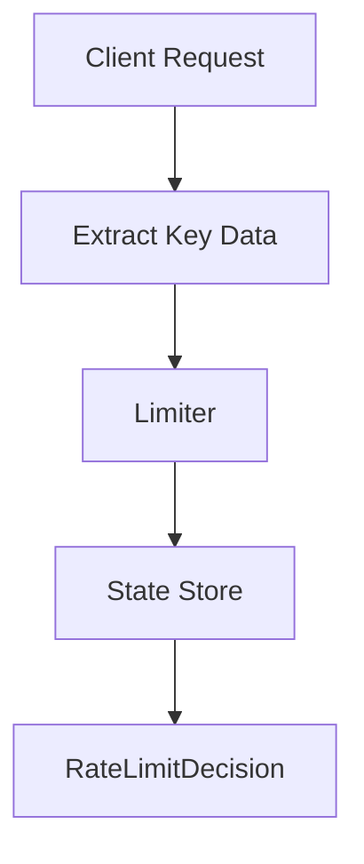

# 005 — Cleanup Expired Windows

---

# 1. Goal

Prevent memory leak by removing counters from old windows.

---

# 2. Production Feature Added

```text
Prevent memory leak by removing counters from old windows.
```

---

# 3. Delta From Previous Phase

```text
Added cleanupOldWindows() and internalKeyCount().
```

---

# 4. Architecture Diagram



---

# 5. Internal Flow

```text
request arrives
↓
extract identity and endpoint
↓
calculate algorithm state
↓
check limit
↓
return production decision
```

---

# 6. Complete Java Code


Use classes from phase 004.

## Updated `FixedWindowRateLimiter.java`

```java
package com.miniratelimiter.limiter;

import com.miniratelimiter.config.RateLimitRule;
import com.miniratelimiter.core.RateLimitDecision;
import com.miniratelimiter.core.RateLimitKey;

import java.time.Clock;
import java.util.Map;
import java.util.concurrent.ConcurrentHashMap;
import java.util.concurrent.atomic.AtomicInteger;

public class FixedWindowRateLimiter {
    private final RateLimitRule rule;
    private final Clock clock;
    private final ConcurrentHashMap<RateLimitKey, AtomicInteger> counters =
            new ConcurrentHashMap<>();

    public FixedWindowRateLimiter(RateLimitRule rule, Clock clock) {
        this.rule = rule;
        this.clock = clock;
    }

    public RateLimitDecision allowRequest(String userId, String api) {
        long now = clock.millis();
        long windowMillis = rule.getWindow().toMillis();
        long windowId = now / windowMillis;
        long resetAt = (windowId + 1) * windowMillis;

        RateLimitKey key = new RateLimitKey(userId, api, windowId);
        AtomicInteger counter = counters.computeIfAbsent(key, k -> new AtomicInteger(0));
        int newCount = counter.incrementAndGet();

        if (newCount <= rule.getLimit()) {
            return new RateLimitDecision(true, rule.getLimit(),
                    rule.getLimit() - newCount, 0, resetAt, "allowed");
        }

        return new RateLimitDecision(false, rule.getLimit(),
                0, resetAt - now, resetAt, "limit reached");
    }

    public void cleanupOldWindows() {
        long now = clock.millis();
        long currentWindowId = now / rule.getWindow().toMillis();

        for (Map.Entry<RateLimitKey, AtomicInteger> entry : counters.entrySet()) {
            if (entry.getKey().getWindowId() < currentWindowId - 1) {
                counters.remove(entry.getKey());
            }
        }
    }

    public int internalKeyCount() {
        return counters.size();
    }
}
```

## `Driver.java`

```java
package com.miniratelimiter.driver;

import com.miniratelimiter.config.RateLimitRule;
import com.miniratelimiter.limiter.FixedWindowRateLimiter;

import java.time.Clock;
import java.time.Duration;

public class Driver {
    public static void main(String[] args) throws Exception {
        FixedWindowRateLimiter limiter = new FixedWindowRateLimiter(
                new RateLimitRule(2, Duration.ofSeconds(2)),
                Clock.systemUTC()
        );

        System.out.println(limiter.allowRequest("alice", "/payment"));
        Thread.sleep(3000);
        System.out.println(limiter.allowRequest("alice", "/payment"));

        System.out.println("Before cleanup keys=" + limiter.internalKeyCount());
        limiter.cleanupOldWindows();
        System.out.println("After cleanup keys=" + limiter.internalKeyCount());
    }
}
```

Other classes same as Phase 004.


---

# 7. DSA/CP Mapping


## Pattern

```text
Eviction / sweep line cleanup
```

## CP Analogy

This is like removing expired elements from a data structure.

Examples:

```text
sliding window remove old index
sweep line remove ended intervals
cache eviction
```

## Complexity

```text
allowRequest: O(1)
cleanup: O(number of keys)
```

## Practice Idea

Given events with timestamps, maintain only events from the last W seconds.


---

# 8. Production Notes


In real production, cleanup can run via:

```text
scheduled executor
background job
Redis TTL
Caffeine cache expiry
```

For Redis, TTL is simpler than manual cleanup.


---

# 9. Interview Notes

You should be able to explain:

```text
what state is stored
why this feature is production-relevant
what complexity is
what breaks at scale
how Redis/distributed version changes it
```

---

# How To Run

```bash
javac -d out $(find src -name "*.java")
java -cp out com.miniratelimiter.driver.Driver
```

Windows PowerShell:

```powershell
Get-ChildItem -Recurse -Filter *.java src | ForEach-Object FullName | javac -d out
java -cp out com.miniratelimiter.driver.Driver
```
