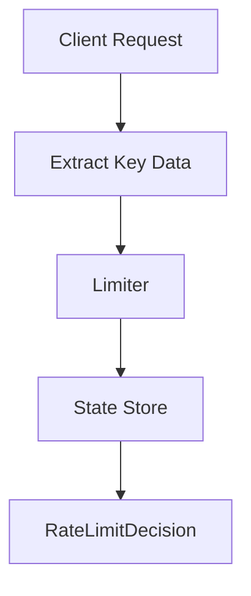

# 006 — Sliding Window Log

---

# 1. Goal

Build accurate rolling-window rate limiter using Deque timestamps.

---

# 2. Production Feature Added

```text
Build accurate rolling-window rate limiter using Deque timestamps.
```

---

# 3. Delta From Previous Phase

```text
Algorithm changed from fixed bucket counter to timestamp log.
```

---

# 4. Architecture Diagram



---

# 5. Internal Flow

```text
request arrives
↓
extract identity and endpoint
↓
calculate algorithm state
↓
check limit
↓
return production decision
```

---

# 6. Complete Java Code


## `RateLimitDecision.java`

```java
package com.miniratelimiter.core;

public class RateLimitDecision {
    private final boolean allowed;
    private final String reason;

    public RateLimitDecision(boolean allowed, String reason) {
        this.allowed = allowed;
        this.reason = reason;
    }

    @Override
    public String toString() {
        return "RateLimitDecision{allowed=" + allowed + ", reason='" + reason + "'}";
    }
}
```

## `SlidingWindowLogRateLimiter.java`

```java
package com.miniratelimiter.limiter;

import com.miniratelimiter.core.RateLimitDecision;

import java.time.Clock;
import java.util.ArrayDeque;
import java.util.Deque;
import java.util.concurrent.ConcurrentHashMap;

public class SlidingWindowLogRateLimiter {
    private final int limit;
    private final long windowMillis;
    private final Clock clock;

    private final ConcurrentHashMap<String, Deque<Long>> logs =
            new ConcurrentHashMap<>();

    public SlidingWindowLogRateLimiter(int limit, long windowMillis, Clock clock) {
        this.limit = limit;
        this.windowMillis = windowMillis;
        this.clock = clock;
    }

    public RateLimitDecision allowRequest(String userId) {
        long now = clock.millis();

        Deque<Long> deque = logs.computeIfAbsent(userId, k -> new ArrayDeque<>());

        synchronized (deque) {
            while (!deque.isEmpty() && deque.peekFirst() <= now - windowMillis) {
                deque.pollFirst();
            }

            if (deque.size() >= limit) {
                return new RateLimitDecision(false, "sliding window log limit reached");
            }

            deque.addLast(now);
            return new RateLimitDecision(true, "allowed activeRequests=" + deque.size());
        }
    }
}
```

## `Driver.java`

```java
package com.miniratelimiter.driver;

import com.miniratelimiter.limiter.SlidingWindowLogRateLimiter;

import java.time.Clock;

public class Driver {
    public static void main(String[] args) throws Exception {
        SlidingWindowLogRateLimiter limiter =
                new SlidingWindowLogRateLimiter(3, 5_000, Clock.systemUTC());

        for (int i = 1; i <= 6; i++) {
            System.out.println("request=" + i + " " + limiter.allowRequest("alice"));
            Thread.sleep(1000);
        }
    }
}
```


---

# 7. DSA/CP Mapping


## Pattern

```text
Sliding window with Deque
```

## CP Analogy

Classic problems:

```text
longest subarray with condition
number of events in last K seconds
moving window maximum
hit counter design
```

## Data Structure

```text
Deque<Long>
```

## Why Deque?

Oldest timestamp is at front.

```text
while front <= now - window:
    pop_front
```

## Complexity

```text
Amortized O(1) per request
Memory O(requests inside window)
```

## Practice Idea

Design Hit Counter: record hits and return hits in past 5 minutes.


---

# 8. Production Notes


Sliding window log is accurate but memory-heavy.

If one user sends 1 million requests in the window, you may store 1 million timestamps.

Token bucket is usually better for production.


---

# 9. Interview Notes

You should be able to explain:

```text
what state is stored
why this feature is production-relevant
what complexity is
what breaks at scale
how Redis/distributed version changes it
```

---

# How To Run

```bash
javac -d out $(find src -name "*.java")
java -cp out com.miniratelimiter.driver.Driver
```

Windows PowerShell:

```powershell
Get-ChildItem -Recurse -Filter *.java src | ForEach-Object FullName | javac -d out
java -cp out com.miniratelimiter.driver.Driver
```
