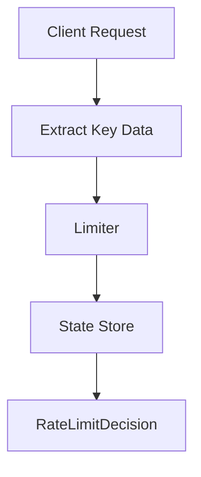

# 007 — Token Bucket

---

# 1. Goal

Build a burst-friendly production-style limiter.

---

# 2. Production Feature Added

```text
Build a burst-friendly production-style limiter.
```

---

# 3. Delta From Previous Phase

```text
Replaces timestamp log with token refill simulation.
```

---

# 4. Architecture Diagram



---

# 5. Internal Flow

```text
request arrives
↓
extract identity and endpoint
↓
calculate algorithm state
↓
check limit
↓
return production decision
```

---

# 6. Complete Java Code


## `RateLimitDecision.java`

```java
package com.miniratelimiter.core;

public class RateLimitDecision {
    private final boolean allowed;
    private final String reason;

    public RateLimitDecision(boolean allowed, String reason) {
        this.allowed = allowed;
        this.reason = reason;
    }

    @Override
    public String toString() {
        return "RateLimitDecision{allowed=" + allowed + ", reason='" + reason + "'}";
    }
}
```

## `TokenBucketRateLimiter.java`

```java
package com.miniratelimiter.limiter;

import com.miniratelimiter.core.RateLimitDecision;

import java.time.Clock;
import java.util.concurrent.ConcurrentHashMap;

public class TokenBucketRateLimiter {

    private static class Bucket {
        double tokens;
        long lastRefillMillis;

        Bucket(double tokens, long lastRefillMillis) {
            this.tokens = tokens;
            this.lastRefillMillis = lastRefillMillis;
        }
    }

    private final int capacity;
    private final double refillTokensPerSecond;
    private final Clock clock;

    private final ConcurrentHashMap<String, Bucket> buckets =
            new ConcurrentHashMap<>();

    public TokenBucketRateLimiter(int capacity, double refillTokensPerSecond, Clock clock) {
        this.capacity = capacity;
        this.refillTokensPerSecond = refillTokensPerSecond;
        this.clock = clock;
    }

    public RateLimitDecision allowRequest(String userId) {
        long now = clock.millis();

        Bucket bucket = buckets.computeIfAbsent(
                userId,
                ignored -> new Bucket(capacity, now)
        );

        synchronized (bucket) {
            refill(bucket, now);

            if (bucket.tokens >= 1.0) {
                bucket.tokens -= 1.0;
                return new RateLimitDecision(true, "allowed tokensLeft=" + bucket.tokens);
            }

            return new RateLimitDecision(false, "no tokens available");
        }
    }

    private void refill(Bucket bucket, long now) {
        long elapsedMillis = now - bucket.lastRefillMillis;
        double tokensToAdd = elapsedMillis / 1000.0 * refillTokensPerSecond;

        bucket.tokens = Math.min(capacity, bucket.tokens + tokensToAdd);
        bucket.lastRefillMillis = now;
    }
}
```

## `Driver.java`

```java
package com.miniratelimiter.driver;

import com.miniratelimiter.limiter.TokenBucketRateLimiter;

import java.time.Clock;

public class Driver {
    public static void main(String[] args) throws Exception {
        TokenBucketRateLimiter limiter =
                new TokenBucketRateLimiter(3, 1.0, Clock.systemUTC());

        for (int i = 1; i <= 8; i++) {
            System.out.println("request=" + i + " " + limiter.allowRequest("alice"));
            Thread.sleep(300);
        }
    }
}
```


---

# 7. DSA/CP Mapping


## Pattern

```text
Greedy simulation
```

## CP Analogy

This is like resource regeneration problems:

```text
energy refills over time
mana regenerates
bucket fills at rate R
consume 1 per action
```

## State

```text
tokens
lastRefillMillis
```

## Complexity

```text
O(1) per request
O(users) memory
```

## Practice Idea

A game character has energy capacity C, regenerates R per second, and each skill costs 1 energy. Determine if each action is allowed.


---

# 8. Production Notes


Token bucket is widely used because:

```text
allows controlled burst
smooth refill
O(1)
low memory
```

This is usually a better production default than sliding window log.


---

# 9. Interview Notes

You should be able to explain:

```text
what state is stored
why this feature is production-relevant
what complexity is
what breaks at scale
how Redis/distributed version changes it
```

---

# How To Run

```bash
javac -d out $(find src -name "*.java")
java -cp out com.miniratelimiter.driver.Driver
```

Windows PowerShell:

```powershell
Get-ChildItem -Recurse -Filter *.java src | ForEach-Object FullName | javac -d out
java -cp out com.miniratelimiter.driver.Driver
```
