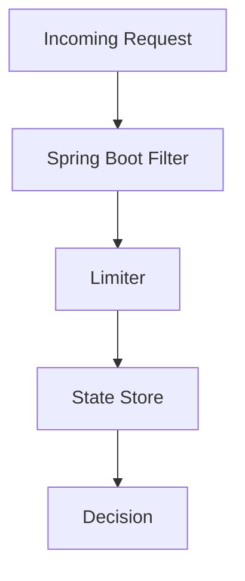

# 009 — Spring Boot Filter

---

# 1. Goal

Integrate rate limiter before controller execution.

---

# 2. Production Feature Added

```text
Integrate rate limiter before controller execution.
```

---

# 3. Delta From Previous Phase

```text
Added HTTP middleware/pipeline integration.
```

---

# 4. Architecture



---

# 5. Production-Level Explanation

Return 429 with headers when rejected.

---

# 6. Complete Java Skeleton

This phase is an integration/production phase. Use the algorithms from earlier phases.

## `RateLimitDecision.java`

```java
package com.miniratelimiter.core;

public class RateLimitDecision {
    private final boolean allowed;
    private final String reason;

    public RateLimitDecision(boolean allowed, String reason) {
        this.allowed = allowed;
        this.reason = reason;
    }

    public boolean isAllowed() {
        return allowed;
    }

    public String getReason() {
        return reason;
    }

    @Override
    public String toString() {
        return "RateLimitDecision{allowed=" + allowed + ", reason='" + reason + "'}";
    }
}
```

## `SpringBootFilter.java`

```java
package com.miniratelimiter.production;

import com.miniratelimiter.core.RateLimitDecision;

public class SpringBootFilter {

    public RateLimitDecision handle(String userId, String api, String ip) {
        /*
         * Phase 009: Spring Boot Filter
         *
         * Production idea:
         * Integrate rate limiter before controller execution.
         */
        return new RateLimitDecision(true, "allowed by Spring Boot Filter");
    }
}
```

## `Driver.java`

```java
package com.miniratelimiter.driver;

import com.miniratelimiter.production.SpringBootFilter;

public class Driver {
    public static void main(String[] args) {
        SpringBootFilter component = new SpringBootFilter();
        System.out.println(component.handle("alice", "/payment", "10.0.0.1"));
    }
}
```

---

# 7. DSA/CP Mapping

```text
Pipeline processing. CP analogy: each request passes through filters like stages in simulation.
```

---

# 8. Interview Notes

Explain:

```text
why this feature is needed
what state is stored
where bottleneck can happen
how to test it
how to make it distributed
```

---

# 9. Production Checklist

```text
correctness
latency
thread safety
distributed consistency
cleanup / TTL
metrics
fallback behavior
load testing
```

---

# How To Run

```bash
javac -d out $(find src -name "*.java")
java -cp out com.miniratelimiter.driver.Driver
```

Windows PowerShell:

```powershell
Get-ChildItem -Recurse -Filter *.java src | ForEach-Object FullName | javac -d out
java -cp out com.miniratelimiter.driver.Driver
```
