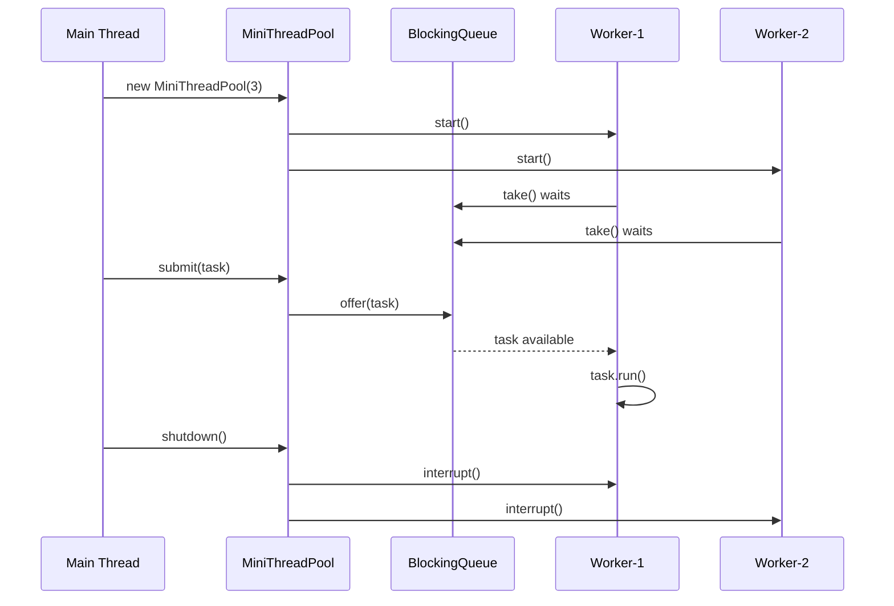
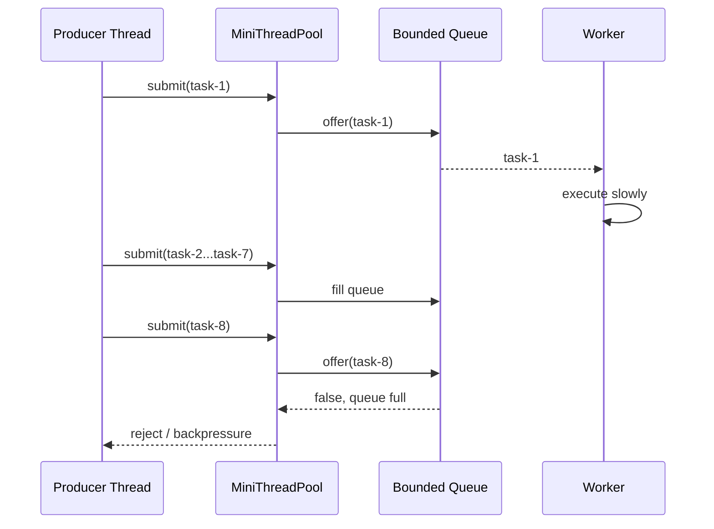
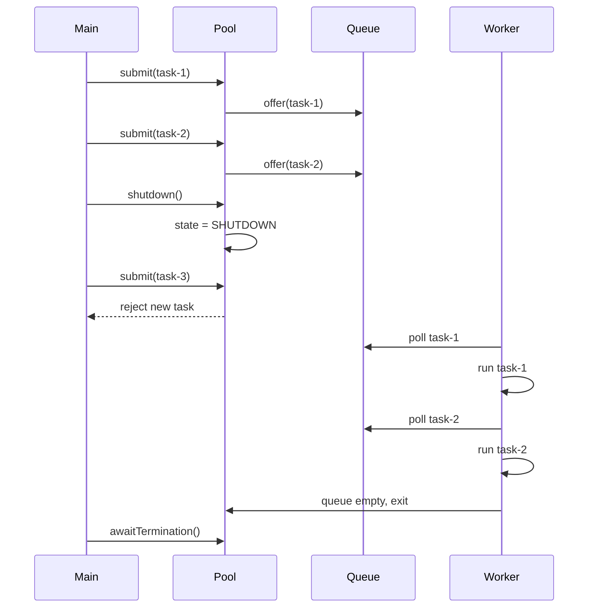
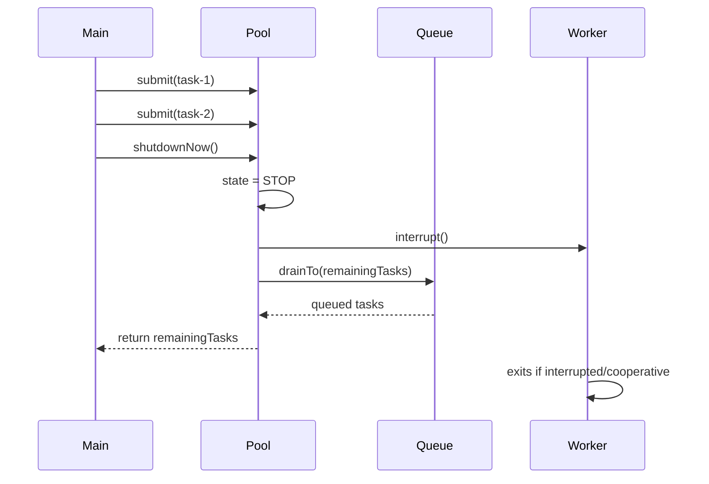
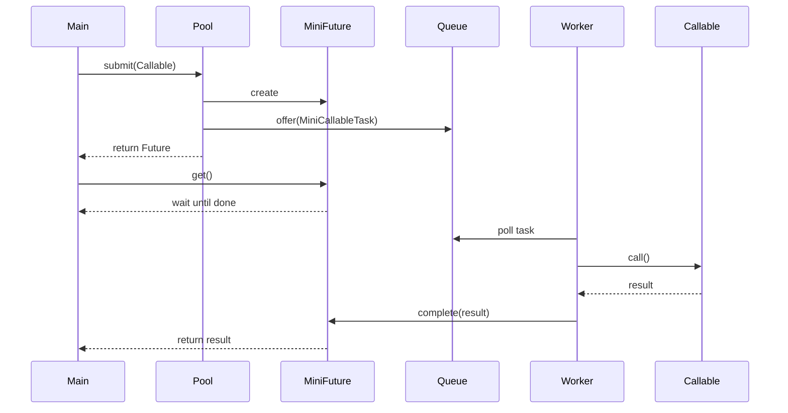
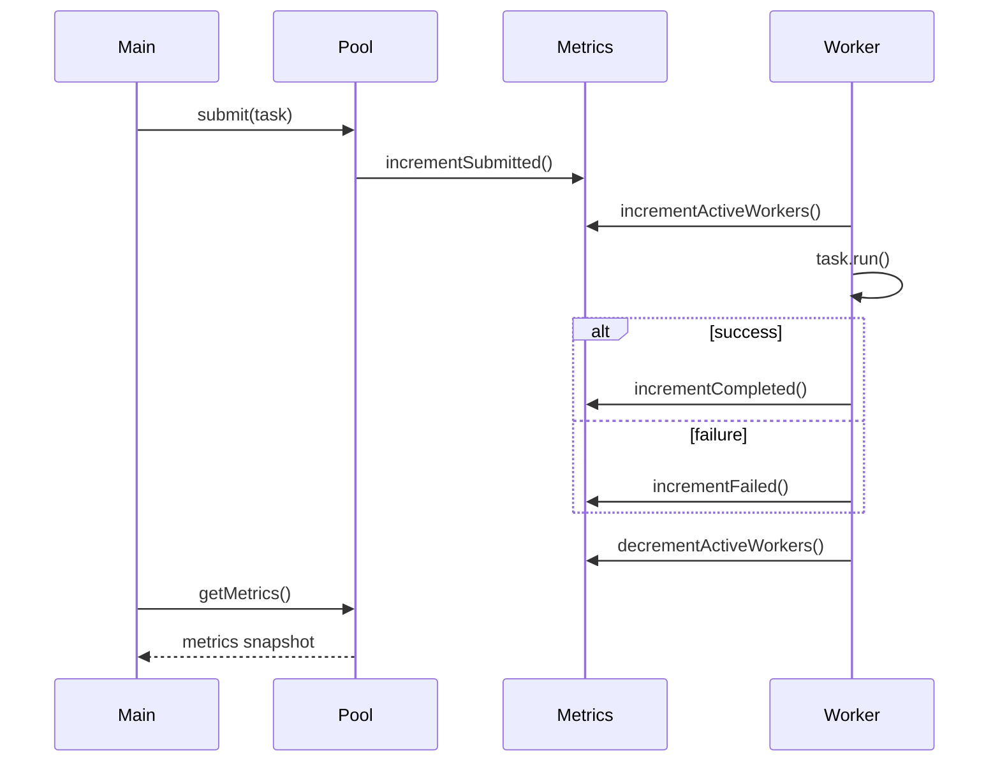
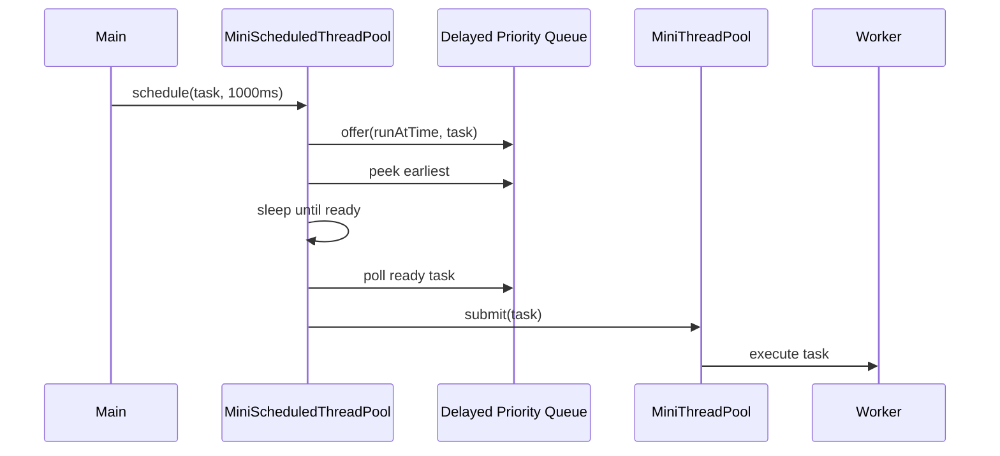

# 001_MiniThreadPool_From_Scratch_Java21

# Clickable Index

- [Part 0 — Project Goal](#part-0--project-goal)
- [Part 1 — Why Thread Pool Exists](#part-1--why-thread-pool-exists)
- [Part 2 — Thread Theory Foundation](#part-2--thread-theory-foundation)
  - [2.1 Process vs Thread](#21-process-vs-thread)
  - [2.2 Sequential Execution vs Concurrent Execution](#22-sequential-execution-vs-concurrent-execution)
  - [2.3 Thread Lifecycle](#23-thread-lifecycle)
  - [2.4 CPU Cores and Context Switching](#24-cpu-cores-and-context-switching)
  - [2.5 Race Condition](#25-race-condition)
  - [2.6 Critical Section](#26-critical-section)
  - [2.7 Synchronization](#27-synchronization)
  - [2.8 Volatile](#28-volatile)
  - [2.9 Atomic Variables](#29-atomic-variables)
  - [2.10 Blocking Queue](#210-blocking-queue)
  - [2.11 Producer Consumer Model](#211-producer-consumer-model)
  - [2.12 Backpressure](#212-backpressure)
  - [2.13 Runnable vs Callable](#213-runnable-vs-callable)
  - [2.14 Future](#214-future)
  - [2.15 Graceful Shutdown](#215-graceful-shutdown)
- [Part 3 — Final System We Are Building](#part-3--final-system-we-are-building)
- [Part 4 — Maven Project Setup](#part-4--maven-project-setup)
- [Part 5 — Phase 1: Fixed Worker Thread Pool](#part-5--phase-1-fixed-worker-thread-pool)
- [Part 6 — Phase 2: Bounded Queue and Backpressure](#part-6--phase-2-bounded-queue-and-backpressure)
- [Part 7 — Phase 3: Graceful Shutdown](#part-7--phase-3-graceful-shutdown)
- [Part 8 — Phase 4: Force Shutdown](#part-8--phase-4-force-shutdown)
- [Part 9 — Phase 5: Rejection Policy](#part-9--phase-5-rejection-policy)
- [Part 10 — Phase 6: Callable and MiniFuture](#part-10--phase-6-callable-and-minifuture)
- [Part 11 — Phase 7: Metrics](#part-11--phase-7-metrics)
- [Part 12 — Phase 8: Scheduled Tasks](#part-12--phase-8-scheduled-tasks)
- [Part 13 — Final Working Code](#part-13--final-working-code)
- [Part 14 — Driver Classes](#part-14--driver-classes)
- [Part 15 — JUnit Tests](#part-15--junit-tests)
- [Part 16 — How To Run](#part-16--how-to-run)
- [Part 17 — Interview Explanation](#part-17--interview-explanation)
- [Part 18 — What This Teaches For Distributed Systems](#part-18--what-this-teaches-for-distributed-systems)

---

# Part 0 — Project Goal

We are building:

```text
MiniThreadPool
```

using:

```text
Java 21
Pure Java first
No Spring Boot
No ExecutorService internally
No ThreadPoolExecutor internally
```

Why?

Because this is your foundation for:

```text
MiniRedis
MiniKafka
MiniMQ
MiniGateway
MiniRateLimiter
MiniELK
MiniDynamo
MiniRaft
```

A thread pool is one of the most important internal building blocks in backend and distributed systems.

Final system capabilities:

```text
1. Fixed number of worker threads
2. Bounded task queue
3. submit(Runnable)
4. submit(Callable<T>)
5. MiniFuture<T>
6. Graceful shutdown
7. Force shutdown
8. Rejection policies
9. Metrics
10. Scheduled tasks
11. Driver classes
12. JUnit tests
```

---

# Part 1 — Why Thread Pool Exists

## Without thread pool

Naive server:

```java
while (true) {
    Socket client = server.accept();

    new Thread(() -> {
        handle(client);
    }).start();
}
```

Problem:

```text
1 request = 1 new thread
1000 requests = 1000 threads
10000 requests = 10000 threads
```

This causes:

```text
Too much memory usage
Too much context switching
High latency
OutOfMemoryError risk
CPU thrashing
Uncontrolled concurrency
```

## With thread pool

Instead of creating a new thread per task:

```text
Create N worker threads once
Put tasks into queue
Workers reuse themselves to execute tasks
```

Flow:

```text
Client submit task
       |
       v
+----------------+
|  Task Queue    |
+----------------+
   |     |     |
   v     v     v
Worker Worker Worker
```

## Real systems using thread pools

| System | Where thread pool is used |
|---|---|
| Web server | request processing |
| Kafka broker | network threads, IO threads, background tasks |
| Redis-like server | background expiry, persistence, network handlers |
| API Gateway | upstream calls |
| Log aggregator | parsing and batching logs |
| Scheduler | delayed jobs |
| Notification system | send email/SMS/push |
| File service | upload processing |
| DB client | async query execution |

---

# Part 2 — Thread Theory Foundation

## 2.1 Process vs Thread

A process is a running program.

Example:

```text
Chrome
IntelliJ
Java application
PostgreSQL
```

A thread is a smaller execution unit inside a process.

```text
Process
 ├── Thread-1
 ├── Thread-2
 └── Thread-3
```

Threads inside same process share:

```text
Heap memory
Static variables
Open files
Network sockets
```

Each thread has its own:

```text
Stack
Program counter
Local variables
Execution path
```

Why important?

Because multiple threads can access the same shared object.

That creates concurrency bugs.

---

## 2.2 Sequential Execution vs Concurrent Execution

Sequential:

```text
Task A starts
Task A finishes
Task B starts
Task B finishes
```

Concurrent:

```text
Task A starts
Task B starts
Both progress independently
```

Parallel:

```text
Task A runs on CPU core 1
Task B runs on CPU core 2
At the same time
```

Concurrency is about structure.

Parallelism is about actual simultaneous execution.

---

## 2.3 Thread Lifecycle

Java thread states:

```text
NEW
RUNNABLE
BLOCKED
WAITING
TIMED_WAITING
TERMINATED
```

Simple flow:

```text
NEW
 |
start()
 |
RUNNABLE
 |
run() completes
 |
TERMINATED
```

Blocking queue example:

```text
Worker calls queue.take()
If queue empty:
    worker goes WAITING
When task is added:
    worker becomes RUNNABLE again
```

---

## 2.4 CPU Cores and Context Switching

If you have 8 CPU cores and 100 runnable threads:

```text
Only 8 can execute at the same instant
Remaining threads wait
OS switches between them
```

This switching is called:

```text
Context switching
```

Too many threads create overhead.

That is why thread pool controls thread count.

---

## 2.5 Race Condition

Race condition happens when multiple threads access shared data and final result depends on timing.

Example:

```java
count++;
```

Looks atomic, but internally:

```text
read count
add 1
write count
```

Two threads can overlap:

```text
count = 0

Thread A reads 0
Thread B reads 0
Thread A writes 1
Thread B writes 1

Expected 2
Actual 1
```

---

## 2.6 Critical Section

Critical section is code that accesses shared mutable state.

Example:

```java
balance = balance - amount;
```

If many threads modify balance, protect it using:

```text
synchronized
Lock
Atomic variables
Concurrent data structures
```

---

## 2.7 Synchronization

`synchronized` ensures only one thread enters a protected block at a time.

```java
synchronized (lock) {
    counter++;
}
```

It gives:

```text
Mutual exclusion
Visibility guarantee
```

But too much locking can reduce performance.

---

## 2.8 Volatile

`volatile` ensures visibility of changes across threads.

Example:

```java
private volatile boolean running = true;
```

If one thread changes:

```java
running = false;
```

other threads can see it.

Important:

```text
volatile is not enough for compound operations like count++
```

Use `AtomicInteger` for counters.

---

## 2.9 Atomic Variables

Atomic variables use CPU-level compare-and-swap style operations.

Examples:

```java
AtomicInteger
AtomicLong
AtomicBoolean
```

Example:

```java
AtomicInteger completed = new AtomicInteger();

completed.incrementAndGet();
```

This is thread-safe without explicit lock.

---

## 2.10 Blocking Queue

Blocking queue is a queue safe for multiple producer/consumer threads.

Important methods:

```text
put(task)       -> waits if queue full
take()          -> waits if queue empty
offer(task)     -> returns false if queue full
poll(timeout)   -> waits for limited time
```

We use:

```java
ArrayBlockingQueue<Runnable>
```

because it is bounded.

Why bounded?

Because unbounded queues can eat memory during traffic spikes.

---

## 2.11 Producer Consumer Model

Thread pool is a producer-consumer system.

```text
Producer = submit() caller
Consumer = worker thread
Queue = task buffer
```

Diagram:

```text
Producer-1 ----\
Producer-2 ----- > Task Queue ---> Worker-1
Producer-3 ----/                  Worker-2
                                  Worker-3
```

---

## 2.12 Backpressure

Backpressure means the system pushes back when overloaded.

Example:

```text
Workers can process 100 tasks/sec
Producers submit 1000 tasks/sec
Queue fills
Need strategy
```

Strategies:

```text
Reject task
Caller runs task
Block producer
Drop task
Scale workers
```

In thread pool, rejection policy is backpressure.

---

## 2.13 Runnable vs Callable

Runnable:

```java
Runnable r = () -> System.out.println("work");
```

Properties:

```text
No return value
Cannot throw checked exception directly
```

Callable:

```java
Callable<Integer> c = () -> 10;
```

Properties:

```text
Returns value
Can throw exception
Works with Future
```

---

## 2.14 Future

Future represents result of async computation.

```text
submit task
get Future immediately
task runs in worker
later call future.get()
```

If result is not ready:

```text
get() waits
```

Flow:

```text
Main thread submits Callable
        |
        v
    MiniFuture returned
        |
        v
Worker executes Callable
        |
        v
Worker completes MiniFuture
        |
        v
Main thread get() returns result
```

---

## 2.15 Graceful Shutdown

Graceful shutdown means:

```text
Stop accepting new tasks
Finish already submitted tasks
Then stop workers
```

Why important?

In production:

```text
Do not lose user requests
Do not kill message processing midway
Do not corrupt files
```

---

# Part 3 — Final System We Are Building

Final architecture:

```text
+-------------------+
| Client / Main App |
+-------------------+
          |
          v
+-------------------+
|  MiniThreadPool   |
|-------------------|
| submit Runnable   |
| submit Callable   |
| shutdown          |
| shutdownNow       |
| metrics           |
+-------------------+
          |
          v
+-------------------+
|  Blocking Queue   |
+-------------------+
   |       |       |
   v       v       v
Worker-1 Worker-2 Worker-3
```

With scheduled tasks:

```text
+-------------------------+
| MiniScheduledThreadPool |
+-------------------------+
            |
            v
   Delayed Task Queue
            |
            v
      MiniThreadPool
```

---

# Part 4 — Maven Project Setup

## Folder structure

```text
mini-thread-pool/
├── pom.xml
├── README.md
├── src/main/java/com/mini/threadpool/
│   ├── MiniThreadPool.java
│   ├── Worker.java
│   ├── RejectionPolicy.java
│   ├── RejectionPolicies.java
│   ├── MiniFuture.java
│   ├── MiniCallableTask.java
│   ├── ThreadPoolMetrics.java
│   ├── MiniScheduledThreadPool.java
│   ├── DemoPhase1.java
│   ├── DemoFinal.java
│   └── DemoScheduled.java
└── src/test/java/com/mini/threadpool/
    ├── MiniThreadPoolTest.java
    ├── MiniFutureTest.java
    ├── RejectionPolicyTest.java
    ├── ShutdownTest.java
    └── MiniScheduledThreadPoolTest.java
```

## pom.xml

```xml
<project xmlns="http://maven.apache.org/POM/4.0.0"
         xmlns:xsi="http://www.w3.org/2001/XMLSchema-instance"
         xsi:schemaLocation="http://maven.apache.org/POM/4.0.0
         https://maven.apache.org/xsd/maven-4.0.0.xsd">

    <modelVersion>4.0.0</modelVersion>

    <groupId>com.mini</groupId>
    <artifactId>mini-thread-pool</artifactId>
    <version>1.0-SNAPSHOT</version>

    <properties>
        <maven.compiler.release>21</maven.compiler.release>
        <project.build.sourceEncoding>UTF-8</project.build.sourceEncoding>
        <junit.version>5.10.2</junit.version>
    </properties>

    <dependencies>
        <dependency>
            <groupId>org.junit.jupiter</groupId>
            <artifactId>junit-jupiter</artifactId>
            <version>${junit.version}</version>
            <scope>test</scope>
        </dependency>
    </dependencies>

    <build>
        <plugins>
            <plugin>
                <groupId>org.apache.maven.plugins</groupId>
                <artifactId>maven-surefire-plugin</artifactId>
                <version>3.2.5</version>
            </plugin>
        </plugins>
    </build>
</project>
```

---

# Part 5 — Phase 1: Fixed Worker Thread Pool

## What are we building?

We build the simplest thread pool:

```text
Fixed number of worker threads
Unbounded/simple blocking queue
submit(Runnable)
shutdown()
```

## Why this phase?

To understand:

```text
worker thread
task queue
producer-consumer
basic task execution
```

## Phase 1 architecture

```text
submit(task)
    |
    v
Task Queue
    |
    v
Worker Thread
    |
    v
task.run()
```

## Step-By-Step Execution Details Before Code

In this phase, we build the smallest working thread pool.

Execution flow:

```text
Step 1: Main thread creates MiniThreadPool(3).
Step 2: Constructor creates 3 worker threads.
Step 3: Each worker starts and waits for a task.
Step 4: Main thread calls submit(task).
Step 5: submit() puts task into taskQueue.
Step 6: One worker wakes up and takes the task.
Step 7: Worker executes task.run().
Step 8: shutdown() changes running=false.
Step 9: Workers are interrupted so they can exit if waiting.
```

Thread state intuition:

```text
Before task:
worker is WAITING on queue.take()

After submit:
queue receives task
worker becomes RUNNABLE
worker executes task
worker waits again
```

## Mermaid Sequence Diagram



## Inline Commands To Run This Phase

```bash
mvn clean compile
java -cp target/classes com.mini.threadpool.DemoPhase1
```

Expected output pattern:

```text
mini-worker-0 executing task 1
mini-worker-1 executing task 2
mini-worker-2 executing task 3
...
```

## Phase 1 code

### MiniThreadPool.java

```java
package com.mini.threadpool;

import java.util.ArrayList;
import java.util.List;
import java.util.concurrent.BlockingQueue;
import java.util.concurrent.LinkedBlockingQueue;

public class MiniThreadPool {
    private final BlockingQueue<Runnable> taskQueue = new LinkedBlockingQueue<>();
    private final List<Thread> workers = new ArrayList<>();
    private volatile boolean running = true;

    public MiniThreadPool(int numberOfThreads) {
        if (numberOfThreads <= 0) {
            throw new IllegalArgumentException("numberOfThreads must be positive");
        }

        for (int i = 0; i < numberOfThreads; i++) {
            Thread worker = new Thread(() -> {
                while (running || !taskQueue.isEmpty()) {
                    try {
                        Runnable task = taskQueue.take();
                        task.run();
                    } catch (InterruptedException e) {
                        if (!running) {
                            break;
                        }
                    } catch (RuntimeException e) {
                        System.err.println("Task failed: " + e.getMessage());
                    }
                }
            }, "mini-worker-" + i);

            workers.add(worker);
            worker.start();
        }
    }

    public void submit(Runnable task) {
        if (!running) {
            throw new IllegalStateException("ThreadPool is shutting down");
        }

        if (task == null) {
            throw new IllegalArgumentException("task cannot be null");
        }

        taskQueue.offer(task);
    }

    public void shutdown() {
        running = false;

        for (Thread worker : workers) {
            worker.interrupt();
        }
    }
}
```

## Phase 1 driver

```java
package com.mini.threadpool;

public class DemoPhase1 {
    public static void main(String[] args) throws InterruptedException {
        MiniThreadPool pool = new MiniThreadPool(3);

        for (int i = 1; i <= 10; i++) {
            int taskId = i;
            pool.submit(() -> {
                System.out.println(Thread.currentThread().getName()
                        + " executing task " + taskId);
            });
        }

        Thread.sleep(1000);
        pool.shutdown();
    }
}
```

## Phase 1 Result

Run:

```bash
mvn clean compile
java -cp target/classes com.mini.threadpool.DemoPhase1
```

Expected result:

```text
mini-worker-0 executing task 1
mini-worker-1 executing task 2
mini-worker-2 executing task 3
mini-worker-0 executing task 4
...
```

Exact order is not guaranteed because multiple workers run concurrently.

What this proves:

```text
1. Workers are created once.
2. Tasks are submitted into queue.
3. Workers reuse themselves to execute multiple tasks.
4. Basic thread pool works.
```

## Phase 1 dry run

```text
Create pool with 3 workers

Worker-0 starts and waits
Worker-1 starts and waits
Worker-2 starts and waits

Submit task-1
Task goes to queue
Worker-0 takes task-1
Worker-0 runs it

Submit task-2
Worker-1 takes task-2

Submit task-3
Worker-2 takes task-3

Submit task-4
If all workers busy, task waits in queue
```

## Phase 1 issue

`LinkedBlockingQueue` can grow very large.

That is dangerous.

Next phase: bounded queue.

---

# Part 6 — Phase 2: Bounded Queue and Backpressure

## What are we building?

We replace unbounded queue with bounded queue.

```java
ArrayBlockingQueue<>(queueCapacity)
```

## Why this phase?

Because real systems cannot accept infinite work.

If queue is unbounded:

```text
Traffic spike
Queue grows
Memory grows
GC pressure grows
Application may crash
```

## What we care about

```text
capacity control
overload handling
backpressure
queue full condition
```

## API

```java
MiniThreadPool pool = new MiniThreadPool(3, 100);
```

Meaning:

```text
3 workers
100 queue capacity
```

## Step-By-Step Execution Details Before Code

In Phase 1, the queue can grow without limit.

In Phase 2, we protect memory using a bounded queue.

Execution flow:

```text
Step 1: Main creates MiniThreadPool(2, 5).
Step 2: Pool creates 2 workers.
Step 3: Queue capacity is fixed to 5.
Step 4: Main submits many slow tasks.
Step 5: 2 tasks are running.
Step 6: 5 tasks are waiting in queue.
Step 7: More tasks arrive.
Step 8: Queue is full.
Step 9: submit() rejects or applies rejection policy.
```

Why this matters:

```text
Unbounded queue hides overload.
Bounded queue exposes overload early.
```

## Mermaid Sequence Diagram



## Inline Commands To Run This Phase

Create or run a backpressure demo, then:

```bash
mvn clean compile
java -cp target/classes com.mini.threadpool.DemoBackpressure
```

Expected output pattern:

```text
mini-worker-0 processing slow task 1
mini-worker-1 processing slow task 2
Rejected task 6
Rejected task 7
...
```

## Phase 2 change

```java
private final BlockingQueue<Runnable> taskQueue;
```

Constructor:

```java
this.taskQueue = new ArrayBlockingQueue<>(queueCapacity);
```

Submit:

```java
boolean accepted = taskQueue.offer(task);
if (!accepted) {
    throw new IllegalStateException("Task queue is full");
}
```

## Backpressure example

```text
workers = 2
queue size = 5
submit 100 slow tasks

2 running
5 waiting
93 rejected
```

This is good.

It protects the system.

---

# Part 7 — Phase 3: Graceful Shutdown

## What are we building?

A proper shutdown mechanism.

## Why this phase?

In production, shutting down should not lose queued tasks.

Expected behavior:

```text
1. Stop accepting new tasks
2. Complete already queued tasks
3. Stop workers after queue empty
```

## State model

```text
RUNNING
   |
shutdown()
   v
SHUTDOWN
   |
queue empty and workers done
   v
TERMINATED
```

## What we care about

```text
No new tasks after shutdown
Existing tasks finish
Workers exit cleanly
Main thread can wait using awaitTermination
```

## Step-By-Step Execution Details Before Code

Graceful shutdown means:

```text
Stop accepting new tasks.
Finish already queued tasks.
Then stop workers.
```

Execution flow:

```text
Step 1: Pool is RUNNING.
Step 2: Main submits tasks.
Step 3: Some tasks run, some wait in queue.
Step 4: Main calls shutdown().
Step 5: Pool state becomes SHUTDOWN.
Step 6: New submit() calls are rejected.
Step 7: Workers continue processing queued tasks.
Step 8: When queue becomes empty, workers exit.
Step 9: Main calls awaitTermination() to wait.
```

Key condition:

```java
while (running || !taskQueue.isEmpty())
```

Why?

```text
Even after shutdown, queued tasks must finish.
```

## Mermaid Sequence Diagram



## Inline Commands To Run This Phase

```bash
mvn test -Dtest=ShutdownTest
```

Expected behavior:

```text
New task after shutdown throws IllegalStateException.
Already queued tasks complete.
```

## API

```java
pool.shutdown();
pool.awaitTermination();
```

## Key logic

Worker should run while:

```java
running || !taskQueue.isEmpty()
```

Not just:

```java
running
```

Because after shutdown there may still be tasks in queue.

---

# Part 8 — Phase 4: Force Shutdown

## What are we building?

Immediate stop:

```java
List<Runnable> remaining = pool.shutdownNow();
```

## Why?

Sometimes tasks are stuck or app must stop fast.

## Behavior

```text
Stop accepting tasks
Clear queued tasks
Interrupt workers
Return tasks not executed
```

## What we care about

```text
difference between graceful and force shutdown
thread interruption
remaining tasks
```

## Important note

Java cannot safely kill a thread.

It can only interrupt.

Task code should cooperate:

```java
if (Thread.currentThread().isInterrupted()) {
    return;
}
```

---

# Part 9 — Phase 5: Rejection Policy

## What are we building?

Configurable behavior when queue is full.

## Why this phase?

Different systems want different overload strategies.

## Policies

| Policy | Behavior | Use case |
|---|---|---|
| AbortPolicy | throw exception | fail fast |
| CallerRunsPolicy | caller executes task | slow down producer |
| DiscardPolicy | drop task | low-value work |
| BlockPolicy | wait for space | must not lose task |

## Step-By-Step Execution Details Before Code

Force shutdown means:

```text
Stop immediately as much as possible.
Return tasks that never started.
Interrupt workers.
```

Execution flow:

```text
Step 1: Pool has running tasks and queued tasks.
Step 2: Main calls shutdownNow().
Step 3: Pool state becomes STOP.
Step 4: Worker threads receive interrupt.
Step 5: Queue is drained into remainingTasks list.
Step 6: Remaining tasks are returned to caller.
Step 7: Running tasks stop only if they handle interruption.
```

Important Java reality:

```text
Java cannot safely kill a thread.
Interrupt is only a signal.
Task must cooperate.
```

## Mermaid Sequence Diagram



## Inline Commands To Run This Phase

Add a small driver:

```bash
mvn clean compile
java -cp target/classes com.mini.threadpool.DemoForceShutdown
```

Expected behavior:

```text
Some queued tasks are returned as not executed.
Running tasks may stop if they check interrupted status.
```

## Interface

```java
package com.mini.threadpool;

@FunctionalInterface
public interface RejectionPolicy {
    void reject(Runnable task, MiniThreadPool pool);
}
```

## Why CallerRunsPolicy is interesting

If queue is full:

```text
submitter thread executes task itself
submitter becomes slow
incoming rate decreases naturally
```

This is backpressure.

---

# Part 10 — Phase 6: Callable and MiniFuture

## What are we building?

Support task return values.

```java
MiniFuture<Integer> future = pool.submit(() -> 10);
Integer result = future.get();
```

## Why this phase?

Real async systems need results.

Examples:

```text
Calculate checksum
Fetch data from remote service
Parse file and return count
Run DB query
```

## Step-By-Step Execution Details Before Code

Now tasks can return values.

Execution flow:

```text
Step 1: Main calls pool.submit(Callable<T>).
Step 2: Pool creates MiniFuture<T>.
Step 3: Pool wraps Callable inside MiniCallableTask.
Step 4: MiniCallableTask is submitted as Runnable.
Step 5: Worker executes MiniCallableTask.run().
Step 6: Callable returns result.
Step 7: MiniFuture.complete(result) stores result.
Step 8: future.get() returns result.
```

If callable throws exception:

```text
MiniFuture stores exception.
future.get() rethrows it.
```

## Mermaid Sequence Diagram



## Inline Commands To Run This Phase

```bash
mvn test -Dtest=MiniFutureTest
```

Expected behavior:

```text
Callable returns 42.
future.get() returns 42.
```

## MiniFuture responsibilities

```text
store result
store exception
track done status
allow get() to wait
notify waiting threads
```

## Flow

```text
Main submits Callable
       |
       v
MiniCallableTask wraps Callable
       |
       v
Worker executes wrapper
       |
       v
Wrapper completes MiniFuture
       |
       v
Main future.get() returns result
```

## What we care about

```text
wait/notify
result completion
exception propagation
generic type T
```

---

# Part 11 — Phase 7: Metrics

## What are we building?

Runtime observability.

## Step-By-Step Execution Details Before Code

Now we add observability.

Execution flow:

```text
Step 1: submit() increments submittedTaskCount.
Step 2: Queue full increments rejectedTaskCount.
Step 3: Worker starts task and increments activeWorkerCount.
Step 4: Task success increments completedTaskCount.
Step 5: Task failure increments failedTaskCount.
Step 6: Worker finishes and decrements activeWorkerCount.
Step 7: getMetrics() shows current state.
```

Why this matters:

```text
Without metrics, you cannot debug production overload.
```

## Mermaid Sequence Diagram



## Inline Commands To Run This Phase

Run final demo:

```bash
mvn clean compile
java -cp target/classes com.mini.threadpool.DemoFinal
```

Expected output includes:

```text
ThreadPoolMetrics{submitted=..., completed=..., failed=..., rejected=..., activeWorkers=...}
```

## Metrics

```text
submittedTaskCount
completedTaskCount
failedTaskCount
rejectedTaskCount
activeWorkerCount
queueSize
poolSize
```

## Why this phase?

In production:

```text
If latency increases, check queue size
If throughput drops, check active workers
If errors increase, check failed count
If overload happens, check rejected count
```

## What we care about

```text
AtomicLong counters
active worker tracking
queue depth
debuggability
```

---

# Part 12 — Phase 8: Scheduled Tasks

## What are we building?

Delayed task execution.

```java
scheduledPool.schedule(task, 1000);
```

Meaning:

```text
Run task after 1000 milliseconds
```

## Why this phase?

Scheduled tasks are foundation for:

```text
retry after delay
timeout handling
cron jobs
cache cleanup
heartbeat
metrics reporting
```

## Step-By-Step Execution Details Before Code

Now we support delayed tasks.

Execution flow:

```text
Step 1: Main creates MiniScheduledThreadPool.
Step 2: Scheduler owns a PriorityBlockingQueue.
Step 3: Main calls schedule(task, delayMillis).
Step 4: Scheduler stores task with runAtMillis.
Step 5: Scheduler thread checks earliest task.
Step 6: If time not reached, scheduler sleeps briefly.
Step 7: If time reached, scheduler submits task to MiniThreadPool.
Step 8: Worker executes task normally.
```

Why this matters:

```text
Schedulers are used for retries, TTL cleanup, heartbeats, and timeout jobs.
```

## Mermaid Sequence Diagram



## Inline Commands To Run This Phase

```bash
mvn clean compile
java -cp target/classes com.mini.threadpool.DemoScheduled
```

Expected output:

```text
Task after 1 second
Task after 2 seconds
```

JUnit:

```bash
mvn test -Dtest=MiniScheduledThreadPoolTest
```

## Internal design

```text
Scheduled task has:
    runAtTimeMillis
    Runnable task

PriorityBlockingQueue orders by runAtTimeMillis

Scheduler thread:
    look at earliest task
    if time reached, submit to MiniThreadPool
    else sleep briefly
```

## What we care about

```text
delayed queue idea
priority ordering
scheduler thread
composition: scheduled pool uses normal pool
```

---

# Part 13 — Final Working Code

This is the complete version after all phases.

## RejectionPolicy.java

```java
package com.mini.threadpool;

@FunctionalInterface
public interface RejectionPolicy {
    void reject(Runnable task, MiniThreadPool pool);
}
```

## RejectionPolicies.java

```java
package com.mini.threadpool;

public final class RejectionPolicies {
    private RejectionPolicies() {}

    public static RejectionPolicy abortPolicy() {
        return (task, pool) -> {
            throw new IllegalStateException("Task rejected: queue is full");
        };
    }

    public static RejectionPolicy discardPolicy() {
        return (task, pool) -> {
            // Intentionally discard.
        };
    }

    public static RejectionPolicy callerRunsPolicy() {
        return (task, pool) -> {
            if (!pool.isShutdown()) {
                task.run();
            }
        };
    }

    public static RejectionPolicy blockPolicy() {
        return (task, pool) -> {
            try {
                pool.putTaskBlocking(task);
            } catch (InterruptedException e) {
                Thread.currentThread().interrupt();
                throw new IllegalStateException("Interrupted while blocking for queue space", e);
            }
        };
    }
}
```

## ThreadPoolMetrics.java

```java
package com.mini.threadpool;

import java.util.concurrent.atomic.AtomicInteger;
import java.util.concurrent.atomic.AtomicLong;

public class ThreadPoolMetrics {
    private final AtomicLong submittedTaskCount = new AtomicLong();
    private final AtomicLong completedTaskCount = new AtomicLong();
    private final AtomicLong failedTaskCount = new AtomicLong();
    private final AtomicLong rejectedTaskCount = new AtomicLong();
    private final AtomicInteger activeWorkerCount = new AtomicInteger();

    void incrementSubmitted() {
        submittedTaskCount.incrementAndGet();
    }

    void incrementCompleted() {
        completedTaskCount.incrementAndGet();
    }

    void incrementFailed() {
        failedTaskCount.incrementAndGet();
    }

    void incrementRejected() {
        rejectedTaskCount.incrementAndGet();
    }

    void incrementActiveWorkers() {
        activeWorkerCount.incrementAndGet();
    }

    void decrementActiveWorkers() {
        activeWorkerCount.decrementAndGet();
    }

    public long submittedTaskCount() {
        return submittedTaskCount.get();
    }

    public long completedTaskCount() {
        return completedTaskCount.get();
    }

    public long failedTaskCount() {
        return failedTaskCount.get();
    }

    public long rejectedTaskCount() {
        return rejectedTaskCount.get();
    }

    public int activeWorkerCount() {
        return activeWorkerCount.get();
    }

    @Override
    public String toString() {
        return "ThreadPoolMetrics{" +
                "submitted=" + submittedTaskCount() +
                ", completed=" + completedTaskCount() +
                ", failed=" + failedTaskCount() +
                ", rejected=" + rejectedTaskCount() +
                ", activeWorkers=" + activeWorkerCount() +
                '}';
    }
}
```

## MiniFuture.java

```java
package com.mini.threadpool;

public class MiniFuture<T> {
    private T result;
    private Throwable exception;
    private boolean done;

    public synchronized T get() throws Exception {
        while (!done) {
            wait();
        }

        if (exception != null) {
            if (exception instanceof Exception e) {
                throw e;
            }
            throw new RuntimeException(exception);
        }

        return result;
    }

    public synchronized boolean isDone() {
        return done;
    }

    synchronized void complete(T result) {
        if (done) {
            return;
        }

        this.result = result;
        this.done = true;
        notifyAll();
    }

    synchronized void completeExceptionally(Throwable exception) {
        if (done) {
            return;
        }

        this.exception = exception;
        this.done = true;
        notifyAll();
    }
}
```

## MiniCallableTask.java

```java
package com.mini.threadpool;

import java.util.concurrent.Callable;

public class MiniCallableTask<T> implements Runnable {
    private final Callable<T> callable;
    private final MiniFuture<T> future;

    public MiniCallableTask(Callable<T> callable, MiniFuture<T> future) {
        this.callable = callable;
        this.future = future;
    }

    @Override
    public void run() {
        try {
            T result = callable.call();
            future.complete(result);
        } catch (Throwable e) {
            future.completeExceptionally(e);
        }
    }
}
```

## Worker.java

```java
package com.mini.threadpool;

import java.util.concurrent.BlockingQueue;
import java.util.concurrent.TimeUnit;

class Worker implements Runnable {
    private final BlockingQueue<Runnable> taskQueue;
    private final MiniThreadPool pool;
    private final Thread thread;

    Worker(String name, BlockingQueue<Runnable> taskQueue, MiniThreadPool pool) {
        this.taskQueue = taskQueue;
        this.pool = pool;
        this.thread = new Thread(this, name);
    }

    void start() {
        thread.start();
    }

    void interrupt() {
        thread.interrupt();
    }

    void join() throws InterruptedException {
        thread.join();
    }

    @Override
    public void run() {
        while (pool.isRunningOrHasTasks()) {
            try {
                Runnable task = taskQueue.poll(200, TimeUnit.MILLISECONDS);

                if (task == null) {
                    continue;
                }

                pool.beforeExecute();

                try {
                    task.run();
                    pool.afterExecuteSuccess();
                } catch (Throwable e) {
                    pool.afterExecuteFailure(e);
                } finally {
                    pool.afterExecuteFinally();
                }

            } catch (InterruptedException e) {
                if (pool.isForceShutdown()) {
                    break;
                }
            }
        }
    }
}
```

## MiniThreadPool.java

```java
package com.mini.threadpool;

import java.util.ArrayList;
import java.util.List;
import java.util.concurrent.ArrayBlockingQueue;
import java.util.concurrent.BlockingQueue;
import java.util.concurrent.Callable;

public class MiniThreadPool {
    private enum State {
        RUNNING,
        SHUTDOWN,
        STOP
    }

    private final BlockingQueue<Runnable> taskQueue;
    private final List<Worker> workers = new ArrayList<>();
    private final RejectionPolicy rejectionPolicy;
    private final ThreadPoolMetrics metrics = new ThreadPoolMetrics();

    private volatile State state = State.RUNNING;

    public MiniThreadPool(int numberOfThreads, int queueCapacity) {
        this(numberOfThreads, queueCapacity, RejectionPolicies.abortPolicy());
    }

    public MiniThreadPool(int numberOfThreads, int queueCapacity, RejectionPolicy rejectionPolicy) {
        if (numberOfThreads <= 0) {
            throw new IllegalArgumentException("numberOfThreads must be positive");
        }
        if (queueCapacity <= 0) {
            throw new IllegalArgumentException("queueCapacity must be positive");
        }
        if (rejectionPolicy == null) {
            throw new IllegalArgumentException("rejectionPolicy cannot be null");
        }

        this.taskQueue = new ArrayBlockingQueue<>(queueCapacity);
        this.rejectionPolicy = rejectionPolicy;

        for (int i = 0; i < numberOfThreads; i++) {
            Worker worker = new Worker("mini-worker-" + i, taskQueue, this);
            workers.add(worker);
            worker.start();
        }
    }

    public void submit(Runnable task) {
        validateTask(task);

        if (state != State.RUNNING) {
            throw new IllegalStateException("ThreadPool is not running");
        }

        boolean accepted = taskQueue.offer(task);

        if (accepted) {
            metrics.incrementSubmitted();
        } else {
            metrics.incrementRejected();
            rejectionPolicy.reject(task, this);
        }
    }

    public <T> MiniFuture<T> submit(Callable<T> callable) {
        if (callable == null) {
            throw new IllegalArgumentException("callable cannot be null");
        }

        MiniFuture<T> future = new MiniFuture<>();
        submit(new MiniCallableTask<>(callable, future));
        return future;
    }

    public void shutdown() {
        state = State.SHUTDOWN;
    }

    public List<Runnable> shutdownNow() {
        state = State.STOP;

        for (Worker worker : workers) {
            worker.interrupt();
        }

        List<Runnable> remainingTasks = new ArrayList<>();
        taskQueue.drainTo(remainingTasks);
        return remainingTasks;
    }

    public void awaitTermination() throws InterruptedException {
        for (Worker worker : workers) {
            worker.join();
        }
    }

    public boolean isShutdown() {
        return state != State.RUNNING;
    }

    boolean isForceShutdown() {
        return state == State.STOP;
    }

    boolean isRunningOrHasTasks() {
        if (state == State.STOP) {
            return false;
        }

        return state == State.RUNNING || !taskQueue.isEmpty();
    }

    void putTaskBlocking(Runnable task) throws InterruptedException {
        if (state != State.RUNNING) {
            throw new IllegalStateException("ThreadPool is not running");
        }

        taskQueue.put(task);
        metrics.incrementSubmitted();
    }

    void beforeExecute() {
        metrics.incrementActiveWorkers();
    }

    void afterExecuteSuccess() {
        metrics.incrementCompleted();
    }

    void afterExecuteFailure(Throwable e) {
        metrics.incrementFailed();
        System.err.println("Task failed: " + e.getMessage());
    }

    void afterExecuteFinally() {
        metrics.decrementActiveWorkers();
    }

    public ThreadPoolMetrics getMetrics() {
        return metrics;
    }

    public int getQueueSize() {
        return taskQueue.size();
    }

    public int getPoolSize() {
        return workers.size();
    }

    private void validateTask(Runnable task) {
        if (task == null) {
            throw new IllegalArgumentException("task cannot be null");
        }
    }
}
```

## MiniScheduledThreadPool.java

```java
package com.mini.threadpool;

import java.util.concurrent.PriorityBlockingQueue;
import java.util.concurrent.atomic.AtomicLong;

public class MiniScheduledThreadPool {
    private final MiniThreadPool workerPool;
    private final PriorityBlockingQueue<ScheduledTask> delayedQueue = new PriorityBlockingQueue<>();
    private final Thread schedulerThread;
    private volatile boolean running = true;

    public MiniScheduledThreadPool(int workers, int queueCapacity) {
        this.workerPool = new MiniThreadPool(workers, queueCapacity);
        this.schedulerThread = new Thread(this::schedulerLoop, "mini-scheduler");
        this.schedulerThread.start();
    }

    public void schedule(Runnable task, long delayMillis) {
        if (!running) {
            throw new IllegalStateException("Scheduler is stopped");
        }
        if (task == null) {
            throw new IllegalArgumentException("task cannot be null");
        }
        if (delayMillis < 0) {
            throw new IllegalArgumentException("delayMillis cannot be negative");
        }

        long runAt = System.currentTimeMillis() + delayMillis;
        delayedQueue.offer(new ScheduledTask(runAt, task));
    }

    public void shutdown() {
        running = false;
        schedulerThread.interrupt();
        workerPool.shutdown();
    }

    public void awaitTermination() throws InterruptedException {
        schedulerThread.join();
        workerPool.awaitTermination();
    }

    private void schedulerLoop() {
        while (running || !delayedQueue.isEmpty()) {
            try {
                ScheduledTask next = delayedQueue.peek();

                if (next == null) {
                    Thread.sleep(50);
                    continue;
                }

                long now = System.currentTimeMillis();

                if (next.runAtMillis <= now) {
                    delayedQueue.poll();
                    workerPool.submit(next.task);
                } else {
                    long sleepTime = Math.min(50, next.runAtMillis - now);
                    Thread.sleep(sleepTime);
                }

            } catch (InterruptedException e) {
                if (!running) {
                    break;
                }
            }
        }
    }

    private static class ScheduledTask implements Comparable<ScheduledTask> {
        private static final AtomicLong SEQUENCE = new AtomicLong();

        private final long runAtMillis;
        private final long sequence;
        private final Runnable task;

        private ScheduledTask(long runAtMillis, Runnable task) {
            this.runAtMillis = runAtMillis;
            this.task = task;
            this.sequence = SEQUENCE.incrementAndGet();
        }

        @Override
        public int compareTo(ScheduledTask other) {
            int byTime = Long.compare(this.runAtMillis, other.runAtMillis);

            if (byTime != 0) {
                return byTime;
            }

            return Long.compare(this.sequence, other.sequence);
        }
    }
}
```

---

# Part 14 — Driver Classes

## DemoFinal.java

```java
package com.mini.threadpool;

public class DemoFinal {
    public static void main(String[] args) throws Exception {
        MiniThreadPool pool = new MiniThreadPool(
                3,
                5,
                RejectionPolicies.callerRunsPolicy()
        );

        for (int i = 1; i <= 10; i++) {
            int taskId = i;

            pool.submit(() -> {
                System.out.println(Thread.currentThread().getName()
                        + " running Runnable task " + taskId);

                sleep(300);
            });
        }

        MiniFuture<Integer> future = pool.submit(() -> {
            sleep(500);
            return 100;
        });

        System.out.println("Future result = " + future.get());

        pool.shutdown();
        pool.awaitTermination();

        System.out.println(pool.getMetrics());
    }

    private static void sleep(long millis) {
        try {
            Thread.sleep(millis);
        } catch (InterruptedException e) {
            Thread.currentThread().interrupt();
        }
    }
}
```

## DemoBackpressure.java

```java
package com.mini.threadpool;

public class DemoBackpressure {
    public static void main(String[] args) throws InterruptedException {
        MiniThreadPool pool = new MiniThreadPool(
                2,
                3,
                RejectionPolicies.abortPolicy()
        );

        for (int i = 1; i <= 20; i++) {
            int taskId = i;

            try {
                pool.submit(() -> {
                    System.out.println(Thread.currentThread().getName()
                            + " processing slow task " + taskId);
                    sleep(1000);
                });
            } catch (Exception e) {
                System.out.println("Rejected task " + taskId);
            }
        }

        pool.shutdown();
        pool.awaitTermination();

        System.out.println(pool.getMetrics());
    }

    private static void sleep(long millis) {
        try {
            Thread.sleep(millis);
        } catch (InterruptedException e) {
            Thread.currentThread().interrupt();
        }
    }
}
```

## DemoScheduled.java

```java
package com.mini.threadpool;

public class DemoScheduled {
    public static void main(String[] args) throws InterruptedException {
        MiniScheduledThreadPool scheduler = new MiniScheduledThreadPool(2, 10);

        scheduler.schedule(() -> {
            System.out.println("Task after 1 second");
        }, 1000);

        scheduler.schedule(() -> {
            System.out.println("Task after 2 seconds");
        }, 2000);

        Thread.sleep(3000);

        scheduler.shutdown();
        scheduler.awaitTermination();
    }
}
```

---

# Part 15 — JUnit Tests

## MiniThreadPoolTest.java

```java
package com.mini.threadpool;

import org.junit.jupiter.api.Test;

import java.util.concurrent.atomic.AtomicInteger;

import static org.junit.jupiter.api.Assertions.assertEquals;

public class MiniThreadPoolTest {

    @Test
    void shouldExecuteSubmittedTasks() throws InterruptedException {
        MiniThreadPool pool = new MiniThreadPool(3, 10);
        AtomicInteger counter = new AtomicInteger();

        for (int i = 0; i < 10; i++) {
            pool.submit(counter::incrementAndGet);
        }

        pool.shutdown();
        pool.awaitTermination();

        assertEquals(10, counter.get());
        assertEquals(10, pool.getMetrics().completedTaskCount());
    }
}
```

## MiniFutureTest.java

```java
package com.mini.threadpool;

import org.junit.jupiter.api.Test;

import static org.junit.jupiter.api.Assertions.assertEquals;

public class MiniFutureTest {

    @Test
    void shouldReturnCallableResult() throws Exception {
        MiniThreadPool pool = new MiniThreadPool(2, 10);

        MiniFuture<Integer> future = pool.submit(() -> 42);

        assertEquals(42, future.get());

        pool.shutdown();
        pool.awaitTermination();
    }
}
```

## RejectionPolicyTest.java

```java
package com.mini.threadpool;

import org.junit.jupiter.api.Test;

import static org.junit.jupiter.api.Assertions.assertThrows;

public class RejectionPolicyTest {

    @Test
    void shouldRejectWhenQueueIsFull() {
        MiniThreadPool pool = new MiniThreadPool(
                1,
                1,
                RejectionPolicies.abortPolicy()
        );

        pool.submit(() -> sleep(1000));
        pool.submit(() -> sleep(1000));

        assertThrows(IllegalStateException.class, () -> {
            pool.submit(() -> sleep(1000));
        });

        pool.shutdownNow();
    }

    private static void sleep(long millis) {
        try {
            Thread.sleep(millis);
        } catch (InterruptedException e) {
            Thread.currentThread().interrupt();
        }
    }
}
```

## ShutdownTest.java

```java
package com.mini.threadpool;

import org.junit.jupiter.api.Test;

import static org.junit.jupiter.api.Assertions.assertThrows;

public class ShutdownTest {

    @Test
    void shouldNotAcceptTasksAfterShutdown() throws InterruptedException {
        MiniThreadPool pool = new MiniThreadPool(2, 10);

        pool.shutdown();

        assertThrows(IllegalStateException.class, () -> {
            pool.submit(() -> System.out.println("Should fail"));
        });

        pool.awaitTermination();
    }
}
```

## MiniScheduledThreadPoolTest.java

```java
package com.mini.threadpool;

import org.junit.jupiter.api.Test;

import java.util.concurrent.atomic.AtomicBoolean;

import static org.junit.jupiter.api.Assertions.assertTrue;

public class MiniScheduledThreadPoolTest {

    @Test
    void shouldRunDelayedTask() throws InterruptedException {
        MiniScheduledThreadPool scheduler = new MiniScheduledThreadPool(1, 10);
        AtomicBoolean executed = new AtomicBoolean(false);

        scheduler.schedule(() -> executed.set(true), 200);

        Thread.sleep(500);

        scheduler.shutdown();
        scheduler.awaitTermination();

        assertTrue(executed.get());
    }
}
```

---

# Part 16 — How To Run

## Compile

```bash
mvn clean compile
```

## Run tests

```bash
mvn test
```

## Run demo

```bash
mvn exec:java -Dexec.mainClass="com.mini.threadpool.DemoFinal"
```

If you do not use exec plugin, run from IntelliJ directly.

---

# Part 17 — Interview Explanation

## How does a thread pool work internally?

Answer:

```text
A thread pool creates a fixed number of worker threads.
Tasks submitted by clients are placed into a blocking queue.
Each worker repeatedly takes a task from the queue and executes it.
This avoids creating one thread per task, controls concurrency, and improves resource usage.
A bounded queue prevents memory explosion.
When the queue is full, rejection policies apply backpressure.
Graceful shutdown stops accepting new tasks but completes queued tasks.
```

## Why bounded queue?

```text
Unbounded queue can grow until memory is exhausted.
Bounded queue forces overload handling.
```

## Why rejection policy?

```text
When queue is full, system must decide:
fail fast, run in caller, block, or drop.
This is a backpressure decision.
```

## Why Future?

```text
Future lets caller submit a task and receive result later.
It decouples task submission from result retrieval.
```

## Why shutdown is hard?

```text
Because workers may be blocked waiting for tasks,
some tasks may be queued,
and some tasks may be running.
A correct shutdown must coordinate all these states.
```

---

# Part 18 — What This Teaches For Distributed Systems

This project is foundation for high-scale systems.

| Concept | Where it appears later |
|---|---|
| Worker threads | Kafka broker, API Gateway |
| Blocking queue | Message broker, log ingestion |
| Backpressure | Kafka, Redis, Gateway |
| Future | async RPC, fanout calls |
| Rejection policy | overload protection |
| Scheduler | retries, TTL cleanup |
| Metrics | production observability |
| Shutdown | graceful deployment |

After MiniThreadPool, you will understand:

```text
How work enters a system
How workers process work
How queues buffer load
How overload happens
How backpressure protects systems
How async result handling works
How graceful shutdown works
```

This is why MiniThreadPool should be project 1 before MiniRedis, MiniKafka, MiniMQ, and MiniGateway.

---

# Next Improvement Ideas

After completing this version, improve it with:

```text
1. Priority task queue
2. Dynamic resizing: corePoolSize and maxPoolSize
3. keepAliveTime for idle workers
4. Task timeout
5. CompletableFuture-style chaining
6. Virtual thread based pool
7. JMH benchmark
8. Prometheus metrics endpoint
9. Dockerized demo
10. README diagrams
```

## Phase 2 Complete Java Code

### MiniThreadPool.java

```java
package com.mini.threadpool;

import java.util.ArrayList;
import java.util.List;
import java.util.concurrent.ArrayBlockingQueue;
import java.util.concurrent.BlockingQueue;

public class MiniThreadPool {
    private final BlockingQueue<Runnable> taskQueue;
    private final List<Thread> workers = new ArrayList<>();
    private volatile boolean running = true;

    public MiniThreadPool(int numberOfThreads, int queueCapacity) {
        if (numberOfThreads <= 0) {
            throw new IllegalArgumentException("numberOfThreads must be positive");
        }

        if (queueCapacity <= 0) {
            throw new IllegalArgumentException("queueCapacity must be positive");
        }

        this.taskQueue = new ArrayBlockingQueue<>(queueCapacity);

        for (int i = 0; i < numberOfThreads; i++) {
            Thread worker = new Thread(() -> {
                while (running || !taskQueue.isEmpty()) {
                    try {
                        Runnable task = taskQueue.take();
                        task.run();
                    } catch (InterruptedException e) {
                        if (!running) {
                            break;
                        }
                    } catch (RuntimeException e) {
                        System.err.println("Task failed: " + e.getMessage());
                    }
                }
            }, "mini-worker-" + i);

            workers.add(worker);
            worker.start();
        }
    }

    public void submit(Runnable task) {
        if (!running) {
            throw new IllegalStateException("ThreadPool is shutting down");
        }

        if (task == null) {
            throw new IllegalArgumentException("task cannot be null");
        }

        boolean accepted = taskQueue.offer(task);

        if (!accepted) {
            throw new IllegalStateException("Task queue is full");
        }
    }

    public void shutdown() {
        running = false;

        for (Thread worker : workers) {
            worker.interrupt();
        }
    }
}
```

### DemoPhase2BoundedQueue.java

```java
package com.mini.threadpool;

public class DemoPhase2BoundedQueue {
    public static void main(String[] args) throws InterruptedException {
        MiniThreadPool pool = new MiniThreadPool(2, 3);

        for (int i = 1; i <= 10; i++) {
            int taskId = i;

            try {
                pool.submit(() -> {
                    System.out.println(Thread.currentThread().getName()
                            + " processing slow task " + taskId);
                    sleep(1000);
                });

                System.out.println("submitted task " + taskId);

            } catch (IllegalStateException e) {
                System.out.println("rejected task " + taskId + " because queue is full");
            }
        }

        Thread.sleep(4000);
        pool.shutdown();
    }

    private static void sleep(long millis) {
        try {
            Thread.sleep(millis);
        } catch (InterruptedException e) {
            Thread.currentThread().interrupt();
        }
    }
}
```

### Run Command

```bash
mvn clean compile
java -cp target/classes com.mini.threadpool.DemoPhase2BoundedQueue
```

### Expected Result

```text
submitted task 1
submitted task 2
submitted task 3
submitted task 4
submitted task 5
rejected task 6 because queue is full
rejected task 7 because queue is full
...
mini-worker-0 processing slow task 1
mini-worker-1 processing slow task 2
```

Exact order may differ because threads run concurrently.

### What This Result Proves

```text
1. Only 2 tasks can run immediately.
2. Only 3 tasks can wait in queue.
3. Extra tasks are rejected.
4. Bounded queue protects memory.
```
