# Senior Backend Interview Quick Reference: LLD + HLD + Project Deep Dive

> Visual, fast-scan guide for FAANG-style senior backend interviews, including Google, Microsoft, CrowdStrike, PayPal, and similar companies.

---

## Clickable Index

- [1. Interview Round Map](#1-interview-round-map)
- [2. Universal Answer Framework](#2-universal-answer-framework)
- [3. HLD System Design Checklist](#3-hld-system-design-checklist)
- [4. HLD Visual Templates](#4-hld-visual-templates)
- [5. Common HLD Patterns](#5-common-hld-patterns)
- [6. Backend Technology Decision Table](#6-backend-technology-decision-table)
- [7. LLD Checklist](#7-lld-checklist)
- [8. LLD Visual Templates](#8-lld-visual-templates)
- [9. Java Code Snippets](#9-java-code-snippets)
- [10. Company-Specific Focus](#10-company-specific-focus)
- [11. Project Deep-Dive Checklist](#11-project-deep-dive-checklist)
- [12. Final 30-Minute Revision Sheet](#12-final-30-minute-revision-sheet)

---

## 1. Interview Round Map

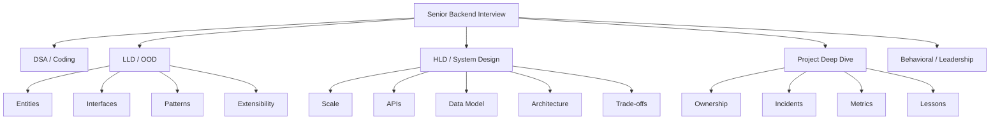

### What interviewers look for

| Area | Senior Signal |
|---|---|
| Coding | Clean, correct, tested, handles edge cases |
| LLD | SOLID, extensible design, good abstractions |
| HLD | Scale, trade-offs, bottlenecks, reliability |
| Project | Real ownership, impact, failure handling |
| Behavioral | Mentorship, decision-making, conflict handling |

---

## 2. Universal Answer Framework

Use this for **any** HLD or LLD question.

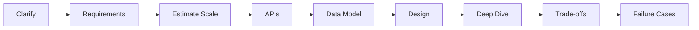

### Speak in this order

| Step | What to say |
|---|---|
| Clarify | “Let me confirm requirements and constraints first.” |
| Functional | “Users can create/read/update/delete...” |
| Non-functional | “We need low latency, high availability, consistency...” |
| Scale | “Assume X users, Y QPS, Z storage.” |
| APIs | “Here are the core endpoints.” |
| Data | “Main entities are...” |
| Design | “Start simple, then scale.” |
| Deep Dive | “Now let’s handle bottlenecks.” |
| Trade-offs | “This gives availability but weaker consistency.” |

---

## 3. HLD System Design Checklist

### Requirement checklist

| Category | Ask / Define |
|---|---|
| Users | DAU/MAU, active users, tenants |
| Traffic | read QPS, write QPS, peak ratio |
| Latency | p50, p95, p99 targets |
| Availability | 99.9%, 99.99%, multi-region? |
| Consistency | strong, eventual, read-after-write |
| Data size | object size, rows/day, retention |
| Security | auth, encryption, audit logs |
| Compliance | payments, PII, GDPR, PCI, SOC2 |

### API checklist

```http
POST /v1/payments
Idempotency-Key: abc-123
Authorization: Bearer <token>

{
  "userId": "u1",
  "amount": 1000,
  "currency": "USD",
  "paymentMethodId": "pm_123"
}
```

| API Concern | Senior Answer |
|---|---|
| Idempotency | Use client-generated key + unique DB constraint |
| Pagination | Cursor pagination over offset pagination |
| Auth | OAuth2/JWT/service-to-service mTLS |
| Versioning | `/v1`, backward-compatible changes |
| Rate limiting | per user, IP, tenant, API key |
| Errors | stable error codes, retryable vs non-retryable |

### Data model checklist

| Decision | Options | When to use |
|---|---|---|
| Main DB | PostgreSQL/MySQL | transactions, relational data, correctness |
| NoSQL | DynamoDB/Cassandra | massive scale, key-value access |
| Cache | Redis/Memcached | hot reads, counters, sessions |
| Search | Elasticsearch/OpenSearch | text search, filtering, logs |
| Object Store | S3/GCS/Azure Blob | files, images, large blobs |
| Stream | Kafka/PubSub/Kinesis | events, pipelines, fanout |

---

## 4. HLD Visual Templates

### Basic scalable backend

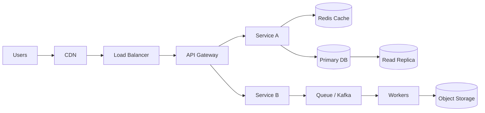

### Event-driven system

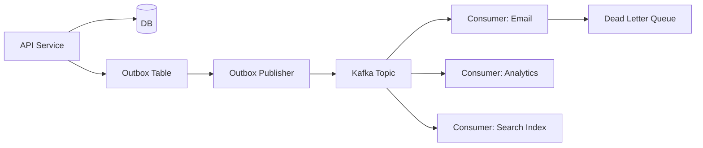

### Multi-region active-passive

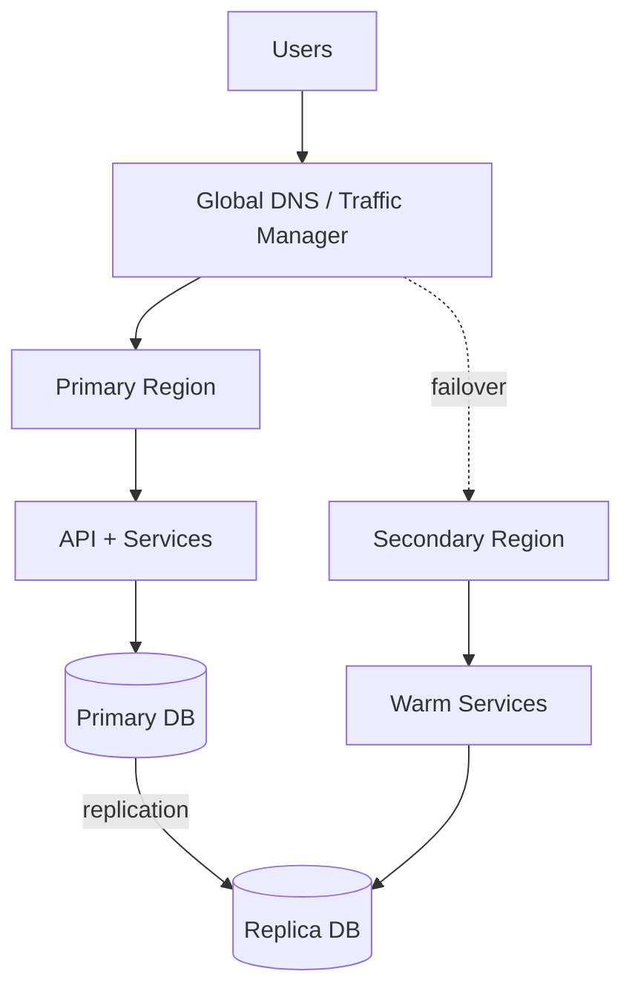

### Payment system high-level design

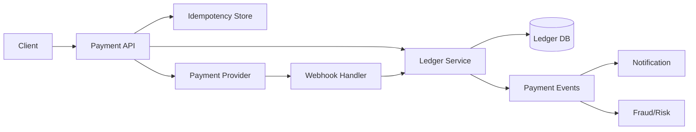

### CrowdStrike-style file scanning pipeline

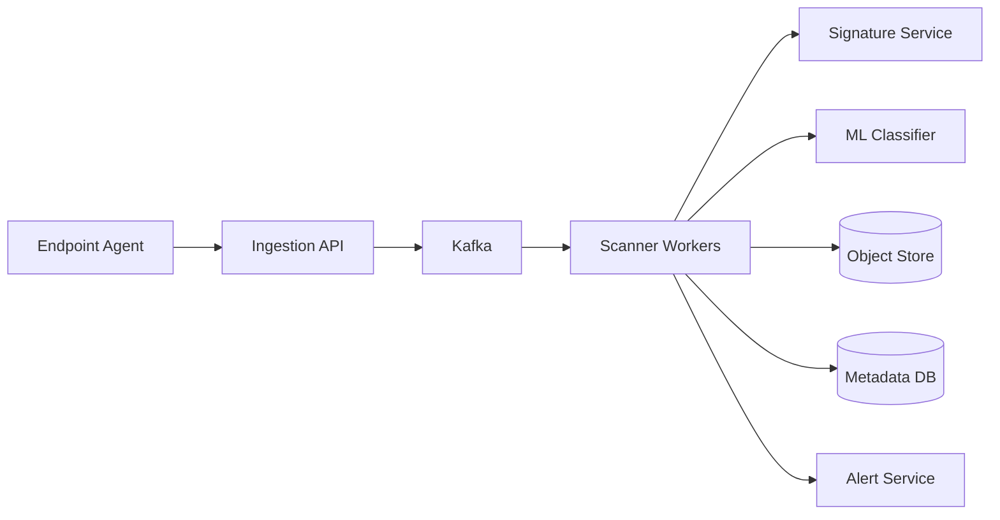

---

## 5. Common HLD Patterns

### 5.1 Cache-aside

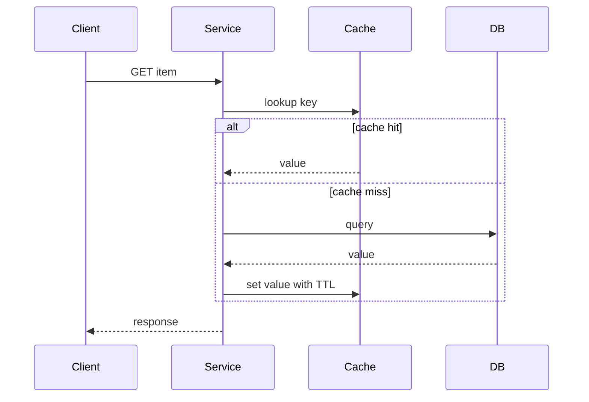

| Good | Risk |
|---|---|
| Simple, fast reads | stale data |
| Reduces DB load | cache stampede |
| Good for hot data | invalidation complexity |

**Mitigations:** TTL, versioned keys, write-through for critical paths, single-flight locking.

### 5.2 Outbox pattern

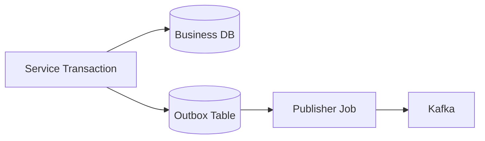

| Problem | Solution |
|---|---|
| DB write succeeds but event publish fails | Store event in same DB transaction |
| Duplicate event publish | Consumers must be idempotent |
| Ordering | Partition by aggregate ID |

### 5.3 Saga pattern

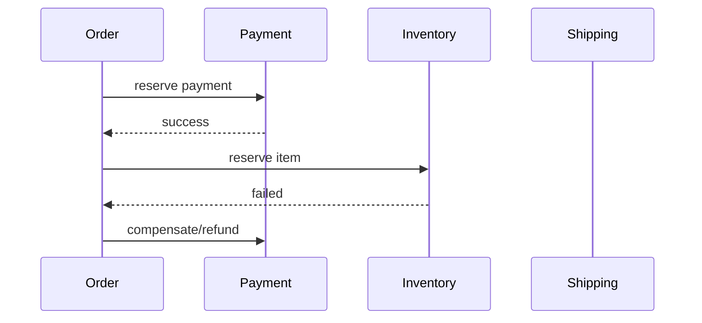

| Use when | Avoid when |
|---|---|
| Distributed transaction across services | Strong ACID required in one DB |
| Long-running workflows | Simple single-table transaction enough |

### 5.4 Rate limiter options

| Algorithm | Use case | Trade-off |
|---|---|---|
| Fixed window | simple API limits | boundary burst issue |
| Sliding window log | accurate | memory-heavy |
| Sliding window counter | balanced | approximate |
| Token bucket | burst allowed | needs refill logic |
| Leaky bucket | smooth traffic | less burst-friendly |

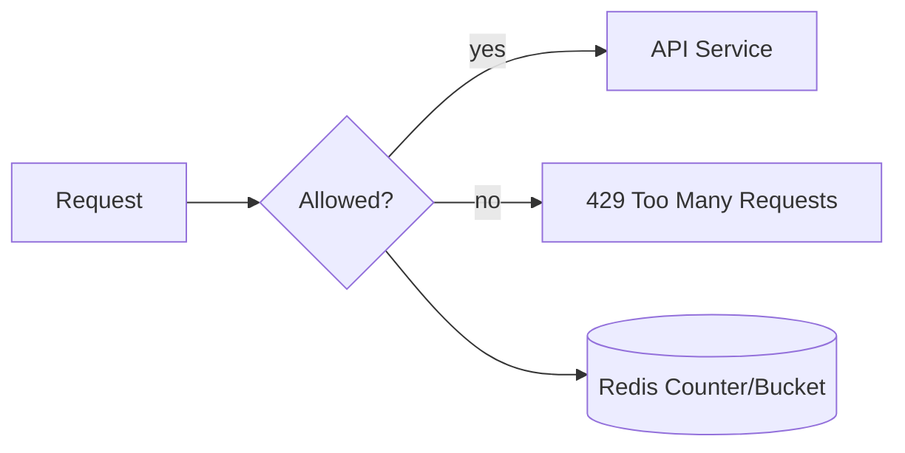

---

## 6. Backend Technology Decision Table

### Database choice

| Requirement | Best fit | Why |
|---|---|---|
| Payments, ledger, transactions | PostgreSQL/MySQL | ACID, constraints, transactions |
| High write scale, key-value access | DynamoDB/Cassandra | partitioned writes |
| Social feed / flexible docs | MongoDB/DynamoDB | document or key-value model |
| Analytics events | BigQuery/Snowflake/ClickHouse | columnar analytics |
| Search | Elasticsearch/OpenSearch | inverted index |
| Time-series metrics | Prometheus/TimescaleDB | time-based queries |

### Queue / stream choice

| Technology | Use when | Trade-off |
|---|---|---|
| Kafka | high-throughput event streaming | operational complexity |
| RabbitMQ | routing, work queues | lower event replay strength |
| SQS | simple cloud queue | cloud-specific, limited ordering unless FIFO |
| Pub/Sub | cloud-native fanout | cloud-specific |
| Redis Streams | small/simple streaming | not ideal for huge durable pipelines |

### Cache choice

| Use case | Pattern |
|---|---|
| Read-heavy product/user data | cache-aside |
| Session store | Redis with TTL |
| Counters/rate limits | Redis atomic operations |
| Global static content | CDN |
| Expensive computed result | cache with versioned key |

### Consistency decision

| Need | Choose |
|---|---|
| Money movement | strong consistency + transactions |
| User profile update | read-after-write useful |
| Feed ranking | eventual consistency okay |
| Inventory booking | strong or reservation model |
| Analytics dashboard | eventual consistency okay |

---

## 7. LLD Checklist

### LLD process

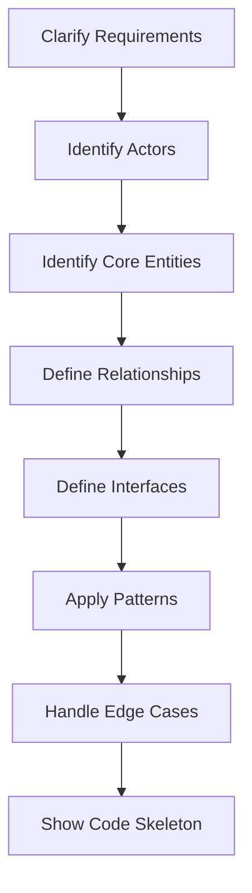

### Class design checklist

| Concern | Ask yourself |
|---|---|
| SRP | Does each class have one reason to change? |
| OCP | Can I add new behavior without changing old code? |
| LSP | Can subclasses replace parent safely? |
| ISP | Are interfaces small and focused? |
| DIP | Does high-level code depend on abstractions? |
| Thread safety | Shared state protected? immutable where possible? |
| Testability | Can I mock dependencies? |
| Extensibility | Can I add new payment method/strategy/rule? |

### Common LLD problems

| Problem | Pattern to show |
|---|---|
| Parking lot | Strategy, Factory, State |
| Elevator | State machine, PriorityQueue |
| Rate limiter | Strategy, Factory, Redis abstraction |
| Logger | Chain of Responsibility, Singleton carefully |
| Notification | Strategy, Observer |
| Payment | Strategy, Adapter, Idempotency |
| Splitwise | Strategy for settlement |
| Chess | State, Factory, abstract Piece |
| File scanner | Pipeline, Strategy, Chain of Responsibility |

---

## 8. LLD Visual Templates

### Strategy pattern

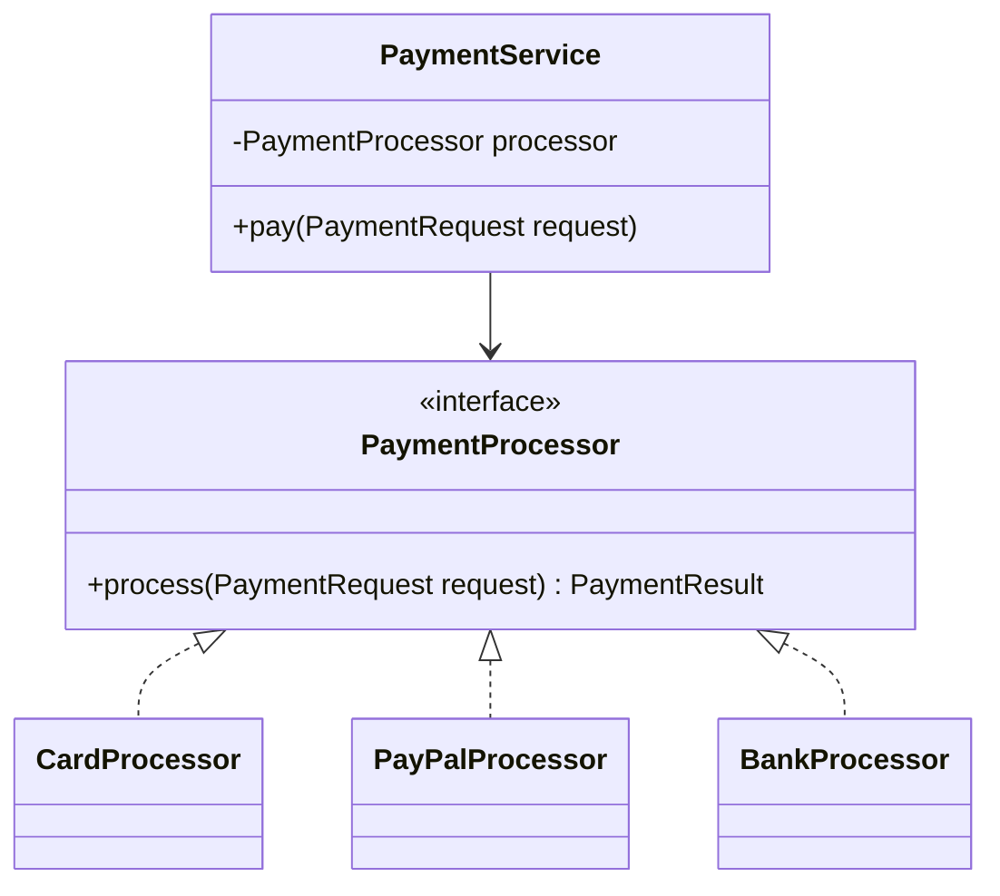

### Rate limiter LLD

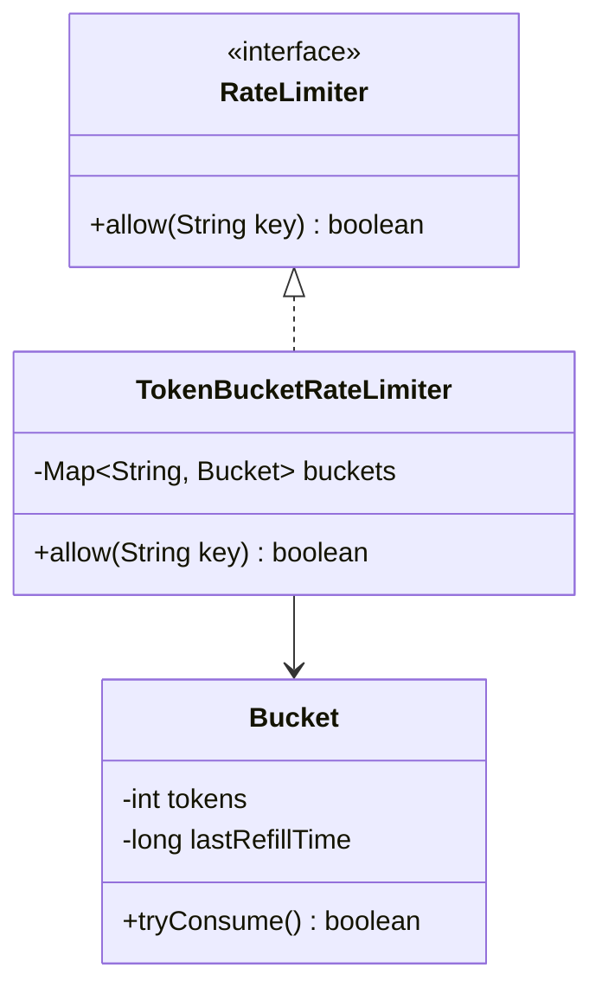

### Notification system LLD

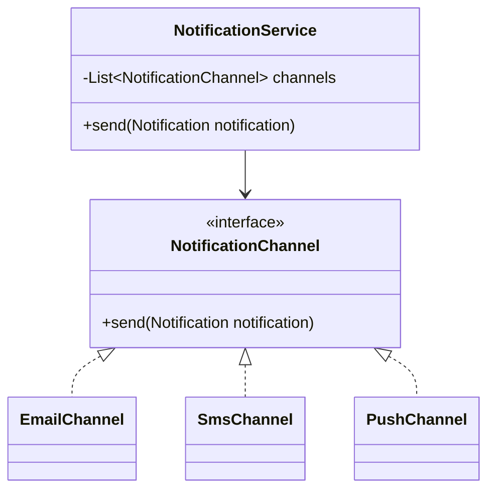

---

## 9. Java Code Snippets

### 9.1 Strategy pattern: Payment processor

```java
interface PaymentProcessor {
    PaymentResult process(PaymentRequest request);
}

class CardPaymentProcessor implements PaymentProcessor {
    @Override
    public PaymentResult process(PaymentRequest request) {
        // call card network / PSP
        return PaymentResult.success(request.idempotencyKey());
    }
}

class PaypalPaymentProcessor implements PaymentProcessor {
    @Override
    public PaymentResult process(PaymentRequest request) {
        // call PayPal adapter
        return PaymentResult.success(request.idempotencyKey());
    }
}

class PaymentService {
    private final PaymentProcessor processor;
    private final IdempotencyStore idempotencyStore;

    PaymentService(PaymentProcessor processor, IdempotencyStore idempotencyStore) {
        this.processor = processor;
        this.idempotencyStore = idempotencyStore;
    }

    public PaymentResult pay(PaymentRequest request) {
        return idempotencyStore.getOrCreate(
            request.idempotencyKey(),
            () -> processor.process(request)
        );
    }
}

record PaymentRequest(String userId, long amountCents, String currency, String idempotencyKey) {}
record PaymentResult(boolean success, String referenceId) {
    static PaymentResult success(String referenceId) {
        return new PaymentResult(true, referenceId);
    }
}
```

### 9.2 Idempotency store idea

```java
import java.util.Map;
import java.util.concurrent.ConcurrentHashMap;
import java.util.function.Supplier;

class IdempotencyStore {
    private final Map<String, PaymentResult> store = new ConcurrentHashMap<>();

    public PaymentResult getOrCreate(String key, Supplier<PaymentResult> operation) {
        return store.computeIfAbsent(key, ignored -> operation.get());
    }
}
```

**Interview note:** In production, use DB unique constraint or Redis/DB with TTL. In-memory map is only for LLD demonstration.

### 9.3 Token bucket rate limiter

```java
class TokenBucketRateLimiter {
    private final int capacity;
    private final int refillTokensPerSecond;
    private int tokens;
    private long lastRefillMillis;

    public TokenBucketRateLimiter(int capacity, int refillTokensPerSecond) {
        this.capacity = capacity;
        this.refillTokensPerSecond = refillTokensPerSecond;
        this.tokens = capacity;
        this.lastRefillMillis = System.currentTimeMillis();
    }

    public synchronized boolean allow() {
        refill();
        if (tokens > 0) {
            tokens--;
            return true;
        }
        return false;
    }

    private void refill() {
        long now = System.currentTimeMillis();
        long elapsedSeconds = (now - lastRefillMillis) / 1000;
        if (elapsedSeconds > 0) {
            int refill = (int) elapsedSeconds * refillTokensPerSecond;
            tokens = Math.min(capacity, tokens + refill);
            lastRefillMillis = now;
        }
    }
}
```

### 9.4 Factory pattern

```java
class PaymentProcessorFactory {
    public PaymentProcessor getProcessor(String type) {
        return switch (type.toUpperCase()) {
            case "CARD" -> new CardPaymentProcessor();
            case "PAYPAL" -> new PaypalPaymentProcessor();
            default -> throw new IllegalArgumentException("Unsupported payment type: " + type);
        };
    }
}
```

### 9.5 Notification Strategy

```java
interface NotificationChannel {
    void send(Notification notification);
}

class EmailChannel implements NotificationChannel {
    public void send(Notification notification) {
        System.out.println("Sending email: " + notification.message());
    }
}

class SmsChannel implements NotificationChannel {
    public void send(Notification notification) {
        System.out.println("Sending SMS: " + notification.message());
    }
}

class NotificationService {
    private final List<NotificationChannel> channels;

    NotificationService(List<NotificationChannel> channels) {
        this.channels = channels;
    }

    public void send(Notification notification) {
        for (NotificationChannel channel : channels) {
            channel.send(notification);
        }
    }
}

record Notification(String userId, String message) {}
```

### 9.6 Circuit breaker skeleton

```java
class CircuitBreaker {
    enum State { CLOSED, OPEN, HALF_OPEN }

    private State state = State.CLOSED;
    private int failureCount = 0;
    private final int failureThreshold = 3;
    private long lastFailureTime = 0;
    private final long retryAfterMillis = 10_000;

    public synchronized boolean allowRequest() {
        if (state == State.CLOSED) return true;

        if (state == State.OPEN &&
            System.currentTimeMillis() - lastFailureTime > retryAfterMillis) {
            state = State.HALF_OPEN;
            return true;
        }
        return state == State.HALF_OPEN;
    }

    public synchronized void recordSuccess() {
        failureCount = 0;
        state = State.CLOSED;
    }

    public synchronized void recordFailure() {
        failureCount++;
        lastFailureTime = System.currentTimeMillis();
        if (failureCount >= failureThreshold) {
            state = State.OPEN;
        }
    }
}
```

---

## 10. Company-Specific Focus

| Company | Likely Focus | Prepare Examples |
|---|---|---|
| Google | scale, clean abstractions, distributed systems | search, storage, feed, rate limiter |
| Microsoft | practical design, cloud, collaboration | Azure-style backend, project ownership |
| CrowdStrike | security telemetry, streaming, file scanning | Kafka pipeline, detection engine, alerting |
| PayPal | payments, ledger, correctness, idempotency | payment workflow, ledger, fraud checks |
| Amazon-style | leadership principles, scale, operational excellence | outages, ownership, cost optimization |
| Meta-style | product scale, feeds, ranking, experimentation | news feed, notifications, analytics |

---

## 11. Project Deep-Dive Checklist

Use this story format for every senior project.

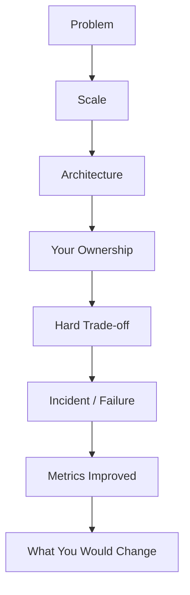

### Prepare 2–3 projects

| Question | Your prepared answer |
|---|---|
| What did you build? | One-line problem statement |
| What was the scale? | QPS, users, data size, latency |
| What was your role? | Personally owned components |
| Why this design? | Alternatives and trade-offs |
| What failed? | Real incident or technical challenge |
| How did you monitor? | logs, metrics, traces, alerts |
| What improved? | latency, cost, reliability, developer speed |
| What would you change? | mature senior reflection |

### Strong senior phrases

| Weak | Strong |
|---|---|
| “We used Kafka.” | “We used Kafka because replay, ordering by key, and high-throughput fanout mattered.” |
| “We used Redis.” | “We used Redis for hot reads with TTL and protected DB using cache-aside.” |
| “It was scalable.” | “At peak, it handled X QPS with p95 latency under Y ms.” |
| “I fixed bugs.” | “I traced production failures using metrics, logs, and distributed traces.” |

---

## 12. Final 30-Minute Revision Sheet

### HLD must-say items

- Clarify requirements first.
- Start simple, then scale.
- Define APIs before architecture.
- Mention data model and indexes.
- Add cache only with invalidation strategy.
- Use queues for async, retry, and backpressure.
- Use idempotency for retries and payments.
- Use DLQ for failed async processing.
- Use observability: logs, metrics, traces.
- Discuss bottlenecks and trade-offs.

### LLD must-say items

- Identify actors and entities.
- Define interfaces before concrete classes.
- Apply SOLID principles.
- Use Strategy for replaceable behavior.
- Use Factory for object creation.
- Keep code testable with dependency injection.
- Mention thread safety.
- Handle edge cases.
- Add small Java skeleton.

### Trade-off cheat sheet

| Topic | Option A | Option B | Choose based on |
|---|---|---|---|
| DB | SQL | NoSQL | transactions vs scale/flexible access |
| Communication | REST | gRPC | public APIs vs internal low-latency calls |
| Processing | Sync | Async | immediate response vs resilience/backpressure |
| Consistency | Strong | Eventual | correctness vs availability/latency |
| Deployment | Monolith | Microservices | simplicity vs independent scaling |
| Cache | Redis | CDN | dynamic hot data vs static/global content |
| Events | Kafka | Queue | replay/fanout vs simple background jobs |

### Last-minute checklist

- [ ] Can explain one HLD end-to-end in 10 minutes.
- [ ] Can explain one LLD with classes and interfaces.
- [ ] Can write small Java code for Strategy/Factory/RateLimiter.
- [ ] Can discuss SQL vs NoSQL clearly.
- [ ] Can discuss Kafka vs queue clearly.
- [ ] Can explain idempotency.
- [ ] Can explain cache invalidation.
- [ ] Can explain project ownership and impact.
- [ ] Can explain one production failure.
- [ ] Can explain what you would improve today.

---

## Bonus: One-Minute System Design Script

> “I’ll start by clarifying functional and non-functional requirements. Then I’ll estimate scale, define APIs, propose a data model, draw a simple architecture, and then evolve it for scale, reliability, consistency, and observability. I’ll also call out trade-offs as we go.”

## Bonus: One-Minute LLD Script

> “I’ll identify the actors, core entities, relationships, and interfaces first. Then I’ll apply SOLID principles, use design patterns only where they help, handle edge cases, and show a small Java skeleton for the core flow.”

