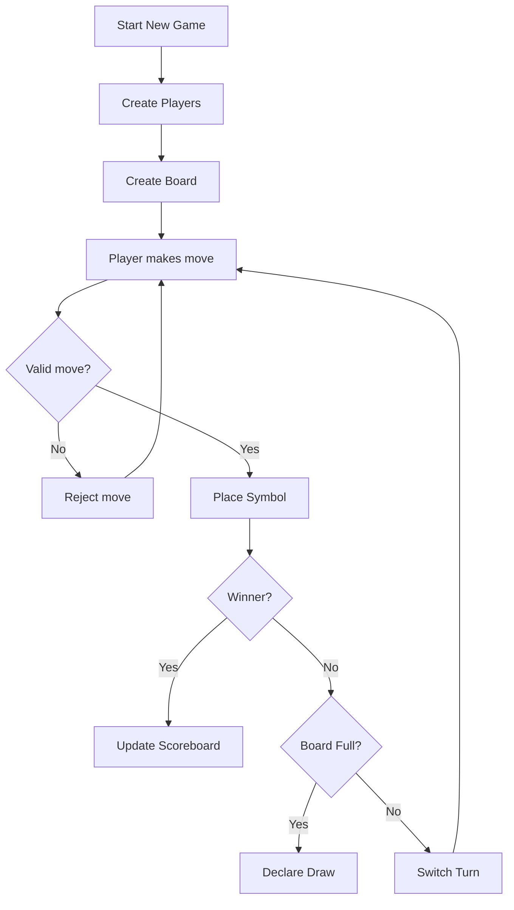
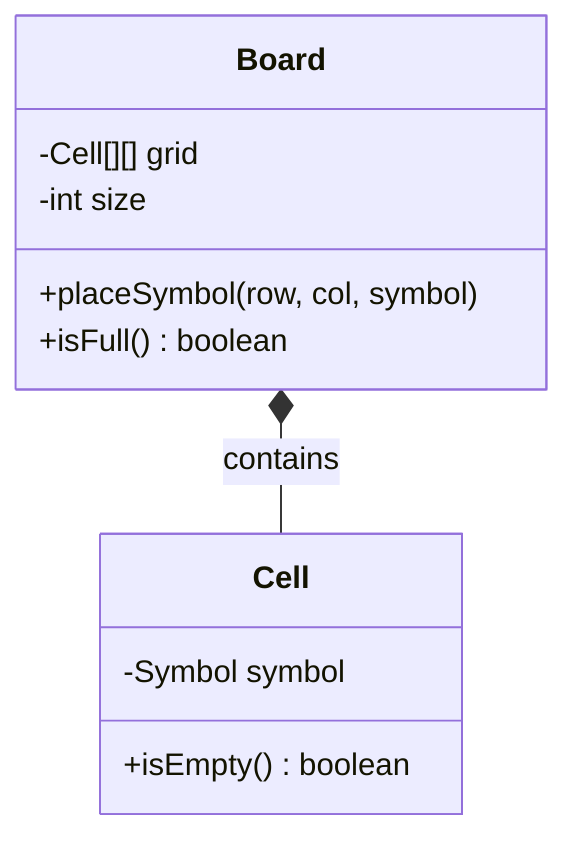
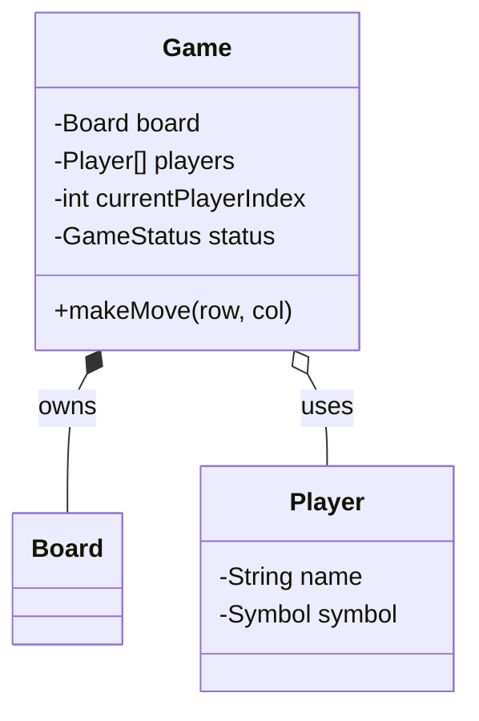
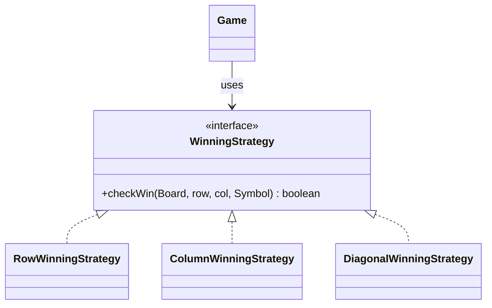
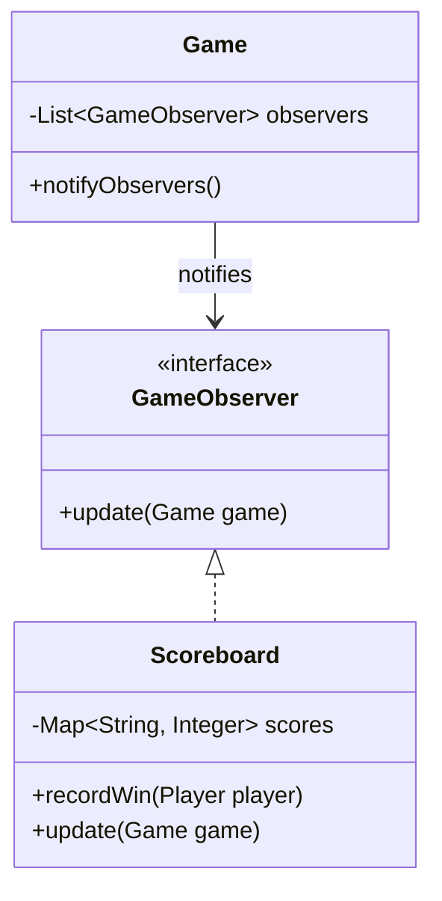
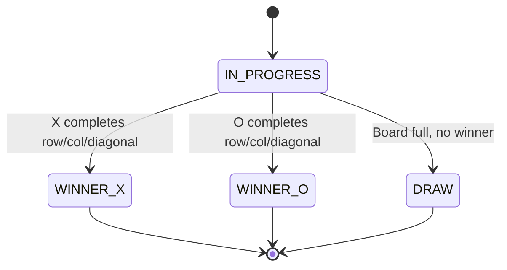
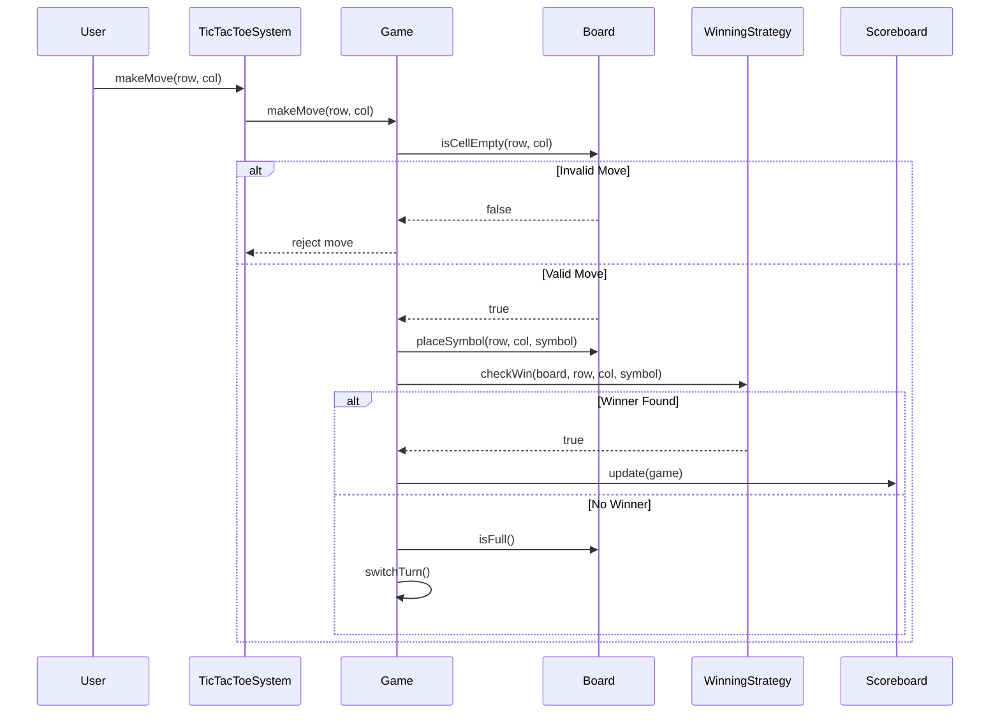
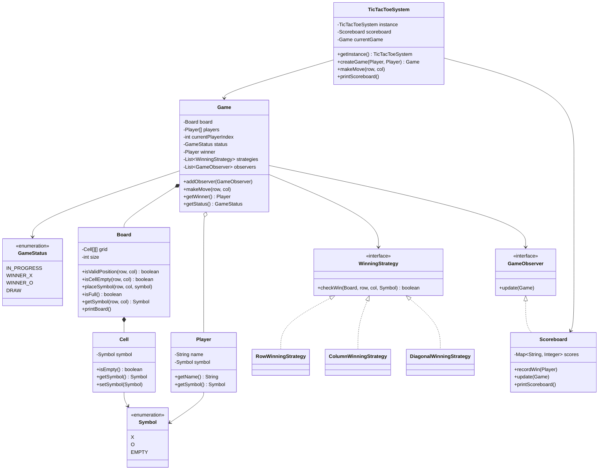

# Tic-Tac-Toe LLD Reference

> Goal: Small, visual, interview-friendly low-level design reference with Mermaid diagrams and Java skeleton code.

---

## 1. Requirements

### Functional Requirements

- Game is played on a **3x3 board**.
- Two players play alternately using symbols **X** and **O**.
- System should validate moves.
- System should reject invalid moves.
- System should detect winner.
- System should detect draw.
- System should maintain scoreboard across games.
- Demo can use hardcoded moves.

### Non-Functional Requirements

- Clean object-oriented design.
- Easy to test.
- Easy to extend for bigger board, AI player, undo, replay.
- Clear separation of responsibilities.

---

## 2. Core Use Cases



---

## 3. Entities + Responsibilities

| Entity | Type | Responsibility |
|---|---|---|
| `Symbol` | Enum | Represents `X`, `O`, `EMPTY` |
| `GameStatus` | Enum | Represents game state |
| `Cell` | Data Class | Holds one symbol |
| `Player` | Data Class | Holds player name and symbol |
| `Board` | Core Class | Manages grid and board operations |
| `WinningStrategy` | Interface | Contract for win checking |
| `Game` | Core Class | Orchestrates gameplay |
| `Scoreboard` | Core Class / Observer | Tracks wins across games |
| `TicTacToeSystem` | Facade / Singleton | Public entry point |

---

## 4. Relationships

### Step 1: Board contains Cells



### Step 2: Game uses Board and Players



### Step 3: Game uses Winning Strategies



### Step 4: Game notifies Scoreboard



---

## 5. State Transitions



---

## 6. Core Flows

### Make Move Flow



---

## 7. Design Patterns Used

| Pattern | Used In | Why |
|---|---|---|
| Strategy Pattern | `WinningStrategy` | Add new win logic without modifying `Game` |
| Observer Pattern | `GameObserver`, `Scoreboard` | Decouple game result from scoreboard update |
| Singleton Pattern | `TicTacToeSystem` | One global system and scoreboard |
| Facade Pattern | `TicTacToeSystem` | Simple public API for clients |
| Composition | `Board` owns `Cell` | Cells do not exist independently |

---

## 8. Skeleton Code

```java
import java.util.*;

// ---------- Enums ----------
enum Symbol {
    X, O, EMPTY
}

enum GameStatus {
    IN_PROGRESS,
    WINNER_X,
    WINNER_O,
    DRAW
}

// ---------- Data Classes ----------
class Player {
    private final String name;
    private final Symbol symbol;

    public Player(String name, Symbol symbol) {
        if (symbol == Symbol.EMPTY) {
            throw new IllegalArgumentException("Player cannot have EMPTY symbol");
        }
        this.name = name;
        this.symbol = symbol;
    }

    public String getName() {
        return name;
    }

    public Symbol getSymbol() {
        return symbol;
    }
}

class Cell {
    private Symbol symbol;

    public Cell() {
        this.symbol = Symbol.EMPTY;
    }

    public boolean isEmpty() {
        return symbol == Symbol.EMPTY;
    }

    public Symbol getSymbol() {
        return symbol;
    }

    public void setSymbol(Symbol symbol) {
        this.symbol = symbol;
    }
}

// ---------- Board ----------
class Board {
    private final Cell[][] grid;
    private final int size;

    public Board(int size) {
        this.size = size;
        this.grid = new Cell[size][size];

        for (int i = 0; i < size; i++) {
            for (int j = 0; j < size; j++) {
                grid[i][j] = new Cell();
            }
        }
    }

    public boolean isValidPosition(int row, int col) {
        return row >= 0 && row < size && col >= 0 && col < size;
    }

    public boolean isCellEmpty(int row, int col) {
        return isValidPosition(row, col) && grid[row][col].isEmpty();
    }

    public void placeSymbol(int row, int col, Symbol symbol) {
        if (!isCellEmpty(row, col)) {
            throw new IllegalArgumentException("Invalid move");
        }
        grid[row][col].setSymbol(symbol);
    }

    public boolean isFull() {
        for (int i = 0; i < size; i++) {
            for (int j = 0; j < size; j++) {
                if (grid[i][j].isEmpty()) {
                    return false;
                }
            }
        }
        return true;
    }

    public Symbol getSymbol(int row, int col) {
        return grid[row][col].getSymbol();
    }

    public int getSize() {
        return size;
    }

    public void printBoard() {
        for (int i = 0; i < size; i++) {
            for (int j = 0; j < size; j++) {
                System.out.print(grid[i][j].getSymbol() + " ");
            }
            System.out.println();
        }
        System.out.println();
    }
}

// ---------- Strategy Pattern ----------
interface WinningStrategy {
    boolean checkWin(Board board, int row, int col, Symbol symbol);
}

class RowWinningStrategy implements WinningStrategy {
    public boolean checkWin(Board board, int row, int col, Symbol symbol) {
        for (int j = 0; j < board.getSize(); j++) {
            if (board.getSymbol(row, j) != symbol) {
                return false;
            }
        }
        return true;
    }
}

class ColumnWinningStrategy implements WinningStrategy {
    public boolean checkWin(Board board, int row, int col, Symbol symbol) {
        for (int i = 0; i < board.getSize(); i++) {
            if (board.getSymbol(i, col) != symbol) {
                return false;
            }
        }
        return true;
    }
}

class DiagonalWinningStrategy implements WinningStrategy {
    public boolean checkWin(Board board, int row, int col, Symbol symbol) {
        int n = board.getSize();
        boolean mainDiagonal = true;
        boolean antiDiagonal = true;

        for (int i = 0; i < n; i++) {
            if (board.getSymbol(i, i) != symbol) {
                mainDiagonal = false;
            }
            if (board.getSymbol(i, n - 1 - i) != symbol) {
                antiDiagonal = false;
            }
        }

        return mainDiagonal || antiDiagonal;
    }
}

// ---------- Observer Pattern ----------
interface GameObserver {
    void update(Game game);
}

class Scoreboard implements GameObserver {
    private final Map<String, Integer> scores = new HashMap<>();

    public void recordWin(Player player) {
        scores.put(player.getName(), scores.getOrDefault(player.getName(), 0) + 1);
    }

    public void update(Game game) {
        Player winner = game.getWinner();
        if (winner != null) {
            recordWin(winner);
        }
    }

    public void printScoreboard() {
        System.out.println("Scoreboard: " + scores);
    }
}

// ---------- Game ----------
class Game {
    private final Board board;
    private final Player[] players;
    private int currentPlayerIndex;
    private GameStatus status;
    private Player winner;

    private final List<WinningStrategy> strategies = new ArrayList<>();
    private final List<GameObserver> observers = new ArrayList<>();

    public Game(Player p1, Player p2, int boardSize) {
        this.board = new Board(boardSize);
        this.players = new Player[]{p1, p2};
        this.currentPlayerIndex = 0;
        this.status = GameStatus.IN_PROGRESS;

        strategies.add(new RowWinningStrategy());
        strategies.add(new ColumnWinningStrategy());
        strategies.add(new DiagonalWinningStrategy());
    }

    public void addObserver(GameObserver observer) {
        observers.add(observer);
    }

    public void makeMove(int row, int col) {
        if (status != GameStatus.IN_PROGRESS) {
            System.out.println("Game already ended");
            return;
        }

        Player currentPlayer = players[currentPlayerIndex];

        if (!board.isCellEmpty(row, col)) {
            System.out.println("Invalid move by " + currentPlayer.getName());
            return;
        }

        board.placeSymbol(row, col, currentPlayer.getSymbol());
        board.printBoard();

        if (hasWon(row, col, currentPlayer.getSymbol())) {
            winner = currentPlayer;
            status = currentPlayer.getSymbol() == Symbol.X
                    ? GameStatus.WINNER_X
                    : GameStatus.WINNER_O;
            notifyObservers();
            System.out.println(currentPlayer.getName() + " wins!");
            return;
        }

        if (board.isFull()) {
            status = GameStatus.DRAW;
            notifyObservers();
            System.out.println("Game draw!");
            return;
        }

        switchTurn();
    }

    private boolean hasWon(int row, int col, Symbol symbol) {
        for (WinningStrategy strategy : strategies) {
            if (strategy.checkWin(board, row, col, symbol)) {
                return true;
            }
        }
        return false;
    }

    private void switchTurn() {
        currentPlayerIndex = 1 - currentPlayerIndex;
    }

    private void notifyObservers() {
        for (GameObserver observer : observers) {
            observer.update(this);
        }
    }

    public Player getWinner() {
        return winner;
    }

    public GameStatus getStatus() {
        return status;
    }
}

// ---------- Facade + Singleton ----------
class TicTacToeSystem {
    private static TicTacToeSystem instance;
    private final Scoreboard scoreboard;
    private Game currentGame;

    private TicTacToeSystem() {
        this.scoreboard = new Scoreboard();
    }

    public static TicTacToeSystem getInstance() {
        if (instance == null) {
            instance = new TicTacToeSystem();
        }
        return instance;
    }

    public Game createGame(Player p1, Player p2) {
        currentGame = new Game(p1, p2, 3);
        currentGame.addObserver(scoreboard);
        return currentGame;
    }

    public void makeMove(int row, int col) {
        currentGame.makeMove(row, col);
    }

    public void printScoreboard() {
        scoreboard.printScoreboard();
    }
}

// ---------- Demo ----------
public class Main {
    public static void main(String[] args) {
        TicTacToeSystem system = TicTacToeSystem.getInstance();

        Player alice = new Player("Alice", Symbol.X);
        Player bob = new Player("Bob", Symbol.O);

        system.createGame(alice, bob);

        system.makeMove(0, 0); // Alice
        system.makeMove(1, 0); // Bob
        system.makeMove(0, 1); // Alice
        system.makeMove(1, 1); // Bob
        system.makeMove(0, 2); // Alice wins

        system.printScoreboard();
    }
}
```

---

## 9. Edge Cases

| Edge Case | Expected Handling |
|---|---|
| Move outside board | Reject move |
| Move on occupied cell | Reject move |
| Move after game ended | Reject move |
| Player uses `EMPTY` symbol | Throw validation error |
| Both players have same symbol | Reject during game creation |
| Board full with no winner | Declare draw |
| Scoreboard update on draw | Do not increment any player score |

---

## 10. Failure Points

| Failure Point | Risk | Fix |
|---|---|---|
| No bounds validation | Array index error | Validate row and column |
| No game-ended check | Moves after winner | Check `GameStatus` before move |
| Duplicate player symbols | Wrong winner logic | Validate players before game starts |
| Direct scoreboard update inside Game | Tight coupling | Use Observer pattern |
| Hardcoded win logic inside Game | Poor extensibility | Use Strategy pattern |
| Mutable player symbol | Unexpected bugs | Make `Player` immutable |

---

## 11. Improvements

### Easy Improvements

- Add player-vs-computer mode.
- Add undo move.
- Add move history.
- Add replay feature.
- Add better console UI.

### Advanced Improvements

- Support `N x N` board.
- Support custom winning length, for example 4 in a row.
- Add AI using Minimax.
- Add multiplayer over network.
- Store scoreboard in database.
- Add thread safety for concurrent games.

---

## Final Class Diagram


