# Parking Lot LLD — Visual Reference

## 1. Requirements

### Functional Requirements
- Support multi-level parking lot.
- Support vehicles: `Bike`, `Car`, `Truck`.
- Support spot sizes: `SMALL`, `MEDIUM`, `LARGE`.
- Allocate compatible parking spots automatically.
- Issue parking ticket on entry.
- Track entry and exit time.
- Calculate parking fee using pluggable pricing strategy.
- Show real-time spot availability.
- Support concurrent entry/exit safely.

### Non-Functional Requirements
- Object-oriented design with clear responsibilities.
- Thread-safe parking and unparking.
- Extensible for new vehicle types, fee rules, allocation rules.
- Testable components.
- Minimal coupling between classes.

---

## 2. Core Use Cases

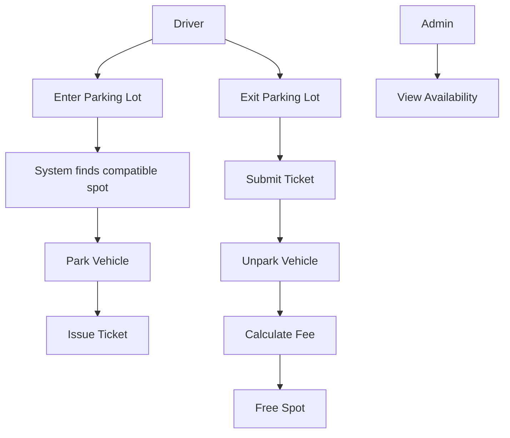

### Main APIs
```java
ParkingTicket parkVehicle(Vehicle vehicle);
double unparkVehicle(String ticketId);
void displayAvailability();
```

---

## 3. Entities + Responsibilities

| Entity | Type | Responsibility |
|---|---|---|
| `VehicleSize` | Enum | Represents `SMALL`, `MEDIUM`, `LARGE` |
| `Vehicle` | Abstract class | Common vehicle data |
| `Bike`, `Car`, `Truck` | Concrete classes | Vehicle-specific size setup |
| `ParkingSpot` | Core class | Holds one vehicle and validates compatibility |
| `ParkingFloor` | Core class | Manages spots on one floor |
| `ParkingTicket` | Data class | Tracks vehicle, spot, entry/exit time |
| `FeeStrategy` | Interface | Calculates fee |
| `SpotAllocationStrategy` | Interface | Finds suitable parking spot |
| `ParkingLot` | Facade / Singleton | Coordinates floors, spots, tickets, fees |
| `ParkingException` | Exception | Handles invalid parking operations |

---

## 4. Relationships

### Step 1 — Vehicle and Size

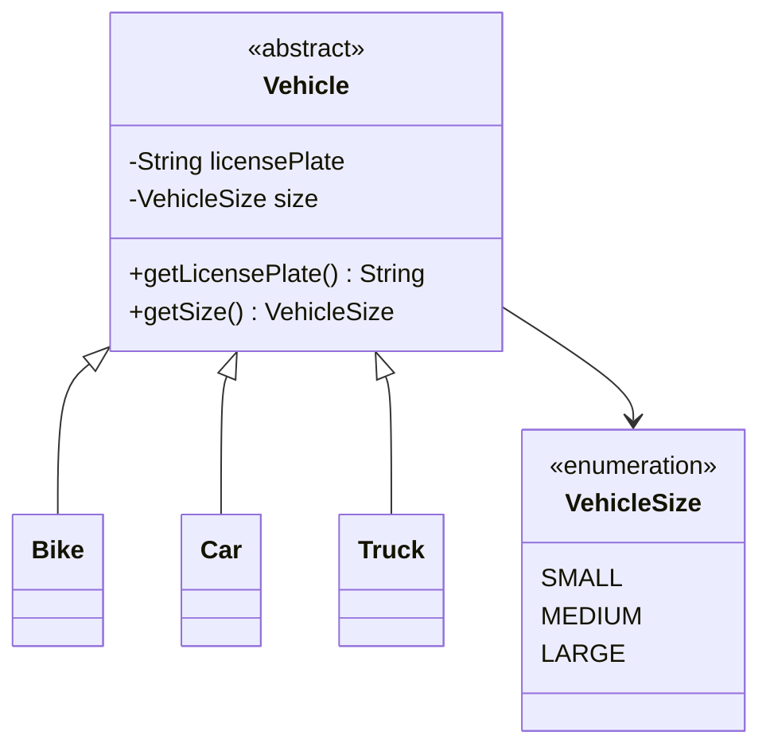

### Step 2 — Floor owns Spots

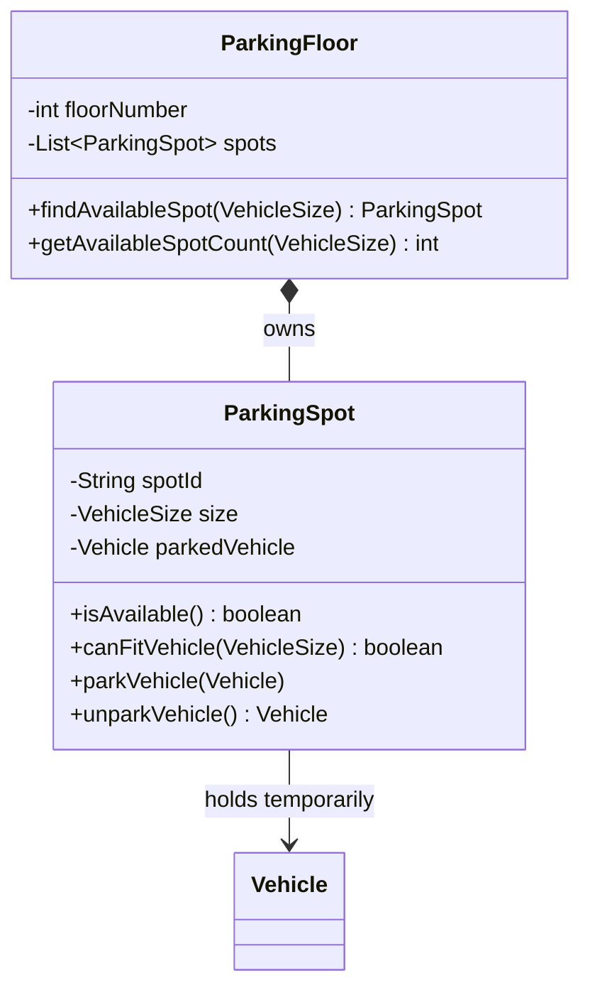

### Step 3 — Ticket connects Vehicle and Spot

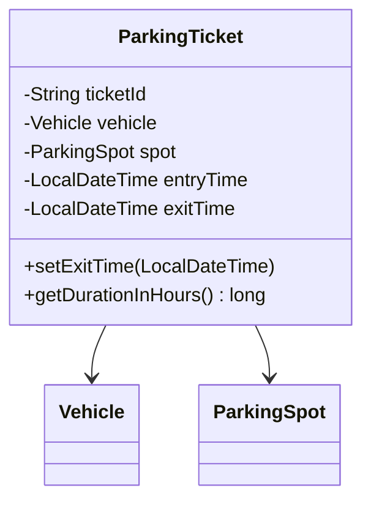

### Step 4 — Strategies

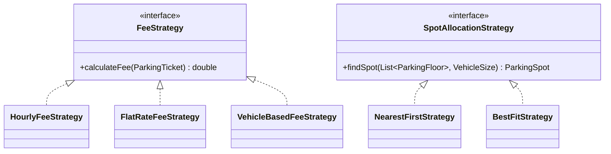

### Final Class Diagram

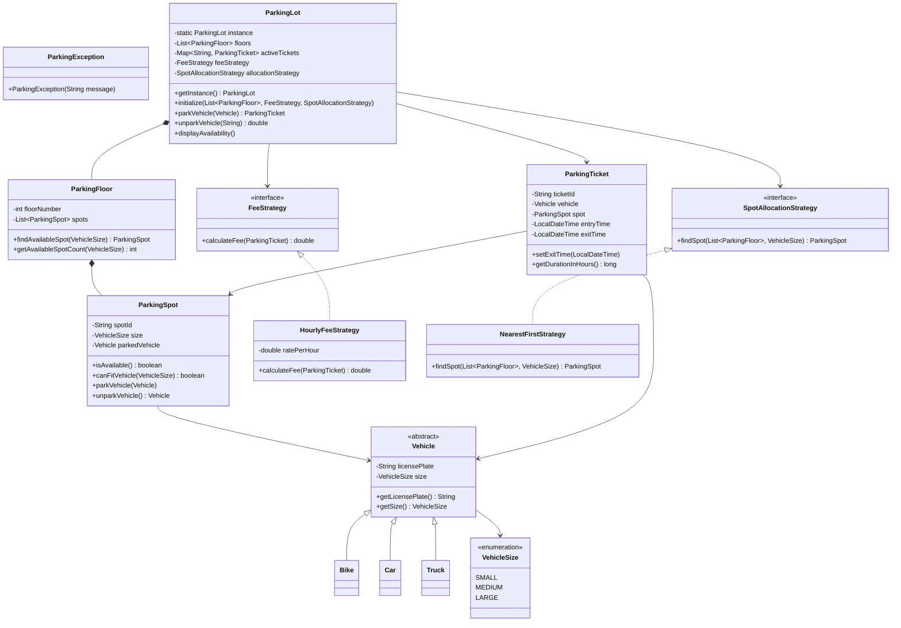

---

## 5. State Transitions

### Parking Spot State

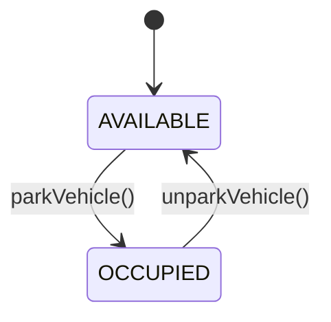

### Ticket State

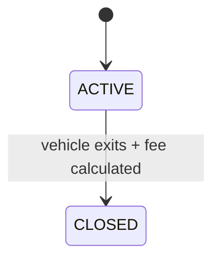

---

## 6. Core Flows

### Park Vehicle Flow

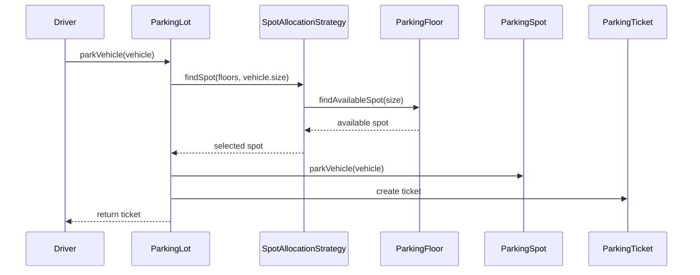

### Unpark Vehicle Flow

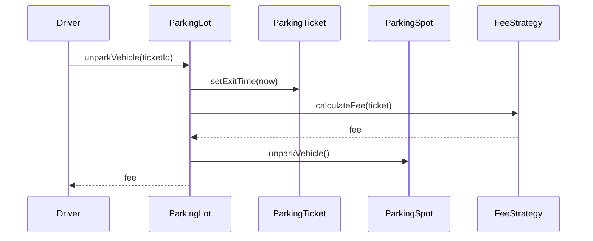

---

## 7. Design Patterns Used

### Strategy Pattern — Fee Calculation

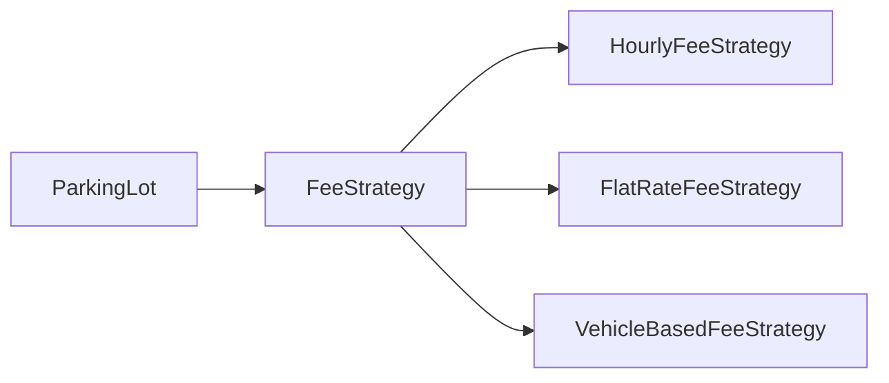

Why:
- Different fee rules can be added without changing `ParkingLot`.
- Examples: hourly fee, flat fee, weekend fee, vehicle-based fee.

### Strategy Pattern — Spot Allocation

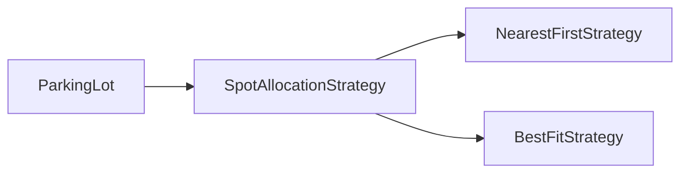

Why:
- Different spot-selection rules can be plugged in.
- Examples: nearest first, best fit, floor balancing.

### Singleton Pattern — ParkingLot

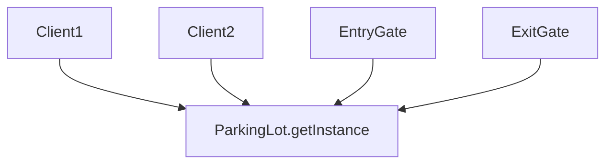

Why:
- One parking lot should maintain one consistent state.
- Avoids duplicate ticket maps and inconsistent spot availability.

### Facade Pattern — ParkingLot

`ParkingLot` hides internal complexity from client code.

Client only calls:
```java
parkVehicle(vehicle);
unparkVehicle(ticketId);
displayAvailability();
```

---

## 8. Skeleton Code

```java
import java.time.*;
import java.util.*;
import java.util.concurrent.*;

// ---------- Enums ----------
enum VehicleSize {
    SMALL, MEDIUM, LARGE
}

// ---------- Exception ----------
class ParkingException extends RuntimeException {
    public ParkingException(String message) {
        super(message);
    }
}

// ---------- Vehicle ----------
abstract class Vehicle {
    private final String licensePlate;
    private final VehicleSize size;

    protected Vehicle(String licensePlate, VehicleSize size) {
        this.licensePlate = licensePlate;
        this.size = size;
    }

    public String getLicensePlate() { return licensePlate; }
    public VehicleSize getSize() { return size; }
}

class Bike extends Vehicle {
    public Bike(String licensePlate) {
        super(licensePlate, VehicleSize.SMALL);
    }
}

class Car extends Vehicle {
    public Car(String licensePlate) {
        super(licensePlate, VehicleSize.MEDIUM);
    }
}

class Truck extends Vehicle {
    public Truck(String licensePlate) {
        super(licensePlate, VehicleSize.LARGE);
    }
}

// ---------- Parking Spot ----------
class ParkingSpot {
    private final String spotId;
    private final VehicleSize size;
    private Vehicle parkedVehicle;

    public ParkingSpot(String spotId, VehicleSize size) {
        this.spotId = spotId;
        this.size = size;
    }

    public synchronized boolean isAvailable() {
        return parkedVehicle == null;
    }

    public boolean canFitVehicle(VehicleSize vehicleSize) {
        return vehicleSize.ordinal() <= size.ordinal();
    }

    public synchronized void parkVehicle(Vehicle vehicle) {
        if (!isAvailable()) {
            throw new ParkingException("Spot already occupied");
        }
        if (!canFitVehicle(vehicle.getSize())) {
            throw new ParkingException("Vehicle does not fit in this spot");
        }
        parkedVehicle = vehicle;
    }

    public synchronized Vehicle unparkVehicle() {
        if (parkedVehicle == null) {
            throw new ParkingException("Spot is already empty");
        }
        Vehicle vehicle = parkedVehicle;
        parkedVehicle = null;
        return vehicle;
    }

    public String getSpotId() { return spotId; }
    public VehicleSize getSize() { return size; }
}

// ---------- Parking Floor ----------
class ParkingFloor {
    private final int floorNumber;
    private final List<ParkingSpot> spots = new ArrayList<>();

    public ParkingFloor(int floorNumber, Map<VehicleSize, Integer> spotCounts) {
        this.floorNumber = floorNumber;
        for (Map.Entry<VehicleSize, Integer> entry : spotCounts.entrySet()) {
            VehicleSize size = entry.getKey();
            int count = entry.getValue();
            for (int i = 1; i <= count; i++) {
                String spotId = "F" + floorNumber + "-" + size.name().charAt(0) + i;
                spots.add(new ParkingSpot(spotId, size));
            }
        }
    }

    public ParkingSpot findAvailableSpot(VehicleSize vehicleSize) {
        for (ParkingSpot spot : spots) {
            if (spot.isAvailable() && spot.canFitVehicle(vehicleSize)) {
                return spot;
            }
        }
        return null;
    }

    public int getAvailableSpotCount(VehicleSize vehicleSize) {
        int count = 0;
        for (ParkingSpot spot : spots) {
            if (spot.isAvailable() && spot.canFitVehicle(vehicleSize)) {
                count++;
            }
        }
        return count;
    }

    public int getFloorNumber() { return floorNumber; }
}

// ---------- Ticket ----------
class ParkingTicket {
    private final String ticketId;
    private final Vehicle vehicle;
    private final ParkingSpot spot;
    private final LocalDateTime entryTime;
    private LocalDateTime exitTime;

    public ParkingTicket(String ticketId, Vehicle vehicle, ParkingSpot spot) {
        this.ticketId = ticketId;
        this.vehicle = vehicle;
        this.spot = spot;
        this.entryTime = LocalDateTime.now();
    }

    public void setExitTime(LocalDateTime exitTime) {
        this.exitTime = exitTime;
    }

    public long getDurationInHours() {
        LocalDateTime end = exitTime == null ? LocalDateTime.now() : exitTime;
        long minutes = Duration.between(entryTime, end).toMinutes();
        return Math.max(1, (long) Math.ceil(minutes / 60.0));
    }

    public String getTicketId() { return ticketId; }
    public Vehicle getVehicle() { return vehicle; }
    public ParkingSpot getSpot() { return spot; }
}

// ---------- Strategies ----------
interface FeeStrategy {
    double calculateFee(ParkingTicket ticket);
}

class HourlyFeeStrategy implements FeeStrategy {
    private final double ratePerHour;

    public HourlyFeeStrategy(double ratePerHour) {
        this.ratePerHour = ratePerHour;
    }

    public double calculateFee(ParkingTicket ticket) {
        return ticket.getDurationInHours() * ratePerHour;
    }
}

interface SpotAllocationStrategy {
    ParkingSpot findSpot(List<ParkingFloor> floors, VehicleSize vehicleSize);
}

class NearestFirstStrategy implements SpotAllocationStrategy {
    public ParkingSpot findSpot(List<ParkingFloor> floors, VehicleSize vehicleSize) {
        for (ParkingFloor floor : floors) {
            ParkingSpot spot = floor.findAvailableSpot(vehicleSize);
            if (spot != null) return spot;
        }
        return null;
    }
}

// ---------- Parking Lot ----------
class ParkingLot {
    private static volatile ParkingLot instance;

    private List<ParkingFloor> floors;
    private FeeStrategy feeStrategy;
    private SpotAllocationStrategy allocationStrategy;
    private final Map<String, ParkingTicket> activeTickets = new ConcurrentHashMap<>();

    private ParkingLot() {}

    public static ParkingLot getInstance() {
        if (instance == null) {
            synchronized (ParkingLot.class) {
                if (instance == null) {
                    instance = new ParkingLot();
                }
            }
        }
        return instance;
    }

    public void initialize(List<ParkingFloor> floors,
                           FeeStrategy feeStrategy,
                           SpotAllocationStrategy allocationStrategy) {
        this.floors = floors;
        this.feeStrategy = feeStrategy;
        this.allocationStrategy = allocationStrategy;
    }

    public synchronized ParkingTicket parkVehicle(Vehicle vehicle) {
        ParkingSpot spot = allocationStrategy.findSpot(floors, vehicle.getSize());
        if (spot == null) {
            throw new ParkingException("No available compatible spot");
        }

        spot.parkVehicle(vehicle);
        String ticketId = UUID.randomUUID().toString();
        ParkingTicket ticket = new ParkingTicket(ticketId, vehicle, spot);
        activeTickets.put(ticketId, ticket);
        return ticket;
    }

    public synchronized double unparkVehicle(String ticketId) {
        ParkingTicket ticket = activeTickets.remove(ticketId);
        if (ticket == null) {
            throw new ParkingException("Invalid or already used ticket");
        }

        ticket.setExitTime(LocalDateTime.now());
        double fee = feeStrategy.calculateFee(ticket);
        ticket.getSpot().unparkVehicle();
        return fee;
    }

    public void displayAvailability() {
        for (ParkingFloor floor : floors) {
            System.out.println("Floor " + floor.getFloorNumber());
            for (VehicleSize size : VehicleSize.values()) {
                System.out.println(size + ": " + floor.getAvailableSpotCount(size));
            }
        }
    }
}

// ---------- Demo ----------
class ParkingLotDemo {
    public static void main(String[] args) {
        Map<VehicleSize, Integer> floorConfig = Map.of(
            VehicleSize.SMALL, 2,
            VehicleSize.MEDIUM, 3,
            VehicleSize.LARGE, 1
        );

        ParkingFloor floor1 = new ParkingFloor(1, floorConfig);
        ParkingFloor floor2 = new ParkingFloor(2, floorConfig);

        ParkingLot lot = ParkingLot.getInstance();
        lot.initialize(
            List.of(floor1, floor2),
            new HourlyFeeStrategy(5.0),
            new NearestFirstStrategy()
        );

        Vehicle car = new Car("KA-01-1234");
        ParkingTicket ticket = lot.parkVehicle(car);

        lot.displayAvailability();

        double fee = lot.unparkVehicle(ticket.getTicketId());
        System.out.println("Fee: $" + fee);
    }
}
```

---

## 9. Edge Cases

| Edge Case | Expected Handling |
|---|---|
| No compatible spot available | Throw `ParkingException` |
| Vehicle too large for available spot | Reject allocation |
| Invalid ticket ID | Throw `ParkingException` |
| Ticket already used | Reject exit request |
| Spot already occupied | Reject parking operation |
| Unparking empty spot | Throw `ParkingException` |
| Parking same vehicle twice | Should be prevented using vehicle-to-ticket map |
| Duration less than 1 hour | Charge minimum 1 hour |
| Concurrent entry requests | Synchronize allocation and spot assignment |
| Concurrent exit requests | Use atomic ticket removal |

---

## 10. Failure Points

### Race Condition During Parking
Two vehicles may receive the same spot if allocation and parking are not atomic.

Fix:
```java
public synchronized ParkingTicket parkVehicle(Vehicle vehicle) { ... }
```

### Ticket Removed Before Fee Calculation
If ticket is removed and fee calculation fails, the system may lose active ticket data.

Fix:
- Calculate fee first, then remove ticket.
- Or use transaction-like flow.

### Singleton Testing Difficulty
Singleton makes unit testing harder due to global state.

Fix:
- Use dependency injection in production systems.
- Reset singleton only in test environment.

### Incorrect Size Compatibility
Using wrong comparison can allow trucks into small spots.

Correct rule:
```java
vehicleSize.ordinal() <= spotSize.ordinal()
```

### Time Calculation Bugs
Rounding down duration may undercharge.

Fix:
```java
Math.ceil(minutes / 60.0)
```

---

## 11. Improvements

### Functional Improvements
- Add entry gates and exit gates.
- Add payment service.
- Add receipt generation.
- Add real-time display boards.
- Add reservation support.
- Add lost-ticket handling.
- Add EV charging spots.
- Add handicapped spots.
- Add license plate recognition.

### Design Improvements
- Replace Singleton with dependency injection.
- Add `VehicleType` separately if billing depends on exact type.
- Add `PaymentStrategy` for card/cash/UPI payments.
- Add `ParkingSession` for richer lifecycle tracking.
- Add event-driven updates for display boards.
- Persist tickets and payments in database.

### Scalability Improvements
- Use distributed lock for multiple entry gates.
- Store availability counters per floor and spot size.
- Use database transactions for ticket + spot updates.
- Cache availability for fast display.
- Add monitoring and audit logs.

---

## Quick Interview Summary

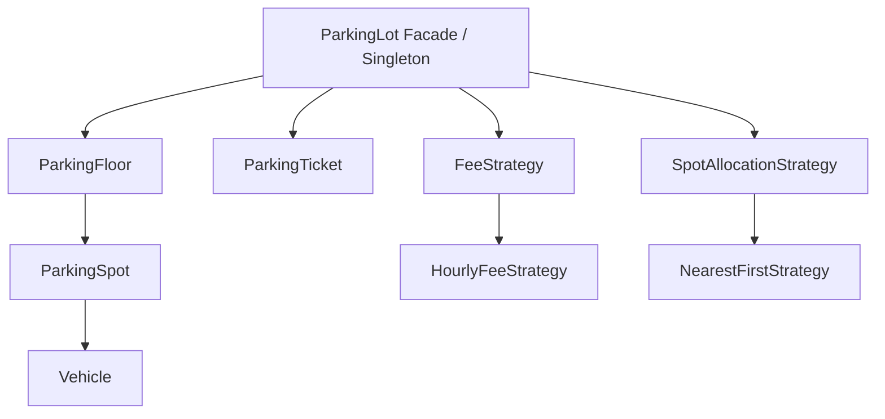

### One-Line Design
A `ParkingLot` facade coordinates multiple `ParkingFloor`s, each floor owns many `ParkingSpot`s, vehicles are assigned using a `SpotAllocationStrategy`, and parking fees are calculated using a `FeeStrategy`.
