# Design Task Management System — LLD Reference

## 1. Requirements

### Functional
- Create, update, delete tasks.
- Tasks have title, description, due date, priority, status.
- Tasks can have subtasks.
- Parent task can be marked `DONE` only when all subtasks are `DONE`.
- Tasks can be assigned to users.
- Tasks support tags and comments.
- Track activity history for creation, status changes, assignment changes, comments.
- Filter tasks by status, priority, and assignee.
- Tasks belong to task lists.

### Non-Functional
- Clean object-oriented design.
- Modular and extensible.
- Thread-safe for concurrent usage.
- Testable components.
- Easy to add new states, sort options, notifications, and filters.

---

## 2. Core Use Cases

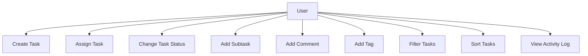

### Main Use Cases
| Use Case | Description |
|---|---|
| Create Task | User creates a task with required and optional fields |
| Assign Task | Task can be assigned/reassigned to a user |
| Change Status | Task moves through valid lifecycle states |
| Add Subtask | A task can contain child tasks |
| Add Comment | Users can comment on a task |
| Filter Tasks | Filter by status, priority, assignee |
| Sort Tasks | Sort by priority, due date, creation date |
| Activity Logging | System records important task events |

---

## 3. Entities + Responsibilities

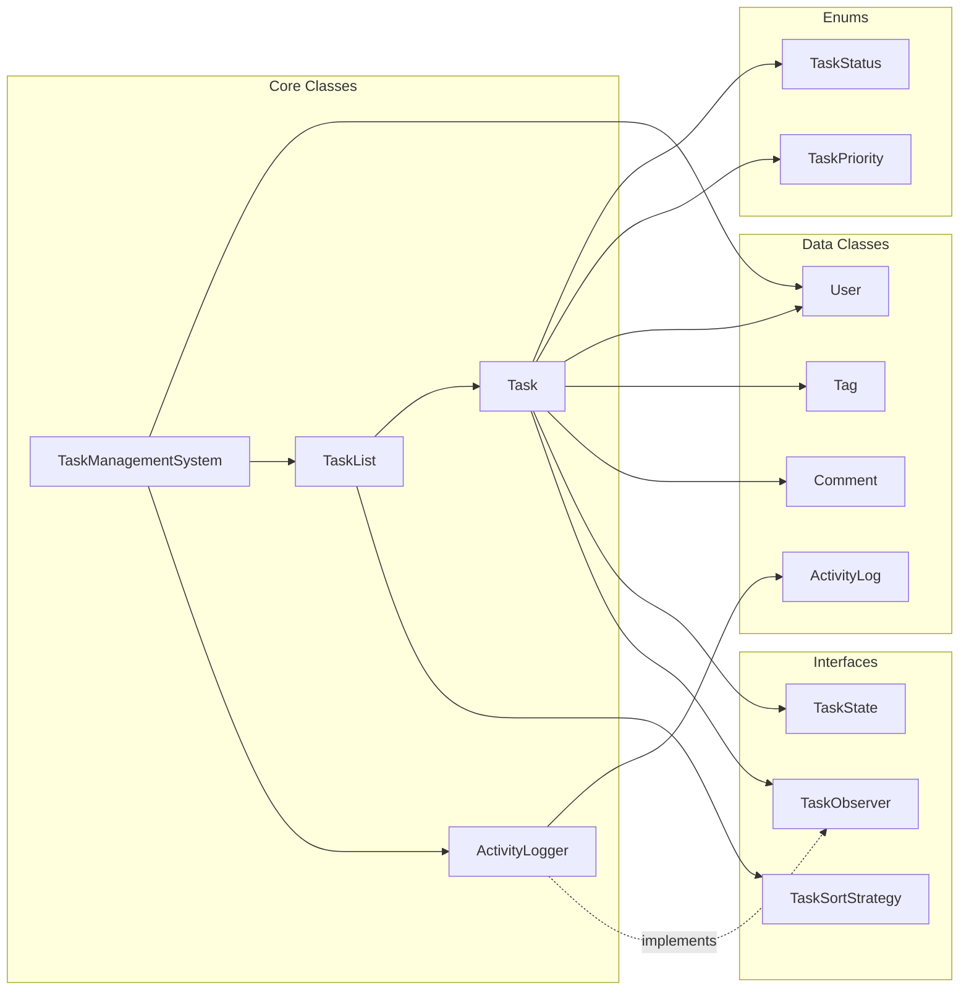

### Entity Table
| Entity | Type | Responsibility |
|---|---|---|
| `TaskStatus` | Enum | `TODO`, `IN_PROGRESS`, `DONE`, `BLOCKED` |
| `TaskPriority` | Enum | `LOW`, `MEDIUM`, `HIGH`, `CRITICAL` |
| `User` | Data Class | User identity: id, name, email |
| `Tag` | Data Class | Task category label |
| `Comment` | Data Class | User comment with timestamp |
| `ActivityLog` | Data Class | Immutable audit entry |
| `TaskState` | Interface | Defines valid task transitions |
| `TaskObserver` | Interface | Receives task update events |
| `TaskSortStrategy` | Interface | Sorts tasks using different algorithms |
| `Task` | Core Class | Main entity; manages state, subtasks, comments, tags |
| `TaskList` | Core Class | Groups tasks and supports filtering/sorting |
| `ActivityLogger` | Core Class | Observer that records activity logs |
| `TaskManagementSystem` | Facade/Singleton | Main entry point |

---

## 4. Relationships

### Step 1: Task has basic properties

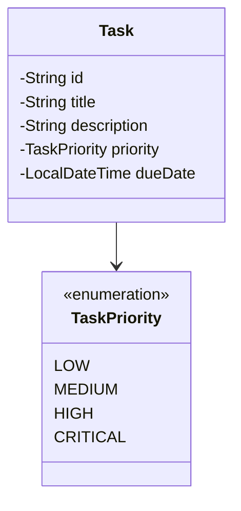

### Step 2: Task has lifecycle state

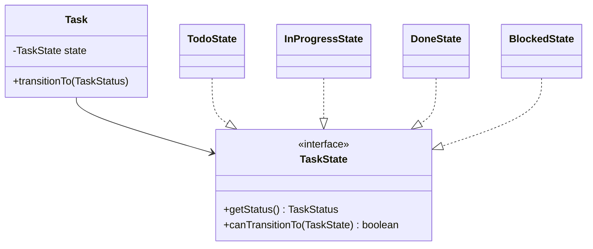

### Step 3: Task links to users, comments, tags, subtasks

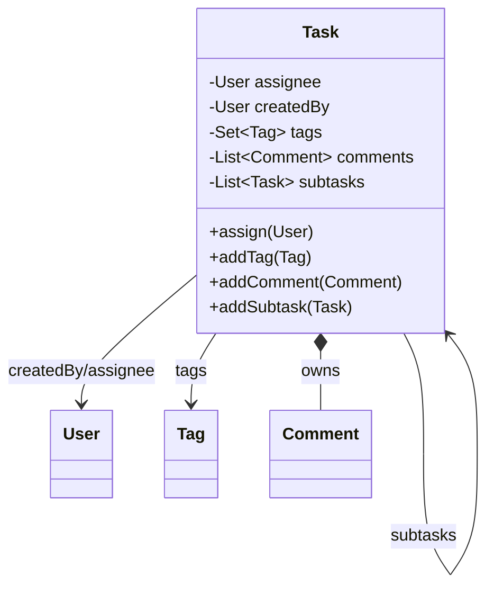

### Step 4: Task notifies observers

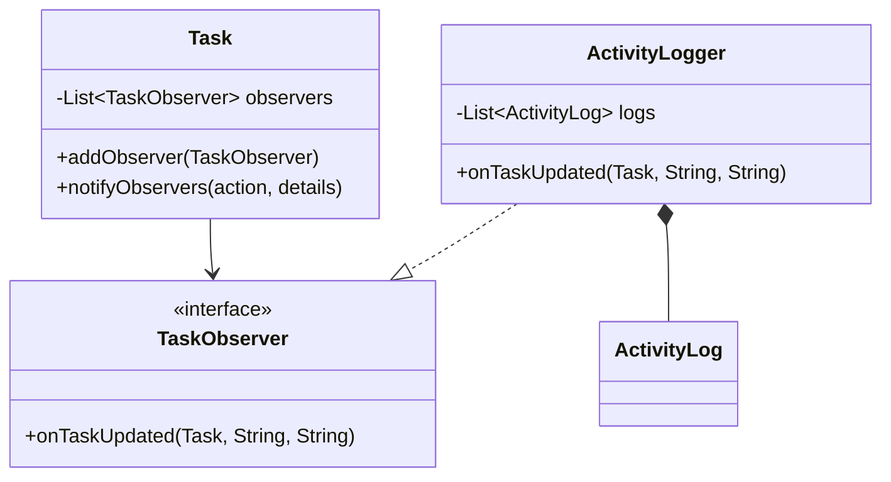

### Step 5: TaskList groups tasks and uses sorting strategy

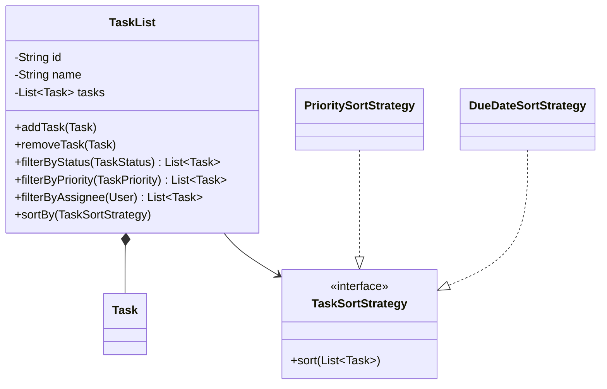

---

## 5. State Transitions

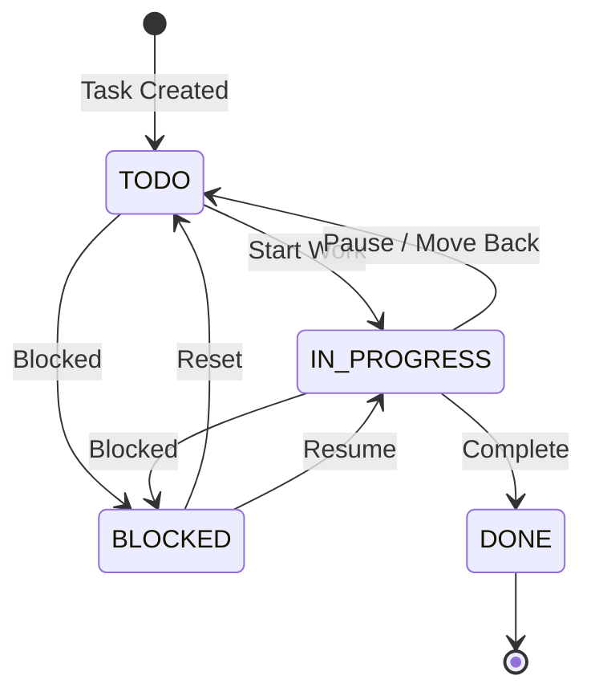

### Transition Rules
| From | To | Valid? |
|---|---|---|
| `TODO` | `IN_PROGRESS` | Yes |
| `TODO` | `BLOCKED` | Yes |
| `TODO` | `DONE` | No |
| `IN_PROGRESS` | `TODO` | Yes |
| `IN_PROGRESS` | `DONE` | Yes, if subtasks done |
| `IN_PROGRESS` | `BLOCKED` | Yes |
| `BLOCKED` | `TODO` | Yes |
| `BLOCKED` | `IN_PROGRESS` | Yes |
| `DONE` | Any | No, terminal |

---

## 6. Core Flows

### 6.1 Create Task Flow

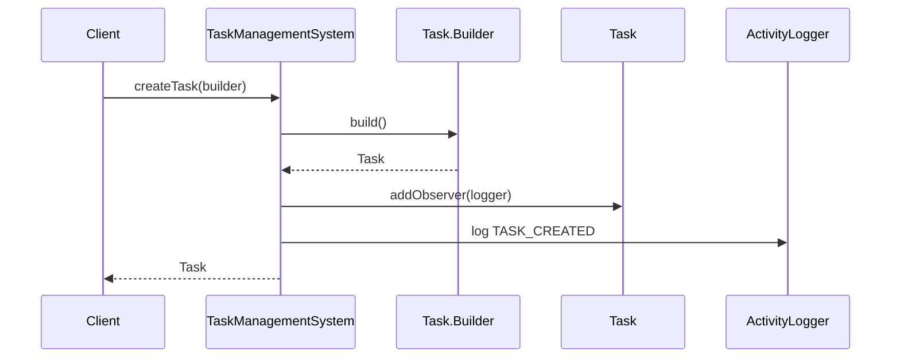

### 6.2 Change Status Flow

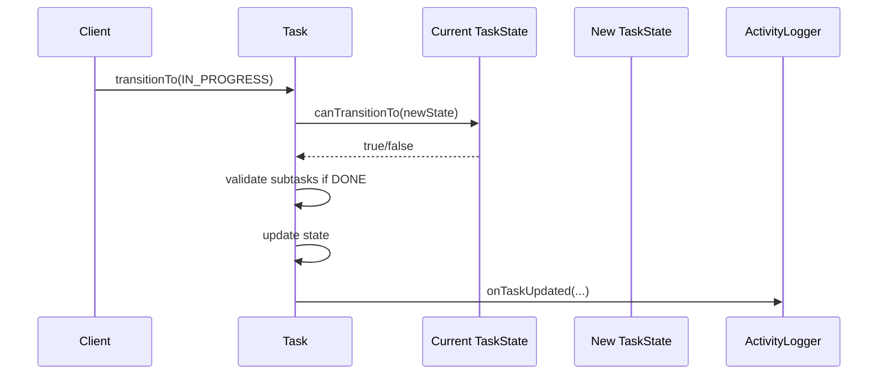

### 6.3 Add Comment Flow

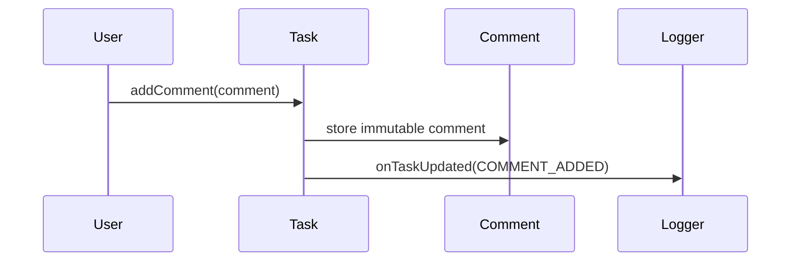

### 6.4 Filter Tasks Flow

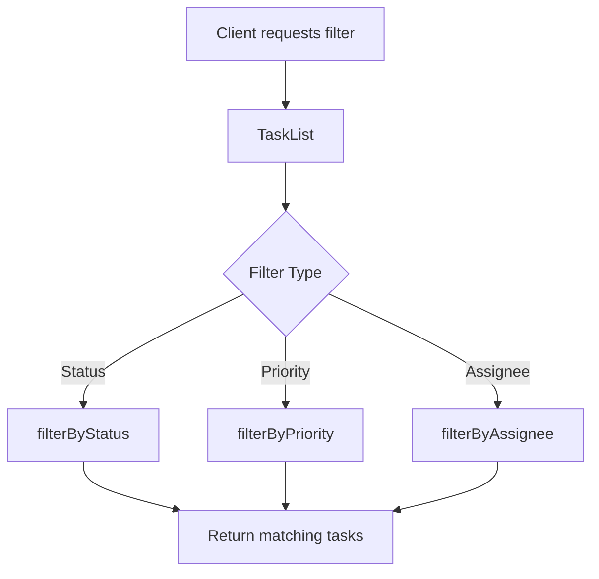

---

## 7. Design Patterns Used

### 7.1 State Pattern

Used for task lifecycle validation.

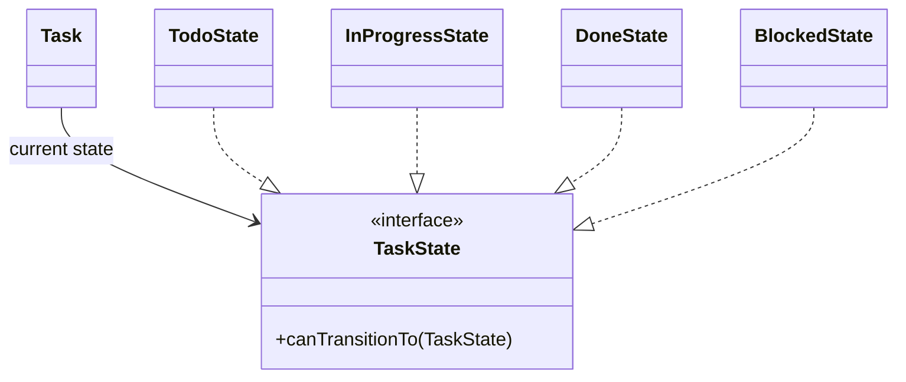

Why useful:
- Avoids large `switch`/`if-else` transition logic.
- Keeps each state rule isolated.
- Easy to add future states like `ARCHIVED`, `REVIEW`, `CANCELLED`.

---

### 7.2 Observer Pattern

Used for activity logging and future notifications.

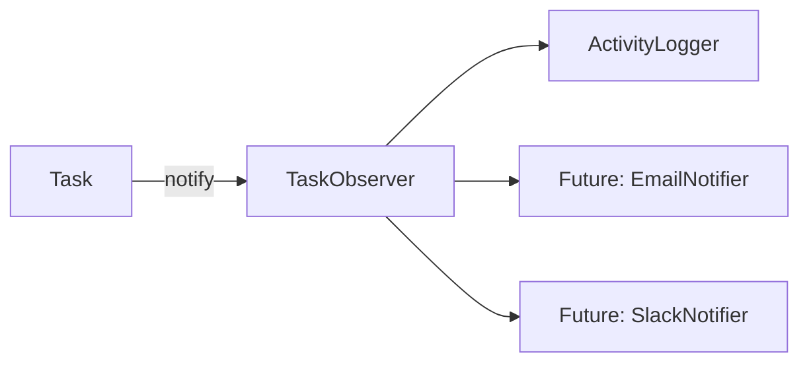

Why useful:
- Task does not directly depend on `ActivityLogger`.
- New observers can be added without changing `Task`.

---

### 7.3 Strategy Pattern

Used for task sorting.

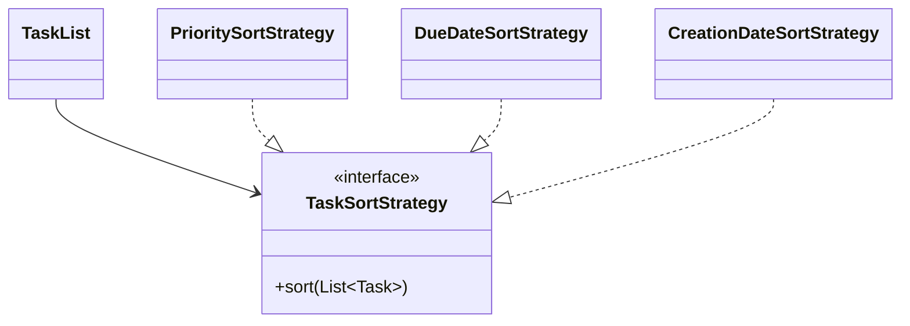

Why useful:
- Sorting logic is pluggable.
- Easy to add sort by assignee, status, creation date.

---

### 7.4 Builder Pattern

Used because `Task` has many optional fields.

```java
Task task = Task.builder("Fix login bug", alice)
    .description("OAuth login fails for Google users")
    .priority(TaskPriority.HIGH)
    .dueDate(LocalDateTime.now().plusDays(2))
    .assignee(bob)
    .build();
```

---

### 7.5 Singleton + Facade

Used by `TaskManagementSystem`.

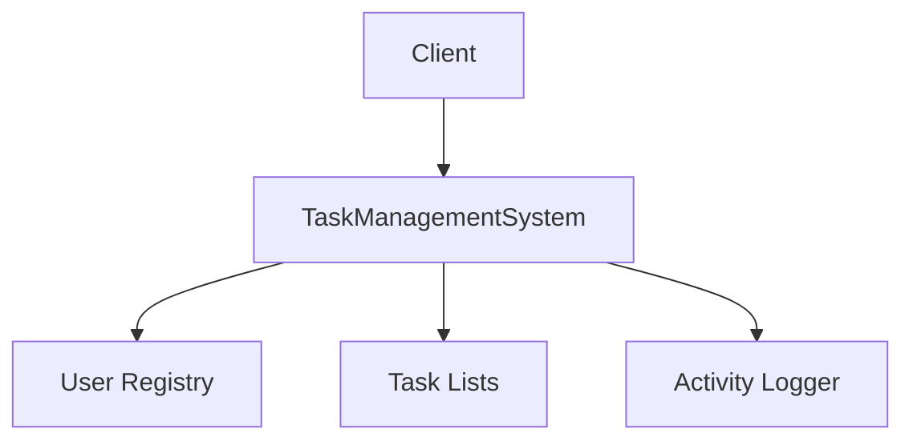

Why useful:
- Single entry point.
- Hides object creation and observer wiring.
- Maintains shared users/lists/logs.

---

## 8. Skeleton Code

```java
import java.time.*;
import java.util.*;
import java.util.concurrent.*;
import java.util.concurrent.atomic.AtomicInteger;

// ---------- Enums ----------
enum TaskStatus {
    TODO, IN_PROGRESS, DONE, BLOCKED
}

enum TaskPriority {
    LOW(1), MEDIUM(2), HIGH(3), CRITICAL(4);

    private final int level;

    TaskPriority(int level) {
        this.level = level;
    }

    public int getLevel() {
        return level;
    }
}

// ---------- Exception ----------
class TaskException extends RuntimeException {
    public TaskException(String message) {
        super(message);
    }
}

// ---------- Data Classes ----------
final class User {
    private final String id;
    private final String name;
    private final String email;

    public User(String id, String name, String email) {
        this.id = id;
        this.name = name;
        this.email = email;
    }

    public String getId() { return id; }
    public String getName() { return name; }
    public String getEmail() { return email; }

    @Override
    public boolean equals(Object obj) {
        if (this == obj) return true;
        if (!(obj instanceof User)) return false;
        User other = (User) obj;
        return Objects.equals(id, other.id);
    }

    @Override
    public int hashCode() {
        return Objects.hash(id);
    }
}

final class Tag {
    private final String name;

    public Tag(String name) {
        this.name = name.trim().toLowerCase();
    }

    public String getName() { return name; }

    @Override
    public String toString() {
        return "#" + name;
    }
}

final class Comment {
    private final User author;
    private final String content;
    private final LocalDateTime createdAt;

    public Comment(User author, String content) {
        this.author = author;
        this.content = content;
        this.createdAt = LocalDateTime.now();
    }

    public User getAuthor() { return author; }
    public String getContent() { return content; }
    public LocalDateTime getCreatedAt() { return createdAt; }
}

final class ActivityLog {
    private final String action;
    private final String details;
    private final User performedBy;
    private final LocalDateTime timestamp;

    public ActivityLog(String action, String details, User performedBy) {
        this.action = action;
        this.details = details;
        this.performedBy = performedBy;
        this.timestamp = LocalDateTime.now();
    }

    @Override
    public String toString() {
        return timestamp + " | " + action + " | " + details;
    }
}

// ---------- State Pattern ----------
interface TaskState {
    TaskStatus getStatus();
    boolean canTransitionTo(TaskState next);
}

class TodoState implements TaskState {
    public TaskStatus getStatus() { return TaskStatus.TODO; }

    public boolean canTransitionTo(TaskState next) {
        return next.getStatus() == TaskStatus.IN_PROGRESS
            || next.getStatus() == TaskStatus.BLOCKED;
    }
}

class InProgressState implements TaskState {
    public TaskStatus getStatus() { return TaskStatus.IN_PROGRESS; }

    public boolean canTransitionTo(TaskState next) {
        return next.getStatus() == TaskStatus.TODO
            || next.getStatus() == TaskStatus.DONE
            || next.getStatus() == TaskStatus.BLOCKED;
    }
}

class DoneState implements TaskState {
    public TaskStatus getStatus() { return TaskStatus.DONE; }

    public boolean canTransitionTo(TaskState next) {
        return false;
    }
}

class BlockedState implements TaskState {
    public TaskStatus getStatus() { return TaskStatus.BLOCKED; }

    public boolean canTransitionTo(TaskState next) {
        return next.getStatus() == TaskStatus.TODO
            || next.getStatus() == TaskStatus.IN_PROGRESS;
    }
}

class TaskStateFactory {
    public static TaskState of(TaskStatus status) {
        switch (status) {
            case TODO: return new TodoState();
            case IN_PROGRESS: return new InProgressState();
            case DONE: return new DoneState();
            case BLOCKED: return new BlockedState();
            default: throw new TaskException("Unknown status");
        }
    }
}

// ---------- Observer Pattern ----------
interface TaskObserver {
    void onTaskUpdated(Task task, String action, String details, User performedBy);
}

class ActivityLogger implements TaskObserver {
    private final List<ActivityLog> logs = Collections.synchronizedList(new ArrayList<>());

    public void onTaskUpdated(Task task, String action, String details, User performedBy) {
        logs.add(new ActivityLog(action, details, performedBy));
    }

    public List<ActivityLog> getLogs() {
        return new ArrayList<>(logs);
    }

    public void printLogs() {
        for (ActivityLog log : getLogs()) {
            System.out.println(log);
        }
    }
}

// ---------- Core Task ----------
class Task {
    private final String id;
    private final String title;
    private String description;
    private TaskState state;
    private TaskPriority priority;
    private LocalDateTime dueDate;
    private User assignee;
    private final User createdBy;
    private final LocalDateTime createdAt;

    private final Set<Tag> tags = ConcurrentHashMap.newKeySet();
    private final List<Comment> comments = Collections.synchronizedList(new ArrayList<>());
    private final List<Task> subtasks = Collections.synchronizedList(new ArrayList<>());
    private final List<TaskObserver> observers = Collections.synchronizedList(new ArrayList<>());

    private Task(Builder builder) {
        this.id = builder.id;
        this.title = builder.title;
        this.description = builder.description;
        this.priority = builder.priority;
        this.dueDate = builder.dueDate;
        this.assignee = builder.assignee;
        this.createdBy = builder.createdBy;
        this.createdAt = LocalDateTime.now();
        this.state = new TodoState();
    }

    public static Builder builder(String title, User createdBy) {
        return new Builder(title, createdBy);
    }

    public synchronized void transitionTo(TaskStatus newStatus, User performedBy) {
        TaskState nextState = TaskStateFactory.of(newStatus);

        if (!state.canTransitionTo(nextState)) {
            throw new TaskException("Invalid transition: " + state.getStatus() + " -> " + newStatus);
        }

        if (newStatus == TaskStatus.DONE && !canComplete()) {
            throw new TaskException("Cannot complete parent task until all subtasks are DONE");
        }

        TaskStatus oldStatus = state.getStatus();
        this.state = nextState;

        notifyObservers(
            "STATUS_CHANGED",
            oldStatus + " -> " + newStatus,
            performedBy
        );
    }

    public boolean canComplete() {
        synchronized (subtasks) {
            return subtasks.stream().allMatch(t -> t.getStatus() == TaskStatus.DONE);
        }
    }

    public void addSubtask(Task subtask, User performedBy) {
        subtasks.add(subtask);
        notifyObservers("SUBTASK_ADDED", subtask.getTitle(), performedBy);
    }

    public synchronized void assign(User user, User performedBy) {
        this.assignee = user;
        notifyObservers("ASSIGNED", "Assigned to " + user.getName(), performedBy);
    }

    public void addTag(Tag tag, User performedBy) {
        tags.add(tag);
        notifyObservers("TAG_ADDED", tag.toString(), performedBy);
    }

    public void addComment(Comment comment) {
        comments.add(comment);
        notifyObservers("COMMENT_ADDED", comment.getContent(), comment.getAuthor());
    }

    public void addObserver(TaskObserver observer) {
        observers.add(observer);
    }

    private void notifyObservers(String action, String details, User performedBy) {
        synchronized (observers) {
            for (TaskObserver observer : observers) {
                observer.onTaskUpdated(this, action, details, performedBy);
            }
        }
    }

    public String getId() { return id; }
    public String getTitle() { return title; }
    public TaskStatus getStatus() { return state.getStatus(); }
    public TaskPriority getPriority() { return priority; }
    public LocalDateTime getDueDate() { return dueDate; }
    public User getAssignee() { return assignee; }
    public LocalDateTime getCreatedAt() { return createdAt; }

    public static class Builder {
        private final String id = UUID.randomUUID().toString();
        private final String title;
        private final User createdBy;
        private String description = "";
        private TaskPriority priority = TaskPriority.MEDIUM;
        private LocalDateTime dueDate;
        private User assignee;

        private Builder(String title, User createdBy) {
            this.title = title;
            this.createdBy = createdBy;
        }

        public Builder description(String description) {
            this.description = description;
            return this;
        }

        public Builder priority(TaskPriority priority) {
            this.priority = priority;
            return this;
        }

        public Builder dueDate(LocalDateTime dueDate) {
            this.dueDate = dueDate;
            return this;
        }

        public Builder assignee(User assignee) {
            this.assignee = assignee;
            return this;
        }

        public Task build() {
            if (title == null || title.trim().isEmpty()) {
                throw new TaskException("Task title cannot be empty");
            }
            return new Task(this);
        }
    }
}

// ---------- Strategy Pattern ----------
interface TaskSortStrategy {
    void sort(List<Task> tasks);
}

class PrioritySortStrategy implements TaskSortStrategy {
    public void sort(List<Task> tasks) {
        tasks.sort((a, b) -> Integer.compare(
            b.getPriority().getLevel(),
            a.getPriority().getLevel()
        ));
    }
}

class DueDateSortStrategy implements TaskSortStrategy {
    public void sort(List<Task> tasks) {
        tasks.sort(Comparator.comparing(
            Task::getDueDate,
            Comparator.nullsLast(Comparator.naturalOrder())
        ));
    }
}

// ---------- TaskList ----------
class TaskList {
    private final String id;
    private final String name;
    private final List<Task> tasks = Collections.synchronizedList(new ArrayList<>());

    public TaskList(String id, String name) {
        this.id = id;
        this.name = name;
    }

    public void addTask(Task task) {
        tasks.add(task);
    }

    public void removeTask(Task task) {
        tasks.remove(task);
    }

    public List<Task> filterByStatus(TaskStatus status) {
        synchronized (tasks) {
            List<Task> result = new ArrayList<>();
            for (Task task : tasks) {
                if (task.getStatus() == status) result.add(task);
            }
            return result;
        }
    }

    public List<Task> filterByPriority(TaskPriority priority) {
        synchronized (tasks) {
            List<Task> result = new ArrayList<>();
            for (Task task : tasks) {
                if (task.getPriority() == priority) result.add(task);
            }
            return result;
        }
    }

    public List<Task> filterByAssignee(User user) {
        synchronized (tasks) {
            List<Task> result = new ArrayList<>();
            for (Task task : tasks) {
                if (user.equals(task.getAssignee())) result.add(task);
            }
            return result;
        }
    }

    public void sortBy(TaskSortStrategy strategy) {
        synchronized (tasks) {
            strategy.sort(tasks);
        }
    }

    public List<Task> getTasks() {
        synchronized (tasks) {
            return new ArrayList<>(tasks);
        }
    }
}

// ---------- Singleton + Facade ----------
class TaskManagementSystem {
    private static volatile TaskManagementSystem instance;
    private static final Object LOCK = new Object();

    private final Map<String, User> users = new ConcurrentHashMap<>();
    private final Map<String, TaskList> taskLists = new ConcurrentHashMap<>();
    private final ActivityLogger activityLogger = new ActivityLogger();
    private final AtomicInteger userCounter = new AtomicInteger(1);
    private final AtomicInteger listCounter = new AtomicInteger(1);

    private TaskManagementSystem() {}

    public static TaskManagementSystem getInstance() {
        if (instance == null) {
            synchronized (LOCK) {
                if (instance == null) {
                    instance = new TaskManagementSystem();
                }
            }
        }
        return instance;
    }

    public User createUser(String name, String email) {
        String id = "U" + userCounter.getAndIncrement();
        User user = new User(id, name, email);
        users.put(id, user);
        return user;
    }

    public TaskList createTaskList(String name) {
        String id = "L" + listCounter.getAndIncrement();
        TaskList list = new TaskList(id, name);
        taskLists.put(id, list);
        return list;
    }

    public Task createTask(Task.Builder builder) {
        Task task = builder.build();
        task.addObserver(activityLogger);
        activityLogger.onTaskUpdated(task, "TASK_CREATED", task.getTitle(), null);
        return task;
    }

    public ActivityLogger getActivityLogger() {
        return activityLogger;
    }
}

// ---------- Demo ----------
class Demo {
    public static void main(String[] args) {
        TaskManagementSystem system = TaskManagementSystem.getInstance();

        User alice = system.createUser("Alice", "alice@example.com");
        User bob = system.createUser("Bob", "bob@example.com");

        TaskList sprint = system.createTaskList("Sprint 1");

        Task task = system.createTask(
            Task.builder("Build login API", alice)
                .description("Implement JWT login")
                .priority(TaskPriority.HIGH)
                .dueDate(LocalDateTime.now().plusDays(3))
                .assignee(bob)
        );

        sprint.addTask(task);
        task.transitionTo(TaskStatus.IN_PROGRESS, bob);
        task.addComment(new Comment(bob, "Started implementation"));
        task.transitionTo(TaskStatus.DONE, bob);

        system.getActivityLogger().printLogs();
    }
}
```

---

## 9. Edge Cases

| Edge Case | Expected Handling |
|---|---|
| Empty task title | Reject with exception |
| Invalid status transition | Reject transition |
| Parent task marked `DONE` while subtasks incomplete | Reject transition |
| Duplicate tags with different casing | Normalize tags to lowercase |
| Task assigned to null user | Either allow unassigned or reject based on requirement |
| Comment with empty content | Reject or trim based on policy |
| Due date in the past | Allow or reject based on business rule |
| Sorting tasks with null due dates | Put null dates last |
| Concurrent status updates | Synchronize transition method |
| Deleted assignee | Keep historical reference or mark unassigned |

---

## 10. Failure Points

| Failure Point | Risk | Mitigation |
|---|---|---|
| Race condition in status update | Two users update same task simultaneously | Use synchronized methods or locks |
| Observer failure | Logger/notification crashes task update | Catch observer exceptions separately |
| Large task list filtering | Slow in-memory scans | Add indexes by status/assignee/priority |
| Infinite subtask nesting | Deep recursion or cycles | Prevent cyclic parent-child relation |
| Singleton hurts testing | Hard to reset state | Add reset method for tests or use dependency injection |
| Activity log grows forever | Memory issue | Persist logs or paginate/archive |
| Weak validation | Invalid data enters system | Validate in builders and mutator methods |

---

## 11. Improvements

### Functional Improvements
- Add task dependencies: task B cannot start until task A is done.
- Add recurring tasks.
- Add attachments.
- Add reminders and notifications.
- Add task watchers/subscribers.
- Add role-based permissions.
- Add project/workspace support.
- Add search by title/description.
- Add labels with colors.
- Add reopen flow from `DONE` to `TODO` if required.

### Design Improvements
- Replace Singleton with dependency injection for better testing.
- Store tasks in repositories instead of in-memory maps.
- Add repository layer: `TaskRepository`, `UserRepository`.
- Add event bus instead of direct observer list.
- Use immutable DTOs for API responses.
- Add optimistic locking with version numbers.

### Scaling Improvements
- Add database persistence.
- Add indexes on status, priority, assignee, due date.
- Add pagination for task lists and logs.
- Add async notification processing.
- Add distributed locks for concurrent updates in multi-server setup.

---

## Final Class Diagram

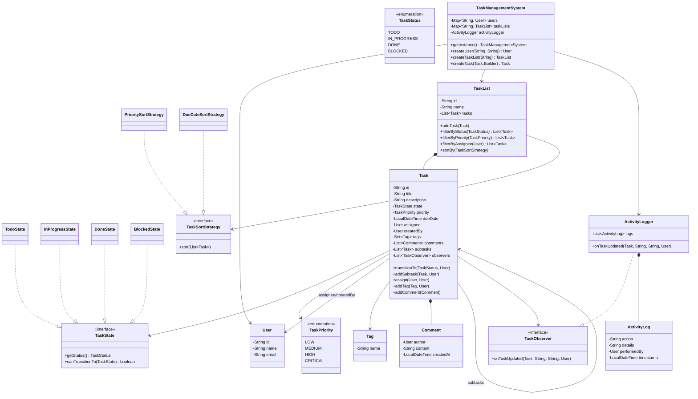
