# ATM Low-Level Design Reference

A compact visual reference for designing an **ATM system** using OOP, state handling, cash dispensing, and banking-service simulation.

---

## 1. Requirements

### Functional Requirements

- Authenticate user using **card number + PIN**.
- Support:
  - Cash withdrawal
  - Cash deposit
  - Balance inquiry
- Dispense cash using largest denominations first:
  - `$100`, `$50`, `$20`, `$10`
- Validate before dispensing:
  - User account has enough balance
  - ATM has enough cash inventory
  - Requested amount can be formed using available denominations
- Track ATM states:
  - `IDLE`
  - `CARD_INSERTED`
  - `AUTHENTICATED`
- Simulate banking operations using an in-memory `BankService`.

### Non-Functional Requirements

- Clean OOP design with separation of concerns.
- Extensible for new transaction types, denominations, and states.
- Thread-safe for concurrent banking operations.
- Testable components.
- Validation-before-commit for financial safety.

---

## 2. Core Use Cases

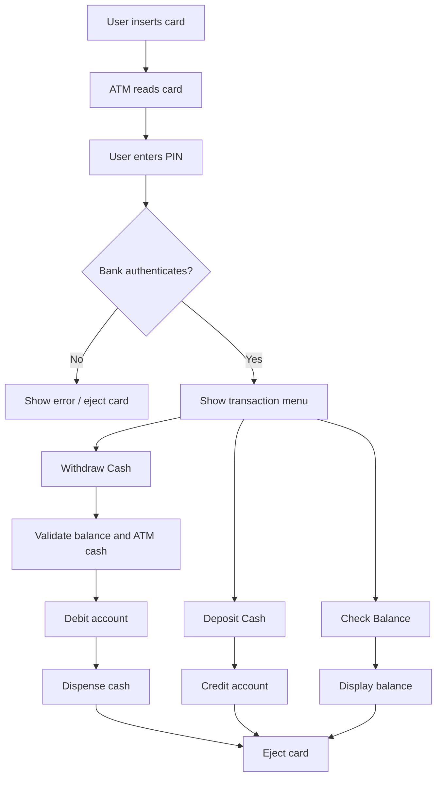

### Main Use Cases

| Use Case | Description |
|---|---|
| Insert Card | User inserts card into ATM |
| Authenticate | ATM verifies PIN with bank service |
| Withdraw | ATM validates account + inventory, then dispenses cash |
| Deposit | ATM accepts amount and credits account |
| Balance Inquiry | ATM displays current account balance |
| Eject Card | ATM resets session |

---

## 3. Entities + Responsibilities

### Entity Summary

| Entity | Type | Responsibility |
|---|---|---|
| `TransactionType` | Enum | Withdrawal, deposit, balance inquiry |
| `ATMState` | Enum | ATM lifecycle states |
| `Denomination` | Enum | Supported bill values |
| `Card` | Data Class | Stores card number, PIN, linked account |
| `Account` | Data Class | Stores account number and balance |
| `Transaction` | Data Class | Immutable transaction record |
| `CashHandler` | Interface | Contract for denomination chain |
| `ATMStateHandler` | Interface | Contract for state-specific behavior |
| `DenominationHandler` | Core Class | Handles one cash denomination |
| `CashDispenser` | Core Class | Manages cash inventory and dispensing |
| `BankService` | Core Class | Simulates banking backend |
| `ATM` | Facade / Singleton | Orchestrates the full system |

---

## 4. Relationships

### Step 1: Basic Banking Data

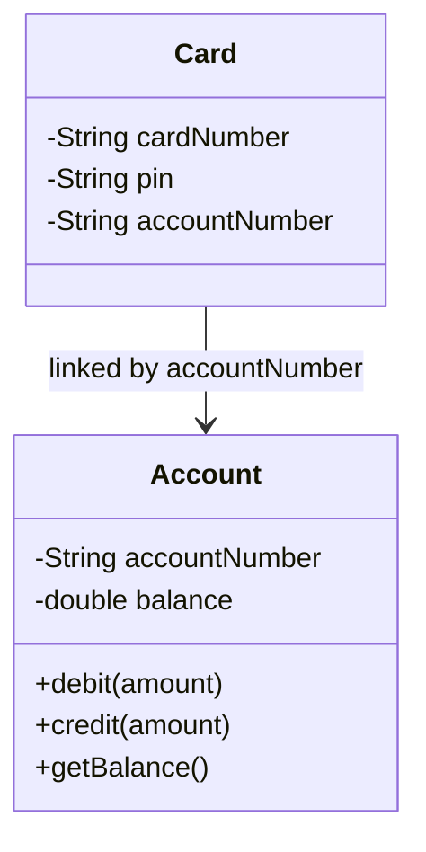

### Step 2: Bank Service Owns Accounts and Cards

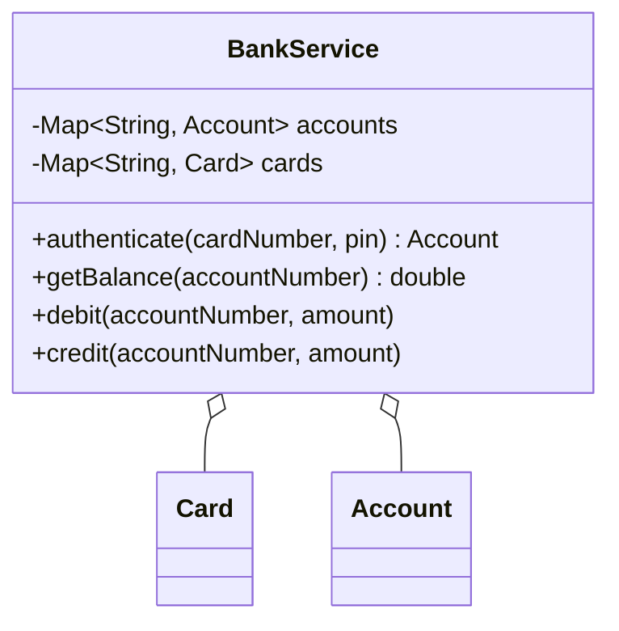

### Step 3: Cash Dispenser Uses Chain of Responsibility

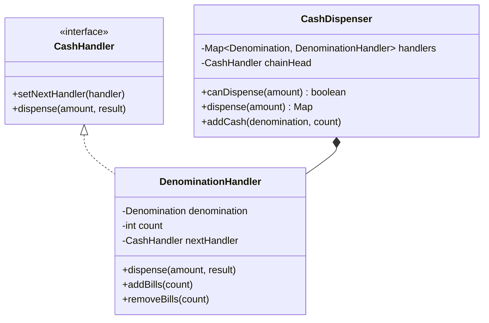

### Step 4: ATM Uses State Handlers

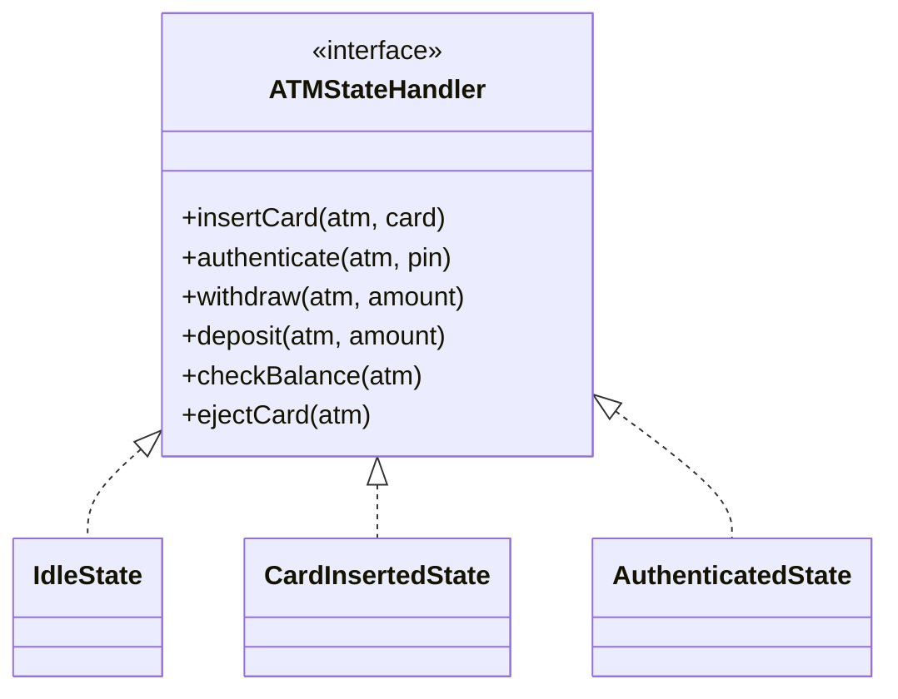

### Final Class Diagram

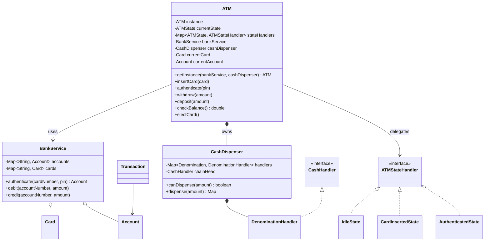

---

## 5. State Transitions

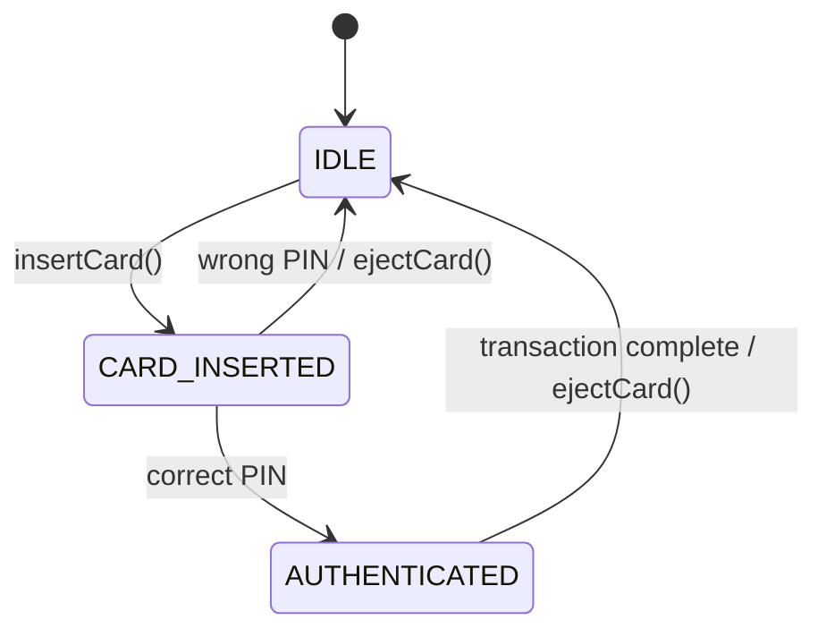

### Valid Operations by State

| State | Valid Operations | Invalid Operations |
|---|---|---|
| `IDLE` | `insertCard()` | authenticate, withdraw, deposit, balance inquiry, eject |
| `CARD_INSERTED` | `authenticate()`, `ejectCard()` | insert again, withdraw, deposit, balance inquiry |
| `AUTHENTICATED` | withdraw, deposit, check balance, eject | insert card, authenticate again |

---

## 6. Core Flows

### Withdrawal Flow

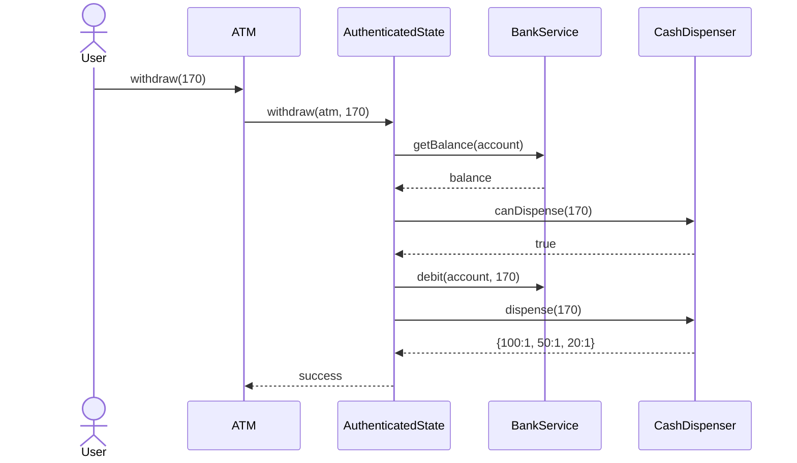

### Cash Dispensing Chain

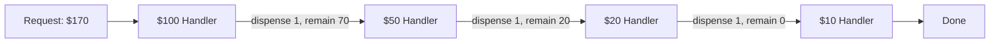

### Deposit Flow

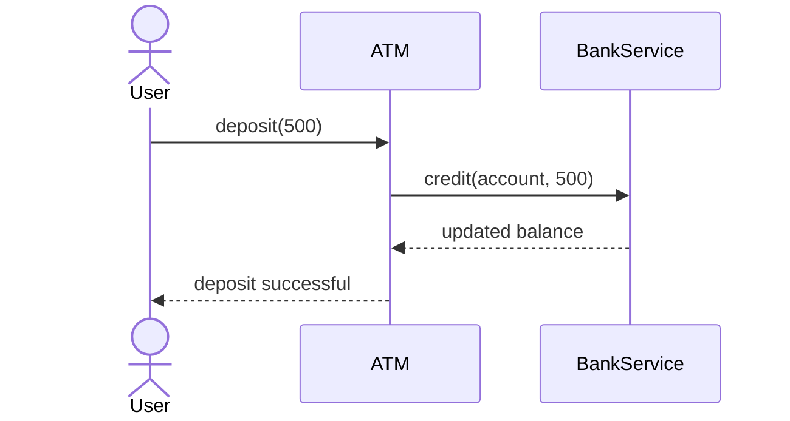

---

## 7. Design Patterns Used

### 1. State Pattern

Used to avoid large `if-else` state checks inside the `ATM` class.

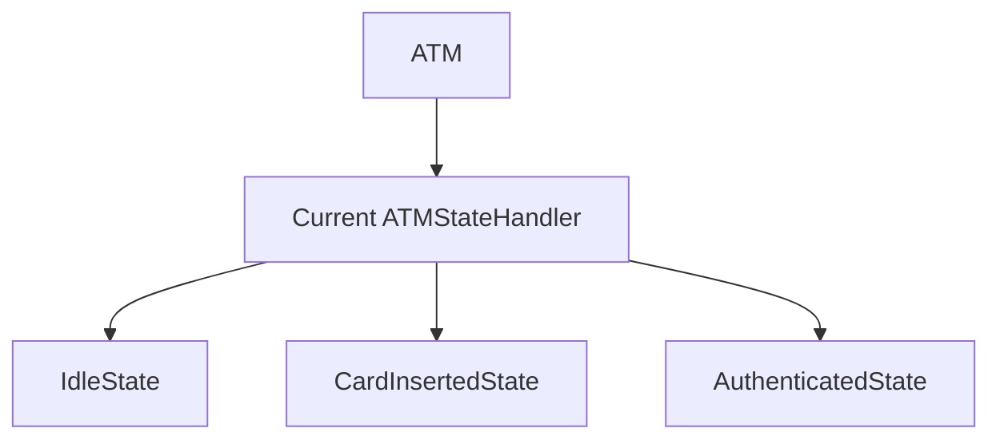

Benefits:

- State-specific behavior is isolated.
- Easy to add `OUT_OF_SERVICE` or `MAINTENANCE` states.
- Keeps `ATM` class cleaner.

---

### 2. Chain of Responsibility Pattern

Used for cash dispensing across denominations.

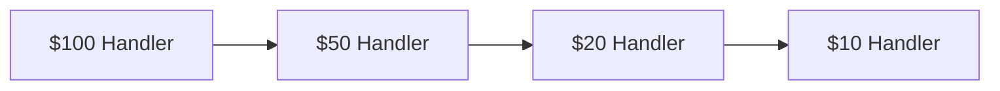

Benefits:

- Each denomination handles only its own logic.
- Easy to add new denomination like `$5`.
- Keeps dispensing logic modular.

---

### 3. Singleton Pattern

Used for `ATM` because one software controller represents one physical ATM machine.

Benefits:

- Single source of ATM state.
- Prevents multiple conflicting cash inventories.

---

### 4. Facade Pattern

`ATM` exposes simple public APIs:

```java
atm.insertCard(card);
atm.authenticate("1234");
atm.withdraw(170);
atm.ejectCard();
```

External clients do not need to know about states, bank service, or cash handlers.

---

## 8. Skeleton Code

### Enums

```java
enum TransactionType {
    WITHDRAWAL,
    DEPOSIT,
    BALANCE_INQUIRY
}

enum ATMState {
    IDLE,
    CARD_INSERTED,
    AUTHENTICATED
}

enum Denomination {
    HUNDRED(100), FIFTY(50), TWENTY(20), TEN(10);

    private final int value;

    Denomination(int value) {
        this.value = value;
    }

    public int getValue() {
        return value;
    }
}
```

---

### Custom Exception

```java
class ATMException extends RuntimeException {
    public ATMException(String message) {
        super(message);
    }
}
```

---

### Data Classes

```java
class Card {
    private final String cardNumber;
    private final String pin;
    private final String accountNumber;

    public Card(String cardNumber, String pin, String accountNumber) {
        this.cardNumber = cardNumber;
        this.pin = pin;
        this.accountNumber = accountNumber;
    }

    public String getCardNumber() { return cardNumber; }
    public String getPin() { return pin; }
    public String getAccountNumber() { return accountNumber; }
}

class Account {
    private final String accountNumber;
    private double balance;

    public Account(String accountNumber, double balance) {
        this.accountNumber = accountNumber;
        this.balance = balance;
    }

    public synchronized void debit(double amount) {
        if (amount <= 0) throw new ATMException("Invalid amount");
        if (balance < amount) throw new ATMException("Insufficient account balance");
        balance -= amount;
    }

    public synchronized void credit(double amount) {
        if (amount <= 0) throw new ATMException("Invalid amount");
        balance += amount;
    }

    public synchronized double getBalance() {
        return balance;
    }

    public String getAccountNumber() { return accountNumber; }
}
```

---

### Bank Service

```java
import java.util.*;
import java.time.LocalDateTime;

class BankService {
    private final Map<String, Account> accounts = new HashMap<>();
    private final Map<String, Card> cards = new HashMap<>();

    public void createAccount(String accountNumber, double balance) {
        accounts.put(accountNumber, new Account(accountNumber, balance));
    }

    public void createCard(String cardNumber, String pin, String accountNumber) {
        if (!accounts.containsKey(accountNumber)) {
            throw new ATMException("Account does not exist");
        }
        cards.put(cardNumber, new Card(cardNumber, pin, accountNumber));
    }

    public Account authenticate(String cardNumber, String pin) {
        Card card = cards.get(cardNumber);
        if (card == null) throw new ATMException("Invalid card");
        if (!card.getPin().equals(pin)) throw new ATMException("Invalid PIN");
        return accounts.get(card.getAccountNumber());
    }

    public double getBalance(String accountNumber) {
        return getAccount(accountNumber).getBalance();
    }

    public void debit(String accountNumber, double amount) {
        getAccount(accountNumber).debit(amount);
    }

    public void credit(String accountNumber, double amount) {
        getAccount(accountNumber).credit(amount);
    }

    private Account getAccount(String accountNumber) {
        Account account = accounts.get(accountNumber);
        if (account == null) throw new ATMException("Account not found");
        return account;
    }

    public Card getCard(String cardNumber) {
        Card card = cards.get(cardNumber);
        if (card == null) throw new ATMException("Card not found");
        return card;
    }
}
```

---

### Cash Dispensing Chain

```java
interface CashHandler {
    void setNextHandler(CashHandler handler);
    void dispense(int amount, Map<Denomination, Integer> result);
}

class DenominationHandler implements CashHandler {
    private final Denomination denomination;
    private int count;
    private CashHandler nextHandler;

    public DenominationHandler(Denomination denomination, int count) {
        this.denomination = denomination;
        this.count = count;
    }

    public void setNextHandler(CashHandler handler) {
        this.nextHandler = handler;
    }

    public synchronized void dispense(int amount, Map<Denomination, Integer> result) {
        int billValue = denomination.getValue();
        int requiredBills = amount / billValue;
        int billsToUse = Math.min(requiredBills, count);

        if (billsToUse > 0) {
            result.put(denomination, billsToUse);
        }

        int remaining = amount - billsToUse * billValue;

        if (remaining > 0 && nextHandler != null) {
            nextHandler.dispense(remaining, result);
        }
    }

    public synchronized void removeBills(int used) {
        if (used > count) throw new ATMException("Not enough bills");
        count -= used;
    }

    public synchronized void addBills(int extra) {
        count += extra;
    }

    public synchronized int getCount() {
        return count;
    }
}
```

---

### CashDispenser

```java
class CashDispenser {
    private final Map<Denomination, DenominationHandler> handlers = new EnumMap<>(Denomination.class);
    private final CashHandler chainHead;

    public CashDispenser() {
        DenominationHandler hundred = new DenominationHandler(Denomination.HUNDRED, 10);
        DenominationHandler fifty = new DenominationHandler(Denomination.FIFTY, 10);
        DenominationHandler twenty = new DenominationHandler(Denomination.TWENTY, 10);
        DenominationHandler ten = new DenominationHandler(Denomination.TEN, 10);

        hundred.setNextHandler(fifty);
        fifty.setNextHandler(twenty);
        twenty.setNextHandler(ten);

        handlers.put(Denomination.HUNDRED, hundred);
        handlers.put(Denomination.FIFTY, fifty);
        handlers.put(Denomination.TWENTY, twenty);
        handlers.put(Denomination.TEN, ten);

        chainHead = hundred;
    }

    public synchronized boolean canDispense(int amount) {
        if (amount <= 0 || amount % 10 != 0) return false;

        int remaining = amount;
        for (Denomination d : Denomination.values()) {
            int value = d.getValue();
            int available = handlers.get(d).getCount();
            int use = Math.min(remaining / value, available);
            remaining -= use * value;
        }
        return remaining == 0;
    }

    public synchronized Map<Denomination, Integer> dispense(int amount) {
        if (!canDispense(amount)) {
            throw new ATMException("ATM cannot dispense requested amount");
        }

        Map<Denomination, Integer> result = new EnumMap<>(Denomination.class);
        chainHead.dispense(amount, result);

        for (Map.Entry<Denomination, Integer> entry : result.entrySet()) {
            handlers.get(entry.getKey()).removeBills(entry.getValue());
        }

        return result;
    }

    public synchronized void addCash(Denomination denomination, int count) {
        handlers.get(denomination).addBills(count);
    }
}
```

---

### State Handler Interface

```java
interface ATMStateHandler {
    void insertCard(ATM atm, Card card);
    void authenticate(ATM atm, String pin);
    void withdraw(ATM atm, double amount);
    void deposit(ATM atm, double amount);
    double checkBalance(ATM atm);
    void ejectCard(ATM atm);
}
```

---

### State Classes

```java
class IdleState implements ATMStateHandler {
    public void insertCard(ATM atm, Card card) {
        atm.setCurrentCard(card);
        atm.setState(ATMState.CARD_INSERTED);
        System.out.println("Card inserted");
    }

    public void authenticate(ATM atm, String pin) { throw new ATMException("Insert card first"); }
    public void withdraw(ATM atm, double amount) { throw new ATMException("Insert card first"); }
    public void deposit(ATM atm, double amount) { throw new ATMException("Insert card first"); }
    public double checkBalance(ATM atm) { throw new ATMException("Insert card first"); }
    public void ejectCard(ATM atm) { throw new ATMException("No card to eject"); }
}

class CardInsertedState implements ATMStateHandler {
    public void authenticate(ATM atm, String pin) {
        Card card = atm.getCurrentCard();
        Account account = atm.getBankService().authenticate(card.getCardNumber(), pin);
        atm.setCurrentAccount(account);
        atm.setState(ATMState.AUTHENTICATED);
        System.out.println("Authentication successful");
    }

    public void ejectCard(ATM atm) {
        atm.resetSession();
        System.out.println("Card ejected");
    }

    public void insertCard(ATM atm, Card card) { throw new ATMException("Card already inserted"); }
    public void withdraw(ATM atm, double amount) { throw new ATMException("Authenticate first"); }
    public void deposit(ATM atm, double amount) { throw new ATMException("Authenticate first"); }
    public double checkBalance(ATM atm) { throw new ATMException("Authenticate first"); }
}

class AuthenticatedState implements ATMStateHandler {
    public void withdraw(ATM atm, double amount) {
        int cashAmount = (int) amount;
        Account account = atm.getCurrentAccount();

        if (account.getBalance() < amount) {
            throw new ATMException("Insufficient account balance");
        }

        if (!atm.getCashDispenser().canDispense(cashAmount)) {
            throw new ATMException("ATM cannot dispense requested amount");
        }

        atm.getBankService().debit(account.getAccountNumber(), amount);
        Map<Denomination, Integer> cash = atm.getCashDispenser().dispense(cashAmount);
        System.out.println("Cash dispensed: " + cash);
    }

    public void deposit(ATM atm, double amount) {
        Account account = atm.getCurrentAccount();
        atm.getBankService().credit(account.getAccountNumber(), amount);
        System.out.println("Deposit successful");
    }

    public double checkBalance(ATM atm) {
        return atm.getCurrentAccount().getBalance();
    }

    public void ejectCard(ATM atm) {
        atm.resetSession();
        System.out.println("Card ejected");
    }

    public void insertCard(ATM atm, Card card) { throw new ATMException("Session already active"); }
    public void authenticate(ATM atm, String pin) { throw new ATMException("Already authenticated"); }
}
```

---

### ATM Facade / Singleton

```java
class ATM {
    private static volatile ATM instance;

    private ATMState currentState;
    private final Map<ATMState, ATMStateHandler> stateHandlers;
    private final BankService bankService;
    private final CashDispenser cashDispenser;

    private Card currentCard;
    private Account currentAccount;

    private ATM(BankService bankService, CashDispenser cashDispenser) {
        this.bankService = bankService;
        this.cashDispenser = cashDispenser;
        this.currentState = ATMState.IDLE;

        this.stateHandlers = new EnumMap<>(ATMState.class);
        stateHandlers.put(ATMState.IDLE, new IdleState());
        stateHandlers.put(ATMState.CARD_INSERTED, new CardInsertedState());
        stateHandlers.put(ATMState.AUTHENTICATED, new AuthenticatedState());
    }

    public static ATM getInstance(BankService bankService, CashDispenser cashDispenser) {
        if (instance == null) {
            synchronized (ATM.class) {
                if (instance == null) {
                    instance = new ATM(bankService, cashDispenser);
                }
            }
        }
        return instance;
    }

    public void insertCard(Card card) {
        stateHandlers.get(currentState).insertCard(this, card);
    }

    public void authenticate(String pin) {
        stateHandlers.get(currentState).authenticate(this, pin);
    }

    public void withdraw(double amount) {
        stateHandlers.get(currentState).withdraw(this, amount);
    }

    public void deposit(double amount) {
        stateHandlers.get(currentState).deposit(this, amount);
    }

    public double checkBalance() {
        return stateHandlers.get(currentState).checkBalance(this);
    }

    public void ejectCard() {
        stateHandlers.get(currentState).ejectCard(this);
    }

    void setState(ATMState state) { this.currentState = state; }
    void setCurrentCard(Card card) { this.currentCard = card; }
    void setCurrentAccount(Account account) { this.currentAccount = account; }

    Card getCurrentCard() { return currentCard; }
    Account getCurrentAccount() { return currentAccount; }
    BankService getBankService() { return bankService; }
    CashDispenser getCashDispenser() { return cashDispenser; }

    void resetSession() {
        currentCard = null;
        currentAccount = null;
        currentState = ATMState.IDLE;
    }
}
```

---

### Demo Driver

```java
public class Main {
    public static void main(String[] args) {
        BankService bankService = new BankService();
        bankService.createAccount("ACC123", 1000);
        bankService.createCard("CARD123", "1234", "ACC123");

        CashDispenser cashDispenser = new CashDispenser();
        ATM atm = ATM.getInstance(bankService, cashDispenser);

        Card card = bankService.getCard("CARD123");

        atm.insertCard(card);
        atm.authenticate("1234");

        System.out.println("Balance: " + atm.checkBalance());

        atm.withdraw(170);
        System.out.println("Balance after withdrawal: " + atm.checkBalance());

        atm.deposit(300);
        System.out.println("Balance after deposit: " + atm.checkBalance());

        atm.ejectCard();
    }
}
```

---

## 9. Edge Cases

| Edge Case | Expected Handling |
|---|---|
| Invalid card | Throw `ATMException("Invalid card")` |
| Wrong PIN | Reject authentication and eject/reset session if needed |
| Withdraw before authentication | Throw `ATMException("Authenticate first")` |
| Amount not multiple of 10 | Reject withdrawal |
| Insufficient account balance | Reject before dispensing cash |
| ATM has insufficient cash | Reject before debiting account |
| ATM cannot form exact amount | Reject before debiting account |
| Deposit negative amount | Reject transaction |
| Insert card when one is already inserted | Reject operation |
| Eject card when no card exists | Reject operation |

---

## 10. Failure Points

### 1. Debit Happens Before Cash Validation

Bad flow:

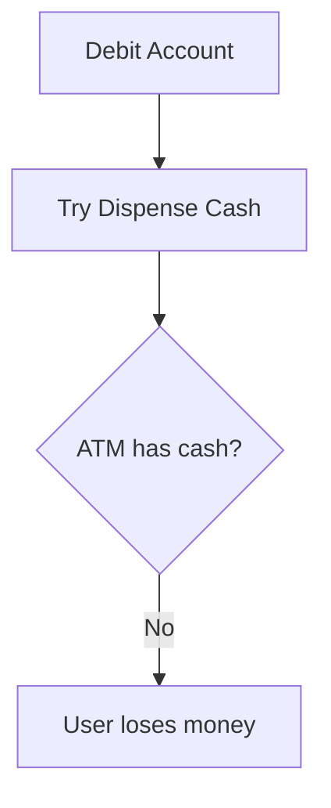

Correct flow:

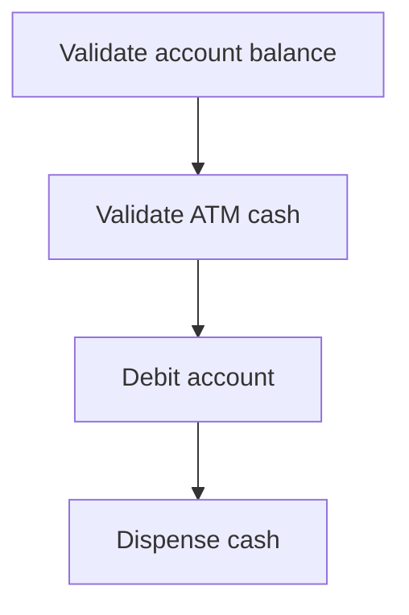

---

### 2. Partial Cash Dispensing Failure

Example: ATM dispenses `$100`, then hardware fails before `$50`.

Possible fix:

- Use transaction logs.
- Reversal transaction.
- Hardware acknowledgement before final commit.

---

### 3. Concurrent Withdrawals

Two ATM sessions may access same account at the same time.

Fix:

- Synchronize `Account.debit()` and `Account.credit()`.
- Use DB row-level locking in real systems.

---

### 4. Singleton Problems in Tests

Singleton makes unit testing harder because state persists.

Fix:

- Add reset method for tests.
- Prefer dependency injection in production-quality code.

---

## 11. Improvements

### Design Improvements

- Add `Transaction` logging and audit trail.
- Add `ReceiptPrinter` component.
- Add `CardReader`, `Keypad`, `Screen`, `CashSlot` hardware abstractions.
- Add `OUT_OF_SERVICE` and `MAINTENANCE` states.
- Add daily withdrawal limits.
- Add failed PIN attempt counter and card blocking.
- Add admin restocking workflow.
- Add currency support.
- Add account types: checking, savings, credit.

### Code Improvements

- Use `BigDecimal` instead of `double` for money.
- Store hashed PINs instead of plain text PINs.
- Make `BankService` an interface.
- Replace singleton with dependency injection for better testing.
- Add transaction rollback support.
- Add persistent database instead of in-memory maps.

### Scalability Improvements

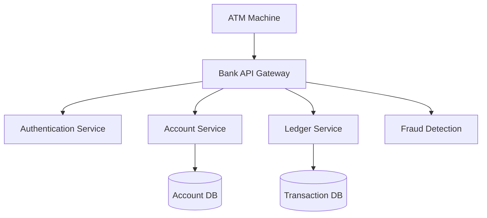

---

## Quick Revision Summary

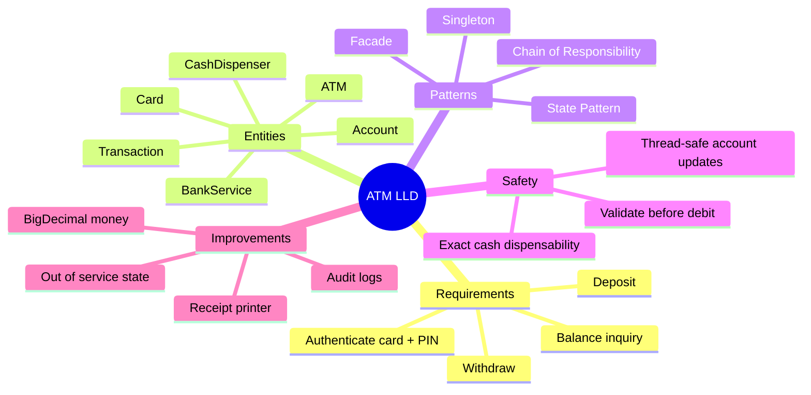
