# Elevator System LLD Reference

> Visual, interview-friendly notes for designing an **Elevator System** using OOP, Mermaid diagrams, and small Java skeleton code.

---

## 1. Requirements

### Functional Requirements

- Support multiple elevators and multiple floors.
- Handle **external requests** from hall buttons: floor + direction.
- Handle **internal requests** from cabin buttons: destination floor.
- Dispatch external requests to the most suitable elevator.
- Each elevator should serve requests using the **LOOK algorithm**.
- Each elevator should show current floor and direction on displays.
- Each elevator should run independently, ideally with its own controller/thread.

### Non-Functional Requirements

- Clean OOP design with separation of concerns.
- Thread-safe request handling.
- Easy to extend with new dispatch strategies.
- Components should be independently testable.
- Scheduling strategy should be replaceable without changing core classes.

---

## 2. Core Use Cases

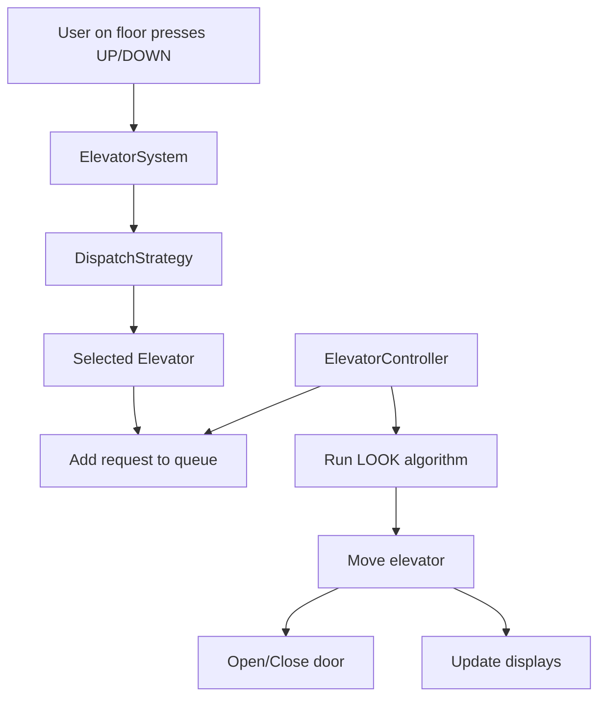

### Main Use Cases

| Use Case | Description |
|---|---|
| External request | Passenger presses hall button on a floor |
| Internal request | Passenger selects destination inside elevator |
| Dispatch elevator | System chooses best elevator for hall request |
| Move elevator | Elevator moves toward next stop |
| Serve floor | Elevator opens door, serves passengers, closes door |
| Update display | Displays update on floor/direction changes |
| Change strategy | System swaps nearest/zone/custom strategy |

---

## 3. Entities + Responsibilities

### Entity Discovery

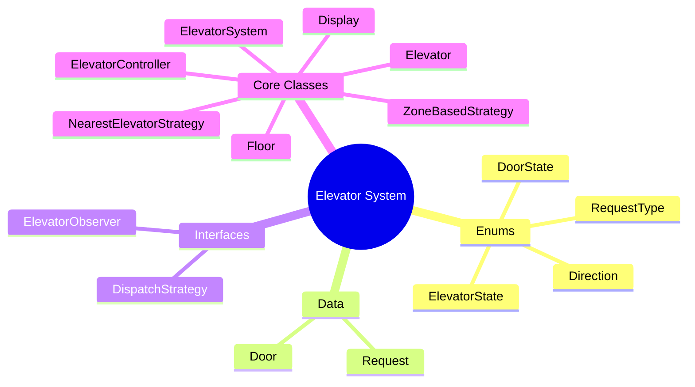

### Responsibility Table

| Entity | Type | Responsibility |
|---|---|---|
| `Direction` | Enum | `UP`, `DOWN`, `IDLE` |
| `ElevatorState` | Enum | Lifecycle state of elevator |
| `DoorState` | Enum | `OPEN`, `CLOSED` |
| `RequestType` | Enum | `INTERNAL`, `EXTERNAL` |
| `Request` | Data Class | Stores floor, direction, type, timestamp |
| `Door` | Data Class | Opens/closes elevator door |
| `Display` | Core Class | Shows current floor and direction |
| `Elevator` | Core Class | Represents elevator car and request queues |
| `Floor` | Core Class | Represents floor buttons and display |
| `ElevatorController` | Core Class | Runs LOOK scheduling algorithm |
| `DispatchStrategy` | Interface | Contract for elevator selection |
| `NearestElevatorStrategy` | Strategy | Chooses closest suitable elevator |
| `ZoneBasedStrategy` | Strategy | Chooses elevator based on floor zone |
| `ElevatorObserver` | Interface | Contract for display update listeners |
| `ElevatorSystem` | Singleton/Facade | Entry point and coordinator |

---

## 4. Relationships

### Step 1: Request Enters the System

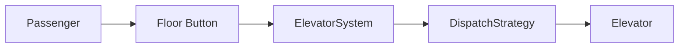

### Step 2: Elevator Owns Physical Components

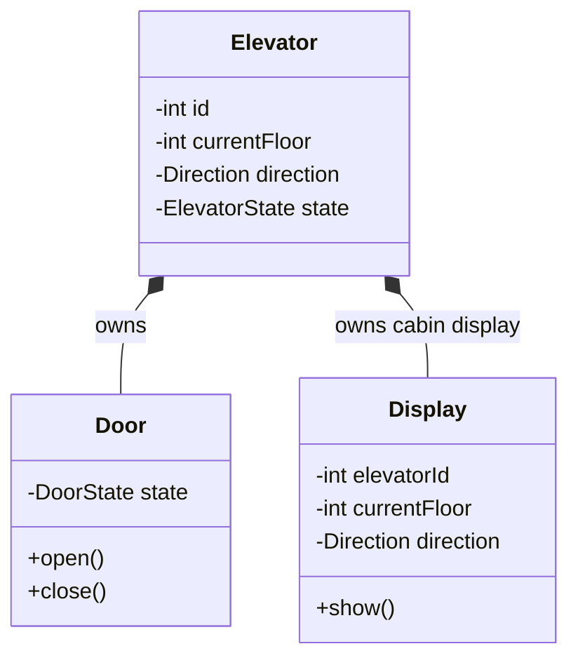

### Step 3: Strategy Relationship

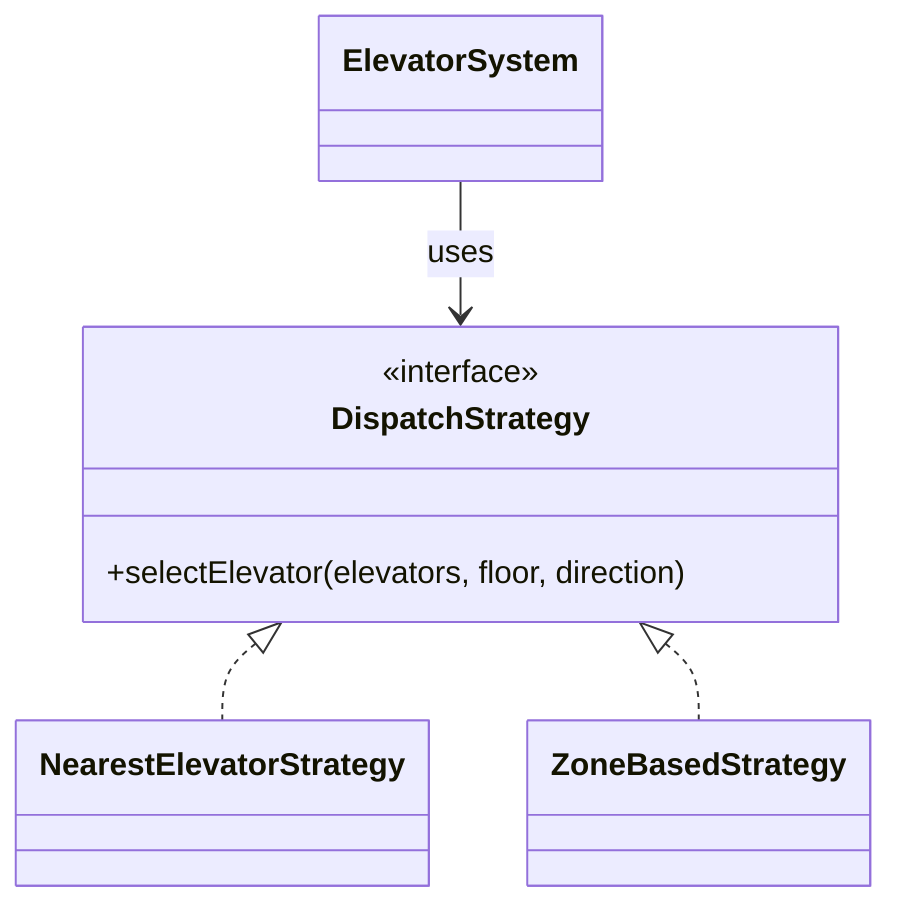

### Step 4: Observer Relationship

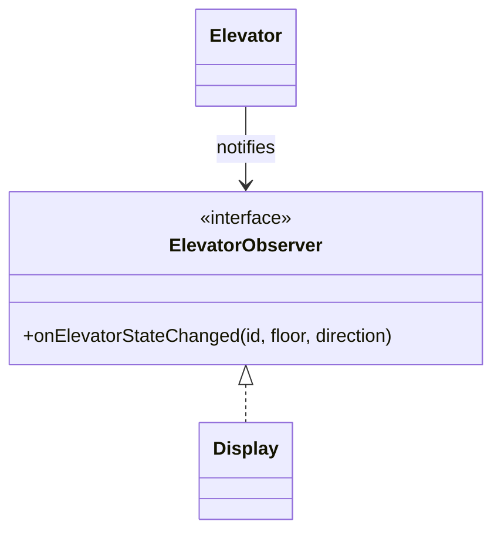

---

## 5. State Transitions

### Elevator State Diagram

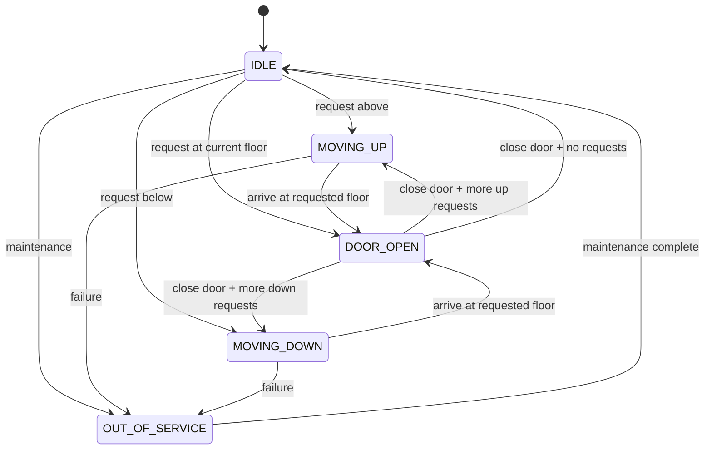

### Direction vs State

| Concept | Purpose |
|---|---|
| `Direction` | Movement intent: UP, DOWN, IDLE |
| `ElevatorState` | Lifecycle state: IDLE, MOVING_UP, MOVING_DOWN, DOOR_OPEN, OUT_OF_SERVICE |

Example: elevator can have `Direction.IDLE` and `ElevatorState.DOOR_OPEN` at the same time.

---

## 6. Core Flows

### External Request Flow

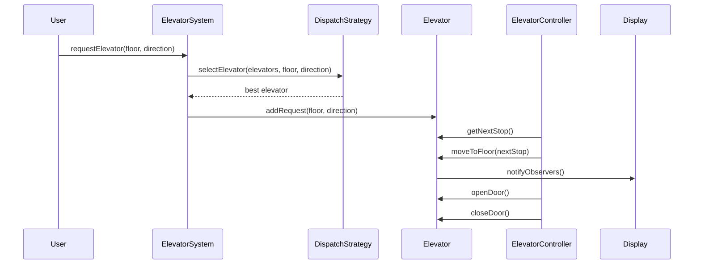

### Internal Request Flow

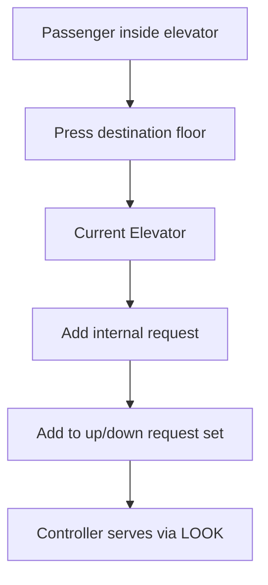

### LOOK Algorithm Flow

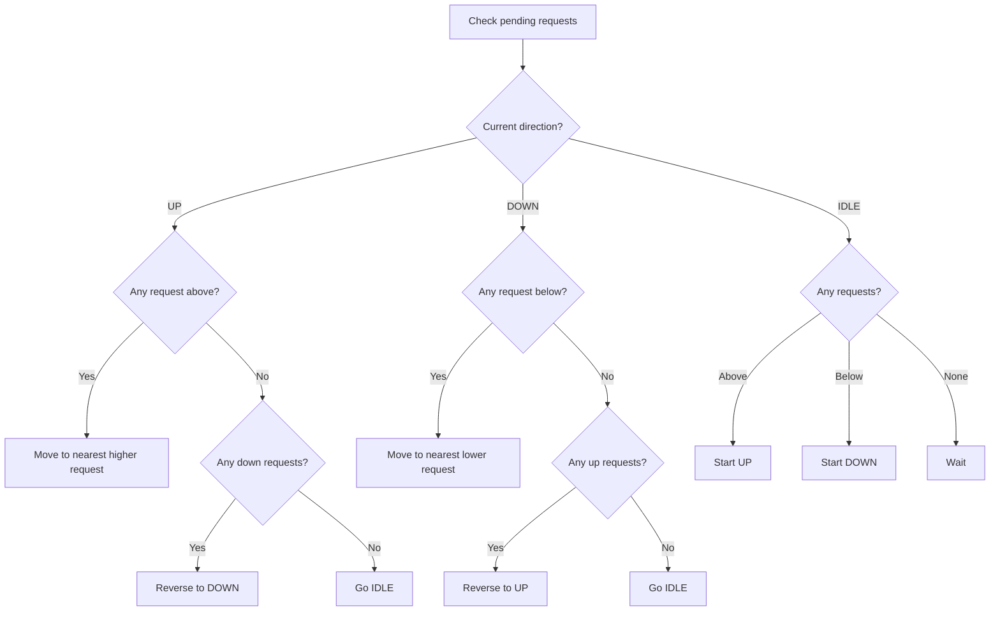

---

## 7. Design Patterns Used

### 1. Strategy Pattern

Used for choosing which elevator should serve an external request.

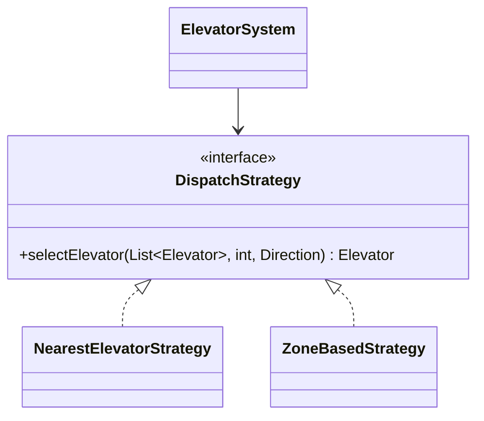

Why useful:

- Swap dispatch algorithm at runtime.
- Add new strategies without modifying `ElevatorSystem`.
- Follows Open/Closed Principle.

### 2. Observer Pattern

Used for display updates.

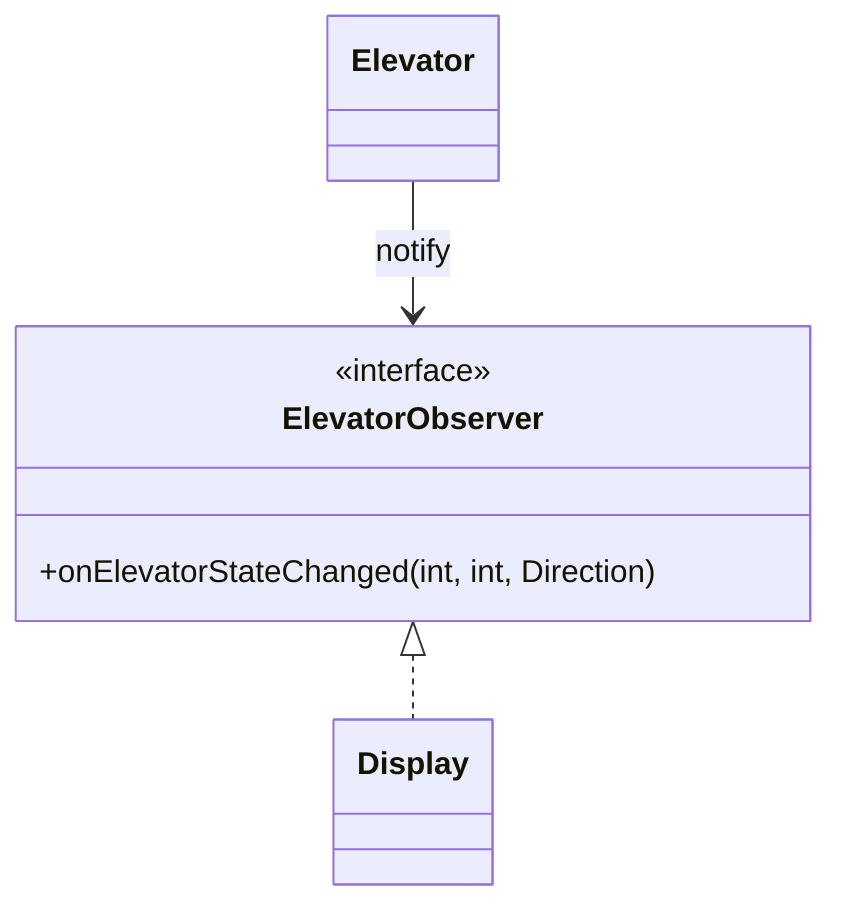

Why useful:

- Elevator does not directly depend on display classes.
- Easy to add monitoring dashboard, logs, analytics, etc.

### 3. Singleton Pattern

Used for `ElevatorSystem` as one central coordinator.

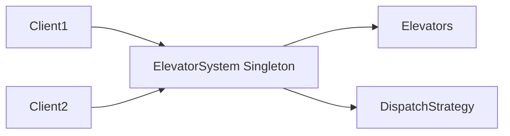

### 4. Why Not State Pattern?

The state behavior is not complex enough to need separate classes like `IdleState`, `MovingUpState`, etc.

Use enum + guard checks unless each state has very different behavior.

---

## 8. Skeleton Code

> Compact Java-style skeleton for interview revision.

```java
import java.util.*;
import java.util.concurrent.*;

// ---------- Enums ----------

enum Direction {
    UP, DOWN, IDLE
}

enum ElevatorState {
    IDLE, MOVING_UP, MOVING_DOWN, DOOR_OPEN, OUT_OF_SERVICE
}

enum DoorState {
    OPEN, CLOSED
}

enum RequestType {
    INTERNAL, EXTERNAL
}

// ---------- Exception ----------

class ElevatorException extends RuntimeException {
    public ElevatorException(String message) {
        super(message);
    }
}

// ---------- Data Classes ----------

final class Request {
    private final int floor;
    private final Direction direction;
    private final RequestType type;
    private final long timestamp;

    public Request(int floor, Direction direction, RequestType type) {
        this.floor = floor;
        this.direction = direction;
        this.type = type;
        this.timestamp = System.currentTimeMillis();
    }

    public int getFloor() { return floor; }
    public Direction getDirection() { return direction; }
    public RequestType getType() { return type; }
    public long getTimestamp() { return timestamp; }
}

class Door {
    private DoorState state = DoorState.CLOSED;

    public synchronized void open() {
        state = DoorState.OPEN;
        System.out.println("Door opened");
    }

    public synchronized void close() {
        state = DoorState.CLOSED;
        System.out.println("Door closed");
    }

    public synchronized boolean isOpen() {
        return state == DoorState.OPEN;
    }
}

// ---------- Observer ----------

interface ElevatorObserver {
    void onElevatorStateChanged(int elevatorId, int floor, Direction direction);
}

class Display implements ElevatorObserver {
    private final int elevatorId;
    private int currentFloor;
    private Direction currentDirection = Direction.IDLE;

    public Display(int elevatorId) {
        this.elevatorId = elevatorId;
    }

    @Override
    public void onElevatorStateChanged(int elevatorId, int floor, Direction direction) {
        if (this.elevatorId != elevatorId) return;
        this.currentFloor = floor;
        this.currentDirection = direction;
        show();
    }

    public void show() {
        System.out.println("Elevator " + elevatorId + " | Floor: " + currentFloor + " | Direction: " + currentDirection);
    }
}

// ---------- Elevator ----------

class Elevator {
    private final int id;
    private final int totalFloors;
    private int currentFloor = 1;
    private Direction direction = Direction.IDLE;
    private ElevatorState state = ElevatorState.IDLE;
    private final Door door = new Door();

    // LOOK algorithm data structures
    private final NavigableSet<Integer> upRequests = new TreeSet<>();
    private final NavigableSet<Integer> downRequests = new TreeSet<>(Collections.reverseOrder());

    private final List<ElevatorObserver> observers = new CopyOnWriteArrayList<>();

    public Elevator(int id, int totalFloors) {
        this.id = id;
        this.totalFloors = totalFloors;
        addObserver(new Display(id));
    }

    public synchronized void addRequest(int floor, Direction requestDirection) {
        validateFloor(floor);

        if (floor > currentFloor) {
            upRequests.add(floor);
        } else if (floor < currentFloor) {
            downRequests.add(floor);
        } else {
            // Already on requested floor
            openDoor();
            closeDoor();
        }

        if (direction == Direction.IDLE) {
            direction = floor >= currentFloor ? Direction.UP : Direction.DOWN;
        }
    }

    public synchronized Integer getNextStop() {
        if (direction == Direction.UP) {
            Integer next = upRequests.ceiling(currentFloor + 1);
            if (next != null) return next;
            if (!downRequests.isEmpty()) {
                direction = Direction.DOWN;
                return downRequests.first();
            }
        }

        if (direction == Direction.DOWN) {
            Integer next = downRequests.ceiling(currentFloor - 1);
            if (next != null) return next;
            if (!upRequests.isEmpty()) {
                direction = Direction.UP;
                return upRequests.first();
            }
        }

        if (!upRequests.isEmpty()) {
            direction = Direction.UP;
            return upRequests.first();
        }

        if (!downRequests.isEmpty()) {
            direction = Direction.DOWN;
            return downRequests.first();
        }

        direction = Direction.IDLE;
        state = ElevatorState.IDLE;
        return null;
    }

    public synchronized void moveToFloor(int floor) {
        validateFloor(floor);

        if (door.isOpen()) {
            throw new ElevatorException("Cannot move while door is open");
        }

        state = floor > currentFloor ? ElevatorState.MOVING_UP : ElevatorState.MOVING_DOWN;
        direction = floor > currentFloor ? Direction.UP : Direction.DOWN;
        currentFloor = floor;

        upRequests.remove(floor);
        downRequests.remove(floor);
        notifyObservers();
    }

    public synchronized void openDoor() {
        state = ElevatorState.DOOR_OPEN;
        door.open();
        notifyObservers();
    }

    public synchronized void closeDoor() {
        door.close();
        if (!hasRequests()) {
            state = ElevatorState.IDLE;
            direction = Direction.IDLE;
        }
        notifyObservers();
    }

    public boolean hasRequests() {
        return !upRequests.isEmpty() || !downRequests.isEmpty();
    }

    public void addObserver(ElevatorObserver observer) {
        observers.add(observer);
    }

    private void notifyObservers() {
        for (ElevatorObserver observer : observers) {
            observer.onElevatorStateChanged(id, currentFloor, direction);
        }
    }

    private void validateFloor(int floor) {
        if (floor < 1 || floor > totalFloors) {
            throw new ElevatorException("Invalid floor: " + floor);
        }
    }

    public int getId() { return id; }
    public int getCurrentFloor() { return currentFloor; }
    public Direction getDirection() { return direction; }
    public ElevatorState getState() { return state; }
}

// ---------- Floor ----------

class Floor {
    private final int floorNumber;
    private boolean upButtonPressed;
    private boolean downButtonPressed;

    public Floor(int floorNumber) {
        this.floorNumber = floorNumber;
    }

    public void pressUpButton() {
        upButtonPressed = true;
    }

    public void pressDownButton() {
        downButtonPressed = true;
    }

    public void resetButtons() {
        upButtonPressed = false;
        downButtonPressed = false;
    }
}

// ---------- Strategy ----------

interface DispatchStrategy {
    Elevator selectElevator(List<Elevator> elevators, int floor, Direction direction);
}

class NearestElevatorStrategy implements DispatchStrategy {
    @Override
    public Elevator selectElevator(List<Elevator> elevators, int floor, Direction direction) {
        Elevator best = null;
        int bestScore = Integer.MIN_VALUE;

        for (Elevator elevator : elevators) {
            if (elevator.getState() == ElevatorState.OUT_OF_SERVICE) continue;

            int distance = Math.abs(elevator.getCurrentFloor() - floor);
            int score = -distance;

            boolean sameDirection = elevator.getDirection() == direction;
            boolean idle = elevator.getDirection() == Direction.IDLE;

            if (idle) score += 10;
            if (sameDirection) score += 5;

            if (score > bestScore) {
                bestScore = score;
                best = elevator;
            }
        }

        if (best == null) {
            throw new ElevatorException("No elevator available");
        }
        return best;
    }
}

// ---------- Controller ----------

class ElevatorController implements Runnable {
    private final Elevator elevator;
    private volatile boolean running = true;

    public ElevatorController(Elevator elevator) {
        this.elevator = elevator;
    }

    @Override
    public void run() {
        while (running) {
            processRequests();
            sleep(500);
        }
    }

    private void processRequests() {
        Integer nextStop = elevator.getNextStop();
        if (nextStop == null) return;

        elevator.moveToFloor(nextStop);
        elevator.openDoor();
        sleep(500);
        elevator.closeDoor();
    }

    public void stop() {
        running = false;
    }

    private void sleep(long ms) {
        try {
            Thread.sleep(ms);
        } catch (InterruptedException e) {
            Thread.currentThread().interrupt();
        }
    }
}

// ---------- System Facade ----------

class ElevatorSystem {
    private static volatile ElevatorSystem instance;

    private final List<Elevator> elevators = new ArrayList<>();
    private final List<ElevatorController> controllers = new ArrayList<>();
    private DispatchStrategy dispatchStrategy = new NearestElevatorStrategy();
    private final int totalFloors;

    private ElevatorSystem(int numElevators, int totalFloors) {
        this.totalFloors = totalFloors;

        for (int i = 1; i <= numElevators; i++) {
            Elevator elevator = new Elevator(i, totalFloors);
            elevators.add(elevator);
            controllers.add(new ElevatorController(elevator));
        }
    }

    public static ElevatorSystem getInstance(int numElevators, int totalFloors) {
        if (instance == null) {
            synchronized (ElevatorSystem.class) {
                if (instance == null) {
                    instance = new ElevatorSystem(numElevators, totalFloors);
                }
            }
        }
        return instance;
    }

    public void requestElevator(int floor, Direction direction) {
        validateFloor(floor);
        Elevator selected = dispatchStrategy.selectElevator(elevators, floor, direction);
        selected.addRequest(floor, direction);
    }

    public void requestFloorInsideElevator(int elevatorId, int destinationFloor) {
        validateFloor(destinationFloor);
        Elevator elevator = elevators.get(elevatorId - 1);
        elevator.addRequest(destinationFloor, Direction.IDLE);
    }

    public void setDispatchStrategy(DispatchStrategy strategy) {
        this.dispatchStrategy = strategy;
    }

    public void start() {
        for (ElevatorController controller : controllers) {
            new Thread(controller).start();
        }
    }

    public void shutdown() {
        for (ElevatorController controller : controllers) {
            controller.stop();
        }
    }

    private void validateFloor(int floor) {
        if (floor < 1 || floor > totalFloors) {
            throw new ElevatorException("Invalid floor: " + floor);
        }
    }
}
```

### Demo Driver

```java
public class ElevatorDemo {
    public static void main(String[] args) {
        ElevatorSystem system = ElevatorSystem.getInstance(3, 10);
        system.start();

        system.requestElevator(5, Direction.UP);
        system.requestElevator(8, Direction.DOWN);
        system.requestFloorInsideElevator(1, 9);

        // Later
        // system.shutdown();
    }
}
```

---

## 9. Edge Cases

| Edge Case | Expected Handling |
|---|---|
| Invalid floor number | Throw `ElevatorException` |
| Request same as current floor | Open door immediately |
| Elevator out of service | Dispatch strategy should skip it |
| Door open while moving | Reject movement |
| Multiple same-floor requests | Use Set to avoid duplicates |
| No elevator available | Throw meaningful exception |
| Internal request before entering elevator | Should not be allowed by real UI layer |
| External request at top floor going UP | Reject or ignore |
| External request at bottom floor going DOWN | Reject or ignore |
| Concurrent requests | Synchronize request queue updates |

---

## 10. Failure Points

| Failure Point | Risk | Mitigation |
|---|---|---|
| Race condition in request sets | Lost or corrupted requests | Use synchronized methods / locks |
| Wrong dispatch choice | Poor wait time | Improve scoring strategy |
| Door movement bug | Unsafe elevator movement | Guard: never move when door is open |
| Thread never stops | Resource leak | `shutdown()` with volatile running flag |
| Elevator stuck in moving state | Requests blocked | Add timeout/health checks |
| Display stale | Bad user experience | Observer notifications on every state change |
| Singleton hard to test | Poor testability | Use dependency injection in production |
| Request starvation | Some floors wait too long | Add aging/fairness strategy |

---

## 11. Improvements

### Design Improvements

- Add `MaintenanceMode` and technician operations.
- Add emergency stop behavior.
- Add overload detection using weight sensor.
- Add door obstruction sensor.
- Add request aging to avoid starvation.
- Add multiple scheduling strategies: SCAN, LOOK, destination control.
- Add analytics: average wait time, average travel time.
- Replace singleton with dependency injection for better testability.

### Code Improvements

- Use `ReentrantLock` instead of broad `synchronized` methods.
- Use `BlockingQueue` or event-driven controller loop.
- Add unit tests for dispatch strategy and LOOK algorithm.
- Add better thread lifecycle management using `ExecutorService`.
- Persist elevator events for debugging.

---

## Final Class Diagram

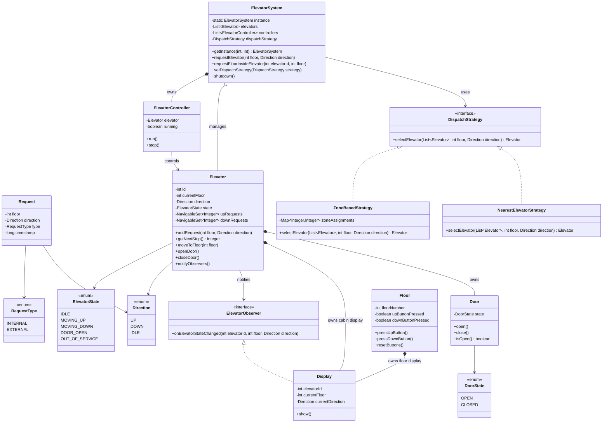

---

## Quick Interview Summary

Design an elevator system using:

- `ElevatorSystem` as facade/singleton.
- `DispatchStrategy` for assigning hall requests.
- `ElevatorController` per elevator for independent operation.
- `Elevator` with two sorted sets: `upRequests` and `downRequests`.
- LOOK algorithm to reduce unnecessary direction changes.
- Observer pattern for display updates.
- Thread-safe request updates.

