# Design Social Network like Facebook — LLD Reference

## 1. Requirements

### Functional Requirements
- Users can register with name and email.
- Users can add other users as friends.
- Users can create text posts.
- Users can comment on posts.
- Comments can have nested replies.
- Users can like posts and comments.
- Users can view a personalized news feed from friends.
- Users receive notifications for likes/comments on their content.

### Non-Functional Requirements
- Clean object-oriented design.
- Modular and extensible for media posts, privacy, reactions, ranking feeds.
- Testable services and repositories.
- Maintainable separation between domain, service, and storage layers.

---

## 2. Core Use Cases

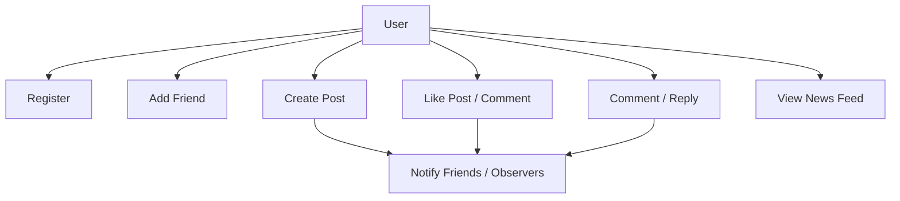

### Main Operations
| Use Case | Description |
|---|---|
| Register user | Create a new user profile |
| Add friend | Create bidirectional friendship |
| Create post | User publishes text content |
| Like content | User likes a post/comment |
| Add comment | User comments on post/comment |
| Generate feed | Show friends' posts in chronological order |
| Notify user | Notify author when content is liked/commented |

---

## 3. Entities + Responsibilities

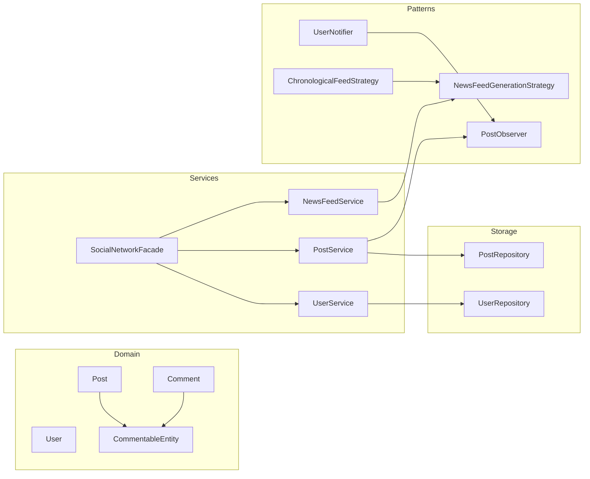

| Entity | Type | Responsibility |
|---|---|---|
| User | Core Class | Stores profile, friends, posts |
| CommentableEntity | Abstract Class | Common base for likeable/commentable content |
| Post | Core Class | Top-level user post |
| Comment | Core Class | Comment or nested reply |
| UserRepository | Repository | Stores users in memory |
| PostRepository | Repository | Stores posts in memory |
| UserService | Service | User registration and friendship |
| PostService | Service | Create posts, likes, comments, notifications |
| NewsFeedService | Service | Generates user feed |
| SocialNetworkFacade | Facade | Single entry point for clients |
| PostObserver | Interface | Observer for post events |
| UserNotifier | Observer | Sends notifications |
| NewsFeedGenerationStrategy | Interface | Feed generation algorithm |
| ChronologicalFeedStrategy | Strategy | Sorts friends' posts by latest first |

---

## 4. Relationships

### Step 1: User and Friendship

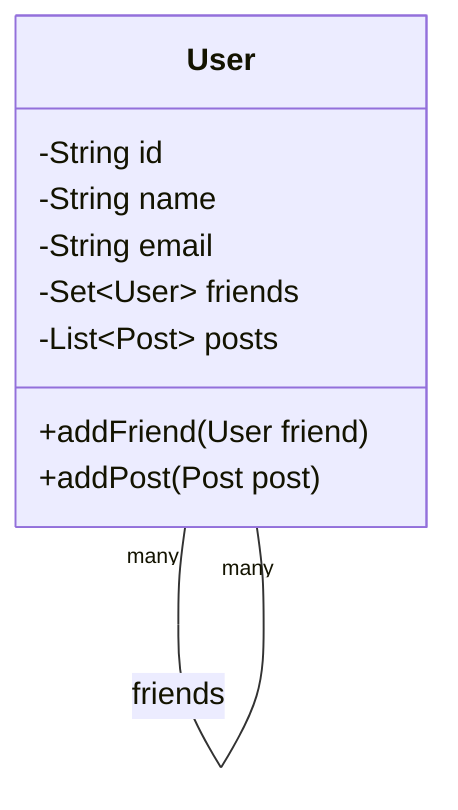

### Step 2: Common Content Model

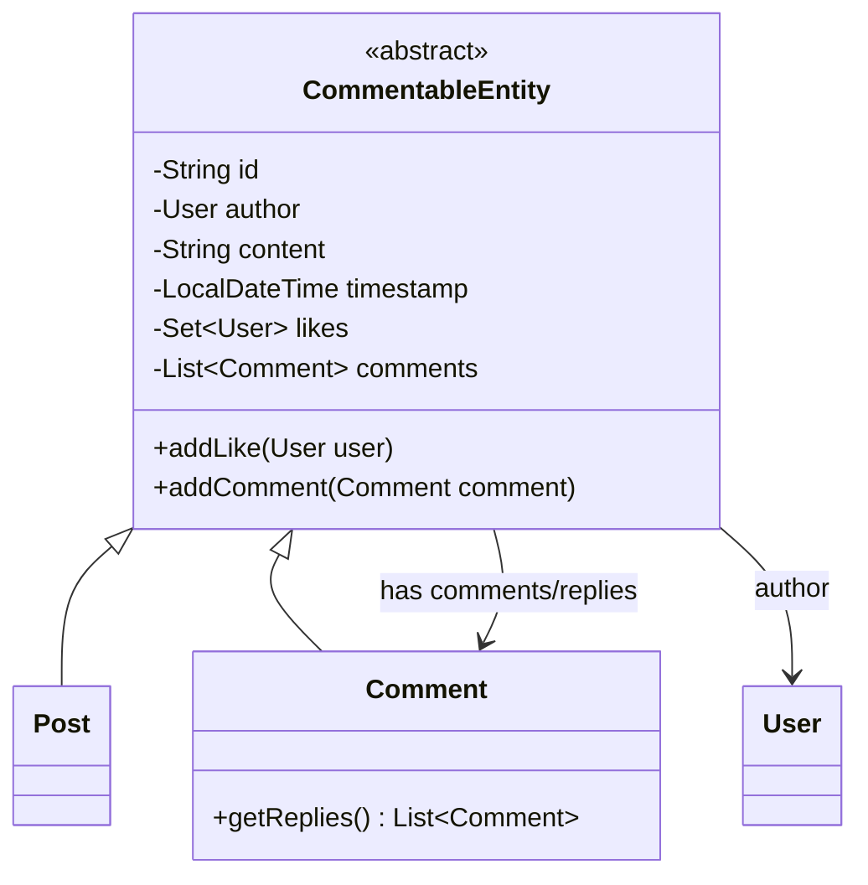

### Step 3: Service + Repository Layer

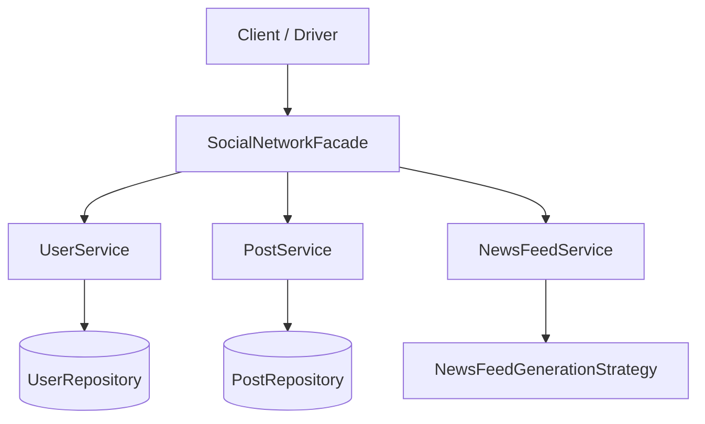

### Relationship Types
| Relationship | Example |
|---|---|
| Inheritance | Post and Comment extend CommentableEntity |
| Association | User has friends |
| Composition-like ownership | User has posts, content has comments |
| Dependency | Services use repositories |
| Implementation | UserNotifier implements PostObserver |
| Strategy dependency | NewsFeedService uses NewsFeedGenerationStrategy |

---

## 5. State Transitions

Social Network does not have a heavy object state machine like ATM/Elevator, but content and friendship flows still have simple lifecycle transitions.

### Friendship Flow

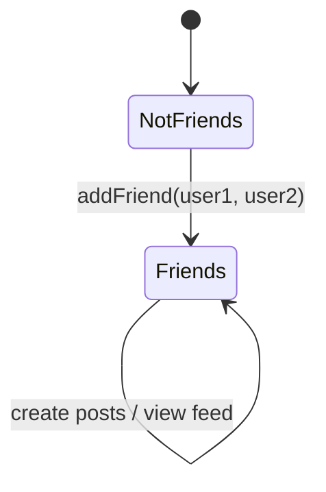

### Content Interaction Flow

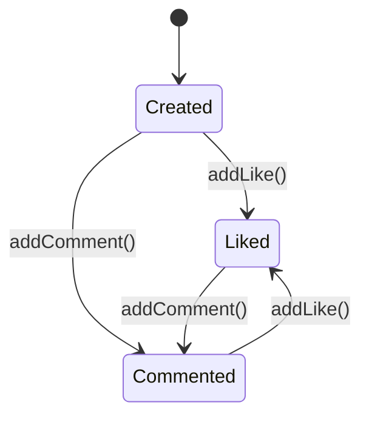

> In this simplified design, editing/deleting/privacy states are skipped.

---

## 6. Core Flows

### 6.1 User Registration

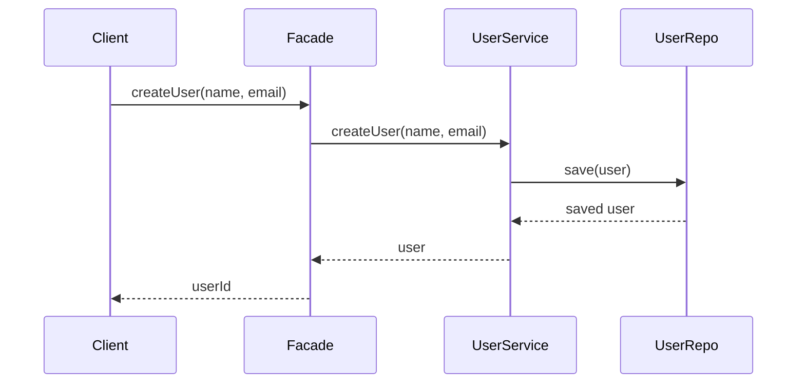

### 6.2 Add Friend

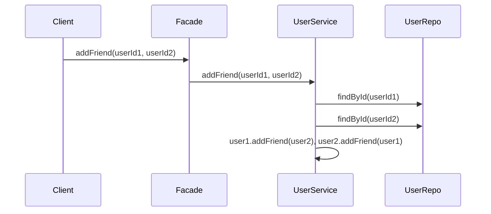

### 6.3 Create Post + Notify

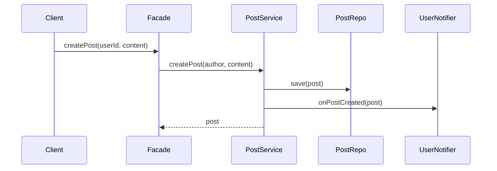

### 6.4 Like Post

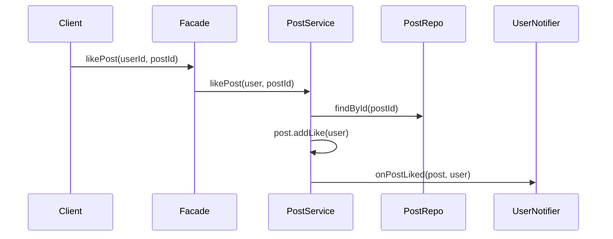

### 6.5 Generate News Feed

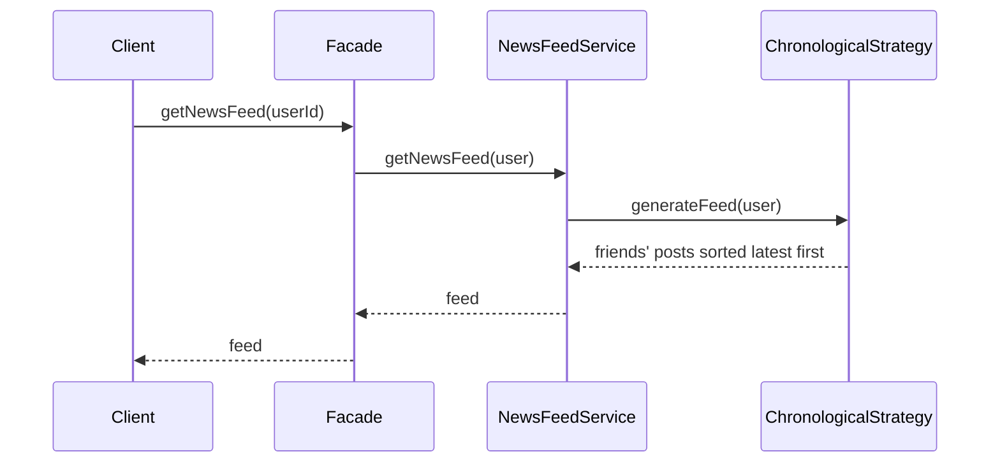

---

## 7. Design Patterns Used

### 7.1 Strategy Pattern — Feed Generation

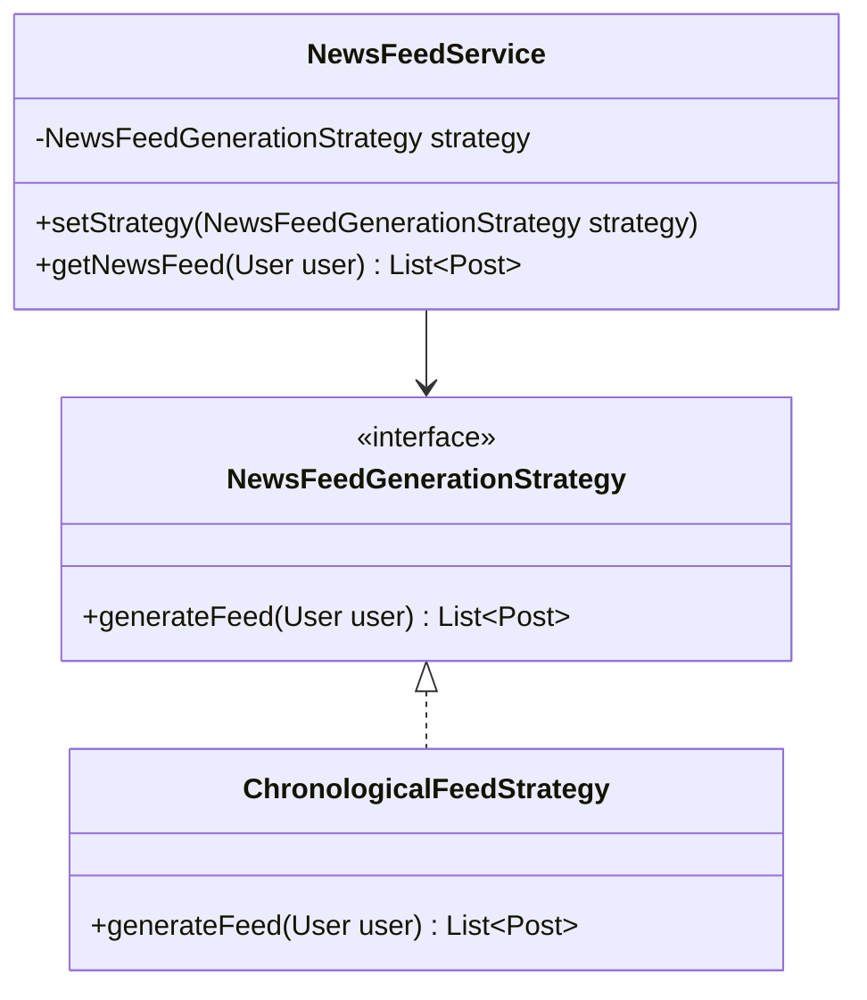

**Why:** Feed ordering can change later: chronological, popularity-based, ML-ranked, close-friends-first.

---

### 7.2 Observer Pattern — Notifications

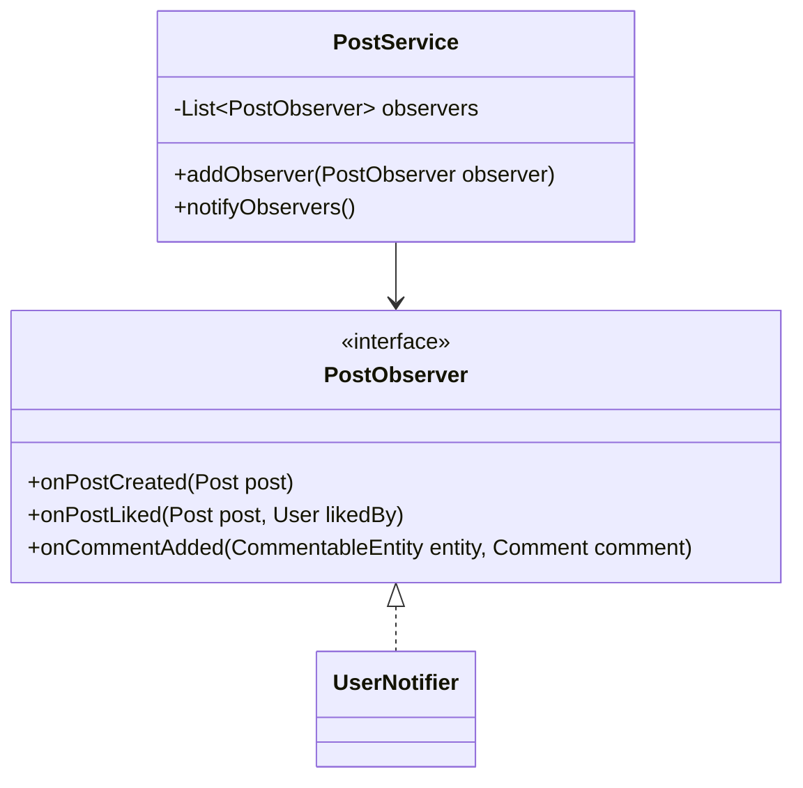

**Why:** PostService should not directly depend on notification/email/SMS/webhook systems.

---

### 7.3 Repository Pattern — Data Access

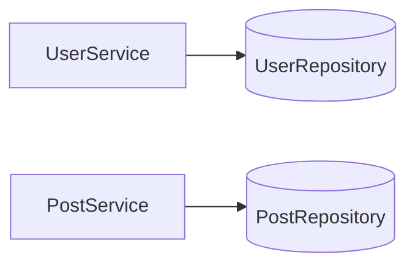

**Why:** Services should not care whether data is stored in memory, SQL, NoSQL, or cache.

---

### 7.4 Facade Pattern — Simple Entry Point

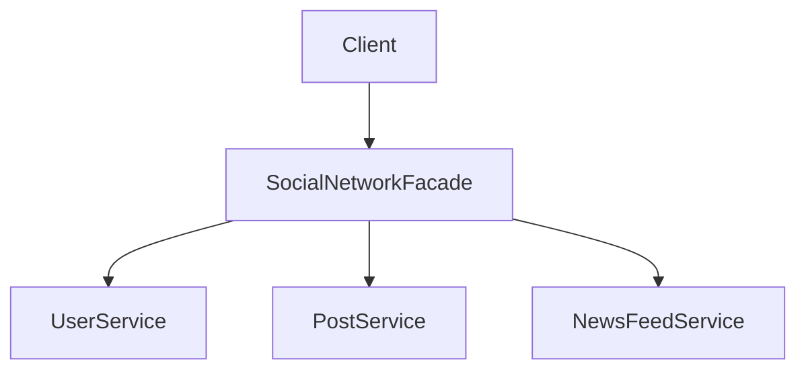

**Why:** Client gets a simple API instead of interacting with multiple services directly.

---

### 7.5 Singleton Pattern — Repositories

Used for `UserRepository` and `PostRepository` in this simplified in-memory design.

**Caution:** In production, dependency injection is usually preferred over Singleton.

---

## 8. Skeleton Code

```java
import java.time.LocalDateTime;
import java.util.*;
import java.util.concurrent.ConcurrentHashMap;

class SocialNetworkException extends RuntimeException {
    public SocialNetworkException(String message) {
        super(message);
    }
}
```

### 8.1 User

```java
class User {
    private final String id;
    private final String name;
    private final String email;
    private final Set<User> friends = new HashSet<>();
    private final List<Post> posts = new ArrayList<>();

    public User(String id, String name, String email) {
        this.id = id;
        this.name = name;
        this.email = email;
    }

    public synchronized void addFriend(User friend) {
        if (friend == null || friend == this) {
            throw new SocialNetworkException("Invalid friend");
        }
        friends.add(friend);
    }

    public synchronized void addPost(Post post) {
        posts.add(post);
    }

    public String getId() { return id; }
    public String getName() { return name; }
    public String getEmail() { return email; }
    public Set<User> getFriends() { return new HashSet<>(friends); }
    public List<Post> getPosts() { return new ArrayList<>(posts); }

    @Override
    public boolean equals(Object obj) {
        if (this == obj) return true;
        if (!(obj instanceof User)) return false;
        return id.equals(((User) obj).id);
    }

    @Override
    public int hashCode() {
        return Objects.hash(id);
    }
}
```

### 8.2 CommentableEntity, Post, Comment

```java
abstract class CommentableEntity {
    protected final String id;
    protected final User author;
    protected final String content;
    protected final LocalDateTime timestamp;
    protected final Set<User> likes = new HashSet<>();
    protected final List<Comment> comments = new ArrayList<>();

    protected CommentableEntity(String id, User author, String content) {
        this.id = id;
        this.author = author;
        this.content = content;
        this.timestamp = LocalDateTime.now();
    }

    public synchronized void addLike(User user) {
        if (user == null) throw new SocialNetworkException("Invalid user");
        likes.add(user);
    }

    public synchronized void addComment(Comment comment) {
        if (comment == null) throw new SocialNetworkException("Invalid comment");
        comments.add(comment);
    }

    public String getId() { return id; }
    public User getAuthor() { return author; }
    public String getContent() { return content; }
    public LocalDateTime getTimestamp() { return timestamp; }
    public int getLikeCount() { return likes.size(); }
    public List<Comment> getComments() { return new ArrayList<>(comments); }
}

class Post extends CommentableEntity {
    public Post(String id, User author, String content) {
        super(id, author, content);
    }
}

class Comment extends CommentableEntity {
    public Comment(String id, User author, String content) {
        super(id, author, content);
    }

    public List<Comment> getReplies() {
        return getComments();
    }
}
```

### 8.3 Repositories

```java
class UserRepository {
    private static final UserRepository INSTANCE = new UserRepository();
    private final Map<String, User> users = new ConcurrentHashMap<>();

    private UserRepository() {}

    public static UserRepository getInstance() {
        return INSTANCE;
    }

    public void save(User user) {
        users.put(user.getId(), user);
    }

    public User findById(String id) {
        User user = users.get(id);
        if (user == null) throw new SocialNetworkException("User not found: " + id);
        return user;
    }
}

class PostRepository {
    private static final PostRepository INSTANCE = new PostRepository();
    private final Map<String, CommentableEntity> content = new ConcurrentHashMap<>();

    private PostRepository() {}

    public static PostRepository getInstance() {
        return INSTANCE;
    }

    public void save(CommentableEntity entity) {
        content.put(entity.getId(), entity);
    }

    public CommentableEntity findById(String id) {
        CommentableEntity entity = content.get(id);
        if (entity == null) throw new SocialNetworkException("Content not found: " + id);
        return entity;
    }
}
```

### 8.4 Observer

```java
interface PostObserver {
    void onPostCreated(Post post);
    void onPostLiked(Post post, User likedBy);
    void onCommentAdded(CommentableEntity entity, Comment comment);
}

class UserNotifier implements PostObserver {
    @Override
    public void onPostCreated(Post post) {
        System.out.println("Notify friends: " + post.getAuthor().getName() + " created a post");
    }

    @Override
    public void onPostLiked(Post post, User likedBy) {
        System.out.println("Notify " + post.getAuthor().getName() + ": " + likedBy.getName() + " liked your post");
    }

    @Override
    public void onCommentAdded(CommentableEntity entity, Comment comment) {
        System.out.println("Notify " + entity.getAuthor().getName() + ": new comment by " + comment.getAuthor().getName());
    }
}
```

### 8.5 Services

```java
class UserService {
    private final UserRepository userRepository = UserRepository.getInstance();

    public User createUser(String name, String email) {
        String id = UUID.randomUUID().toString();
        User user = new User(id, name, email);
        userRepository.save(user);
        return user;
    }

    public void addFriend(String userId1, String userId2) {
        User u1 = userRepository.findById(userId1);
        User u2 = userRepository.findById(userId2);

        u1.addFriend(u2);
        u2.addFriend(u1);
    }

    public User getUserById(String id) {
        return userRepository.findById(id);
    }
}

class PostService {
    private final PostRepository postRepository = PostRepository.getInstance();
    private final List<PostObserver> observers = new ArrayList<>();

    public void addObserver(PostObserver observer) {
        observers.add(observer);
    }

    public Post createPost(User author, String content) {
        Post post = new Post(UUID.randomUUID().toString(), author, content);
        postRepository.save(post);
        author.addPost(post);
        observers.forEach(o -> o.onPostCreated(post));
        return post;
    }

    public void likePost(User user, String postId) {
        CommentableEntity entity = postRepository.findById(postId);
        if (!(entity instanceof Post)) {
            throw new SocialNetworkException("Not a post");
        }
        Post post = (Post) entity;
        post.addLike(user);
        observers.forEach(o -> o.onPostLiked(post, user));
    }

    public Comment addComment(User author, String entityId, String content) {
        CommentableEntity entity = postRepository.findById(entityId);
        Comment comment = new Comment(UUID.randomUUID().toString(), author, content);
        entity.addComment(comment);
        postRepository.save(comment);
        observers.forEach(o -> o.onCommentAdded(entity, comment));
        return comment;
    }
}
```

### 8.6 Feed Strategy

```java
interface NewsFeedGenerationStrategy {
    List<Post> generateFeed(User user);
}

class ChronologicalFeedStrategy implements NewsFeedGenerationStrategy {
    @Override
    public List<Post> generateFeed(User user) {
        List<Post> feed = new ArrayList<>();

        for (User friend : user.getFriends()) {
            feed.addAll(friend.getPosts());
        }

        feed.sort((p1, p2) -> p2.getTimestamp().compareTo(p1.getTimestamp()));
        return feed;
    }
}

class NewsFeedService {
    private NewsFeedGenerationStrategy strategy;

    public NewsFeedService(NewsFeedGenerationStrategy strategy) {
        this.strategy = strategy;
    }

    public void setStrategy(NewsFeedGenerationStrategy strategy) {
        this.strategy = strategy;
    }

    public List<Post> getNewsFeed(User user) {
        return strategy.generateFeed(user);
    }
}
```

### 8.7 Facade + Demo

```java
class SocialNetworkFacade {
    private final UserService userService = new UserService();
    private final PostService postService = new PostService();
    private final NewsFeedService newsFeedService =
            new NewsFeedService(new ChronologicalFeedStrategy());

    public SocialNetworkFacade() {
        postService.addObserver(new UserNotifier());
    }

    public User createUser(String name, String email) {
        return userService.createUser(name, email);
    }

    public void addFriend(String userId1, String userId2) {
        userService.addFriend(userId1, userId2);
    }

    public Post createPost(String userId, String content) {
        User user = userService.getUserById(userId);
        return postService.createPost(user, content);
    }

    public void likePost(String userId, String postId) {
        User user = userService.getUserById(userId);
        postService.likePost(user, postId);
    }

    public Comment addComment(String userId, String entityId, String content) {
        User user = userService.getUserById(userId);
        return postService.addComment(user, entityId, content);
    }

    public List<Post> getNewsFeed(String userId) {
        User user = userService.getUserById(userId);
        return newsFeedService.getNewsFeed(user);
    }
}

class Demo {
    public static void main(String[] args) {
        SocialNetworkFacade facebook = new SocialNetworkFacade();

        User john = facebook.createUser("John", "john@mail.com");
        User sarah = facebook.createUser("Sarah", "sarah@mail.com");

        facebook.addFriend(john.getId(), sarah.getId());

        Post post = facebook.createPost(sarah.getId(), "Finished a 10K run today!");
        facebook.likePost(john.getId(), post.getId());
        facebook.addComment(john.getId(), post.getId(), "Great job!");

        List<Post> feed = facebook.getNewsFeed(john.getId());
        feed.forEach(p -> System.out.println(p.getAuthor().getName() + ": " + p.getContent()));
    }
}
```

---

## 9. Edge Cases

| Edge Case | Expected Handling |
|---|---|
| Add self as friend | Reject |
| Add already existing friend | No duplicate due to Set |
| Like same post twice | No duplicate due to Set |
| Comment on invalid content ID | Throw exception |
| User not found | Throw exception |
| Empty post content | Validate and reject |
| Feed for user with no friends | Return empty list |
| Nested comment depth too large | Limit depth in future version |
| Notification failure | Should not fail main transaction |

---

## 10. Failure Points

| Failure Point | Risk | Mitigation |
|---|---|---|
| In-memory repository | Data lost on restart | Use persistent DB |
| Concurrent likes/comments | Race conditions | Use synchronized methods or concurrent collections |
| Large friend list | Feed generation becomes slow | Cache/precompute feeds |
| Deep nested comments | Recursive rendering issues | Add max depth/pagination |
| Notification service failure | User not notified | Async queue + retry |
| Duplicate emails | Multiple accounts with same email | Add unique email validation |
| Singleton repositories | Hard to test | Prefer dependency injection |

---

## 11. Improvements

### Functional Improvements
- Add privacy controls: public, friends-only, private.
- Add media posts: images, videos, links.
- Add reactions: like, love, haha, angry.
- Add friend requests instead of direct friendship.
- Add editing/deleting posts and comments.
- Add blocking/reporting users.
- Add messaging/chat.

### Design Improvements
- Replace Singleton repositories with dependency injection.
- Add repository interfaces for easier testing.
- Add pagination to feeds and comments.
- Use event queue for notifications.
- Add feed cache for faster reads.
- Add ranking strategy for personalized feed.
- Split PostService into PostService, CommentService, LikeService.

### Scalability Improvements
- Store users/posts in database.
- Use distributed cache for news feed.
- Use fanout-on-write for celebrity/friend posts.
- Use Kafka/RabbitMQ for notification events.
- Use search index for users/posts.

---

## Final Class Diagram

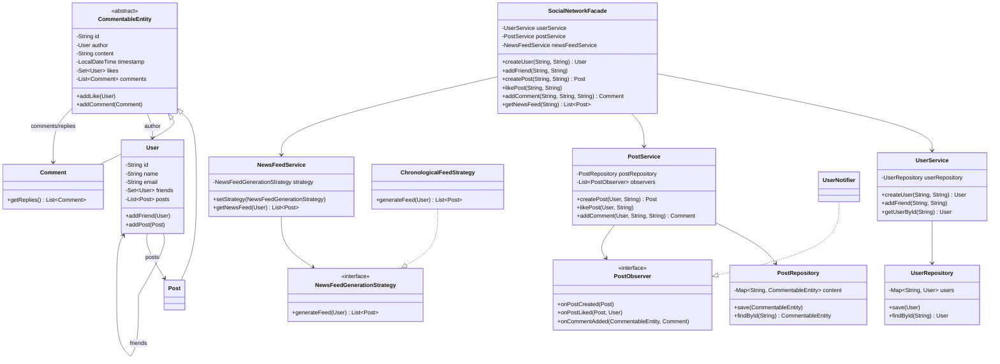
