# LLD Visual Java Reference

Compact visual notes for learning Low-Level Design. Each problem follows the same interview-friendly structure:

1. Requirements  
2. Core Use Cases  
3. Entities + Responsibilities  
4. Relationships  
5. State Transitions  
6. Core Flows  
7. Design Patterns Used  
8. Skeleton Code  
9. Edge Cases  

---

# 1. Design Tic Tac Toe

## 1. Requirements
- 3x3 board.
- Two players: X and O.
- Alternate turns.
- Detect win, draw, invalid move.
- Maintain score across games.

## 2. Core Use Cases
- Start game.
- Make move.
- Validate move.
- Check winner/draw.
- Reset game.

## 3. Entities + Responsibilities
| Entity | Responsibility |
|---|---|
| Player | Holds name and symbol |
| Board | Manages cells |
| Cell | Holds symbol |
| Game | Controls turns and status |
| Scoreboard | Tracks wins |
| WinningStrategy | Checks winning condition |

## 4. Relationships
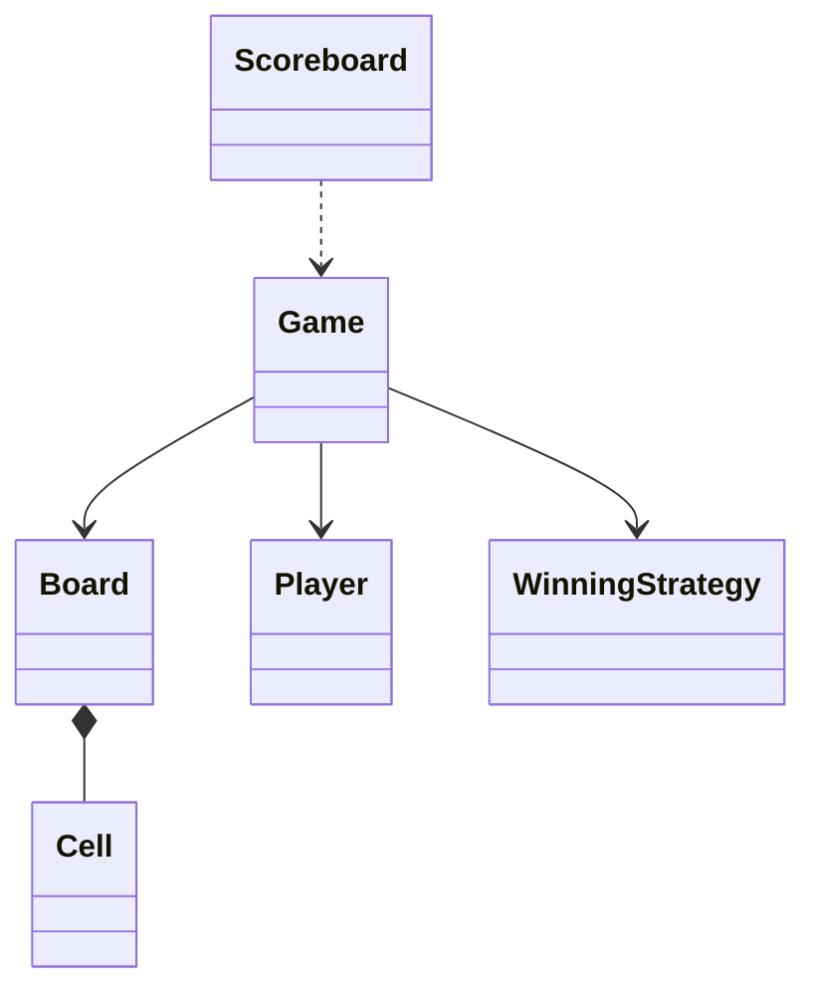

## 5. State Transitions
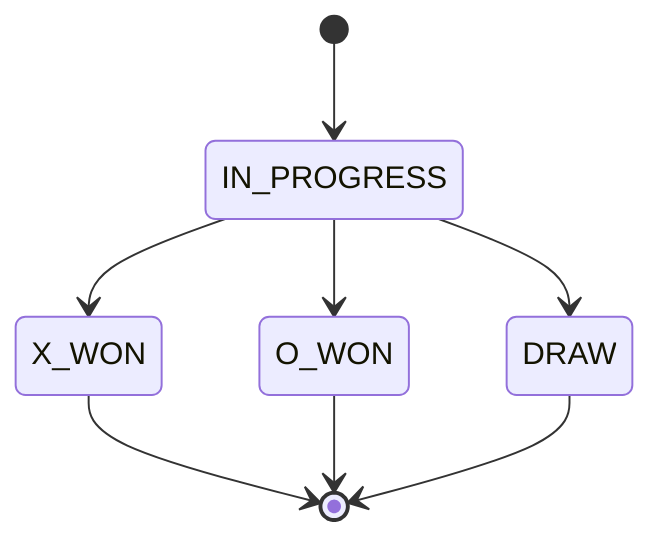

## 6. Core Flows
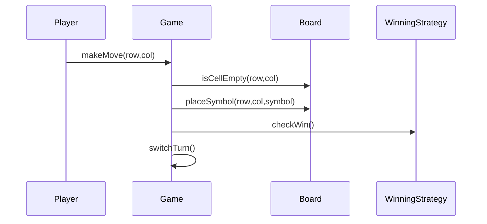

## 7. Design Patterns Used
- Strategy: different win checks.
- Observer: scoreboard update after game ends.
- Facade: game system exposes simple API.

## 8. Skeleton Code
```java
enum Symbol { X, O, EMPTY }
enum GameStatus { IN_PROGRESS, X_WON, O_WON, DRAW }

class Player {
    private final String name;
    private final Symbol symbol;
    public Player(String name, Symbol symbol) { this.name = name; this.symbol = symbol; }
}

class Cell {
    private Symbol symbol = Symbol.EMPTY;
    public boolean isEmpty() { return symbol == Symbol.EMPTY; }
    public void setSymbol(Symbol symbol) { this.symbol = symbol; }
}

class Board {
    private final Cell[][] cells = new Cell[3][3];
    public boolean isCellEmpty(int r, int c) { return true; }
    public void placeSymbol(int r, int c, Symbol s) { }
    public boolean isFull() { return false; }
}

interface WinningStrategy {
    boolean checkWin(Board board, int row, int col, Symbol symbol);
}

class Game {
    private Board board;
    private Player[] players;
    private int currentPlayerIndex;
    private GameStatus status;
    public void makeMove(int row, int col) { }
}
```

## 9. Edge Cases
- Move outside board.
- Cell already occupied.
- Move after game over.
- Duplicate player symbols.

---

# 2. Design Chess Game

## 1. Requirements
- 8x8 board.
- Two players: white and black.
- Support legal moves for pieces.
- Detect check, checkmate, stalemate.
- Track turns.

## 2. Core Use Cases
- Start game.
- Move piece.
- Validate move.
- Capture piece.
- Detect game end.

## 3. Entities + Responsibilities
| Entity | Responsibility |
|---|---|
| Game | Controls match |
| Board | Holds squares |
| Square | Holds piece |
| Piece | Base class for pieces |
| Move | Source and destination |
| MoveValidator | Validates rules |

## 4. Relationships
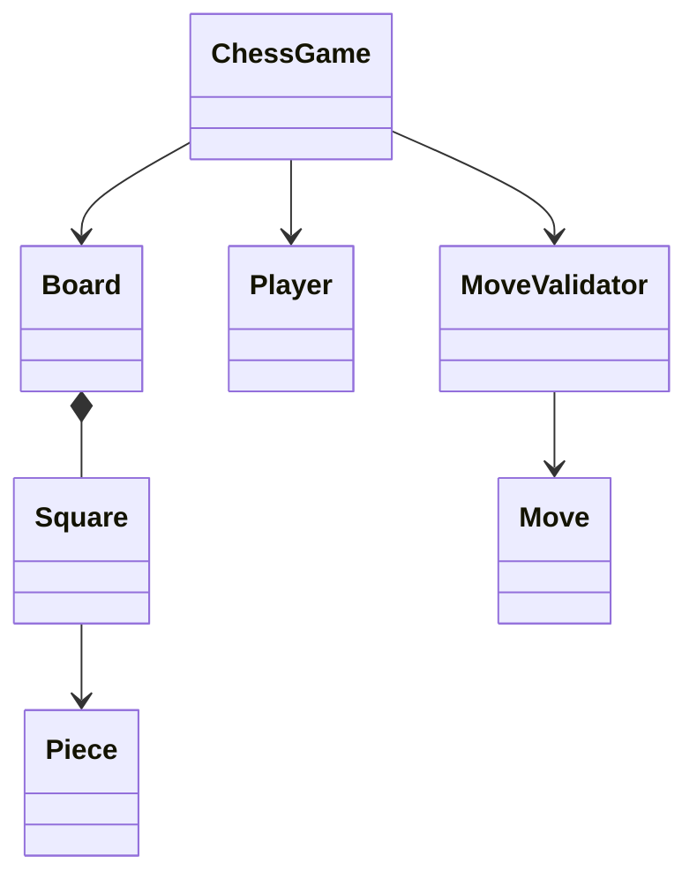

## 5. State Transitions
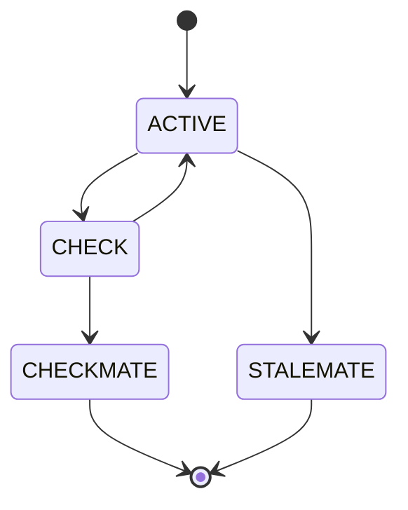

## 6. Core Flows
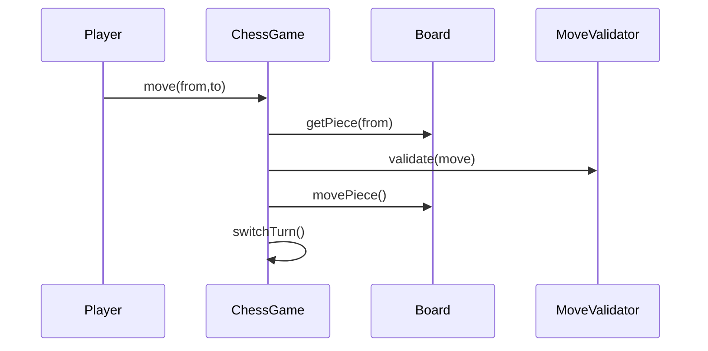

## 7. Design Patterns Used
- Strategy: piece-specific movement rules.
- Factory: initialize pieces.
- Command: move object can support undo later.

## 8. Skeleton Code
```java
enum Color { WHITE, BLACK }
enum GameStatus { ACTIVE, CHECK, CHECKMATE, STALEMATE }

abstract class Piece {
    protected Color color;
    public abstract boolean canMove(Board board, Square from, Square to);
}

class King extends Piece { public boolean canMove(Board b, Square f, Square t) { return false; } }
class Queen extends Piece { public boolean canMove(Board b, Square f, Square t) { return false; } }

class Square {
    int row, col;
    Piece piece;
}

class Board {
    private Square[][] squares = new Square[8][8];
    public void movePiece(Square from, Square to) { }
}

class Move {
    Square from, to;
    Piece movedPiece, capturedPiece;
}

class ChessGame {
    private Board board;
    private Color currentTurn;
    private GameStatus status;
    public void move(Square from, Square to) { }
}
```

## 9. Edge Cases
- King moving into check.
- Invalid piece movement.
- Moving opponent piece.
- Castling, en passant, pawn promotion.

---

# 3. Design LRU Cache

## 1. Requirements
- Fixed capacity cache.
- Get and put in O(1).
- Evict least recently used key.

## 2. Core Use Cases
- Put key-value.
- Get value.
- Update existing value.
- Evict LRU item.

## 3. Entities + Responsibilities
| Entity | Responsibility |
|---|---|
| LRUCache | Public API |
| Node | Doubly linked list node |
| HashMap | Key to node lookup |

## 4. Relationships
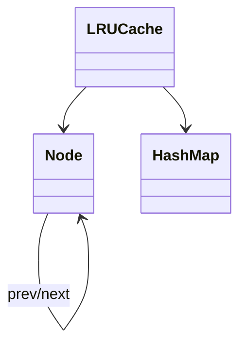

## 5. State Transitions
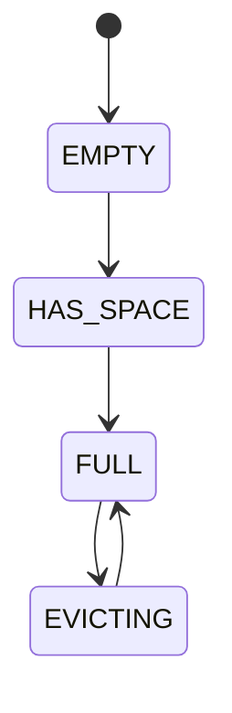

## 6. Core Flows
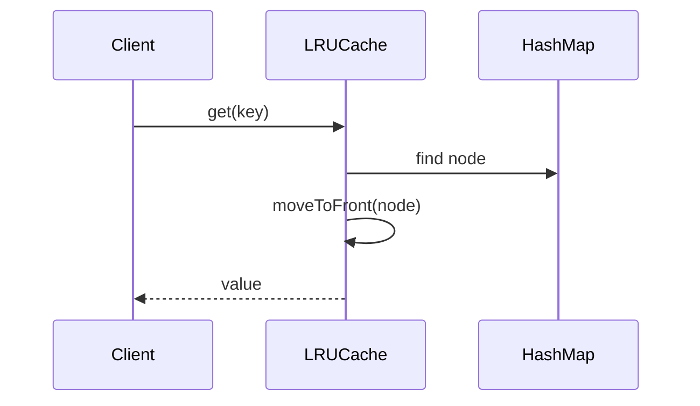

## 7. Design Patterns Used
- Data structure composition: HashMap + Doubly Linked List.
- Encapsulation: internal list hidden from client.

## 8. Skeleton Code
```java
class LRUCache<K, V> {
    private class Node {
        K key;
        V value;
        Node prev, next;
    }

    private final int capacity;
    private final Map<K, Node> map = new HashMap<>();
    private Node head, tail;

    public LRUCache(int capacity) { this.capacity = capacity; }
    public V get(K key) { return null; }
    public void put(K key, V value) { }
    private void moveToFront(Node node) { }
    private void remove(Node node) { }
    private void addFirst(Node node) { }
}
```

## 9. Edge Cases
- Capacity zero.
- Updating existing key.
- Getting missing key.
- Repeated get changes recency.

---

# 4. Design Search Autocomplete System

## 1. Requirements
- Return suggestions for prefix.
- Rank by frequency or relevance.
- Support adding new search terms.

## 2. Core Use Cases
- Insert term.
- Search by prefix.
- Update frequency.
- Return top K suggestions.

## 3. Entities + Responsibilities
| Entity | Responsibility |
|---|---|
| TrieNode | Stores children and suggestions |
| Trie | Prefix search |
| Suggestion | Term and score |
| AutocompleteService | Public API |
| RankingStrategy | Sorts suggestions |

## 4. Relationships
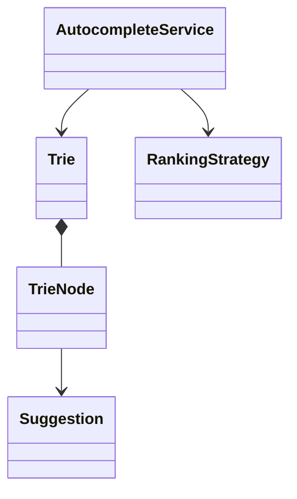

## 5. State Transitions
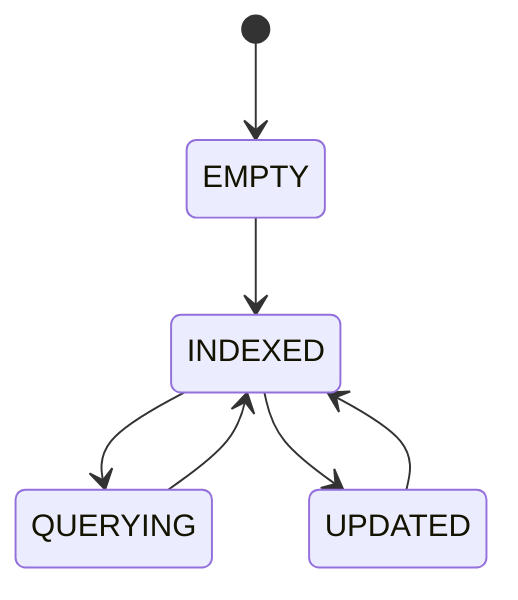

## 6. Core Flows
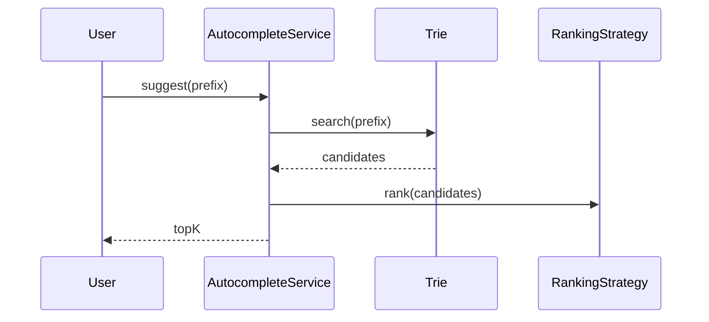

## 7. Design Patterns Used
- Trie data structure.
- Strategy: ranking logic.
- Facade: autocomplete service.

## 8. Skeleton Code
```java
class Suggestion {
    String term;
    int frequency;
}

class TrieNode {
    Map<Character, TrieNode> children = new HashMap<>();
    boolean isWord;
    String word;
}

class Trie {
    private TrieNode root = new TrieNode();
    public void insert(String word) { }
    public List<String> searchPrefix(String prefix) { return List.of(); }
}

interface RankingStrategy {
    List<String> rank(List<String> candidates, int k);
}

class AutocompleteService {
    private Trie trie;
    private RankingStrategy rankingStrategy;
    public List<String> suggest(String prefix, int k) { return List.of(); }
}
```

## 9. Edge Cases
- Empty prefix.
- No matching suggestions.
- Case sensitivity.
- Duplicate terms.

---

# 5. Design ATM

## 1. Requirements
- Authenticate user using card and PIN.
- Check balance.
- Withdraw cash.
- Deposit cash.
- Print receipt.

## 2. Core Use Cases
- Insert card.
- Enter PIN.
- Select transaction.
- Dispense cash.
- Eject card.

## 3. Entities + Responsibilities
| Entity | Responsibility |
|---|---|
| ATM | Coordinates actions |
| Card | User card info |
| Account | Balance and operations |
| BankService | Validates account |
| Transaction | Base transaction |
| CashDispenser | Dispenses notes |

## 4. Relationships
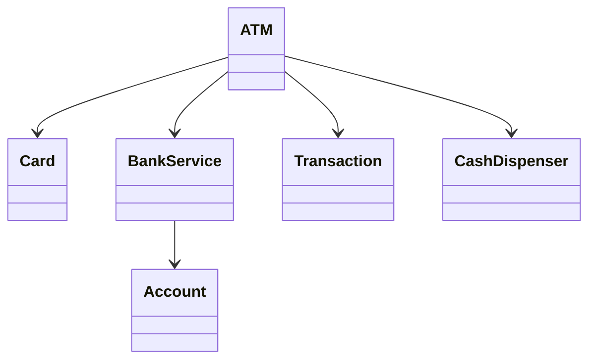

## 5. State Transitions
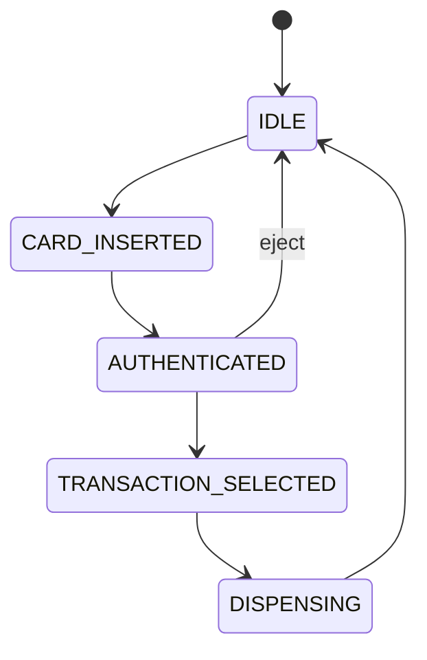

## 6. Core Flows
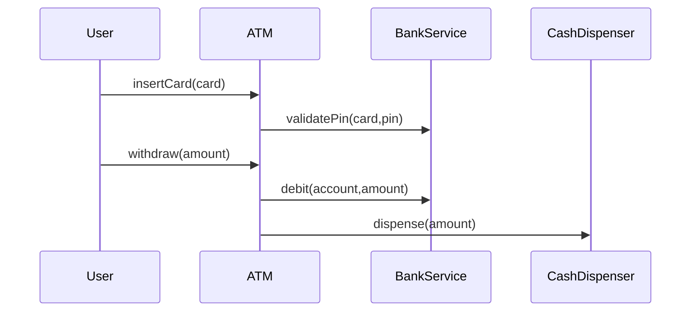

## 7. Design Patterns Used
- State: ATM states.
- Strategy/Chain: cash dispensing denominations.
- Template Method: transaction execution flow.

## 8. Skeleton Code
```java
enum ATMState { IDLE, CARD_INSERTED, AUTHENTICATED, TRANSACTION_SELECTED }

class Card { String cardNumber; }
class Account { String id; double balance; }

interface BankService {
    boolean validatePin(Card card, String pin);
    boolean debit(String accountId, double amount);
}

abstract class Transaction {
    protected Account account;
    public abstract void execute();
}

class WithdrawTransaction extends Transaction {
    public void execute() { }
}

class ATM {
    private ATMState state = ATMState.IDLE;
    private Card currentCard;
    public void insertCard(Card card) { }
    public void enterPin(String pin) { }
    public void withdraw(double amount) { }
}
```

## 9. Edge Cases
- Wrong PIN limit.
- Insufficient account balance.
- ATM cash unavailable.
- Network failure with bank.

---

# 6. Design Elevator System

## 1. Requirements
- Multiple elevators.
- Handle internal and external requests.
- Assign elevator to request.
- Move elevators between floors.

## 2. Core Use Cases
- Request elevator from floor.
- Select destination.
- Assign best elevator.
- Open/close doors.

## 3. Entities + Responsibilities
| Entity | Responsibility |
|---|---|
| Elevator | Moves and serves requests |
| ElevatorController | Assigns elevators |
| Request | Source/destination request |
| Scheduler | Selection algorithm |
| Door | Door state |

## 4. Relationships
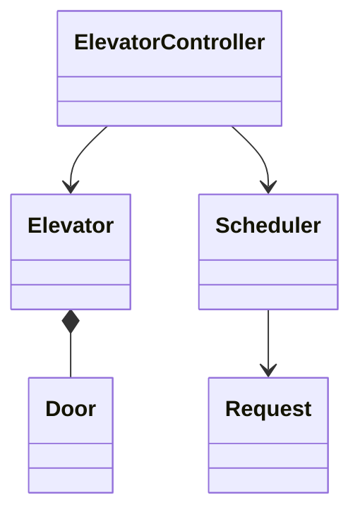

## 5. State Transitions
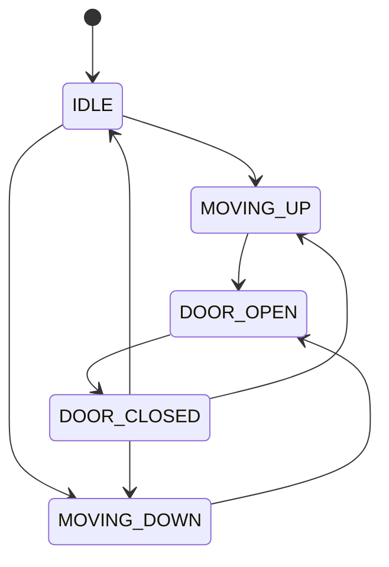

## 6. Core Flows
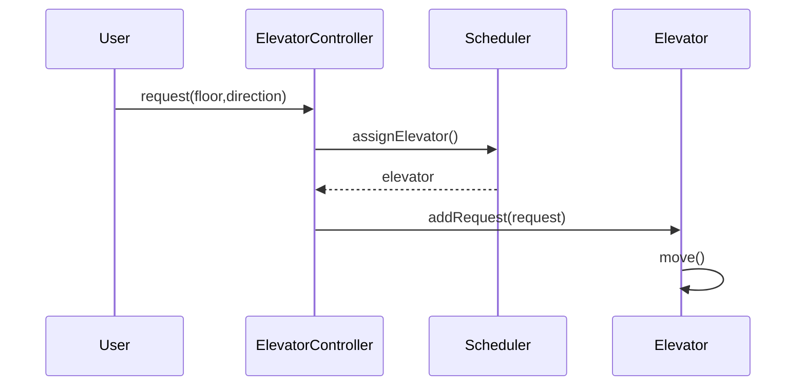

## 7. Design Patterns Used
- Strategy: scheduling algorithm.
- State: elevator movement state.
- Command: request object.

## 8. Skeleton Code
```java
enum Direction { UP, DOWN, IDLE }
enum ElevatorState { IDLE, MOVING, DOOR_OPEN }

class Request {
    int sourceFloor;
    int destinationFloor;
    Direction direction;
}

interface Scheduler {
    Elevator assign(List<Elevator> elevators, Request request);
}

class Elevator {
    private int currentFloor;
    private Direction direction;
    private Queue<Request> requests = new LinkedList<>();
    public void addRequest(Request request) { }
    public void move() { }
}

class ElevatorController {
    private List<Elevator> elevators;
    private Scheduler scheduler;
    public void requestElevator(Request request) { }
}
```

## 9. Edge Cases
- All elevators busy.
- Same floor request.
- Over-capacity elevator.
- Emergency stop.

---

# 7. Design Parking Lot

## 1. Requirements
- Multiple floors.
- Vehicle types: bike, car, truck.
- Spot sizes: small, medium, large.
- Automatic spot allocation.
- Ticket and fee calculation.

## 2. Core Use Cases
- Park vehicle.
- Unpark vehicle.
- Display availability.
- Calculate fee.

## 3. Entities + Responsibilities
| Entity | Responsibility |
|---|---|
| Vehicle | Vehicle data |
| ParkingSpot | Holds vehicle |
| ParkingFloor | Manages spots |
| ParkingLot | Orchestrates system |
| Ticket | Tracks session |
| FeeStrategy | Calculates fee |
| AllocationStrategy | Finds spot |

## 4. Relationships
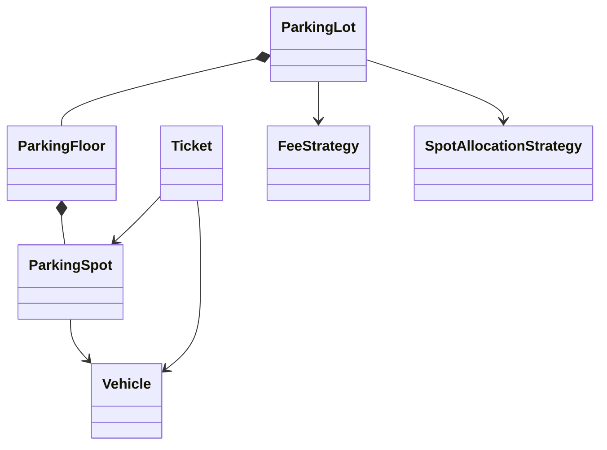

## 5. State Transitions
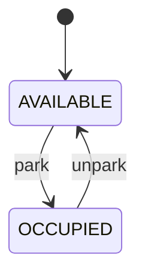

## 6. Core Flows
```mermaid
sequenceDiagram
Driver->>ParkingLot: parkVehicle(vehicle)
ParkingLot->>SpotAllocationStrategy: findSpot()
ParkingLot->>ParkingSpot: park(vehicle)
ParkingLot-->>Driver: ticket
Driver->>ParkingLot: unpark(ticketId)
ParkingLot->>FeeStrategy: calculate(ticket)
```

## 7. Design Patterns Used
- Singleton: one parking lot instance.
- Strategy: fee and spot allocation.
- Facade: parking lot API.

## 8. Skeleton Code
```java
enum VehicleSize { SMALL, MEDIUM, LARGE }

abstract class Vehicle {
    String plate;
    VehicleSize size;
}
class Bike extends Vehicle { }
class Car extends Vehicle { }
class Truck extends Vehicle { }

class ParkingSpot {
    String id;
    VehicleSize size;
    Vehicle vehicle;
    public boolean canFit(Vehicle v) { return false; }
    public synchronized void park(Vehicle v) { }
    public synchronized Vehicle unpark() { return null; }
}

class ParkingTicket {
    String id;
    Vehicle vehicle;
    ParkingSpot spot;
    LocalDateTime entryTime;
    LocalDateTime exitTime;
}

interface FeeStrategy { double calculate(ParkingTicket ticket); }
interface SpotAllocationStrategy { ParkingSpot findSpot(List<ParkingFloor> floors, Vehicle vehicle); }

class ParkingLot {
    private List<ParkingFloor> floors;
    private Map<String, ParkingTicket> activeTickets;
    public ParkingTicket parkVehicle(Vehicle vehicle) { return null; }
    public double unparkVehicle(String ticketId) { return 0; }
}
```

## 9. Edge Cases
- No compatible spot.
- Duplicate vehicle already parked.
- Invalid ticket.
- Concurrent parking requests.

---

# 8. Design Inventory Management System

## 1. Requirements
- Manage products and stock.
- Add/remove inventory.
- Track warehouses.
- Support low-stock alerts.

## 2. Core Use Cases
- Add product.
- Receive stock.
- Reserve stock.
- Ship stock.
- Check availability.

## 3. Entities + Responsibilities
| Entity | Responsibility |
|---|---|
| Product | Product metadata |
| InventoryItem | Product quantity at location |
| Warehouse | Stores inventory |
| InventoryService | Coordinates operations |
| StockMovement | Audit movement |
| ReorderPolicy | Low-stock logic |

## 4. Relationships
```mermaid
classDiagram
class InventoryService
class Product
class Warehouse
class InventoryItem
class StockMovement
class ReorderPolicy
Warehouse *-- InventoryItem
InventoryItem --> Product
InventoryService --> Warehouse
InventoryService --> StockMovement
InventoryService --> ReorderPolicy
```

## 5. State Transitions
```mermaid
stateDiagram-v2
[*] --> IN_STOCK
IN_STOCK --> RESERVED
RESERVED --> SHIPPED
IN_STOCK --> LOW_STOCK
LOW_STOCK --> RESTOCKED
RESTOCKED --> IN_STOCK
```

## 6. Core Flows
```mermaid
sequenceDiagram
Admin->>InventoryService: addStock(product,qty)
InventoryService->>Warehouse: updateQuantity()
Order->>InventoryService: reserve(product,qty)
InventoryService->>Warehouse: reduceAvailable()
InventoryService->>StockMovement: record()
```

## 7. Design Patterns Used
- Strategy: reorder policy.
- Observer: low-stock alerts.
- Repository: product and warehouse storage.

## 8. Skeleton Code
```java
class Product {
    String sku;
    String name;
}

class InventoryItem {
    Product product;
    int availableQty;
    int reservedQty;
}

class Warehouse {
    String id;
    Map<String, InventoryItem> inventory = new HashMap<>();
    public void addStock(String sku, int qty) { }
    public boolean reserve(String sku, int qty) { return false; }
}

interface ReorderPolicy {
    boolean shouldReorder(InventoryItem item);
}

class InventoryService {
    private List<Warehouse> warehouses;
    public boolean reserve(String sku, int qty) { return false; }
    public void addStock(String warehouseId, String sku, int qty) { }
}
```

## 9. Edge Cases
- Negative quantity.
- Out of stock.
- Concurrent reservations.
- Product not found.

---

# 9. Design a Social Network

## 1. Requirements
- Users can create posts.
- Follow/unfollow users.
- Like/comment posts.
- Generate feed.

## 2. Core Use Cases
- Create profile.
- Follow user.
- Publish post.
- View feed.
- Like/comment.

## 3. Entities + Responsibilities
| Entity | Responsibility |
|---|---|
| User | Profile and relationships |
| Post | Content item |
| Comment | Comment on post |
| Like | Like relation |
| FeedService | Builds feed |
| FollowService | Manages follows |

## 4. Relationships
```mermaid
classDiagram
class User
class Post
class Comment
class Like
class FeedService
class FollowService
User --> Post
Post *-- Comment
Post --> Like
FeedService --> User
FollowService --> User
```

## 5. State Transitions
```mermaid
stateDiagram-v2
[*] --> DRAFT
DRAFT --> PUBLISHED
PUBLISHED --> EDITED
PUBLISHED --> DELETED
EDITED --> DELETED
```

## 6. Core Flows
```mermaid
sequenceDiagram
User->>PostService: createPost(content)
PostService->>FeedService: fanout(post)
Follower->>FeedService: getFeed(userId)
FeedService-->>Follower: posts
```

## 7. Design Patterns Used
- Observer/Event: notify followers.
- Strategy: feed ranking.
- Repository: user/post storage.

## 8. Skeleton Code
```java
class User {
    String id;
    String name;
    Set<String> following = new HashSet<>();
}

class Post {
    String id;
    String authorId;
    String content;
    LocalDateTime createdAt;
}

class Comment {
    String id;
    String postId;
    String userId;
    String text;
}

interface FeedRankingStrategy {
    List<Post> rank(List<Post> posts);
}

class FeedService {
    public List<Post> getFeed(String userId) { return List.of(); }
}

class FollowService {
    public void follow(String followerId, String followeeId) { }
}
```

## 9. Edge Cases
- Duplicate follow.
- Self-follow.
- Deleted post in feed.
- Private accounts.

---

# 10. Design Spotify

## 1. Requirements
- Users can search and play songs.
- Create playlists.
- Like songs.
- Recommend music.

## 2. Core Use Cases
- Search song.
- Play song.
- Create playlist.
- Add song to playlist.
- Generate recommendations.

## 3. Entities + Responsibilities
| Entity | Responsibility |
|---|---|
| User | Listener account |
| Song | Audio metadata |
| Artist | Creator info |
| Album | Song collection |
| Playlist | User-curated songs |
| Player | Playback control |
| RecommendationStrategy | Suggest songs |

## 4. Relationships
```mermaid
classDiagram
class User
class Song
class Artist
class Album
class Playlist
class Player
class RecommendationStrategy
Artist --> Song
Album *-- Song
User --> Playlist
Playlist o-- Song
Player --> Song
User --> RecommendationStrategy
```

## 5. State Transitions
```mermaid
stateDiagram-v2
[*] --> STOPPED
STOPPED --> PLAYING
PLAYING --> PAUSED
PAUSED --> PLAYING
PLAYING --> STOPPED
```

## 6. Core Flows
```mermaid
sequenceDiagram
User->>MusicService: search(query)
MusicService-->>User: songs
User->>Player: play(song)
Player->>Player: stream()
User->>PlaylistService: addSong(playlist,song)
```

## 7. Design Patterns Used
- State: player state.
- Strategy: recommendation algorithm.
- Composite: playlist contains songs.

## 8. Skeleton Code
```java
class Song {
    String id;
    String title;
    String artistId;
    int durationSeconds;
}

class Playlist {
    String id;
    String name;
    List<Song> songs = new ArrayList<>();
    public void addSong(Song song) { }
}

enum PlayerState { PLAYING, PAUSED, STOPPED }

class Player {
    private PlayerState state;
    private Song currentSong;
    public void play(Song song) { }
    public void pause() { }
    public void stop() { }
}

interface RecommendationStrategy {
    List<Song> recommend(User user);
}
```

## 9. Edge Cases
- Song unavailable.
- Duplicate song in playlist.
- Empty playlist.
- Network failure during streaming.

---

# 11. Design Pub Sub System

## 1. Requirements
- Publishers send messages to topics.
- Subscribers receive messages from topics.
- Support multiple subscribers per topic.
- Deliver messages asynchronously.

## 2. Core Use Cases
- Create topic.
- Subscribe to topic.
- Publish message.
- Consume message.

## 3. Entities + Responsibilities
| Entity | Responsibility |
|---|---|
| Topic | Message channel |
| Message | Payload |
| Publisher | Publishes messages |
| Subscriber | Consumes messages |
| Broker | Routes messages |
| DeliveryStrategy | Delivery behavior |

## 4. Relationships
```mermaid
classDiagram
class Broker
class Topic
class Message
class Publisher
class Subscriber
class DeliveryStrategy
Broker *-- Topic
Topic o-- Message
Publisher --> Broker
Broker --> Subscriber
Broker --> DeliveryStrategy
```

## 5. State Transitions
```mermaid
stateDiagram-v2
[*] --> CREATED
CREATED --> PUBLISHED
PUBLISHED --> DELIVERED
PUBLISHED --> FAILED
FAILED --> RETRYING
RETRYING --> DELIVERED
```

## 6. Core Flows
```mermaid
sequenceDiagram
Publisher->>Broker: publish(topic,message)
Broker->>Topic: append(message)
Broker->>Subscriber: notify(message)
Subscriber->>Broker: ack(message)
```

## 7. Design Patterns Used
- Observer: subscribers observe topics.
- Strategy: delivery/retry strategy.
- Queue: message buffering.

## 8. Skeleton Code
```java
class Message {
    String id;
    String payload;
}

interface Subscriber {
    void consume(Message message);
}

class Topic {
    String name;
    Queue<Message> messages = new LinkedList<>();
    List<Subscriber> subscribers = new ArrayList<>();
}

class Broker {
    private Map<String, Topic> topics = new HashMap<>();
    public void createTopic(String name) { }
    public void subscribe(String topic, Subscriber subscriber) { }
    public void publish(String topic, Message message) { }
}
```

## 9. Edge Cases
- Subscriber failure.
- Duplicate delivery.
- Message ordering.
- Topic not found.

---

# 12. Design Chat Application

## 1. Requirements
- One-to-one and group chat.
- Send text messages.
- Show delivery/read status.
- Store chat history.

## 2. Core Use Cases
- Create chat.
- Send message.
- Receive message.
- Mark as read.
- Fetch history.

## 3. Entities + Responsibilities
| Entity | Responsibility |
|---|---|
| User | Chat participant |
| Conversation | Chat room/thread |
| Message | Text payload |
| MessageStatus | Delivery state |
| ChatService | Coordinates messaging |
| NotificationService | Push notification |

## 4. Relationships
```mermaid
classDiagram
class User
class Conversation
class Message
class ChatService
class NotificationService
Conversation o-- User
Conversation *-- Message
ChatService --> Conversation
ChatService --> NotificationService
```

## 5. State Transitions
```mermaid
stateDiagram-v2
[*] --> SENT
SENT --> DELIVERED
DELIVERED --> READ
SENT --> FAILED
FAILED --> SENT : retry
```

## 6. Core Flows
```mermaid
sequenceDiagram
User->>ChatService: sendMessage(conversation,text)
ChatService->>Conversation: addMessage()
ChatService->>NotificationService: notifyRecipients()
Recipient->>ChatService: markRead(message)
```

## 7. Design Patterns Used
- Observer: notifications.
- Factory: create one-to-one/group conversation.
- Repository: message persistence.

## 8. Skeleton Code
```java
enum MessageStatus { SENT, DELIVERED, READ, FAILED }

class User {
    String id;
    String name;
}

class Message {
    String id;
    String senderId;
    String text;
    MessageStatus status;
    LocalDateTime sentAt;
}

class Conversation {
    String id;
    List<User> participants = new ArrayList<>();
    List<Message> messages = new ArrayList<>();
}

class ChatService {
    public Message sendMessage(String conversationId, String senderId, String text) { return null; }
    public void markRead(String messageId, String userId) { }
}
```

## 9. Edge Cases
- User not in conversation.
- Empty message.
- Offline recipient.
- Duplicate delivery.

---

# 13. Design Payment Gateway

## 1. Requirements
- Process payments through multiple providers.
- Support card/UPI/wallet.
- Track payment status.
- Handle refunds.

## 2. Core Use Cases
- Initiate payment.
- Validate payment method.
- Route to provider.
- Confirm success/failure.
- Refund payment.

## 3. Entities + Responsibilities
| Entity | Responsibility |
|---|---|
| Payment | Payment record |
| PaymentMethod | Card/UPI/wallet details |
| PaymentGateway | Facade API |
| PaymentProvider | External processor |
| PaymentRouter | Chooses provider |
| Refund | Refund record |

## 4. Relationships
```mermaid
classDiagram
class PaymentGateway
class Payment
class PaymentMethod
class PaymentProvider
class PaymentRouter
class Refund
PaymentGateway --> PaymentRouter
PaymentRouter --> PaymentProvider
Payment --> PaymentMethod
Refund --> Payment
```

## 5. State Transitions
```mermaid
stateDiagram-v2
[*] --> CREATED
CREATED --> PROCESSING
PROCESSING --> SUCCESS
PROCESSING --> FAILED
SUCCESS --> REFUNDED
FAILED --> [*]
REFUNDED --> [*]
```

## 6. Core Flows
```mermaid
sequenceDiagram
Client->>PaymentGateway: pay(request)
PaymentGateway->>PaymentRouter: selectProvider()
PaymentGateway->>PaymentProvider: charge(payment)
PaymentProvider-->>PaymentGateway: response
PaymentGateway-->>Client: status
```

## 7. Design Patterns Used
- Strategy: provider selection.
- Adapter: provider-specific APIs.
- State: payment lifecycle.
- Facade: payment gateway API.

## 8. Skeleton Code
```java
enum PaymentStatus { CREATED, PROCESSING, SUCCESS, FAILED, REFUNDED }

enum PaymentType { CARD, UPI, WALLET }

class Payment {
    String id;
    double amount;
    PaymentStatus status;
    PaymentMethod method;
}

abstract class PaymentMethod {
    PaymentType type;
}

interface PaymentProvider {
    PaymentStatus charge(Payment payment);
    boolean refund(Payment payment);
}

interface PaymentRouter {
    PaymentProvider selectProvider(Payment payment);
}

class PaymentGateway {
    private PaymentRouter router;
    public PaymentStatus pay(Payment payment) { return PaymentStatus.CREATED; }
    public boolean refund(String paymentId) { return false; }
}
```

## 9. Edge Cases
- Duplicate payment request.
- Provider timeout.
- Partial refund.
- Payment success but callback delayed.

---

# 14. Design Splitwise

## 1. Requirements
- Users create groups.
- Add expenses.
- Split equally/exact/percentage.
- Track balances.
- Settle debts.

## 2. Core Use Cases
- Add expense.
- Calculate owed amounts.
- Show balances.
- Simplify debts.
- Settle payment.

## 3. Entities + Responsibilities
| Entity | Responsibility |
|---|---|
| User | Participant |
| Group | Collection of users |
| Expense | Payment record |
| Split | User share |
| SplitStrategy | Split calculation |
| BalanceSheet | Tracks owes/owed |

## 4. Relationships
```mermaid
classDiagram
class Group
class User
class Expense
class Split
class SplitStrategy
class BalanceSheet
Group o-- User
Group *-- Expense
Expense *-- Split
Expense --> SplitStrategy
BalanceSheet --> User
```

## 5. State Transitions
```mermaid
stateDiagram-v2
[*] --> CREATED
CREATED --> ACTIVE
ACTIVE --> SETTLED
ACTIVE --> CANCELLED
SETTLED --> [*]
```

## 6. Core Flows
```mermaid
sequenceDiagram
User->>ExpenseService: addExpense(amount,paidBy,splits)
ExpenseService->>SplitStrategy: calculate()
ExpenseService->>BalanceSheet: updateBalances()
User->>ExpenseService: settle(from,to,amount)
```

## 7. Design Patterns Used
- Strategy: split calculation.
- Command: expense operation.
- Repository: users/groups/expenses.

## 8. Skeleton Code
```java
class User {
    String id;
    String name;
}

class Split {
    User user;
    double amount;
}

class Expense {
    String id;
    User paidBy;
    double amount;
    List<Split> splits;
}

interface SplitStrategy {
    List<Split> calculate(double amount, List<User> users);
}

class EqualSplitStrategy implements SplitStrategy {
    public List<Split> calculate(double amount, List<User> users) { return List.of(); }
}

class BalanceSheet {
    Map<String, Map<String, Double>> balances = new HashMap<>();
    public void addDebt(User from, User to, double amount) { }
}
```

## 9. Edge Cases
- Split sum mismatch.
- Negative amount.
- User not in group.
- Rounding errors.

---

# 15. Design Amazon

## 1. Requirements
- Browse/search products.
- Add to cart.
- Place order.
- Make payment.
- Track order shipment.

## 2. Core Use Cases
- Search product.
- Add to cart.
- Checkout.
- Pay order.
- Ship order.

## 3. Entities + Responsibilities
| Entity | Responsibility |
|---|---|
| User | Customer account |
| Product | Product metadata |
| Inventory | Stock availability |
| Cart | Temporary selected items |
| Order | Purchase record |
| Payment | Payment info |
| Shipment | Delivery info |

## 4. Relationships
```mermaid
classDiagram
class User
class Product
class Inventory
class Cart
class CartItem
class Order
class Payment
class Shipment
User --> Cart
Cart *-- CartItem
CartItem --> Product
Order *-- CartItem
Order --> Payment
Order --> Shipment
Inventory --> Product
```

## 5. State Transitions
```mermaid
stateDiagram-v2
[*] --> CART
CART --> ORDER_CREATED
ORDER_CREATED --> PAID
PAID --> PACKED
PACKED --> SHIPPED
SHIPPED --> DELIVERED
ORDER_CREATED --> CANCELLED
```

## 6. Core Flows
```mermaid
sequenceDiagram
User->>CartService: addItem(product,qty)
User->>OrderService: checkout(cart)
OrderService->>Inventory: reserveStock()
OrderService->>PaymentService: pay()
OrderService->>ShipmentService: createShipment()
```

## 7. Design Patterns Used
- Facade: checkout service.
- Strategy: payment/shipping methods.
- State: order lifecycle.
- Saga idea: checkout across inventory/payment/shipping.

## 8. Skeleton Code
```java
enum OrderStatus { CREATED, PAID, PACKED, SHIPPED, DELIVERED, CANCELLED }

class Product {
    String id;
    String name;
    double price;
}

class CartItem {
    Product product;
    int quantity;
}

class Cart {
    String userId;
    List<CartItem> items = new ArrayList<>();
}

class Order {
    String id;
    List<CartItem> items;
    OrderStatus status;
}

class OrderService {
    public Order checkout(Cart cart) { return null; }
    public void cancelOrder(String orderId) { }
}
```

## 9. Edge Cases
- Product out of stock.
- Payment failed after stock reserved.
- Price changed before checkout.
- Duplicate order submission.

---

# 16. Design Ride Hailing Service

## 1. Requirements
- Riders request rides.
- Drivers accept rides.
- Match rider to nearby driver.
- Track ride status.
- Calculate fare.

## 2. Core Use Cases
- Request ride.
- Match driver.
- Accept ride.
- Start ride.
- Complete ride.

## 3. Entities + Responsibilities
| Entity | Responsibility |
|---|---|
| Rider | Customer |
| Driver | Service provider |
| Vehicle | Driver vehicle |
| Ride | Trip record |
| Location | Coordinates |
| MatchingStrategy | Finds driver |
| FareStrategy | Calculates fare |

## 4. Relationships
```mermaid
classDiagram
class RideService
class Rider
class Driver
class Vehicle
class Ride
class Location
class MatchingStrategy
class FareStrategy
Driver --> Vehicle
Ride --> Rider
Ride --> Driver
Ride --> Location
RideService --> MatchingStrategy
RideService --> FareStrategy
```

## 5. State Transitions
```mermaid
stateDiagram-v2
[*] --> REQUESTED
REQUESTED --> MATCHED
MATCHED --> ACCEPTED
ACCEPTED --> STARTED
STARTED --> COMPLETED
REQUESTED --> CANCELLED
ACCEPTED --> CANCELLED
```

## 6. Core Flows
```mermaid
sequenceDiagram
Rider->>RideService: requestRide(pickup,drop)
RideService->>MatchingStrategy: findDriver()
RideService->>Driver: offerRide()
Driver-->>RideService: accept
RideService->>FareStrategy: calculateFare()
```

## 7. Design Patterns Used
- Strategy: driver matching and fare calculation.
- State: ride lifecycle.
- Observer: notify driver/rider.

## 8. Skeleton Code
```java
enum RideStatus { REQUESTED, MATCHED, ACCEPTED, STARTED, COMPLETED, CANCELLED }

class Location {
    double lat;
    double lon;
}

class Rider { String id; String name; }
class Driver { String id; String name; boolean available; Location location; }

class Ride {
    String id;
    Rider rider;
    Driver driver;
    Location pickup;
    Location drop;
    RideStatus status;
}

interface MatchingStrategy { Driver findDriver(List<Driver> drivers, Location pickup); }
interface FareStrategy { double calculate(Ride ride); }

class RideService {
    public Ride requestRide(Rider rider, Location pickup, Location drop) { return null; }
    public void startRide(String rideId) { }
    public void completeRide(String rideId) { }
}
```

## 9. Edge Cases
- No driver available.
- Driver cancels after accepting.
- Rider cancels mid-flow.
- GPS update delay.

---

# 17. Design URL Shortener

## 1. Requirements
- Convert long URL to short URL.
- Redirect short URL to long URL.
- Avoid duplicate short codes.
- Track expiry optionally.

## 2. Core Use Cases
- Create short URL.
- Redirect.
- Expire URL.
- Track click count.

## 3. Entities + Responsibilities
| Entity | Responsibility |
|---|---|
| UrlMapping | Short-long mapping |
| CodeGenerator | Generates short code |
| UrlRepository | Stores mappings |
| UrlShortenerService | Public API |

## 4. Relationships
```mermaid
classDiagram
class UrlShortenerService
class UrlMapping
class CodeGenerator
class UrlRepository
UrlShortenerService --> CodeGenerator
UrlShortenerService --> UrlRepository
UrlRepository --> UrlMapping
```

## 5. State Transitions
```mermaid
stateDiagram-v2
[*] --> ACTIVE
ACTIVE --> EXPIRED
ACTIVE --> DELETED
EXPIRED --> [*]
DELETED --> [*]
```

## 6. Core Flows
```mermaid
sequenceDiagram
Client->>UrlShortenerService: shorten(longUrl)
UrlShortenerService->>CodeGenerator: generate()
UrlShortenerService->>UrlRepository: save(mapping)
Client->>UrlShortenerService: resolve(code)
UrlShortenerService-->>Client: longUrl
```

## 7. Design Patterns Used
- Strategy: code generation.
- Repository: storage abstraction.
- Facade: service API.

## 8. Skeleton Code
```java
class UrlMapping {
    String code;
    String longUrl;
    LocalDateTime createdAt;
    LocalDateTime expiresAt;
    int clickCount;
}

interface CodeGenerator {
    String generate(String longUrl);
}

interface UrlRepository {
    void save(UrlMapping mapping);
    UrlMapping findByCode(String code);
}

class UrlShortenerService {
    private CodeGenerator codeGenerator;
    private UrlRepository repository;
    public String shorten(String longUrl) { return null; }
    public String resolve(String code) { return null; }
}
```

## 9. Edge Cases
- Code collision.
- Invalid URL.
- Expired short URL.
- Malicious URL.

---

# 18. Design Rate Limiter

## 1. Requirements
- Limit requests per user/API key.
- Support fixed window/sliding window/token bucket.
- Allow or reject request.

## 2. Core Use Cases
- Check request allowed.
- Track usage.
- Reset/refill limits.
- Configure limits per user.

## 3. Entities + Responsibilities
| Entity | Responsibility |
|---|---|
| RateLimiter | Public API |
| RateLimitRule | Limit config |
| Bucket | User state |
| RateLimitStrategy | Algorithm |
| RequestContext | Request metadata |

## 4. Relationships
```mermaid
classDiagram
class RateLimiter
class RateLimitRule
class Bucket
class RateLimitStrategy
class RequestContext
RateLimiter --> RateLimitStrategy
RateLimiter --> RateLimitRule
RateLimiter --> Bucket
RateLimitStrategy --> RequestContext
```

## 5. State Transitions
```mermaid
stateDiagram-v2
[*] --> ALLOWING
ALLOWING --> THROTTLED : limit exceeded
THROTTLED --> ALLOWING : window reset/refill
```

## 6. Core Flows
```mermaid
sequenceDiagram
Client->>RateLimiter: allowRequest(userId)
RateLimiter->>RateLimitStrategy: isAllowed(context,bucket)
RateLimitStrategy-->>RateLimiter: true/false
RateLimiter-->>Client: allowed/rejected
```

## 7. Design Patterns Used
- Strategy: rate limit algorithm.
- Factory: create strategy by config.
- Singleton optional: global limiter instance.

## 8. Skeleton Code
```java
class RequestContext {
    String userId;
    long timestamp;
}

class RateLimitRule {
    int maxRequests;
    long windowMillis;
}

class Bucket {
    int tokens;
    long lastRefillTime;
}

interface RateLimitStrategy {
    boolean isAllowed(RequestContext context, Bucket bucket, RateLimitRule rule);
}

class TokenBucketStrategy implements RateLimitStrategy {
    public boolean isAllowed(RequestContext c, Bucket b, RateLimitRule r) { return false; }
}

class RateLimiter {
    private Map<String, Bucket> buckets = new HashMap<>();
    private RateLimitStrategy strategy;
    public boolean allowRequest(String userId) { return false; }
}
```

## 9. Edge Cases
- Burst traffic.
- Clock skew.
- Distributed servers.
- Missing user/API key.

---

# 19. Design Version Control System

## 1. Requirements
- Track files and versions.
- Commit changes.
- Branch and merge.
- View history.

## 2. Core Use Cases
- Initialize repository.
- Add file changes.
- Commit snapshot.
- Create branch.
- Merge branch.

## 3. Entities + Responsibilities
| Entity | Responsibility |
|---|---|
| Repository | Project storage |
| Commit | Snapshot metadata |
| Blob | File content |
| Tree | Directory structure |
| Branch | Pointer to commit |
| WorkingDirectory | Current files |
| MergeStrategy | Resolves merge |

## 4. Relationships
```mermaid
classDiagram
class Repository
class Commit
class Tree
class Blob
class Branch
class WorkingDirectory
class MergeStrategy
Repository *-- Branch
Branch --> Commit
Commit --> Tree
Tree o-- Blob
Repository --> WorkingDirectory
Repository --> MergeStrategy
```

## 5. State Transitions
```mermaid
stateDiagram-v2
[*] --> CLEAN
CLEAN --> MODIFIED
MODIFIED --> STAGED
STAGED --> COMMITTED
COMMITTED --> CLEAN
MODIFIED --> CLEAN : discard
```

## 6. Core Flows
```mermaid
sequenceDiagram
Dev->>Repository: add(file)
Repository->>WorkingDirectory: stage(file)
Dev->>Repository: commit(message)
Repository->>Commit: create snapshot
Repository->>Branch: update head
```

## 7. Design Patterns Used
- Composite: tree contains blobs/trees.
- Strategy: merge conflict resolution.
- Memento idea: commits as snapshots.
- Command: commit operation.

## 8. Skeleton Code
```java
class Blob {
    String hash;
    String content;
}

class Tree {
    String hash;
    Map<String, Object> entries = new HashMap<>();
}

class Commit {
    String id;
    String message;
    Commit parent;
    Tree rootTree;
    LocalDateTime createdAt;
}

class Branch {
    String name;
    Commit head;
}

interface MergeStrategy {
    Commit merge(Branch source, Branch target);
}

class Repository {
    Map<String, Branch> branches = new HashMap<>();
    Branch currentBranch;
    public void add(String filePath) { }
    public Commit commit(String message) { return null; }
    public Branch createBranch(String name) { return null; }
    public void merge(String branchName) { }
}
```

## 9. Edge Cases
- Merge conflict.
- Commit with no changes.
- Branch already exists.
- File deleted/renamed.

---

# Practice Method

For each problem:

```mermaid
flowchart TD
A[Read Requirements] --> B[Draw Entities]
B --> C[Define Relationships]
C --> D[Add State Machine]
D --> E[Write Skeleton Code]
E --> F[Implement Core Flow]
F --> G[Test Edge Cases]
```

Best practice: first redraw the Mermaid diagram from memory, then write the Java skeleton without looking.
