# LLD Visual Java Reference

A visual-first Low-Level Design reference for common interview problems.

## How to Read This File

- Each problem follows the same 9-section structure.
- Class diagrams include important entities, attributes, and methods.
- Java code is compact reference code, meant for learning and interview revision.

---

## Clickable Index

### 🎮 Games & Puzzles
- [Design Tic Tac Toe](#design-tic-tac-toe)
- [Design Chess Game](#design-chess-game)

### 🧱 Data Structures & Search
- [Design LRU Cache](#design-lru-cache)
- [Design Search Autocomplete System](#design-search-autocomplete-system)

### 🔄 Managing States
- [Design ATM](#design-atm)
- [Design Elevator System](#design-elevator-system)

### 🏢 Management Systems
- [Design Parking Lot](#design-parking-lot)
- [Design Inventory Management System](#design-inventory-management-system)

### 🌐 Social & Content Platforms
- [Design a Social Network](#design-a-social-network)
- [Design Spotify](#design-spotify)

### 💬 Communication & Messaging
- [Design Pub Sub System](#design-pub-sub-system)
- [Design Chat Application](#design-chat-application)

### 💰 Financial & Payment Systems
- [Design Payment Gateway](#design-payment-gateway)
- [Design Splitwise](#design-splitwise)

### 🛒 E-commerce & Booking Systems
- [Design Amazon](#design-amazon)
- [Design Ride Hailing Service](#design-ride-hailing-service)

### ⚙️ Developer Tools & Infrastructure
- [Design URL Shortener](#design-url-shortener)
- [Design Rate Limiter](#design-rate-limiter)
- [Design Version Control System](#design-version-control-system)

---

## Universal LLD Flow

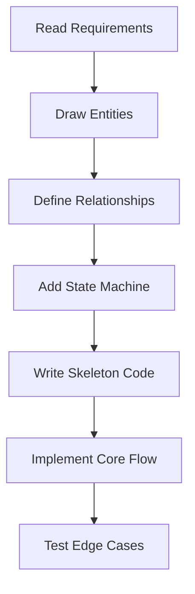

---

# 🎮 Games & Puzzles

---

## Design Tic Tac Toe

### 1. Requirements
- 3x3 board.
- Two players: X and O.
- Alternate turns.
- Reject invalid moves.
- Detect win or draw.
- Maintain score across games.

### 2. Core Use Cases
- Start game.
- Make move.
- Check winner.
- Reset game.
- Show score.

### 3. Entities + Responsibilities
| Entity | Responsibility |
|---|---|
| Symbol | X, O, EMPTY |
| Cell | Holds symbol |
| Board | Manages grid |
| Player | Name and symbol |
| Game | Controls turns and result |
| WinningStrategy | Win-check contract |
| Scoreboard | Tracks wins |

### 4. Relationships
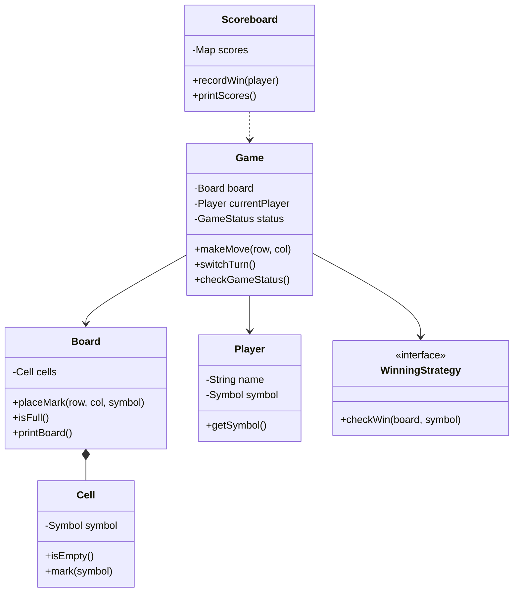

### 5. State Transitions
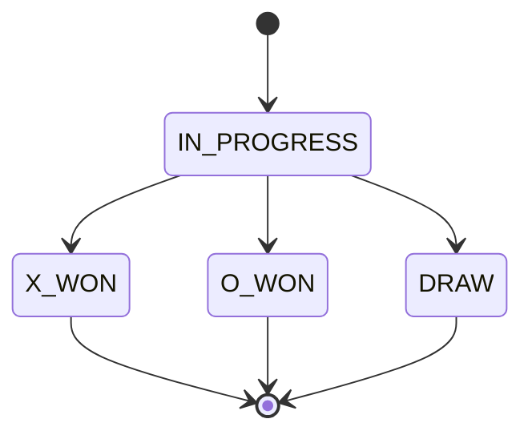

### 6. Core Flows
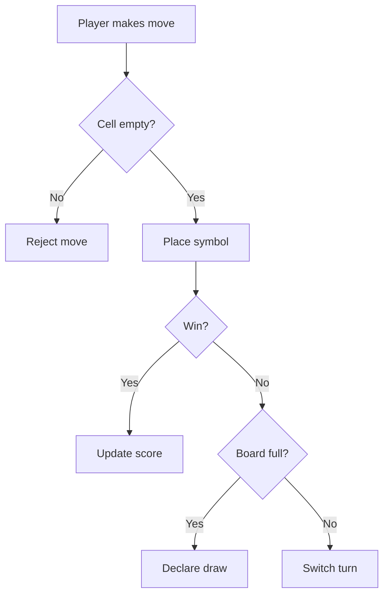

### 7. Design Patterns Used
- **Strategy:** different win checks.
- **Observer:** scoreboard can listen to game result.
- **Facade:** optional system class hides internals.

### 8. Skeleton Code
```java
import java.util.*;

enum Symbol { X, O, EMPTY }
enum GameStatus { IN_PROGRESS, X_WON, O_WON, DRAW }

class Cell {
    private Symbol symbol = Symbol.EMPTY;
    boolean isEmpty() { return symbol == Symbol.EMPTY; }
    Symbol getSymbol() { return symbol; }
    void setSymbol(Symbol symbol) { this.symbol = symbol; }
}

class Player {
    private final String name;
    private final Symbol symbol;
    Player(String name, Symbol symbol) {
        if (symbol == Symbol.EMPTY) throw new IllegalArgumentException("Invalid player symbol");
        this.name = name;
        this.symbol = symbol;
    }
    String getName() { return name; }
    Symbol getSymbol() { return symbol; }
}

class Board {
    private final Cell[][] cells;
    private final int size;
    Board(int size) {
        this.size = size;
        cells = new Cell[size][size];
        for (int r = 0; r < size; r++)
            for (int c = 0; c < size; c++)
                cells[r][c] = new Cell();
    }
    boolean place(int row, int col, Symbol symbol) {
        if (row < 0 || col < 0 || row >= size || col >= size) return false;
        if (!cells[row][col].isEmpty()) return false;
        cells[row][col].setSymbol(symbol);
        return true;
    }
    Symbol get(int row, int col) { return cells[row][col].getSymbol(); }
    int size() { return size; }
    boolean isFull() {
        for (Cell[] row : cells)
            for (Cell cell : row)
                if (cell.isEmpty()) return false;
        return true;
    }
}

interface WinningStrategy {
    boolean check(Board board, int row, int col, Symbol symbol);
}

class RowWinningStrategy implements WinningStrategy {
    public boolean check(Board board, int row, int col, Symbol symbol) {
        for (int c = 0; c < board.size(); c++) if (board.get(row, c) != symbol) return false;
        return true;
    }
}

class ColumnWinningStrategy implements WinningStrategy {
    public boolean check(Board board, int row, int col, Symbol symbol) {
        for (int r = 0; r < board.size(); r++) if (board.get(r, col) != symbol) return false;
        return true;
    }
}

class DiagonalWinningStrategy implements WinningStrategy {
    public boolean check(Board board, int row, int col, Symbol symbol) {
        boolean main = true, anti = true;
        for (int i = 0; i < board.size(); i++) {
            main &= board.get(i, i) == symbol;
            anti &= board.get(i, board.size() - 1 - i) == symbol;
        }
        return main || anti;
    }
}

class Game {
    private final Board board = new Board(3);
    private final Player[] players;
    private int current = 0;
    private GameStatus status = GameStatus.IN_PROGRESS;
    private final List<WinningStrategy> strategies = List.of(
        new RowWinningStrategy(), new ColumnWinningStrategy(), new DiagonalWinningStrategy()
    );
    Game(Player p1, Player p2) { players = new Player[]{p1, p2}; }
    boolean makeMove(int row, int col) {
        if (status != GameStatus.IN_PROGRESS) return false;
        Player p = players[current];
        if (!board.place(row, col, p.getSymbol())) return false;
        for (WinningStrategy s : strategies) {
            if (s.check(board, row, col, p.getSymbol())) {
                status = p.getSymbol() == Symbol.X ? GameStatus.X_WON : GameStatus.O_WON;
                return true;
            }
        }
        if (board.isFull()) status = GameStatus.DRAW;
        else current = 1 - current;
        return true;
    }
    GameStatus getStatus() { return status; }
}
```

### 9. Edge Cases
- Move outside board.
- Move on occupied cell.
- Move after game over.
- Draw after last move.
- Duplicate player symbols.

---

## Design Chess Game

### 1. Requirements
- 8x8 board.
- Two players: white and black.
- Pieces move according to rules.
- Alternate turns.
- Detect check and checkmate.
- Support move validation.

### 2. Core Use Cases
- Start game.
- Move piece.
- Validate legal move.
- Capture piece.
- Detect check/checkmate.

### 3. Entities + Responsibilities
| Entity | Responsibility |
|---|---|
| Board | 8x8 grid |
| Cell | Position and piece |
| Piece | Base class for chess pieces |
| Move | From and to cells |
| Player | Color and status |
| Game | Turn and game status |

### 4. Relationships
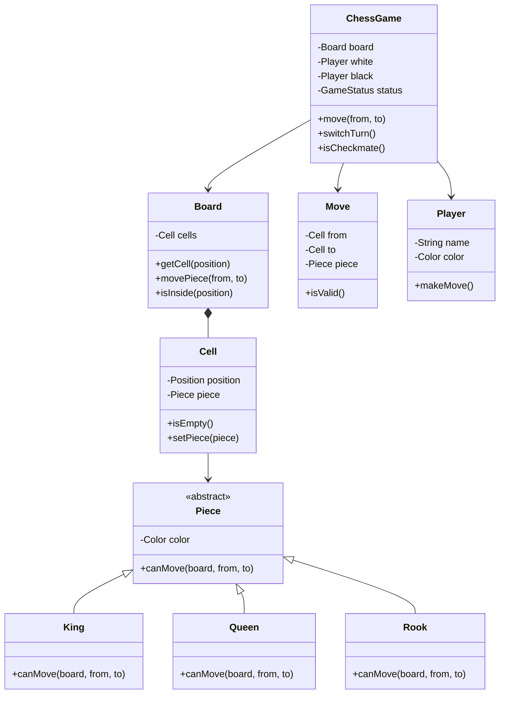

### 5. State Transitions
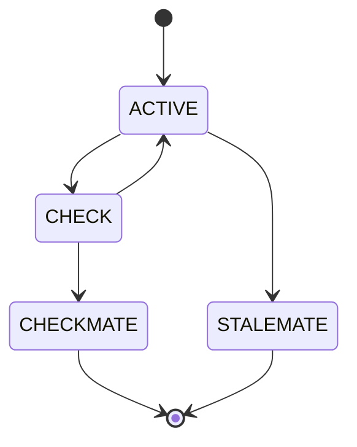

### 6. Core Flows
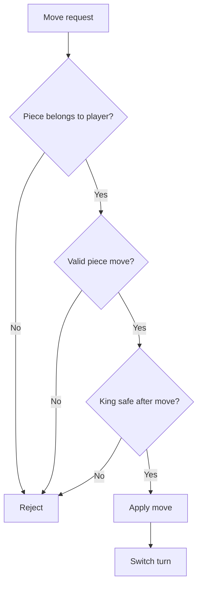

### 7. Design Patterns Used
- **Strategy/Polymorphism:** each piece validates its own movement.
- **Command:** Move object can support undo later.
- **State:** active, check, checkmate.

### 8. Skeleton Code
```java
import java.util.*;

enum Color { WHITE, BLACK }
enum ChessStatus { ACTIVE, CHECK, CHECKMATE, STALEMATE }

class Position {
    final int row, col;
    Position(int row, int col) { this.row = row; this.col = col; }
}

abstract class Piece {
    private final Color color;
    Piece(Color color) { this.color = color; }
    Color getColor() { return color; }
    abstract boolean canMove(Board board, Position from, Position to);
}

class King extends Piece {
    King(Color color) { super(color); }
    boolean canMove(Board board, Position from, Position to) {
        return Math.abs(from.row - to.row) <= 1 && Math.abs(from.col - to.col) <= 1;
    }
}

class Rook extends Piece {
    Rook(Color color) { super(color); }
    boolean canMove(Board board, Position from, Position to) {
        return from.row == to.row || from.col == to.col;
    }
}

class Cell {
    private Piece piece;
    Piece getPiece() { return piece; }
    void setPiece(Piece piece) { this.piece = piece; }
    boolean isEmpty() { return piece == null; }
}

class Board {
    private final Cell[][] cells = new Cell[8][8];
    Board() {
        for (int r = 0; r < 8; r++)
            for (int c = 0; c < 8; c++)
                cells[r][c] = new Cell();
    }
    Cell getCell(Position p) { return cells[p.row][p.col]; }
    boolean isValid(Position p) { return p.row >= 0 && p.col >= 0 && p.row < 8 && p.col < 8; }
}

class Move {
    final Position from, to;
    Move(Position from, Position to) { this.from = from; this.to = to; }
}

class ChessGame {
    private final Board board = new Board();
    private Color currentTurn = Color.WHITE;
    private ChessStatus status = ChessStatus.ACTIVE;

    boolean move(Move move) {
        if (!board.isValid(move.from) || !board.isValid(move.to)) return false;
        Cell source = board.getCell(move.from);
        Cell target = board.getCell(move.to);
        if (source.isEmpty()) return false;
        Piece piece = source.getPiece();
        if (piece.getColor() != currentTurn) return false;
        if (!target.isEmpty() && target.getPiece().getColor() == currentTurn) return false;
        if (!piece.canMove(board, move.from, move.to)) return false;
        target.setPiece(piece);
        source.setPiece(null);
        currentTurn = currentTurn == Color.WHITE ? Color.BLACK : Color.WHITE;
        return true;
    }
}
```

### 9. Edge Cases
- Moving opponent piece.
- Capturing own piece.
- Invalid board coordinates.
- King moving into check.
- Castling, promotion, en passant.

---

# 🧱 Data Structures & Search

---

## Design LRU Cache

### 1. Requirements
- Fixed capacity cache.
- `get(key)` returns value and marks key as recently used.
- `put(key, value)` inserts or updates.
- Evict least recently used key when full.
- O(1) get and put.

### 2. Core Use Cases
- Put value.
- Get value.
- Evict old value.

### 3. Entities + Responsibilities
| Entity | Responsibility |
|---|---|
| Node | Doubly linked list node |
| LRUCache | Map + list orchestration |

### 4. Relationships
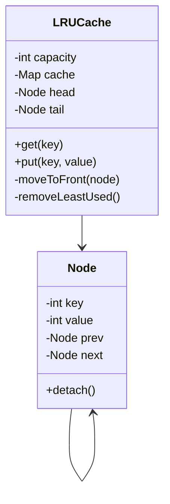

### 5. State Transitions
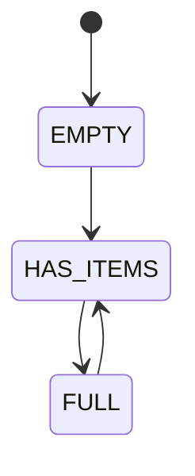

### 6. Core Flows
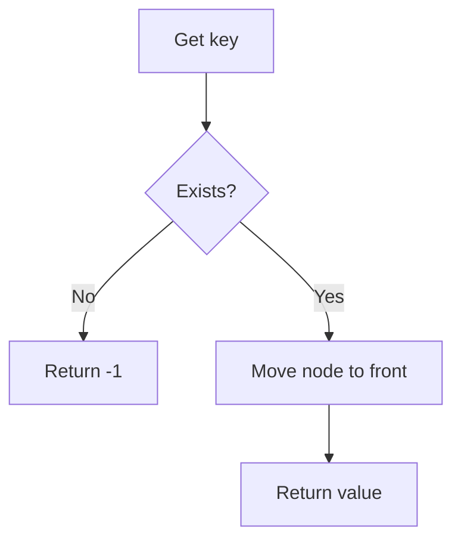

### 7. Design Patterns Used
- **HashMap + Doubly Linked List:** O(1) access and ordering.

### 8. Skeleton Code
```java
import java.util.*;

class LRUCache<K, V> {
    private class Node {
        K key;
        V value;
        Node prev, next;
        Node(K key, V value) { this.key = key; this.value = value; }
    }

    private final int capacity;
    private final Map<K, Node> map = new HashMap<>();
    private final Node head = new Node(null, null);
    private final Node tail = new Node(null, null);

    LRUCache(int capacity) {
        this.capacity = capacity;
        head.next = tail;
        tail.prev = head;
    }

    V get(K key) {
        Node node = map.get(key);
        if (node == null) return null;
        remove(node);
        addFirst(node);
        return node.value;
    }

    void put(K key, V value) {
        if (map.containsKey(key)) remove(map.get(key));
        Node node = new Node(key, value);
        addFirst(node);
        map.put(key, node);
        if (map.size() > capacity) {
            Node lru = tail.prev;
            remove(lru);
            map.remove(lru.key);
        }
    }

    private void addFirst(Node node) {
        node.next = head.next;
        node.prev = head;
        head.next.prev = node;
        head.next = node;
    }

    private void remove(Node node) {
        node.prev.next = node.next;
        node.next.prev = node.prev;
    }
}
```

### 9. Edge Cases
- Capacity zero.
- Updating existing key.
- Getting missing key.
- Repeated access changes eviction order.

---

## Design Search Autocomplete System

### 1. Requirements
- Store searchable words/sentences.
- Return top suggestions for prefix.
- Rank by frequency.
- Update frequency after search.

### 2. Core Use Cases
- Insert sentence.
- Type prefix.
- Get suggestions.

### 3. Entities + Responsibilities
| Entity | Responsibility |
|---|---|
| TrieNode | Children and sentence frequency |
| AutocompleteSystem | Insert and search |

### 4. Relationships
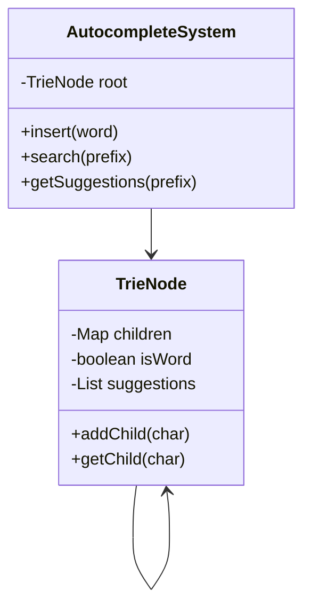

### 5. State Transitions
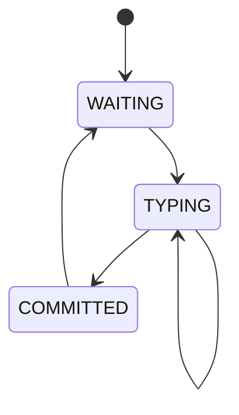

### 6. Core Flows
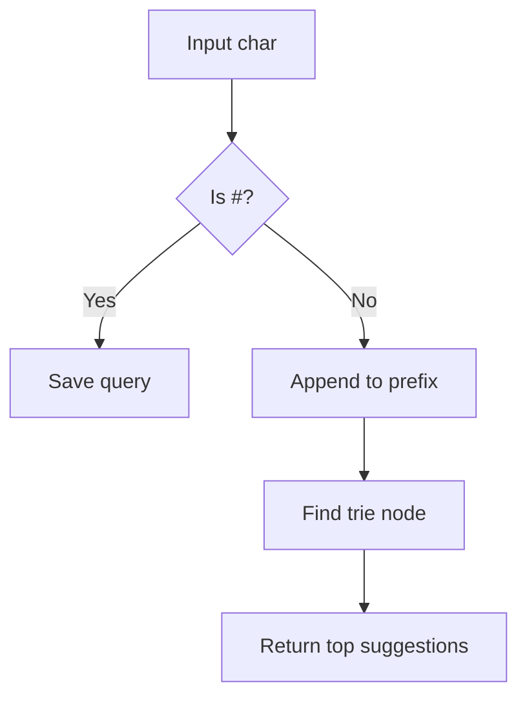

### 7. Design Patterns Used
- **Trie:** efficient prefix search.
- **Priority Queue:** rank top suggestions.

### 8. Skeleton Code
```java
import java.util.*;

class TrieNode {
    Map<Character, TrieNode> children = new HashMap<>();
    Map<String, Integer> counts = new HashMap<>();
}

class AutocompleteSystem {
    private final TrieNode root = new TrieNode();
    private StringBuilder current = new StringBuilder();

    void insert(String sentence, int count) {
        TrieNode node = root;
        for (char ch : sentence.toCharArray()) {
            node = node.children.computeIfAbsent(ch, c -> new TrieNode());
            node.counts.put(sentence, node.counts.getOrDefault(sentence, 0) + count);
        }
    }

    List<String> input(char ch) {
        if (ch == '#') {
            insert(current.toString(), 1);
            current.setLength(0);
            return List.of();
        }
        current.append(ch);
        TrieNode node = root;
        for (char c : current.toString().toCharArray()) {
            node = node.children.get(c);
            if (node == null) return List.of();
        }
        PriorityQueue<String> pq = new PriorityQueue<>((a, b) -> {
            int ca = node.counts.get(a), cb = node.counts.get(b);
            if (ca != cb) return ca - cb;
            return b.compareTo(a);
        });
        for (String s : node.counts.keySet()) {
            pq.offer(s);
            if (pq.size() > 3) pq.poll();
        }
        List<String> result = new ArrayList<>();
        while (!pq.isEmpty()) result.add(pq.poll());
        Collections.reverse(result);
        return result;
    }
}
```

### 9. Edge Cases
- Unknown prefix.
- Same frequency tie.
- Empty input.
- Case sensitivity.

---

# 🔄 Managing States

---

## Design ATM

### 1. Requirements
- Insert card.
- Authenticate PIN.
- Check balance.
- Withdraw cash.
- Deposit cash.
- Eject card.

### 2. Core Use Cases
- Authenticate user.
- Withdraw amount.
- Update account balance.

### 3. Entities + Responsibilities
| Entity | Responsibility |
|---|---|
| ATM | Context object |
| ATMState | State contract |
| Card | Card details |
| Account | Balance |
| BankService | Validation and account updates |
| CashDispenser | Dispenses cash |

### 4. Relationships
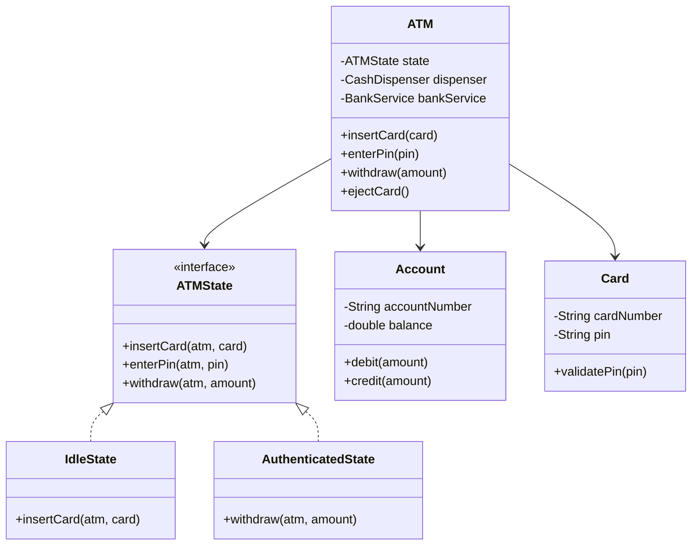

### 5. State Transitions
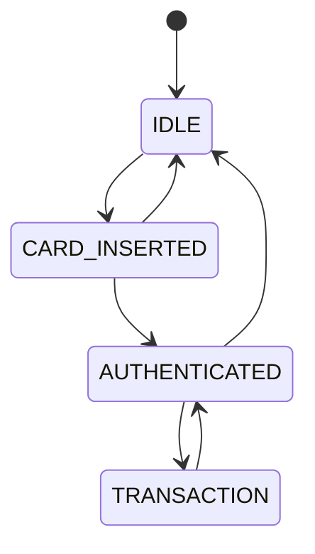

### 6. Core Flows
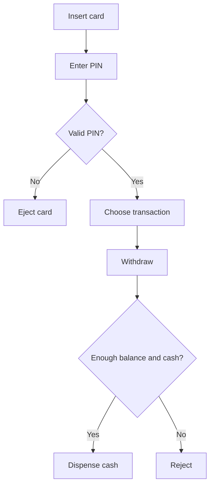

### 7. Design Patterns Used
- **State:** ATM behavior changes by state.
- **Facade:** ATM hides bank and dispenser internals.

### 8. Skeleton Code
```java
interface ATMState {
    void insertCard(ATM atm, Card card);
    void enterPin(ATM atm, String pin);
    void withdraw(ATM atm, double amount);
    void ejectCard(ATM atm);
}

class Card {
    final String number;
    final String pin;
    Card(String number, String pin) { this.number = number; this.pin = pin; }
}

class Account {
    private double balance;
    Account(double balance) { this.balance = balance; }
    boolean withdraw(double amount) {
        if (amount > balance) return false;
        balance -= amount;
        return true;
    }
    double getBalance() { return balance; }
}

class ATM {
    private ATMState state = new IdleState();
    Card currentCard;
    Account account = new Account(1000);
    void setState(ATMState state) { this.state = state; }
    void insertCard(Card card) { state.insertCard(this, card); }
    void enterPin(String pin) { state.enterPin(this, pin); }
    void withdraw(double amount) { state.withdraw(this, amount); }
    void ejectCard() { state.ejectCard(this); }
}

class IdleState implements ATMState {
    public void insertCard(ATM atm, Card card) { atm.currentCard = card; atm.setState(new CardInsertedState()); }
    public void enterPin(ATM atm, String pin) { throw new IllegalStateException("Insert card first"); }
    public void withdraw(ATM atm, double amount) { throw new IllegalStateException("Insert card first"); }
    public void ejectCard(ATM atm) { }
}

class CardInsertedState implements ATMState {
    public void insertCard(ATM atm, Card card) { throw new IllegalStateException("Card already inserted"); }
    public void enterPin(ATM atm, String pin) {
        if (atm.currentCard.pin.equals(pin)) atm.setState(new AuthenticatedState());
        else ejectCard(atm);
    }
    public void withdraw(ATM atm, double amount) { throw new IllegalStateException("Authenticate first"); }
    public void ejectCard(ATM atm) { atm.currentCard = null; atm.setState(new IdleState()); }
}

class AuthenticatedState implements ATMState {
    public void insertCard(ATM atm, Card card) { throw new IllegalStateException("Busy"); }
    public void enterPin(ATM atm, String pin) { }
    public void withdraw(ATM atm, double amount) {
        if (!atm.account.withdraw(amount)) throw new IllegalArgumentException("Insufficient balance");
    }
    public void ejectCard(ATM atm) { atm.currentCard = null; atm.setState(new IdleState()); }
}
```

### 9. Edge Cases
- Wrong PIN.
- Insufficient balance.
- ATM out of cash.
- Card removed mid-transaction.

---

## Design Elevator System

### 1. Requirements
- Multiple elevators.
- Users request pickup from floor.
- Users select destination.
- Elevator moves up/down/idle.
- Assign best elevator.

### 2. Core Use Cases
- External floor request.
- Internal destination request.
- Move elevator.
- Open/close door.

### 3. Entities + Responsibilities
| Entity | Responsibility |
|---|---|
| Elevator | Current floor, direction, requests |
| Request | Source/destination |
| Dispatcher | Assign elevator |
| ElevatorSystem | Facade |

### 4. Relationships
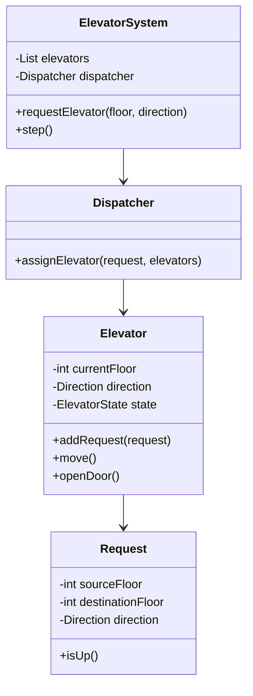

### 5. State Transitions
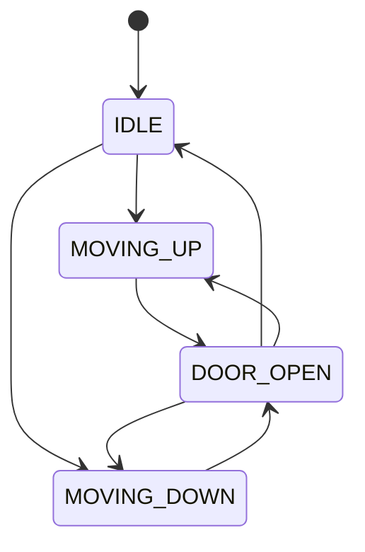

### 6. Core Flows
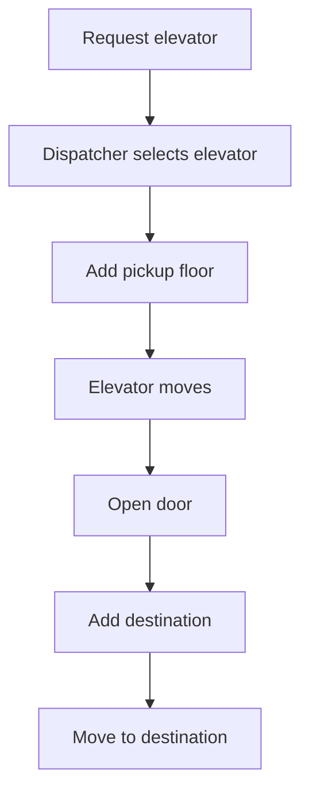

### 7. Design Patterns Used
- **Strategy:** elevator assignment algorithm.
- **State:** direction and door state.

### 8. Skeleton Code
```java
import java.util.*;

enum Direction { UP, DOWN, IDLE }
enum ElevatorState { IDLE, MOVING, DOOR_OPEN }

class Request {
    final int floor;
    Request(int floor) { this.floor = floor; }
}

class Elevator {
    final int id;
    int currentFloor = 0;
    Direction direction = Direction.IDLE;
    ElevatorState state = ElevatorState.IDLE;
    Queue<Request> requests = new LinkedList<>();

    Elevator(int id) { this.id = id; }
    void addRequest(Request request) { requests.offer(request); }
    void step() {
        if (requests.isEmpty()) { direction = Direction.IDLE; state = ElevatorState.IDLE; return; }
        Request target = requests.peek();
        if (currentFloor < target.floor) { currentFloor++; direction = Direction.UP; state = ElevatorState.MOVING; }
        else if (currentFloor > target.floor) { currentFloor--; direction = Direction.DOWN; state = ElevatorState.MOVING; }
        else { requests.poll(); state = ElevatorState.DOOR_OPEN; }
    }
}

interface DispatchStrategy {
    Elevator select(List<Elevator> elevators, int floor);
}

class NearestElevatorStrategy implements DispatchStrategy {
    public Elevator select(List<Elevator> elevators, int floor) {
        return elevators.stream()
            .min(Comparator.comparingInt(e -> Math.abs(e.currentFloor - floor)))
            .orElseThrow();
    }
}

class ElevatorSystem {
    private final List<Elevator> elevators = new ArrayList<>();
    private final DispatchStrategy strategy = new NearestElevatorStrategy();
    ElevatorSystem(int count) {
        for (int i = 1; i <= count; i++) elevators.add(new Elevator(i));
    }
    void requestElevator(int floor) {
        Elevator elevator = strategy.select(elevators, floor);
        elevator.addRequest(new Request(floor));
    }
}
```

### 9. Edge Cases
- Multiple requests same floor.
- Elevator overloaded.
- Emergency stop.
- Direction optimization.

---

# 🏢 Management Systems

---

## Design Parking Lot

### 1. Requirements
- Multiple floors.
- Multiple spot sizes.
- Vehicles: bike, car, truck.
- Auto assign compatible spot.
- Issue ticket.
- Calculate fee on exit.

### 2. Core Use Cases
- Park vehicle.
- Unpark vehicle.
- Display availability.
- Calculate fee.

### 3. Entities + Responsibilities
| Entity | Responsibility |
|---|---|
| Vehicle | Base vehicle data |
| ParkingSpot | Holds vehicle |
| ParkingFloor | Collection of spots |
| ParkingTicket | Entry data |
| ParkingLot | Main facade |
| FeeStrategy | Calculates fee |
| AllocationStrategy | Chooses spot |

### 4. Relationships
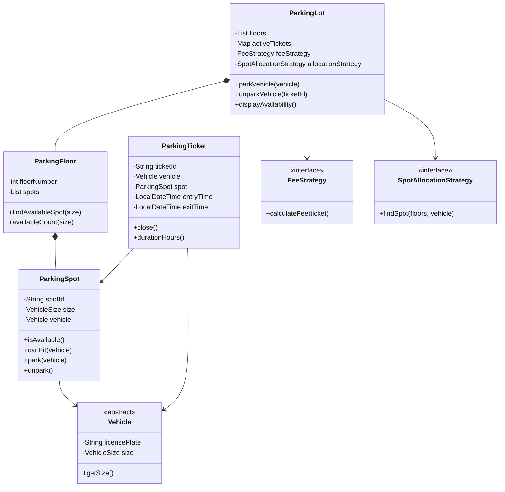

### 5. State Transitions
```mermaid
stateDiagram-v2
  [*] --> AVAILABLE
  AVAILABLE --> OCCUPIED
  OCCUPIED --> AVAILABLE
```

### 6. Core Flows
```mermaid
flowchart TD
  A[Vehicle enters] --> B[Find compatible spot]
  B --> C{Spot found?}
  C -- No --> D[Reject]
  C -- Yes --> E[Park vehicle]
  E --> F[Issue ticket]
  F --> G[Vehicle exits]
  G --> H[Calculate fee]
  H --> I[Free spot]
```

### 7. Design Patterns Used
- **Strategy:** fee and allocation logic.
- **Singleton:** one parking lot instance.
- **Facade:** ParkingLot hides floors and spots.

### 8. Skeleton Code
```java
import java.time.*;
import java.util.*;
import java.util.concurrent.*;

enum VehicleSize { SMALL, MEDIUM, LARGE }

abstract class Vehicle {
    private final String plate;
    private final VehicleSize size;
    Vehicle(String plate, VehicleSize size) { this.plate = plate; this.size = size; }
    String getPlate() { return plate; }
    VehicleSize getSize() { return size; }
}
class Bike extends Vehicle { Bike(String p) { super(p, VehicleSize.SMALL); } }
class Car extends Vehicle { Car(String p) { super(p, VehicleSize.MEDIUM); } }
class Truck extends Vehicle { Truck(String p) { super(p, VehicleSize.LARGE); } }

class ParkingSpot {
    final String id;
    final VehicleSize size;
    private Vehicle vehicle;
    ParkingSpot(String id, VehicleSize size) { this.id = id; this.size = size; }
    synchronized boolean isAvailable() { return vehicle == null; }
    boolean canFit(Vehicle v) { return size.ordinal() >= v.getSize().ordinal(); }
    synchronized void park(Vehicle v) {
        if (!isAvailable() || !canFit(v)) throw new IllegalStateException("Invalid spot");
        vehicle = v;
    }
    synchronized void unpark() { vehicle = null; }
}

class ParkingFloor {
    final int floor;
    final List<ParkingSpot> spots = new ArrayList<>();
    ParkingFloor(int floor) { this.floor = floor; }
    void addSpot(ParkingSpot spot) { spots.add(spot); }
}

class ParkingTicket {
    final String id;
    final Vehicle vehicle;
    final ParkingSpot spot;
    final LocalDateTime entryTime = LocalDateTime.now();
    LocalDateTime exitTime;
    ParkingTicket(String id, Vehicle vehicle, ParkingSpot spot) {
        this.id = id; this.vehicle = vehicle; this.spot = spot;
    }
}

interface FeeStrategy { double calculate(ParkingTicket ticket); }
class HourlyFeeStrategy implements FeeStrategy {
    public double calculate(ParkingTicket ticket) {
        ticket.exitTime = LocalDateTime.now();
        long hours = Math.max(1, Duration.between(ticket.entryTime, ticket.exitTime).toHours());
        return hours * 5.0;
    }
}

interface AllocationStrategy { ParkingSpot findSpot(List<ParkingFloor> floors, Vehicle vehicle); }
class FirstAvailableStrategy implements AllocationStrategy {
    public ParkingSpot findSpot(List<ParkingFloor> floors, Vehicle vehicle) {
        for (ParkingFloor floor : floors)
            for (ParkingSpot spot : floor.spots)
                if (spot.isAvailable() && spot.canFit(vehicle)) return spot;
        return null;
    }
}

class ParkingLot {
    private final List<ParkingFloor> floors = new ArrayList<>();
    private final Map<String, ParkingTicket> activeTickets = new ConcurrentHashMap<>();
    private final FeeStrategy feeStrategy = new HourlyFeeStrategy();
    private final AllocationStrategy allocationStrategy = new FirstAvailableStrategy();

    void addFloor(ParkingFloor floor) { floors.add(floor); }
    ParkingTicket park(Vehicle vehicle) {
        ParkingSpot spot = allocationStrategy.findSpot(floors, vehicle);
        if (spot == null) throw new IllegalStateException("No spot available");
        spot.park(vehicle);
        ParkingTicket ticket = new ParkingTicket(UUID.randomUUID().toString(), vehicle, spot);
        activeTickets.put(ticket.id, ticket);
        return ticket;
    }
    double unpark(String ticketId) {
        ParkingTicket ticket = activeTickets.remove(ticketId);
        if (ticket == null) throw new IllegalArgumentException("Invalid ticket");
        double fee = feeStrategy.calculate(ticket);
        ticket.spot.unpark();
        return fee;
    }
}
```

### 9. Edge Cases
- No compatible spot.
- Duplicate vehicle entry.
- Invalid ticket.
- Concurrent parking into same spot.

---

## Design Inventory Management System

### 1. Requirements
- Add products.
- Track stock by warehouse/location.
- Reserve stock.
- Release stock.
- Update quantity.

### 2. Core Use Cases
- Add inventory.
- Place order reservation.
- Deduct stock.
- Check low stock.

### 3. Entities + Responsibilities
| Entity | Responsibility |
|---|---|
| Product | Product metadata |
| InventoryItem | Product quantity |
| Warehouse | Holds inventory |
| InventoryService | Core operations |

### 4. Relationships
```mermaid
classDiagram
  class InventoryService {
    -List warehouses
    +addStock(product, qty)
    +reserve(product, qty)
    +release(product, qty)
    +checkAvailability(product)
  }
  class Warehouse {
    -String id
    -Map items
    +addItem(item)
    +getItem(productId)
  }
  class InventoryItem {
    -Product product
    -int availableQty
    -int reservedQty
    +reserve(qty)
    +release(qty)
    +sell(qty)
  }
  class Product {
    -String id
    -String name
    +getId()
  }
  InventoryService --> Warehouse
  Warehouse *-- InventoryItem
  InventoryItem --> Product
```

### 5. State Transitions
```mermaid
stateDiagram-v2
  [*] --> AVAILABLE
  AVAILABLE --> RESERVED
  RESERVED --> SOLD
  RESERVED --> AVAILABLE
```

### 6. Core Flows
```mermaid
flowchart TD
  A[Order request] --> B{Enough stock?}
  B -- No --> C[Reject]
  B -- Yes --> D[Reserve stock]
  D --> E{Payment success?}
  E -- Yes --> F[Deduct stock]
  E -- No --> G[Release stock]
```

### 7. Design Patterns Used
- **Repository:** product/inventory storage abstraction.
- **Service Layer:** inventory operations.

### 8. Skeleton Code
```java
import java.util.*;

class Product {
    final String sku;
    final String name;
    Product(String sku, String name) { this.sku = sku; this.name = name; }
}

class InventoryItem {
    final Product product;
    private int available;
    private int reserved;
    InventoryItem(Product product, int quantity) { this.product = product; this.available = quantity; }
    synchronized boolean reserve(int qty) {
        if (qty > available) return false;
        available -= qty;
        reserved += qty;
        return true;
    }
    synchronized void release(int qty) { reserved -= qty; available += qty; }
    synchronized void confirmSale(int qty) { reserved -= qty; }
    int getAvailable() { return available; }
}

class Warehouse {
    final String id;
    private final Map<String, InventoryItem> items = new HashMap<>();
    Warehouse(String id) { this.id = id; }
    void addProduct(Product product, int quantity) { items.put(product.sku, new InventoryItem(product, quantity)); }
    InventoryItem getItem(String sku) { return items.get(sku); }
}

class InventoryService {
    private final List<Warehouse> warehouses = new ArrayList<>();
    void addWarehouse(Warehouse w) { warehouses.add(w); }
    boolean reserve(String sku, int qty) {
        for (Warehouse w : warehouses) {
            InventoryItem item = w.getItem(sku);
            if (item != null && item.reserve(qty)) return true;
        }
        return false;
    }
}
```

### 9. Edge Cases
- Negative quantity.
- Concurrent reservation.
- Product not found.
- Partial fulfillment.

---

# 🌐 Social & Content Platforms

---

## Design a Social Network

### 1. Requirements
- Users can post content.
- Users can follow others.
- Users can like/comment.
- Users can see feed.

### 2. Core Use Cases
- Create post.
- Follow user.
- Generate feed.
- Like/comment.

### 3. Entities + Responsibilities
| Entity | Responsibility |
|---|---|
| User | Profile and follows |
| Post | Content |
| Comment | Replies |
| FeedService | Builds feed |

### 4. Relationships
```mermaid
classDiagram
  class SocialNetworkService {
    -Map users
    -FeedService feedService
    +createUser(name)
    +createPost(user, text)
    +follow(user, target)
    +getFeed(user)
  }
  class User {
    -String id
    -String name
    -Set friends
    +follow(user)
    +unfollow(user)
  }
  class Post {
    -String id
    -User author
    -String content
    +like(user)
    +addComment(comment)
  }
  class Comment {
    -User author
    -String text
    +edit(text)
  }
  class FeedService {
    +generateFeed(user)
  }
  SocialNetworkService --> User
  SocialNetworkService --> FeedService
  User --> Post
  Post --> Comment
```

### 5. State Transitions
```mermaid
stateDiagram-v2
  [*] --> DRAFT
  DRAFT --> PUBLISHED
  PUBLISHED --> DELETED
```

### 6. Core Flows
```mermaid
flowchart TD
  A[User opens feed] --> B[Get followed users]
  B --> C[Fetch recent posts]
  C --> D[Sort by time]
  D --> E[Return feed]
```

### 7. Design Patterns Used
- **Observer:** notify followers.
- **Strategy:** feed ranking.
- **Repository:** data access.

### 8. Skeleton Code
```java
import java.time.*;
import java.util.*;

class User {
    final String id;
    final String name;
    final Set<String> following = new HashSet<>();
    User(String id, String name) { this.id = id; this.name = name; }
    void follow(User user) { following.add(user.id); }
}

class Post {
    final String id;
    final String authorId;
    final String content;
    final LocalDateTime createdAt = LocalDateTime.now();
    final Set<String> likes = new HashSet<>();
    Post(String id, String authorId, String content) {
        this.id = id; this.authorId = authorId; this.content = content;
    }
    void like(String userId) { likes.add(userId); }
}

class SocialNetworkService {
    private final Map<String, User> users = new HashMap<>();
    private final List<Post> posts = new ArrayList<>();
    User createUser(String id, String name) { User u = new User(id, name); users.put(id, u); return u; }
    Post createPost(String userId, String content) {
        Post p = new Post(UUID.randomUUID().toString(), userId, content);
        posts.add(p);
        return p;
    }
    List<Post> getFeed(String userId) {
        User user = users.get(userId);
        return posts.stream()
            .filter(p -> user.following.contains(p.authorId) || p.authorId.equals(userId))
            .sorted((a, b) -> b.createdAt.compareTo(a.createdAt))
            .toList();
    }
}
```

### 9. Edge Cases
- User follows self.
- Duplicate likes.
- Deleted posts.
- Large-scale feed generation.

---

## Design Spotify

### 1. Requirements
- Users can search songs.
- Users can create playlists.
- Play, pause, next, previous.
- Support queue.

### 2. Core Use Cases
- Search song.
- Add to playlist.
- Play song.
- Manage queue.

### 3. Entities + Responsibilities
| Entity | Responsibility |
|---|---|
| Song | Metadata |
| Playlist | Collection of songs |
| Player | Playback state |
| Queue | Next songs |
| MusicService | Facade |

### 4. Relationships
```mermaid
classDiagram
  class MusicService {
    -Map songs
    -Map playlists
    +searchSong(query)
    +createPlaylist(user)
    +play(song)
  }
  class Song {
    -String id
    -String title
    -String artist
    +getMetadata()
  }
  class Playlist {
    -String id
    -List songs
    +addSong(song)
    +removeSong(song)
  }
  class Player {
    -PlayQueue queue
    -PlayerState state
    +play()
    +pause()
    +next()
  }
  class PlayQueue {
    -Queue songs
    +enqueue(song)
    +next()
  }
  MusicService --> Song
  MusicService --> Playlist
  MusicService --> Player
  Player --> PlayQueue
  Playlist --> Song
```

### 5. State Transitions
```mermaid
stateDiagram-v2
  [*] --> STOPPED
  STOPPED --> PLAYING
  PLAYING --> PAUSED
  PAUSED --> PLAYING
  PLAYING --> STOPPED
```

### 6. Core Flows
```mermaid
flowchart TD
  A[Select song] --> B[Add to queue]
  B --> C[Play]
  C --> D{Next clicked?}
  D -- Yes --> E[Play next song]
  D -- No --> C
```

### 7. Design Patterns Used
- **State:** player state.
- **Iterator:** playlist traversal.
- **Facade:** music service.

### 8. Skeleton Code
```java
import java.util.*;

enum PlayerState { STOPPED, PLAYING, PAUSED }

class Song {
    final String id, title, artist;
    Song(String id, String title, String artist) { this.id = id; this.title = title; this.artist = artist; }
}

class Playlist {
    final String name;
    final List<Song> songs = new ArrayList<>();
    Playlist(String name) { this.name = name; }
    void addSong(Song song) { songs.add(song); }
}

class MusicPlayer {
    private final Queue<Song> queue = new LinkedList<>();
    private Song current;
    private PlayerState state = PlayerState.STOPPED;
    void addToQueue(Song song) { queue.offer(song); }
    void play() {
        if (current == null) current = queue.poll();
        if (current != null) state = PlayerState.PLAYING;
    }
    void pause() { if (state == PlayerState.PLAYING) state = PlayerState.PAUSED; }
    void next() { current = queue.poll(); state = current == null ? PlayerState.STOPPED : PlayerState.PLAYING; }
}

class MusicService {
    private final Map<String, Song> songs = new HashMap<>();
    private final MusicPlayer player = new MusicPlayer();
    void addSong(Song song) { songs.put(song.id, song); }
    List<Song> search(String keyword) {
        return songs.values().stream()
            .filter(s -> s.title.contains(keyword) || s.artist.contains(keyword))
            .toList();
    }
    void playSong(String songId) { player.addToQueue(songs.get(songId)); player.play(); }
}
```

### 9. Edge Cases
- Empty queue.
- Song unavailable.
- Duplicate playlist songs.
- Offline playback.

---

# 💬 Communication & Messaging

---

## Design Pub Sub System

### 1. Requirements
- Publishers publish messages to topics.
- Subscribers subscribe to topics.
- Messages delivered to subscribers.
- Support multiple topics.

### 2. Core Use Cases
- Create topic.
- Subscribe.
- Publish.
- Consume message.

### 3. Entities + Responsibilities
| Entity | Responsibility |
|---|---|
| Topic | Holds subscribers |
| Message | Payload |
| Publisher | Sends message |
| Subscriber | Receives message |
| Broker | Coordinates topics |

### 4. Relationships
```mermaid
classDiagram
  class Broker {
    -Map topics
    +createTopic(name)
    +publish(topic, message)
    +subscribe(topic, subscriber)
  }
  class Topic {
    -String name
    -List subscribers
    -Queue messages
    +addSubscriber(subscriber)
    +publish(message)
  }
  class Subscriber {
    -String id
    +consume(message)
  }
  class Message {
    -String id
    -String payload
    +getPayload()
  }
  Broker --> Topic
  Topic --> Subscriber
  Topic --> Message
```

### 5. State Transitions
```mermaid
stateDiagram-v2
  [*] --> CREATED
  CREATED --> PUBLISHED
  PUBLISHED --> DELIVERED
```

### 6. Core Flows
```mermaid
flowchart TD
  A[Publisher sends message] --> B[Broker finds topic]
  B --> C[Topic gets subscribers]
  C --> D[Deliver message]
```

### 7. Design Patterns Used
- **Observer:** subscribers observe topic.
- **Broker:** central mediator.

### 8. Skeleton Code
```java
import java.util.*;

class Message {
    final String payload;
    Message(String payload) { this.payload = payload; }
}

interface Subscriber {
    void onMessage(Message message);
}

class Topic {
    final String name;
    private final List<Subscriber> subscribers = new ArrayList<>();
    Topic(String name) { this.name = name; }
    void subscribe(Subscriber subscriber) { subscribers.add(subscriber); }
    void publish(Message message) {
        for (Subscriber s : subscribers) s.onMessage(message);
    }
}

class Broker {
    private final Map<String, Topic> topics = new HashMap<>();
    Topic createTopic(String name) { return topics.computeIfAbsent(name, Topic::new); }
    void subscribe(String topic, Subscriber subscriber) { createTopic(topic).subscribe(subscriber); }
    void publish(String topic, String payload) { createTopic(topic).publish(new Message(payload)); }
}
```

### 9. Edge Cases
- No subscribers.
- Subscriber failure.
- Message ordering.
- Duplicate delivery.

---

## Design Chat Application

### 1. Requirements
- One-to-one chat.
- Group chat.
- Send and receive messages.
- Show message history.
- Support online/offline users.

### 2. Core Use Cases
- Send message.
- Create group.
- Add member.
- Read conversation.

### 3. Entities + Responsibilities
| Entity | Responsibility |
|---|---|
| User | Sender/receiver |
| Message | Text and timestamp |
| Conversation | Message history |
| ChatService | Core operations |

### 4. Relationships
```mermaid
classDiagram
  class ChatService {
    -Map users
    -Map conversations
    +sendMessage(conversation, sender, text)
    +createConversation(users)
    +markRead(message)
  }
  class User {
    -String id
    -String name
    +goOnline()
    +goOffline()
  }
  class Conversation {
    -String id
    -List members
    -List messages
    +addMessage(message)
  }
  class Message {
    -String id
    -User sender
    -String text
    -MessageStatus status
    +markDelivered()
    +markRead()
  }
  ChatService --> User
  ChatService --> Conversation
  Conversation --> Message
  Conversation --> User
```

### 5. State Transitions
```mermaid
stateDiagram-v2
  [*] --> SENT
  SENT --> DELIVERED
  DELIVERED --> READ
```

### 6. Core Flows
```mermaid
flowchart TD
  A[User sends message] --> B[Find conversation]
  B --> C[Save message]
  C --> D{Receiver online?}
  D -- Yes --> E[Push message]
  D -- No --> F[Store for later]
```

### 7. Design Patterns Used
- **Observer:** online message delivery.
- **Repository:** message persistence.

### 8. Skeleton Code
```java
import java.time.*;
import java.util.*;

enum MessageStatus { SENT, DELIVERED, READ }

class ChatUser {
    final String id, name;
    boolean online;
    ChatUser(String id, String name) { this.id = id; this.name = name; }
}

class ChatMessage {
    final String senderId;
    final String text;
    final LocalDateTime time = LocalDateTime.now();
    MessageStatus status = MessageStatus.SENT;
    ChatMessage(String senderId, String text) { this.senderId = senderId; this.text = text; }
}

class Conversation {
    final String id;
    final Set<String> members = new HashSet<>();
    final List<ChatMessage> messages = new ArrayList<>();
    Conversation(String id, Collection<String> members) { this.id = id; this.members.addAll(members); }
    void addMessage(ChatMessage message) { messages.add(message); }
}

class ChatService {
    private final Map<String, Conversation> conversations = new HashMap<>();
    Conversation createConversation(String id, Collection<String> members) {
        Conversation c = new Conversation(id, members);
        conversations.put(id, c);
        return c;
    }
    void sendMessage(String conversationId, String senderId, String text) {
        Conversation c = conversations.get(conversationId);
        if (c == null || !c.members.contains(senderId)) throw new IllegalArgumentException("Invalid conversation");
        c.addMessage(new ChatMessage(senderId, text));
    }
}
```

### 9. Edge Cases
- User not in group.
- Deleted message.
- Offline delivery.
- Duplicate message retry.

---

# 💰 Financial & Payment Systems

---

## Design Payment Gateway

### 1. Requirements
- Initiate payment.
- Route to payment provider.
- Track payment status.
- Handle callback/webhook.
- Refund payment.

### 2. Core Use Cases
- Create payment.
- Process payment.
- Update status.
- Refund.

### 3. Entities + Responsibilities
| Entity | Responsibility |
|---|---|
| Payment | Payment data |
| PaymentMethod | Card/UPI/wallet |
| PaymentProcessor | Provider contract |
| PaymentGateway | Main facade |

### 4. Relationships
```mermaid
classDiagram
  class PaymentGateway {
    -PaymentProcessor processor
    -Map payments
    +initiatePayment(request)
    +processPayment(paymentId)
    +refund(paymentId)
  }
  class Payment {
    -String id
    -double amount
    -PaymentStatus status
    -PaymentMethod method
    +markSuccess()
    +markFailed()
  }
  class PaymentProcessor {
    <<interface>>
    +charge(payment)
    +refund(payment)
  }
  class StripeProcessor {
    +charge(payment)
    +refund(payment)
  }
  class PaymentMethod {
    -String type
    -String token
    +isValid()
  }
  PaymentGateway --> Payment
  PaymentGateway --> PaymentProcessor
  PaymentProcessor <|.. StripeProcessor
  Payment --> PaymentMethod
```

### 5. State Transitions
```mermaid
stateDiagram-v2
  [*] --> INITIATED
  INITIATED --> PROCESSING
  PROCESSING --> SUCCESS
  PROCESSING --> FAILED
  SUCCESS --> REFUNDED
```

### 6. Core Flows
```mermaid
flowchart TD
  A[Create payment] --> B[Select processor]
  B --> C[Call provider]
  C --> D{Success?}
  D -- Yes --> E[Mark success]
  D -- No --> F[Mark failed]
```

### 7. Design Patterns Used
- **Strategy:** provider-specific processors.
- **State:** payment status.
- **Facade:** PaymentGateway.

### 8. Skeleton Code
```java
import java.util.*;

enum PaymentStatus { INITIATED, PROCESSING, SUCCESS, FAILED, REFUNDED }

class PaymentMethod {
    final String type;
    final String token;
    PaymentMethod(String type, String token) { this.type = type; this.token = token; }
}

class Payment {
    final String id;
    final double amount;
    final PaymentMethod method;
    PaymentStatus status = PaymentStatus.INITIATED;
    Payment(String id, double amount, PaymentMethod method) {
        this.id = id; this.amount = amount; this.method = method;
    }
}

interface PaymentProcessor {
    boolean process(Payment payment);
    boolean refund(Payment payment);
}

class MockCardProcessor implements PaymentProcessor {
    public boolean process(Payment payment) { return payment.amount > 0; }
    public boolean refund(Payment payment) { return payment.status == PaymentStatus.SUCCESS; }
}

class PaymentGateway {
    private final Map<String, Payment> payments = new HashMap<>();
    private final PaymentProcessor processor = new MockCardProcessor();
    Payment pay(double amount, PaymentMethod method) {
        Payment payment = new Payment(UUID.randomUUID().toString(), amount, method);
        payments.put(payment.id, payment);
        payment.status = PaymentStatus.PROCESSING;
        payment.status = processor.process(payment) ? PaymentStatus.SUCCESS : PaymentStatus.FAILED;
        return payment;
    }
    boolean refund(String paymentId) {
        Payment payment = payments.get(paymentId);
        if (payment == null) return false;
        if (processor.refund(payment)) { payment.status = PaymentStatus.REFUNDED; return true; }
        return false;
    }
}
```

### 9. Edge Cases
- Duplicate payment request.
- Provider timeout.
- Webhook retry.
- Partial refund.

---

## Design Splitwise

### 1. Requirements
- Users create groups.
- Add expenses.
- Split equally or unequally.
- Track balances.
- Settle debts.

### 2. Core Use Cases
- Add expense.
- Calculate balances.
- Show who owes whom.
- Settle payment.

### 3. Entities + Responsibilities
| Entity | Responsibility |
|---|---|
| User | Member |
| Group | Users and expenses |
| Expense | Amount and split |
| SplitStrategy | Split calculation |
| BalanceSheet | Owe/lent tracking |

### 4. Relationships
```mermaid
classDiagram
  class SplitwiseService {
    -Map users
    -Map groups
    +addExpense(group, expense)
    +settleUp(payer, payee)
    +getBalances(user)
  }
  class Group {
    -String id
    -List users
    -List expenses
    +addMember(user)
    +addExpense(expense)
  }
  class User {
    -String id
    -String name
    +getBalance()
  }
  class Expense {
    -User paidBy
    -double amount
    -SplitStrategy strategy
    +calculateSplits()
  }
  class SplitStrategy {
    <<interface>>
    +split(amount, users)
  }
  SplitwiseService --> Group
  Group --> User
  Group --> Expense
  Expense --> SplitStrategy
```

### 5. State Transitions
```mermaid
stateDiagram-v2
  [*] --> CREATED
  CREATED --> SETTLED
```

### 6. Core Flows
```mermaid
flowchart TD
  A[Add expense] --> B[Calculate splits]
  B --> C[Update payer balance]
  C --> D[Update borrower balances]
  D --> E[Show balances]
```

### 7. Design Patterns Used
- **Strategy:** equal, exact, percentage split.
- **Service Layer:** expense orchestration.

### 8. Skeleton Code
```java
import java.util.*;

class SplitUser {
    final String id, name;
    SplitUser(String id, String name) { this.id = id; this.name = name; }
}

interface SplitStrategy {
    Map<String, Double> split(double amount, List<SplitUser> users);
}

class EqualSplitStrategy implements SplitStrategy {
    public Map<String, Double> split(double amount, List<SplitUser> users) {
        Map<String, Double> result = new HashMap<>();
        double share = amount / users.size();
        for (SplitUser u : users) result.put(u.id, share);
        return result;
    }
}

class Expense {
    final String paidBy;
    final double amount;
    final Map<String, Double> shares;
    Expense(String paidBy, double amount, Map<String, Double> shares) {
        this.paidBy = paidBy; this.amount = amount; this.shares = shares;
    }
}

class SplitwiseService {
    private final Map<String, Map<String, Double>> balances = new HashMap<>();
    void addExpense(String paidBy, double amount, List<SplitUser> users, SplitStrategy strategy) {
        Map<String, Double> shares = strategy.split(amount, users);
        for (Map.Entry<String, Double> e : shares.entrySet()) {
            String owedBy = e.getKey();
            if (owedBy.equals(paidBy)) continue;
            balances.computeIfAbsent(owedBy, k -> new HashMap<>())
                    .merge(paidBy, e.getValue(), Double::sum);
        }
    }
    Map<String, Map<String, Double>> getBalances() { return balances; }
}
```

### 9. Edge Cases
- Unequal split sum mismatch.
- Decimal rounding.
- User not in group.
- Settlement simplification.

---

# 🛒 E-commerce & Booking Systems

---

## Design Amazon

### 1. Requirements
- Search products.
- Add to cart.
- Place order.
- Make payment.
- Track order status.

### 2. Core Use Cases
- Browse product.
- Add item to cart.
- Checkout.
- Pay.
- Ship order.

### 3. Entities + Responsibilities
| Entity | Responsibility |
|---|---|
| Product | Catalog item |
| Cart | Selected items |
| Order | Purchase record |
| Payment | Payment status |
| Inventory | Stock tracking |

### 4. Relationships
```mermaid
classDiagram
  class EcommerceService {
    -Catalog catalog
    -Inventory inventory
    -OrderService orderService
    +searchProducts(query)
    +addToCart(user, product)
    +checkout(cart)
  }
  class Product {
    -String id
    -String name
    -double price
    +getPrice()
  }
  class Cart {
    -User user
    -List items
    +addItem(product, qty)
    +removeItem(product)
    +total()
  }
  class Order {
    -String id
    -OrderStatus status
    -Payment payment
    +place()
    +cancel()
  }
  class Payment {
    -String id
    -double amount
    +pay()
  }
  class Inventory {
    -Map stock
    +reserve(product, qty)
    +release(product, qty)
  }
  EcommerceService --> Product
  EcommerceService --> Cart
  EcommerceService --> Order
  Order --> Payment
  EcommerceService --> Inventory
```

### 5. State Transitions
```mermaid
stateDiagram-v2
  [*] --> CREATED
  CREATED --> PAID
  PAID --> SHIPPED
  SHIPPED --> DELIVERED
  CREATED --> CANCELLED
```

### 6. Core Flows
```mermaid
flowchart TD
  A[Checkout cart] --> B[Reserve inventory]
  B --> C[Create order]
  C --> D[Take payment]
  D --> E{Payment success?}
  E -- Yes --> F[Confirm order]
  E -- No --> G[Release inventory]
```

### 7. Design Patterns Used
- **State:** order lifecycle.
- **Strategy:** payment/shipping options.
- **Facade:** ecommerce service.

### 8. Skeleton Code
```java
import java.util.*;

enum OrderStatus { CREATED, PAID, SHIPPED, DELIVERED, CANCELLED }

class ProductItem {
    final String sku, name;
    final double price;
    ProductItem(String sku, String name, double price) { this.sku = sku; this.name = name; this.price = price; }
}

class Cart {
    final Map<ProductItem, Integer> items = new HashMap<>();
    void add(ProductItem product, int qty) { items.merge(product, qty, Integer::sum); }
    double total() { return items.entrySet().stream().mapToDouble(e -> e.getKey().price * e.getValue()).sum(); }
}

class Order {
    final String id;
    final Map<ProductItem, Integer> items;
    OrderStatus status = OrderStatus.CREATED;
    Order(String id, Map<ProductItem, Integer> items) { this.id = id; this.items = new HashMap<>(items); }
}

class Inventory {
    private final Map<String, Integer> stock = new HashMap<>();
    void addStock(String sku, int qty) { stock.merge(sku, qty, Integer::sum); }
    boolean reserve(ProductItem product, int qty) {
        int available = stock.getOrDefault(product.sku, 0);
        if (available < qty) return false;
        stock.put(product.sku, available - qty);
        return true;
    }
}

class EcommerceService {
    private final Inventory inventory = new Inventory();
    Order checkout(Cart cart) {
        for (Map.Entry<ProductItem, Integer> e : cart.items.entrySet())
            if (!inventory.reserve(e.getKey(), e.getValue())) throw new IllegalStateException("Out of stock");
        Order order = new Order(UUID.randomUUID().toString(), cart.items);
        order.status = OrderStatus.PAID;
        return order;
    }
}
```

### 9. Edge Cases
- Out of stock.
- Payment failure.
- Price changed during checkout.
- Duplicate order retry.

---

## Design Ride Hailing Service

### 1. Requirements
- Riders request rides.
- Drivers accept rides.
- Match nearby driver.
- Track ride status.
- Calculate fare.

### 2. Core Use Cases
- Request ride.
- Match driver.
- Start ride.
- End ride.
- Pay fare.

### 3. Entities + Responsibilities
| Entity | Responsibility |
|---|---|
| Rider | Customer |
| Driver | Available driver |
| Ride | Trip data |
| MatchingStrategy | Finds driver |
| FareStrategy | Calculates price |

### 4. Relationships
```mermaid
classDiagram
  class RideService {
    -MatchingStrategy matchingStrategy
    -FareStrategy fareStrategy
    -Map rides
    +requestRide(rider, pickup, drop)
    +acceptRide(driver, ride)
    +completeRide(ride)
  }
  class Rider {
    -String id
    -String name
    +requestRide()
  }
  class Driver {
    -String id
    -Location location
    -boolean available
    +acceptRide(ride)
  }
  class Ride {
    -Rider rider
    -Driver driver
    -RideStatus status
    +start()
    +complete()
    +cancel()
  }
  class MatchingStrategy {
    <<interface>>
    +findDriver(rider, drivers)
  }
  class FareStrategy {
    <<interface>>
    +calculateFare(ride)
  }
  RideService --> Rider
  RideService --> Driver
  RideService --> Ride
  RideService --> MatchingStrategy
  RideService --> FareStrategy
```

### 5. State Transitions
```mermaid
stateDiagram-v2
  [*] --> REQUESTED
  REQUESTED --> ACCEPTED
  ACCEPTED --> STARTED
  STARTED --> COMPLETED
  REQUESTED --> CANCELLED
```

### 6. Core Flows
```mermaid
flowchart TD
  A[Rider requests ride] --> B[Find nearby driver]
  B --> C{Driver found?}
  C -- No --> D[Reject request]
  C -- Yes --> E[Create ride]
  E --> F[Driver accepts]
  F --> G[Start ride]
  G --> H[End ride and calculate fare]
```

### 7. Design Patterns Used
- **Strategy:** matching and fare calculation.
- **State:** ride lifecycle.

### 8. Skeleton Code
```java
import java.util.*;

enum RideStatus { REQUESTED, ACCEPTED, STARTED, COMPLETED, CANCELLED }

class Location {
    final double x, y;
    Location(double x, double y) { this.x = x; this.y = y; }
    double distance(Location other) { return Math.hypot(x - other.x, y - other.y); }
}

class Rider { final String id; Rider(String id) { this.id = id; } }
class Driver {
    final String id;
    Location location;
    boolean available = true;
    Driver(String id, Location location) { this.id = id; this.location = location; }
}

class Ride {
    final String id;
    final Rider rider;
    final Driver driver;
    final Location from, to;
    RideStatus status = RideStatus.REQUESTED;
    Ride(String id, Rider rider, Driver driver, Location from, Location to) {
        this.id = id; this.rider = rider; this.driver = driver; this.from = from; this.to = to;
    }
}

interface MatchingStrategy { Driver match(List<Driver> drivers, Location pickup); }
class NearestDriverStrategy implements MatchingStrategy {
    public Driver match(List<Driver> drivers, Location pickup) {
        return drivers.stream().filter(d -> d.available)
            .min(Comparator.comparingDouble(d -> d.location.distance(pickup))).orElse(null);
    }
}

interface FareStrategy { double calculate(Location from, Location to); }
class DistanceFareStrategy implements FareStrategy {
    public double calculate(Location from, Location to) { return 5 + from.distance(to) * 2; }
}

class RideService {
    private final List<Driver> drivers = new ArrayList<>();
    private final MatchingStrategy matching = new NearestDriverStrategy();
    private final FareStrategy fare = new DistanceFareStrategy();
    void addDriver(Driver d) { drivers.add(d); }
    Ride requestRide(Rider rider, Location from, Location to) {
        Driver driver = matching.match(drivers, from);
        if (driver == null) throw new IllegalStateException("No driver available");
        driver.available = false;
        Ride ride = new Ride(UUID.randomUUID().toString(), rider, driver, from, to);
        ride.status = RideStatus.ACCEPTED;
        return ride;
    }
    double completeRide(Ride ride) { ride.status = RideStatus.COMPLETED; ride.driver.available = true; return fare.calculate(ride.from, ride.to); }
}
```

### 9. Edge Cases
- No driver available.
- Driver cancels.
- Rider cancels.
- Surge pricing.

---

# ⚙️ Developer Tools & Infrastructure

---

## Design URL Shortener

### 1. Requirements
- Shorten long URL.
- Redirect short URL.
- Avoid duplicate short codes.
- Track expiry optionally.

### 2. Core Use Cases
- Create short link.
- Redirect.
- Expire link.

### 3. Entities + Responsibilities
| Entity | Responsibility |
|---|---|
| UrlMapping | Short code to long URL |
| CodeGenerator | Generates code |
| UrlShortenerService | Main operations |

### 4. Relationships
```mermaid
classDiagram
  class UrlShortenerService {
    -Map mappings
    -CodeGenerator generator
    +shorten(longUrl)
    +redirect(code)
    +expire(code)
  }
  class UrlMapping {
    -String code
    -String longUrl
    -LocalDateTime createdAt
    -boolean active
    +isActive()
    +expire()
  }
  class CodeGenerator {
    <<interface>>
    +generate(longUrl)
  }
  class RandomCodeGenerator {
    +generate(longUrl)
  }
  UrlShortenerService --> UrlMapping
  UrlShortenerService --> CodeGenerator
  CodeGenerator <|.. RandomCodeGenerator
```

### 5. State Transitions
```mermaid
stateDiagram-v2
  [*] --> ACTIVE
  ACTIVE --> EXPIRED
```

### 6. Core Flows
```mermaid
flowchart TD
  A[Long URL] --> B[Generate code]
  B --> C[Save mapping]
  C --> D[Return short URL]
  E[Short URL request] --> F[Lookup mapping]
  F --> G[Redirect]
```

### 7. Design Patterns Used
- **Strategy:** code generation.
- **Repository:** mapping persistence.

### 8. Skeleton Code
```java
import java.time.*;
import java.util.*;

class UrlMapping {
    final String code;
    final String longUrl;
    final LocalDateTime createdAt = LocalDateTime.now();
    UrlMapping(String code, String longUrl) { this.code = code; this.longUrl = longUrl; }
}

interface CodeGenerator { String generate(); }
class RandomCodeGenerator implements CodeGenerator {
    private static final String CHARS = "abcdefghijklmnopqrstuvwxyzABCDEFGHIJKLMNOPQRSTUVWXYZ0123456789";
    public String generate() {
        Random random = new Random();
        StringBuilder sb = new StringBuilder();
        for (int i = 0; i < 6; i++) sb.append(CHARS.charAt(random.nextInt(CHARS.length())));
        return sb.toString();
    }
}

class UrlShortenerService {
    private final Map<String, UrlMapping> mappings = new HashMap<>();
    private final CodeGenerator generator = new RandomCodeGenerator();
    String shorten(String longUrl) {
        String code;
        do { code = generator.generate(); } while (mappings.containsKey(code));
        mappings.put(code, new UrlMapping(code, longUrl));
        return code;
    }
    String resolve(String code) {
        UrlMapping mapping = mappings.get(code);
        if (mapping == null) throw new IllegalArgumentException("Invalid short URL");
        return mapping.longUrl;
    }
}
```

### 9. Edge Cases
- Code collision.
- Invalid short URL.
- Expired URL.
- Malicious URL.

---

## Design Rate Limiter

### 1. Requirements
- Limit requests per user/IP.
- Support fixed window or token bucket.
- Allow/deny request.
- Thread-safe.

### 2. Core Use Cases
- Check request.
- Refill tokens.
- Reject over-limit request.

### 3. Entities + Responsibilities
| Entity | Responsibility |
|---|---|
| RateLimiter | Main contract |
| TokenBucket | Tracks tokens |
| RateLimiterService | User buckets |

### 4. Relationships
```mermaid
classDiagram
  class RateLimiterService {
    -RateLimiter limiter
    +allowRequest(clientId)
  }
  class RateLimiter {
    <<interface>>
    +allow(clientId)
  }
  class TokenBucketRateLimiter {
    -Map buckets
    +allow(clientId)
    -refill(bucket)
  }
  class Bucket {
    -int capacity
    -int tokens
    -long lastRefillTime
    +tryConsume()
    +refill()
  }
  RateLimiterService --> RateLimiter
  RateLimiter <|.. TokenBucketRateLimiter
  TokenBucketRateLimiter --> Bucket
```

### 5. State Transitions
```mermaid
stateDiagram-v2
  [*] --> ALLOWED
  ALLOWED --> LIMITED
  LIMITED --> ALLOWED
```

### 6. Core Flows
```mermaid
flowchart TD
  A[Request arrives] --> B[Find user bucket]
  B --> C[Refill tokens]
  C --> D{Token available?}
  D -- Yes --> E[Allow]
  D -- No --> F[Reject]
```

### 7. Design Patterns Used
- **Strategy:** different limiter algorithms.
- **Factory:** create limiter per key.

### 8. Skeleton Code
```java
import java.util.*;
import java.util.concurrent.*;

interface RateLimiter {
    boolean allow(String key);
}

class Bucket {
    final int capacity;
    final double refillPerSecond;
    double tokens;
    long lastRefillTime;
    Bucket(int capacity, double refillPerSecond) {
        this.capacity = capacity;
        this.refillPerSecond = refillPerSecond;
        this.tokens = capacity;
        this.lastRefillTime = System.nanoTime();
    }
    synchronized boolean allow() {
        refill();
        if (tokens >= 1) { tokens--; return true; }
        return false;
    }
    private void refill() {
        long now = System.nanoTime();
        double seconds = (now - lastRefillTime) / 1_000_000_000.0;
        tokens = Math.min(capacity, tokens + seconds * refillPerSecond);
        lastRefillTime = now;
    }
}

class TokenBucketRateLimiter implements RateLimiter {
    private final Map<String, Bucket> buckets = new ConcurrentHashMap<>();
    public boolean allow(String key) {
        Bucket bucket = buckets.computeIfAbsent(key, k -> new Bucket(5, 1));
        return bucket.allow();
    }
}
```

### 9. Edge Cases
- Concurrent requests.
- Clock changes.
- Distributed rate limiting.
- Memory cleanup for inactive users.

---

## Design Version Control System

### 1. Requirements
- Track files.
- Commit snapshots.
- View history.
- Branch support.
- Checkout commit.

### 2. Core Use Cases
- Add file.
- Commit changes.
- Create branch.
- Checkout branch/commit.

### 3. Entities + Responsibilities
| Entity | Responsibility |
|---|---|
| Blob | File content |
| Commit | Snapshot and parent |
| Branch | Points to commit |
| Repository | Main facade |

### 4. Relationships
```mermaid
classDiagram
  class Repository {
    -Map commits
    -Map branches
    -Branch currentBranch
    +commit(message)
    +checkout(branch)
    +createBranch(name)
  }
  class Commit {
    -String id
    -String message
    -Commit parent
    -List blobs
    +getSnapshot()
  }
  class Blob {
    -String path
    -String contentHash
    +getContent()
  }
  class Branch {
    -String name
    -Commit head
    +moveHead(commit)
  }
  Repository --> Commit
  Repository --> Branch
  Commit --> Blob
  Branch --> Commit
```

### 5. State Transitions
```mermaid
stateDiagram-v2
  [*] --> WORKING_TREE
  WORKING_TREE --> STAGED
  STAGED --> COMMITTED
  COMMITTED --> WORKING_TREE
```

### 6. Core Flows
```mermaid
flowchart TD
  A[Modify file] --> B[Add to staging]
  B --> C[Commit]
  C --> D[Create commit object]
  D --> E[Move branch pointer]
```

### 7. Design Patterns Used
- **Memento:** commits store snapshots.
- **Composite:** repository tree can represent files/folders.
- **Command:** commit/checkout commands.

### 8. Skeleton Code
```java
import java.time.*;
import java.util.*;

class Blob {
    final String path;
    final String content;
    Blob(String path, String content) { this.path = path; this.content = content; }
}

class Commit {
    final String id;
    final String message;
    final Commit parent;
    final Map<String, Blob> snapshot;
    final LocalDateTime time = LocalDateTime.now();
    Commit(String id, String message, Commit parent, Map<String, Blob> snapshot) {
        this.id = id; this.message = message; this.parent = parent; this.snapshot = new HashMap<>(snapshot);
    }
}

class Branch {
    final String name;
    Commit head;
    Branch(String name, Commit head) { this.name = name; this.head = head; }
}

class Repository {
    private final Map<String, Blob> workingTree = new HashMap<>();
    private final Map<String, Blob> staging = new HashMap<>();
    private final Map<String, Branch> branches = new HashMap<>();
    private Branch current;

    Repository() {
        current = new Branch("main", null);
        branches.put("main", current);
    }
    void writeFile(String path, String content) { workingTree.put(path, new Blob(path, content)); }
    void add(String path) { staging.put(path, workingTree.get(path)); }
    Commit commit(String message) {
        Map<String, Blob> snapshot = current.head == null ? new HashMap<>() : new HashMap<>(current.head.snapshot);
        snapshot.putAll(staging);
        Commit commit = new Commit(UUID.randomUUID().toString(), message, current.head, snapshot);
        current.head = commit;
        staging.clear();
        return commit;
    }
    void createBranch(String name) { branches.put(name, new Branch(name, current.head)); }
    void checkout(String name) {
        current = branches.get(name);
        if (current == null) throw new IllegalArgumentException("Unknown branch");
        workingTree.clear();
        if (current.head != null) workingTree.putAll(current.head.snapshot);
    }
}
```

### 9. Edge Cases
- Commit with no changes.
- Merge conflicts.
- Checkout with uncommitted changes.
- Large file storage.

---

# Quick Revision Table

| Problem | Main Pattern | Key Entity |
|---|---|---|
| Tic Tac Toe | Strategy | Game |
| Chess | Polymorphism | Piece |
| LRU Cache | HashMap + DLL | Node |
| Autocomplete | Trie | TrieNode |
| ATM | State | ATMState |
| Elevator | Strategy | Dispatcher |
| Parking Lot | Strategy + Facade | ParkingLot |
| Inventory | Service Layer | InventoryItem |
| Social Network | Observer + Strategy | FeedService |
| Spotify | State | Player |
| Pub Sub | Observer | Topic |
| Chat | Observer | Conversation |
| Payment Gateway | Strategy + State | Payment |
| Splitwise | Strategy | Expense |
| Amazon | State + Strategy | Order |
| Ride Hailing | Strategy + State | Ride |
| URL Shortener | Strategy | CodeGenerator |
| Rate Limiter | Strategy | Bucket |
| Version Control | Memento | Commit |

