# LLD Visual Java Reference With Mermaid Class Diagrams

Visual-first LLD notes. Every problem uses a safe Mermaid `classDiagram` with entities, fields, methods, and relationships.

> Note: This file uses Mermaid class diagrams only. Class diagrams are kept for visual learning.

## Clickable Index

### Games & Puzzles
- [Design Tic Tac Toe](#design-tic-tac-toe)
- [Design Chess Game](#design-chess-game)
### Data Structures & Search
- [Design LRU Cache](#design-lru-cache)
- [Design Search Autocomplete System](#design-search-autocomplete-system)
### Managing States
- [Design ATM](#design-atm)
- [Design Elevator System](#design-elevator-system)
### Management Systems
- [Design Parking Lot](#design-parking-lot)
- [Design Inventory Management System](#design-inventory-management-system)
### Social & Content Platforms
- [Design a Social Network](#design-a-social-network)
- [Design Spotify](#design-spotify)
### Communication & Messaging
- [Design Pub Sub System](#design-pub-sub-system)
- [Design Chat Application](#design-chat-application)
### Financial & Payment Systems
- [Design Payment Gateway](#design-payment-gateway)
- [Design Splitwise](#design-splitwise)
### E-commerce & Booking Systems
- [Design Amazon](#design-amazon)
- [Design Ride Hailing Service](#design-ride-hailing-service)
### Developer Tools & Infrastructure
- [Design URL Shortener](#design-url-shortener)
- [Design Rate Limiter](#design-rate-limiter)
- [Design Version Control System](#design-version-control-system)

---

## Design Tic Tac Toe

### 1. Requirements

- Use object-oriented design with clear responsibilities.
- Keep the system modular and extensible.
- Support core operations and important edge cases.

### 2. Core Use Cases

- Start game, make move, validate move, detect win or draw.

### 3. Entities + Responsibilities

- See the Mermaid class diagram below. It includes key entities, fields, methods, and relationships.

### 4. Relationships

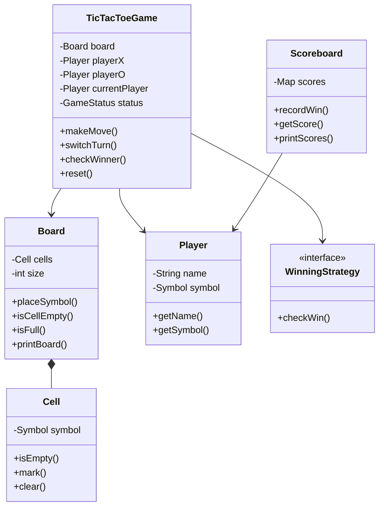

### 5. State Transitions

- State changes are represented using enums and status fields in the Java skeleton.

### 6. Core Flows

- Main flow: Start game, make move, validate move, detect win or draw.

### 7. Design Patterns Used

- Strategy for win checks, Observer optional for scoreboard, Facade optional.

### 8. Skeleton Code

```java
enum Symbol { X, O, EMPTY }
enum GameStatus { IN_PROGRESS, X_WON, O_WON, DRAW }

class Player {
    private final String name;
    private final Symbol symbol;
    public Player(String name, Symbol symbol) { this.name = name; this.symbol = symbol; }
    public String getName() { return name; }
    public Symbol getSymbol() { return symbol; }
}

class Cell {
    private Symbol symbol = Symbol.EMPTY;
    public boolean isEmpty() { return symbol == Symbol.EMPTY; }
    public void mark(Symbol symbol) { this.symbol = symbol; }
    public void clear() { this.symbol = Symbol.EMPTY; }
}

class Board {
    private final Cell[][] cells;
    private final int size;
    public Board(int size) { this.size = size; this.cells = new Cell[size][size]; }
    public void placeSymbol(int row, int col, Symbol symbol) { /* TODO */ }
    public boolean isCellEmpty(int row, int col) { return false; /* TODO */ }
    public boolean isFull() { return false; /* TODO */ }
    public void printBoard() { /* TODO */ }
}

interface WinningStrategy {
    boolean checkWin(Board board, Symbol symbol);
}

class TicTacToeGame {
    private Board board;
    private Player playerX;
    private Player playerO;
    private Player currentPlayer;
    private GameStatus status;
    public void makeMove(int row, int col) { /* TODO */ }
    private void switchTurn() { /* TODO */ }
    private void checkWinner() { /* TODO */ }
}

class Scoreboard {
    private final java.util.Map<String, Integer> scores = new java.util.HashMap<>();
    public void recordWin(Player player) { /* TODO */ }
    public int getScore(String playerName) { return scores.getOrDefault(playerName, 0); }
}
```

### 9. Edge Cases

- Move outside board, occupied cell, move after game over.

---

## Design Chess Game

### 1. Requirements

- Use object-oriented design with clear responsibilities.
- Keep the system modular and extensible.
- Support core operations and important edge cases.

### 2. Core Use Cases

- Move piece, validate legal move, detect check/checkmate.

### 3. Entities + Responsibilities

- See the Mermaid class diagram below. It includes key entities, fields, methods, and relationships.

### 4. Relationships

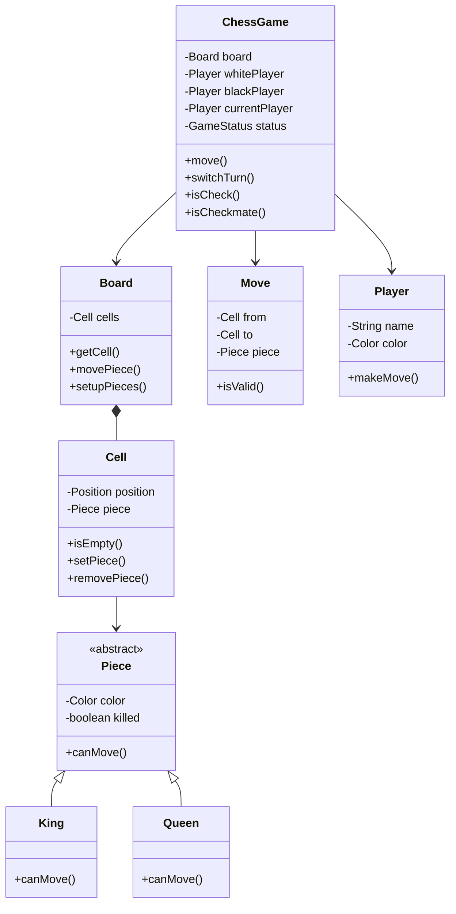

### 5. State Transitions

- State changes are represented using enums and status fields in the Java skeleton.

### 6. Core Flows

- Main flow: Move piece, validate legal move, detect check/checkmate.

### 7. Design Patterns Used

- State for game state, Strategy for piece movement validation.

### 8. Skeleton Code

```java
enum Color { WHITE, BLACK }
enum GameStatus { ACTIVE, CHECK, CHECKMATE, STALEMATE }

class Position {
    int row;
    int col;
}

abstract class Piece {
    protected Color color;
    protected boolean killed;
    public abstract boolean canMove(Board board, Cell from, Cell to);
}

class King extends Piece {
    public boolean canMove(Board board, Cell from, Cell to) { return false; /* TODO */ }
}

class Queen extends Piece {
    public boolean canMove(Board board, Cell from, Cell to) { return false; /* TODO */ }
}

class Cell {
    private Position position;
    private Piece piece;
    public boolean isEmpty() { return piece == null; }
    public void setPiece(Piece piece) { this.piece = piece; }
    public Piece removePiece() { Piece p = piece; piece = null; return p; }
}

class Board {
    private Cell[][] cells = new Cell[8][8];
    public Cell getCell(Position position) { return null; /* TODO */ }
    public void movePiece(Cell from, Cell to) { /* TODO */ }
    public void setupPieces() { /* TODO */ }
}

class Player {
    private String name;
    private Color color;
}

class Move {
    private Cell from;
    private Cell to;
    private Piece piece;
    public boolean isValid() { return false; /* TODO */ }
}

class ChessGame {
    private Board board;
    private Player currentPlayer;
    private GameStatus status;
    public void move(Position from, Position to) { /* TODO */ }
    private void switchTurn() { /* TODO */ }
}
```

### 9. Edge Cases

- Illegal move, moving into check, empty source cell.

---

## Design LRU Cache

### 1. Requirements

- Use object-oriented design with clear responsibilities.
- Keep the system modular and extensible.
- Support core operations and important edge cases.

### 2. Core Use Cases

- Get key, put key, evict least recently used item.

### 3. Entities + Responsibilities

- See the Mermaid class diagram below. It includes key entities, fields, methods, and relationships.

### 4. Relationships

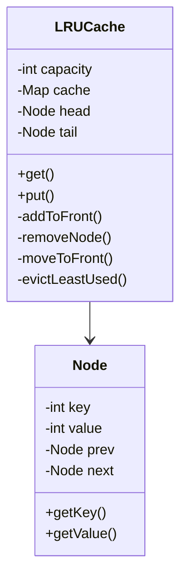

### 5. State Transitions

- State changes are represented using enums and status fields in the Java skeleton.

### 6. Core Flows

- Main flow: Get key, put key, evict least recently used item.

### 7. Design Patterns Used

- HashMap plus Doubly Linked List.

### 8. Skeleton Code

```java
class Node {
    int key;
    int value;
    Node prev;
    Node next;
    Node(int key, int value) { this.key = key; this.value = value; }
}

class LRUCache {
    private final int capacity;
    private final java.util.Map<Integer, Node> cache = new java.util.HashMap<>();
    private final Node head = new Node(0, 0);
    private final Node tail = new Node(0, 0);

    public LRUCache(int capacity) {
        this.capacity = capacity;
        head.next = tail;
        tail.prev = head;
    }

    public int get(int key) { return -1; /* TODO */ }
    public void put(int key, int value) { /* TODO */ }
    private void addToFront(Node node) { /* TODO */ }
    private void removeNode(Node node) { /* TODO */ }
    private void moveToFront(Node node) { /* TODO */ }
    private void evictLeastUsed() { /* TODO */ }
}
```

### 9. Edge Cases

- Capacity zero, update existing key, get missing key.

---

## Design Search Autocomplete System

### 1. Requirements

- Use object-oriented design with clear responsibilities.
- Keep the system modular and extensible.
- Support core operations and important edge cases.

### 2. Core Use Cases

- Insert words, search prefix, return suggestions.

### 3. Entities + Responsibilities

- See the Mermaid class diagram below. It includes key entities, fields, methods, and relationships.

### 4. Relationships

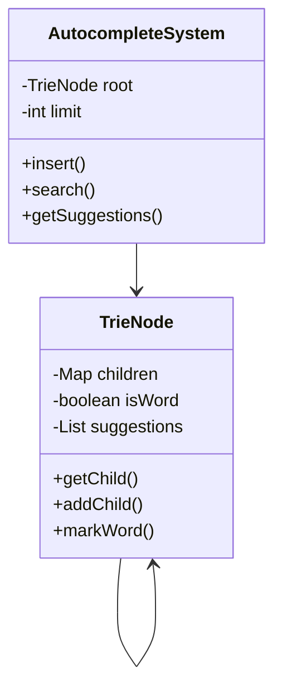

### 5. State Transitions

- State changes are represented using enums and status fields in the Java skeleton.

### 6. Core Flows

- Main flow: Insert words, search prefix, return suggestions.

### 7. Design Patterns Used

- Trie, optional ranking strategy.

### 8. Skeleton Code

```java
class TrieNode {
    java.util.Map<Character, TrieNode> children = new java.util.HashMap<>();
    boolean isWord;
    java.util.List<String> suggestions = new java.util.ArrayList<>();
}

class AutocompleteSystem {
    private final TrieNode root = new TrieNode();
    private final int limit;

    public AutocompleteSystem(int limit) { this.limit = limit; }
    public void insert(String word) { /* TODO */ }
    public java.util.List<String> search(String prefix) { return java.util.List.of(); /* TODO */ }
    public java.util.List<String> getSuggestions(String prefix) { return search(prefix); }
}
```

### 9. Edge Cases

- Unknown prefix, duplicate word, empty query.

---

## Design ATM

### 1. Requirements

- Use object-oriented design with clear responsibilities.
- Keep the system modular and extensible.
- Support core operations and important edge cases.

### 2. Core Use Cases

- Insert card, authenticate, withdraw cash, eject card.

### 3. Entities + Responsibilities

- See the Mermaid class diagram below. It includes key entities, fields, methods, and relationships.

### 4. Relationships

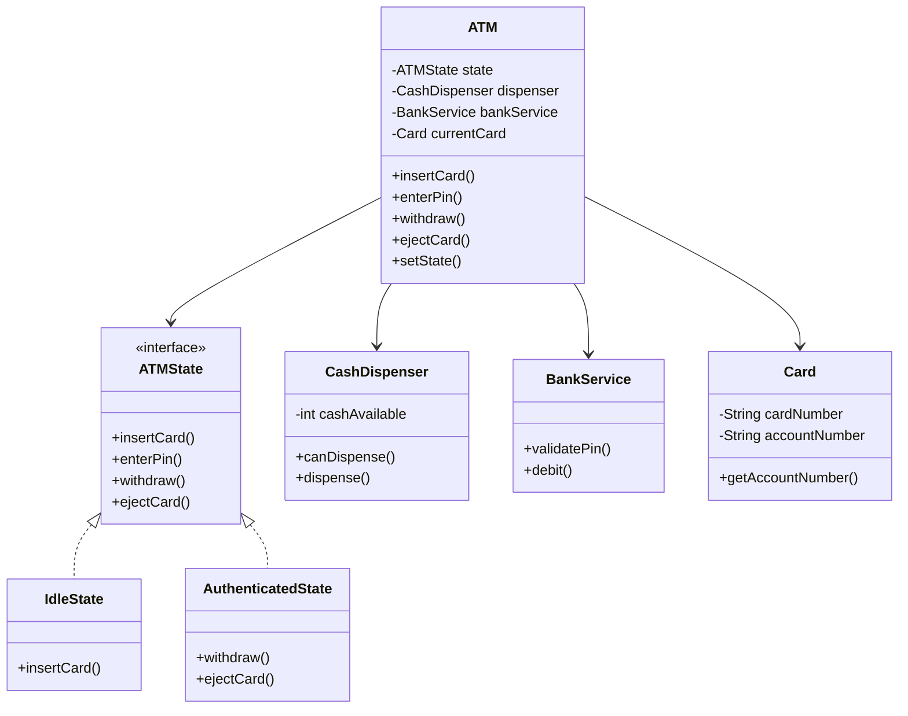

### 5. State Transitions

- State changes are represented using enums and status fields in the Java skeleton.

### 6. Core Flows

- Main flow: Insert card, authenticate, withdraw cash, eject card.

### 7. Design Patterns Used

- State pattern for ATM lifecycle.

### 8. Skeleton Code

```java
interface ATMState {
    void insertCard(ATM atm, Card card);
    void enterPin(ATM atm, String pin);
    void withdraw(ATM atm, double amount);
    void ejectCard(ATM atm);
}

class IdleState implements ATMState {
    public void insertCard(ATM atm, Card card) { /* TODO */ }
    public void enterPin(ATM atm, String pin) { /* TODO */ }
    public void withdraw(ATM atm, double amount) { /* TODO */ }
    public void ejectCard(ATM atm) { /* TODO */ }
}

class AuthenticatedState implements ATMState {
    public void insertCard(ATM atm, Card card) { /* TODO */ }
    public void enterPin(ATM atm, String pin) { /* TODO */ }
    public void withdraw(ATM atm, double amount) { /* TODO */ }
    public void ejectCard(ATM atm) { /* TODO */ }
}

class Card {
    private String cardNumber;
    private String accountNumber;
    public String getAccountNumber() { return accountNumber; }
}

class CashDispenser {
    private int cashAvailable;
    public boolean canDispense(double amount) { return false; /* TODO */ }
    public void dispense(double amount) { /* TODO */ }
}

class BankService {
    public boolean validatePin(Card card, String pin) { return false; /* TODO */ }
    public boolean debit(String accountNumber, double amount) { return false; /* TODO */ }
}

class ATM {
    private ATMState state = new IdleState();
    private CashDispenser dispenser;
    private BankService bankService;
    private Card currentCard;
    public void insertCard(Card card) { state.insertCard(this, card); }
    public void enterPin(String pin) { state.enterPin(this, pin); }
    public void withdraw(double amount) { state.withdraw(this, amount); }
    public void ejectCard() { state.ejectCard(this); }
    public void setState(ATMState state) { this.state = state; }
}
```

### 9. Edge Cases

- Wrong PIN, insufficient balance, insufficient ATM cash.

---

## Design Elevator System

### 1. Requirements

- Use object-oriented design with clear responsibilities.
- Keep the system modular and extensible.
- Support core operations and important edge cases.

### 2. Core Use Cases

- Request elevator, assign elevator, move, open and close doors.

### 3. Entities + Responsibilities

- See the Mermaid class diagram below. It includes key entities, fields, methods, and relationships.

### 4. Relationships

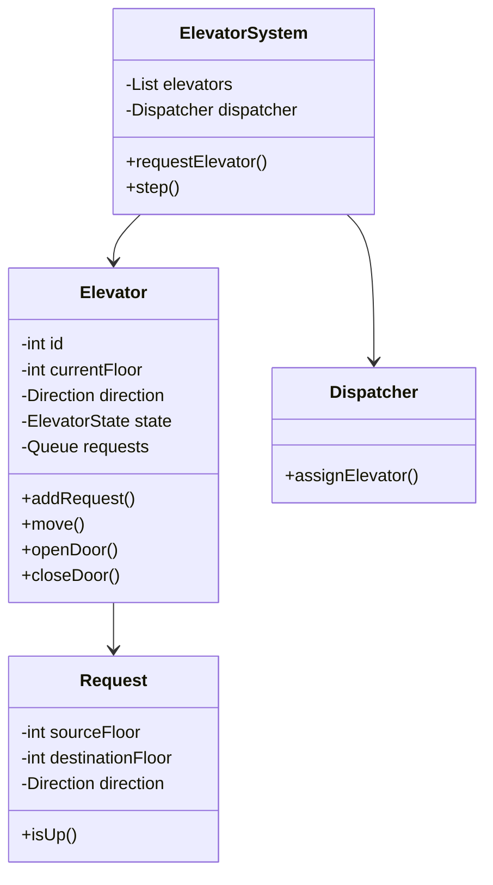

### 5. State Transitions

- State changes are represented using enums and status fields in the Java skeleton.

### 6. Core Flows

- Main flow: Request elevator, assign elevator, move, open and close doors.

### 7. Design Patterns Used

- Dispatcher Strategy, State for elevator status.

### 8. Skeleton Code

```java
enum Direction { UP, DOWN, IDLE }
enum ElevatorState { MOVING, IDLE, DOOR_OPEN }

class Request {
    int sourceFloor;
    int destinationFloor;
    Direction direction;
    public boolean isUp() { return destinationFloor > sourceFloor; }
}

class Elevator {
    private int id;
    private int currentFloor;
    private Direction direction = Direction.IDLE;
    private ElevatorState state = ElevatorState.IDLE;
    private java.util.Queue<Request> requests = new java.util.LinkedList<>();
    public void addRequest(Request request) { requests.offer(request); }
    public void move() { /* TODO */ }
    public void openDoor() { /* TODO */ }
    public void closeDoor() { /* TODO */ }
}

class Dispatcher {
    public Elevator assignElevator(Request request, java.util.List<Elevator> elevators) {
        return null; /* TODO */
    }
}

class ElevatorSystem {
    private java.util.List<Elevator> elevators;
    private Dispatcher dispatcher;
    public void requestElevator(int source, int destination) { /* TODO */ }
    public void step() { /* TODO */ }
}
```

### 9. Edge Cases

- Multiple requests, same floor request, overloaded elevator.

---

## Design Parking Lot

### 1. Requirements

- Use object-oriented design with clear responsibilities.
- Keep the system modular and extensible.
- Support core operations and important edge cases.

### 2. Core Use Cases

- Park vehicle, issue ticket, unpark vehicle, calculate fee.

### 3. Entities + Responsibilities

- See the Mermaid class diagram below. It includes key entities, fields, methods, and relationships.

### 4. Relationships

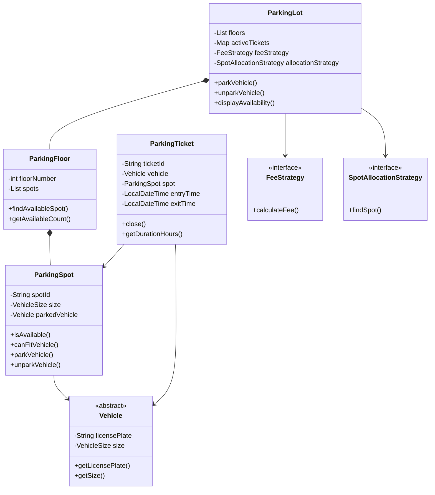

### 5. State Transitions

- State changes are represented using enums and status fields in the Java skeleton.

### 6. Core Flows

- Main flow: Park vehicle, issue ticket, unpark vehicle, calculate fee.

### 7. Design Patterns Used

- Strategy for allocation and fee, Singleton or Facade for ParkingLot.

### 8. Skeleton Code

```java
enum VehicleSize { SMALL, MEDIUM, LARGE }

abstract class Vehicle {
    private final String licensePlate;
    private final VehicleSize size;
    protected Vehicle(String licensePlate, VehicleSize size) {
        this.licensePlate = licensePlate;
        this.size = size;
    }
    public String getLicensePlate() { return licensePlate; }
    public VehicleSize getSize() { return size; }
}

class Bike extends Vehicle { public Bike(String plate) { super(plate, VehicleSize.SMALL); } }
class Car extends Vehicle { public Car(String plate) { super(plate, VehicleSize.MEDIUM); } }
class Truck extends Vehicle { public Truck(String plate) { super(plate, VehicleSize.LARGE); } }

class ParkingSpot {
    private String spotId;
    private VehicleSize size;
    private Vehicle parkedVehicle;
    public boolean isAvailable() { return parkedVehicle == null; }
    public boolean canFitVehicle(Vehicle vehicle) { return false; /* TODO */ }
    public synchronized void parkVehicle(Vehicle vehicle) { /* TODO */ }
    public synchronized Vehicle unparkVehicle() { return null; /* TODO */ }
}

class ParkingFloor {
    private int floorNumber;
    private java.util.List<ParkingSpot> spots;
    public ParkingSpot findAvailableSpot(Vehicle vehicle) { return null; /* TODO */ }
    public int getAvailableCount(VehicleSize size) { return 0; /* TODO */ }
}

class ParkingTicket {
    private String ticketId;
    private Vehicle vehicle;
    private ParkingSpot spot;
    private java.time.LocalDateTime entryTime;
    private java.time.LocalDateTime exitTime;
    public void close() { this.exitTime = java.time.LocalDateTime.now(); }
    public long getDurationHours() { return 0; /* TODO */ }
}

interface FeeStrategy { double calculateFee(ParkingTicket ticket); }
interface SpotAllocationStrategy { ParkingSpot findSpot(java.util.List<ParkingFloor> floors, Vehicle vehicle); }

class ParkingLot {
    private java.util.List<ParkingFloor> floors;
    private java.util.Map<String, ParkingTicket> activeTickets = new java.util.concurrent.ConcurrentHashMap<>();
    private FeeStrategy feeStrategy;
    private SpotAllocationStrategy allocationStrategy;
    public ParkingTicket parkVehicle(Vehicle vehicle) { return null; /* TODO */ }
    public double unparkVehicle(String ticketId) { return 0.0; /* TODO */ }
    public void displayAvailability() { /* TODO */ }
}
```

### 9. Edge Cases

- No compatible spot, invalid ticket, concurrent park/unpark.

---

## Design Inventory Management System

### 1. Requirements

- Use object-oriented design with clear responsibilities.
- Keep the system modular and extensible.
- Support core operations and important edge cases.

### 2. Core Use Cases

- Add stock, reserve stock, sell stock, release reservation.

### 3. Entities + Responsibilities

- See the Mermaid class diagram below. It includes key entities, fields, methods, and relationships.

### 4. Relationships

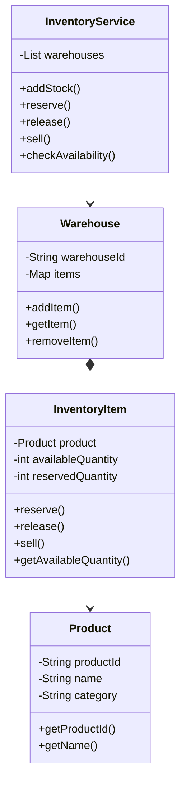

### 5. State Transitions

- State changes are represented using enums and status fields in the Java skeleton.

### 6. Core Flows

- Main flow: Add stock, reserve stock, sell stock, release reservation.

### 7. Design Patterns Used

- Service layer, Repository style storage, State for stock lifecycle.

### 8. Skeleton Code

```java
class Product {
    private String productId;
    private String name;
    private String category;
}

class InventoryItem {
    private Product product;
    private int availableQuantity;
    private int reservedQuantity;
    public void reserve(int qty) { /* TODO */ }
    public void release(int qty) { /* TODO */ }
    public void sell(int qty) { /* TODO */ }
    public int getAvailableQuantity() { return availableQuantity; }
}

class Warehouse {
    private String warehouseId;
    private java.util.Map<String, InventoryItem> items = new java.util.HashMap<>();
    public void addItem(InventoryItem item) { /* TODO */ }
    public InventoryItem getItem(String productId) { return items.get(productId); }
}

class InventoryService {
    private java.util.List<Warehouse> warehouses = new java.util.ArrayList<>();
    public void addStock(Product product, int qty) { /* TODO */ }
    public boolean reserve(Product product, int qty) { return false; /* TODO */ }
    public void release(Product product, int qty) { /* TODO */ }
    public void sell(Product product, int qty) { /* TODO */ }
}
```

### 9. Edge Cases

- Insufficient stock, negative quantity, duplicate product.

---

## Design a Social Network

### 1. Requirements

- Use object-oriented design with clear responsibilities.
- Keep the system modular and extensible.
- Support core operations and important edge cases.

### 2. Core Use Cases

- Create user, follow user, create post, view feed.

### 3. Entities + Responsibilities

- See the Mermaid class diagram below. It includes key entities, fields, methods, and relationships.

### 4. Relationships

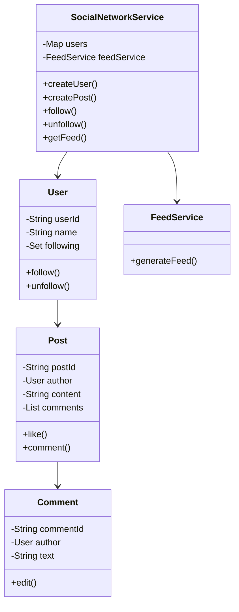

### 5. State Transitions

- State changes are represented using enums and status fields in the Java skeleton.

### 6. Core Flows

- Main flow: Create user, follow user, create post, view feed.

### 7. Design Patterns Used

- Observer optional for notifications, Strategy for feed ranking.

### 8. Skeleton Code

```java
class User {
    private String userId;
    private String name;
    private java.util.Set<User> following = new java.util.HashSet<>();
    public void follow(User user) { following.add(user); }
    public void unfollow(User user) { following.remove(user); }
}

class Post {
    private String postId;
    private User author;
    private String content;
    private java.util.List<Comment> comments = new java.util.ArrayList<>();
    public void like(User user) { /* TODO */ }
    public void comment(Comment comment) { comments.add(comment); }
}

class Comment {
    private String commentId;
    private User author;
    private String text;
    public void edit(String text) { this.text = text; }
}

class FeedService {
    public java.util.List<Post> generateFeed(User user) { return java.util.List.of(); /* TODO */ }
}

class SocialNetworkService {
    private java.util.Map<String, User> users = new java.util.HashMap<>();
    private FeedService feedService = new FeedService();
    public User createUser(String name) { return null; /* TODO */ }
    public Post createPost(User user, String content) { return null; /* TODO */ }
    public void follow(User user, User target) { user.follow(target); }
    public java.util.List<Post> getFeed(User user) { return feedService.generateFeed(user); }
}
```

### 9. Edge Cases

- Self follow, duplicate follow, deleted post.

---

## Design Spotify

### 1. Requirements

- Use object-oriented design with clear responsibilities.
- Keep the system modular and extensible.
- Support core operations and important edge cases.

### 2. Core Use Cases

- Search songs, create playlist, play/pause/next.

### 3. Entities + Responsibilities

- See the Mermaid class diagram below. It includes key entities, fields, methods, and relationships.

### 4. Relationships

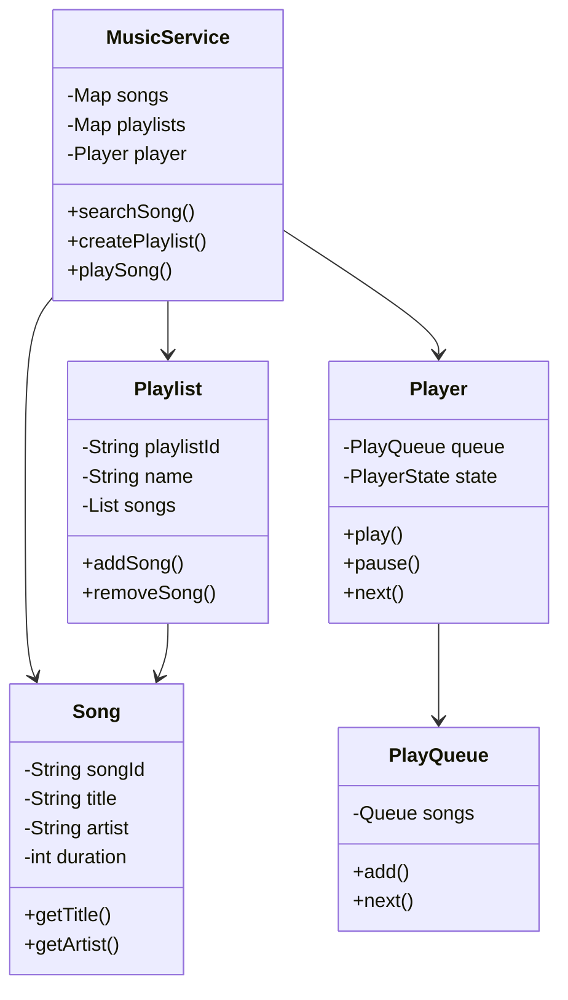

### 5. State Transitions

- State changes are represented using enums and status fields in the Java skeleton.

### 6. Core Flows

- Main flow: Search songs, create playlist, play/pause/next.

### 7. Design Patterns Used

- State for player, Queue for playback.

### 8. Skeleton Code

```java
enum PlayerState { PLAYING, PAUSED, STOPPED }

class Song {
    private String songId;
    private String title;
    private String artist;
    private int durationSeconds;
}

class Playlist {
    private String playlistId;
    private String name;
    private java.util.List<Song> songs = new java.util.ArrayList<>();
    public void addSong(Song song) { songs.add(song); }
    public void removeSong(Song song) { songs.remove(song); }
}

class PlayQueue {
    private java.util.Queue<Song> songs = new java.util.LinkedList<>();
    public void add(Song song) { songs.offer(song); }
    public Song next() { return songs.poll(); }
}

class Player {
    private PlayQueue queue = new PlayQueue();
    private PlayerState state = PlayerState.STOPPED;
    public void play() { state = PlayerState.PLAYING; }
    public void pause() { state = PlayerState.PAUSED; }
    public Song next() { return queue.next(); }
}

class MusicService {
    private java.util.Map<String, Song> songs = new java.util.HashMap<>();
    private java.util.Map<String, Playlist> playlists = new java.util.HashMap<>();
    private Player player = new Player();
    public java.util.List<Song> searchSong(String query) { return java.util.List.of(); /* TODO */ }
    public Playlist createPlaylist(String name) { return null; /* TODO */ }
}
```

### 9. Edge Cases

- Empty queue, unavailable song, duplicate playlist song.

---

## Design Pub Sub System

### 1. Requirements

- Use object-oriented design with clear responsibilities.
- Keep the system modular and extensible.
- Support core operations and important edge cases.

### 2. Core Use Cases

- Create topic, subscribe, publish, consume.

### 3. Entities + Responsibilities

- See the Mermaid class diagram below. It includes key entities, fields, methods, and relationships.

### 4. Relationships

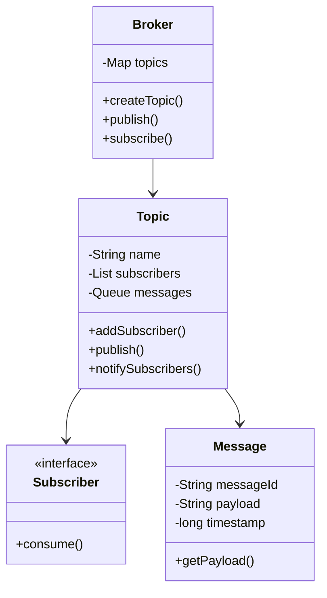

### 5. State Transitions

- State changes are represented using enums and status fields in the Java skeleton.

### 6. Core Flows

- Main flow: Create topic, subscribe, publish, consume.

### 7. Design Patterns Used

- Observer and Publisher Subscriber.

### 8. Skeleton Code

```java
class Message {
    private String messageId;
    private String payload;
    private long timestamp;
    public String getPayload() { return payload; }
}

interface Subscriber {
    void consume(Message message);
}

class Topic {
    private String name;
    private java.util.List<Subscriber> subscribers = new java.util.ArrayList<>();
    private java.util.Queue<Message> messages = new java.util.LinkedList<>();
    public void addSubscriber(Subscriber subscriber) { subscribers.add(subscriber); }
    public void publish(Message message) { /* TODO */ }
    private void notifySubscribers(Message message) { /* TODO */ }
}

class Broker {
    private java.util.Map<String, Topic> topics = new java.util.HashMap<>();
    public Topic createTopic(String name) { return null; /* TODO */ }
    public void publish(String topicName, Message message) { /* TODO */ }
    public void subscribe(String topicName, Subscriber subscriber) { /* TODO */ }
}
```

### 9. Edge Cases

- Topic not found, slow subscriber, duplicate subscription.

---

## Design Chat Application

### 1. Requirements

- Use object-oriented design with clear responsibilities.
- Keep the system modular and extensible.
- Support core operations and important edge cases.

### 2. Core Use Cases

- Create conversation, send message, mark delivered/read.

### 3. Entities + Responsibilities

- See the Mermaid class diagram below. It includes key entities, fields, methods, and relationships.

### 4. Relationships

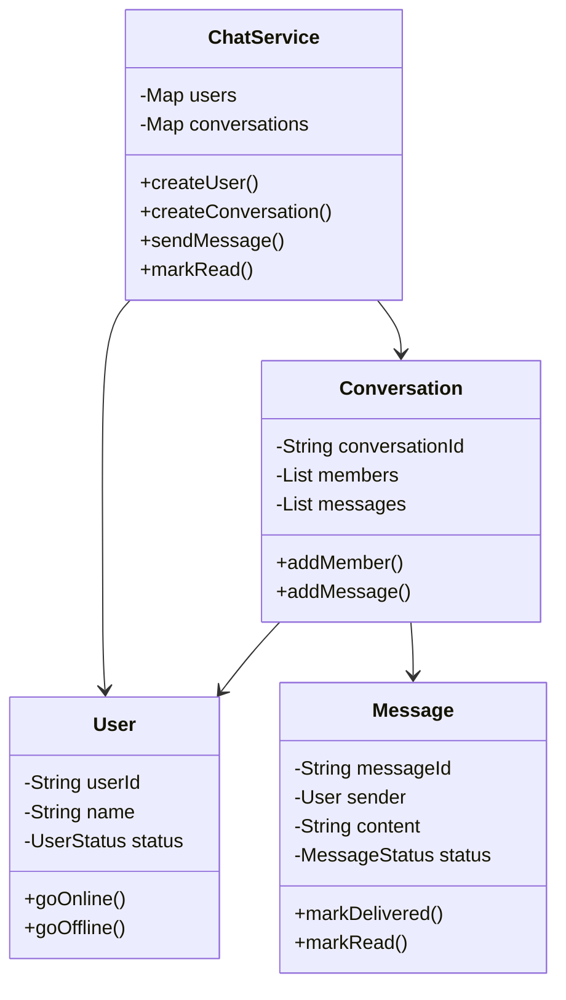

### 5. State Transitions

- State changes are represented using enums and status fields in the Java skeleton.

### 6. Core Flows

- Main flow: Create conversation, send message, mark delivered/read.

### 7. Design Patterns Used

- Observer for delivery, State for message status.

### 8. Skeleton Code

```java
enum UserStatus { ONLINE, OFFLINE }
enum MessageStatus { SENT, DELIVERED, READ }

class User {
    private String userId;
    private String name;
    private UserStatus status;
    public void goOnline() { status = UserStatus.ONLINE; }
    public void goOffline() { status = UserStatus.OFFLINE; }
}

class Message {
    private String messageId;
    private User sender;
    private String content;
    private MessageStatus status = MessageStatus.SENT;
    public void markDelivered() { status = MessageStatus.DELIVERED; }
    public void markRead() { status = MessageStatus.READ; }
}

class Conversation {
    private String conversationId;
    private java.util.List<User> members = new java.util.ArrayList<>();
    private java.util.List<Message> messages = new java.util.ArrayList<>();
    public void addMember(User user) { members.add(user); }
    public void addMessage(Message message) { messages.add(message); }
}

class ChatService {
    private java.util.Map<String, User> users = new java.util.HashMap<>();
    private java.util.Map<String, Conversation> conversations = new java.util.HashMap<>();
    public User createUser(String name) { return null; /* TODO */ }
    public Conversation createConversation(java.util.List<User> members) { return null; /* TODO */ }
    public Message sendMessage(Conversation conversation, User sender, String text) { return null; /* TODO */ }
}
```

### 9. Edge Cases

- User offline, empty message, non-member sends message.

---

## Design Payment Gateway

### 1. Requirements

- Use object-oriented design with clear responsibilities.
- Keep the system modular and extensible.
- Support core operations and important edge cases.

### 2. Core Use Cases

- Initiate payment, process payment, refund payment.

### 3. Entities + Responsibilities

- See the Mermaid class diagram below. It includes key entities, fields, methods, and relationships.

### 4. Relationships

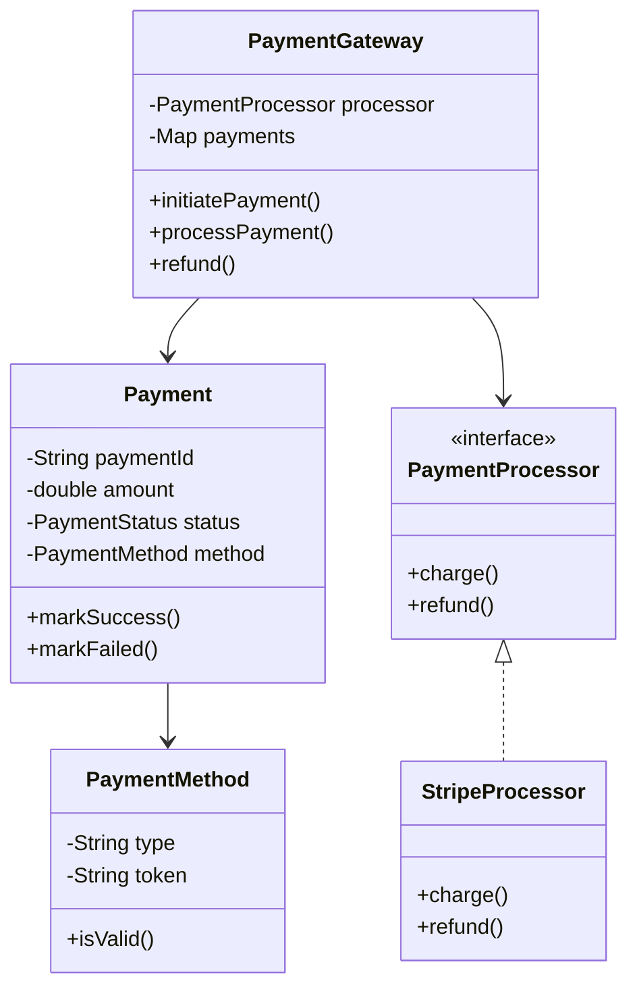

### 5. State Transitions

- State changes are represented using enums and status fields in the Java skeleton.

### 6. Core Flows

- Main flow: Initiate payment, process payment, refund payment.

### 7. Design Patterns Used

- Strategy for payment processors, State for payment status.

### 8. Skeleton Code

```java
enum PaymentStatus { INITIATED, SUCCESS, FAILED, REFUNDED }

class PaymentMethod {
    private String type;
    private String token;
    public boolean isValid() { return false; /* TODO */ }
}

class Payment {
    private String paymentId;
    private double amount;
    private PaymentStatus status;
    private PaymentMethod method;
    public void markSuccess() { status = PaymentStatus.SUCCESS; }
    public void markFailed() { status = PaymentStatus.FAILED; }
}

interface PaymentProcessor {
    boolean charge(Payment payment);
    boolean refund(Payment payment);
}

class StripeProcessor implements PaymentProcessor {
    public boolean charge(Payment payment) { return false; /* TODO */ }
    public boolean refund(Payment payment) { return false; /* TODO */ }
}

class PaymentGateway {
    private PaymentProcessor processor;
    private java.util.Map<String, Payment> payments = new java.util.HashMap<>();
    public Payment initiatePayment(double amount, PaymentMethod method) { return null; /* TODO */ }
    public boolean processPayment(String paymentId) { return false; /* TODO */ }
    public boolean refund(String paymentId) { return false; /* TODO */ }
}
```

### 9. Edge Cases

- Duplicate payment, processor failure, refund after failure.

---

## Design Splitwise

### 1. Requirements

- Use object-oriented design with clear responsibilities.
- Keep the system modular and extensible.
- Support core operations and important edge cases.

### 2. Core Use Cases

- Create expense, split among users, settle balances.

### 3. Entities + Responsibilities

- See the Mermaid class diagram below. It includes key entities, fields, methods, and relationships.

### 4. Relationships

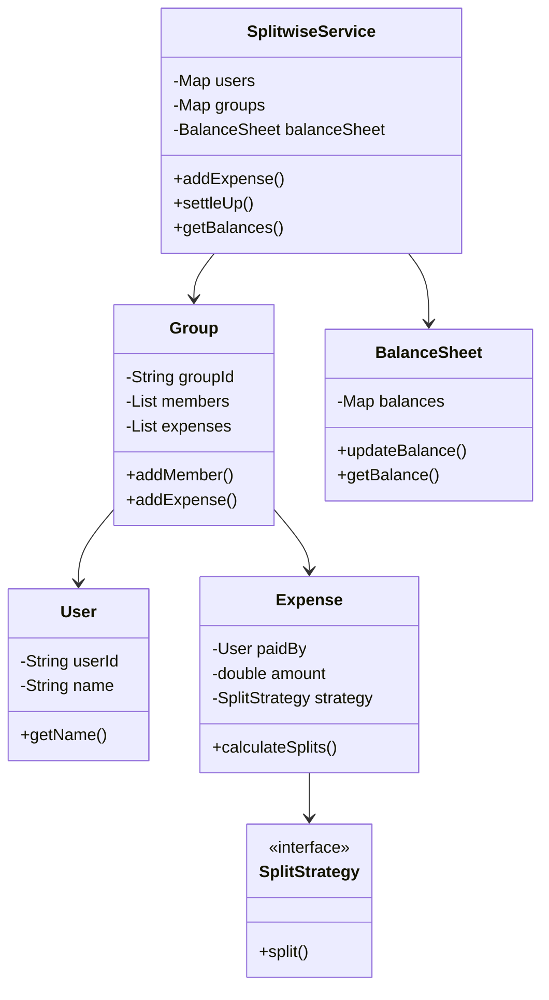

### 5. State Transitions

- State changes are represented using enums and status fields in the Java skeleton.

### 6. Core Flows

- Main flow: Create expense, split among users, settle balances.

### 7. Design Patterns Used

- Strategy for split calculation.

### 8. Skeleton Code

```java
class User {
    private String userId;
    private String name;
}

class Split {
    User user;
    double amount;
}

interface SplitStrategy {
    java.util.List<Split> split(double amount, java.util.List<User> users);
}

class EqualSplitStrategy implements SplitStrategy {
    public java.util.List<Split> split(double amount, java.util.List<User> users) {
        return java.util.List.of(); /* TODO */
    }
}

class Expense {
    private User paidBy;
    private double amount;
    private SplitStrategy strategy;
    public java.util.List<Split> calculateSplits(java.util.List<User> users) { return strategy.split(amount, users); }
}

class Group {
    private String groupId;
    private java.util.List<User> members = new java.util.ArrayList<>();
    private java.util.List<Expense> expenses = new java.util.ArrayList<>();
    public void addMember(User user) { members.add(user); }
    public void addExpense(Expense expense) { expenses.add(expense); }
}

class BalanceSheet {
    private java.util.Map<String, Double> balances = new java.util.HashMap<>();
    public void updateBalance(User from, User to, double amount) { /* TODO */ }
    public double getBalance(User user) { return 0.0; /* TODO */ }
}

class SplitwiseService {
    private BalanceSheet balanceSheet = new BalanceSheet();
    public void addExpense(Group group, Expense expense) { /* TODO */ }
    public void settleUp(User payer, User payee, double amount) { /* TODO */ }
}
```

### 9. Edge Cases

- Unequal split mismatch, duplicate settlement, negative expense.

---

## Design Amazon

### 1. Requirements

- Use object-oriented design with clear responsibilities.
- Keep the system modular and extensible.
- Support core operations and important edge cases.

### 2. Core Use Cases

- Search product, add to cart, checkout, create order.

### 3. Entities + Responsibilities

- See the Mermaid class diagram below. It includes key entities, fields, methods, and relationships.

### 4. Relationships

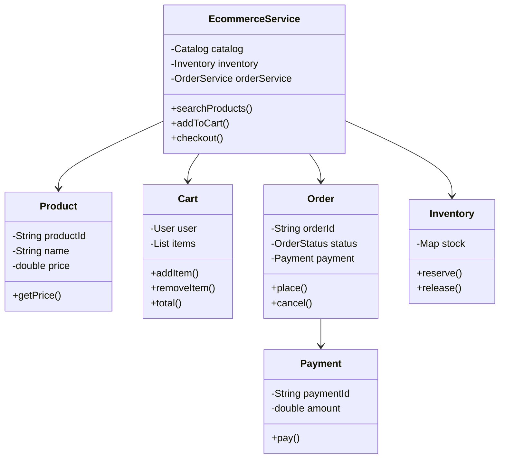

### 5. State Transitions

- State changes are represented using enums and status fields in the Java skeleton.

### 6. Core Flows

- Main flow: Search product, add to cart, checkout, create order.

### 7. Design Patterns Used

- Facade/service layer, Strategy for payment/shipping.

### 8. Skeleton Code

```java
enum OrderStatus { CREATED, PLACED, CANCELLED, SHIPPED, DELIVERED }

class Product {
    private String productId;
    private String name;
    private double price;
}

class CartItem {
    Product product;
    int quantity;
}

class Cart {
    private User user;
    private java.util.List<CartItem> items = new java.util.ArrayList<>();
    public void addItem(Product product, int qty) { /* TODO */ }
    public void removeItem(Product product) { /* TODO */ }
    public double total() { return 0.0; /* TODO */ }
}

class User {
    private String userId;
    private String name;
}

class Inventory {
    private java.util.Map<String, Integer> stock = new java.util.HashMap<>();
    public boolean reserve(Product product, int qty) { return false; /* TODO */ }
    public void release(Product product, int qty) { /* TODO */ }
}

class Payment {
    private String paymentId;
    private double amount;
    public boolean pay() { return false; /* TODO */ }
}

class Order {
    private String orderId;
    private OrderStatus status;
    private Payment payment;
    public void place() { status = OrderStatus.PLACED; }
    public void cancel() { status = OrderStatus.CANCELLED; }
}

class EcommerceService {
    private Inventory inventory = new Inventory();
    public java.util.List<Product> searchProducts(String query) { return java.util.List.of(); /* TODO */ }
    public Order checkout(Cart cart) { return null; /* TODO */ }
}
```

### 9. Edge Cases

- Out of stock, payment failure, cart changed during checkout.

---

## Design Ride Hailing Service

### 1. Requirements

- Use object-oriented design with clear responsibilities.
- Keep the system modular and extensible.
- Support core operations and important edge cases.

### 2. Core Use Cases

- Request ride, match driver, start ride, complete ride.

### 3. Entities + Responsibilities

- See the Mermaid class diagram below. It includes key entities, fields, methods, and relationships.

### 4. Relationships

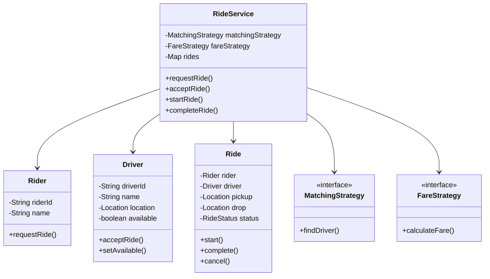

### 5. State Transitions

- State changes are represented using enums and status fields in the Java skeleton.

### 6. Core Flows

- Main flow: Request ride, match driver, start ride, complete ride.

### 7. Design Patterns Used

- Strategy for driver matching and fare calculation, State for ride status.

### 8. Skeleton Code

```java
enum RideStatus { REQUESTED, ACCEPTED, STARTED, COMPLETED, CANCELLED }

class Location {
    double latitude;
    double longitude;
}

class Rider {
    private String riderId;
    private String name;
}

class Driver {
    private String driverId;
    private String name;
    private Location location;
    private boolean available;
    public void setAvailable(boolean available) { this.available = available; }
}

class Ride {
    private Rider rider;
    private Driver driver;
    private Location pickup;
    private Location drop;
    private RideStatus status;
    public void start() { status = RideStatus.STARTED; }
    public void complete() { status = RideStatus.COMPLETED; }
    public void cancel() { status = RideStatus.CANCELLED; }
}

interface MatchingStrategy {
    Driver findDriver(Rider rider, java.util.List<Driver> drivers);
}

interface FareStrategy {
    double calculateFare(Ride ride);
}

class RideService {
    private MatchingStrategy matchingStrategy;
    private FareStrategy fareStrategy;
    private java.util.Map<String, Ride> rides = new java.util.HashMap<>();
    public Ride requestRide(Rider rider, Location pickup, Location drop) { return null; /* TODO */ }
    public void acceptRide(Driver driver, Ride ride) { /* TODO */ }
    public void completeRide(Ride ride) { /* TODO */ }
}
```

### 9. Edge Cases

- No drivers, driver cancels, rider cancels.

---

## Design URL Shortener

### 1. Requirements

- Use object-oriented design with clear responsibilities.
- Keep the system modular and extensible.
- Support core operations and important edge cases.

### 2. Core Use Cases

- Shorten URL, redirect by code, expire link.

### 3. Entities + Responsibilities

- See the Mermaid class diagram below. It includes key entities, fields, methods, and relationships.

### 4. Relationships

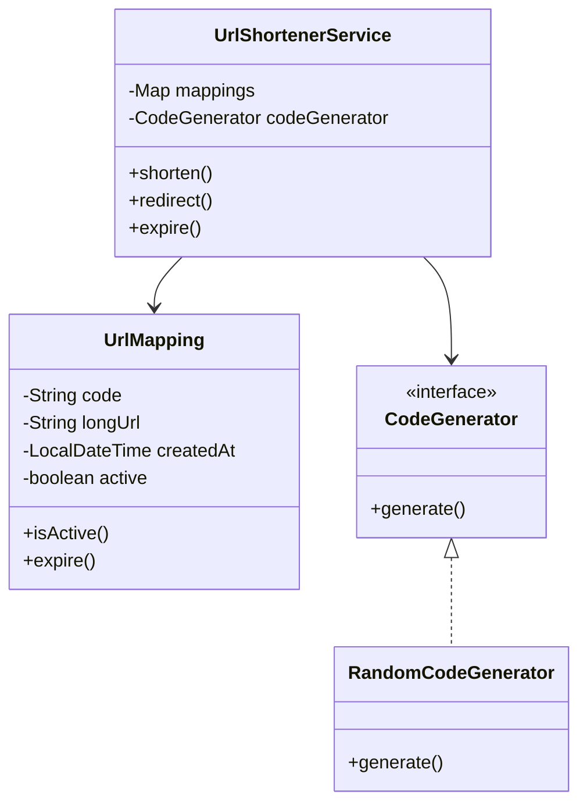

### 5. State Transitions

- State changes are represented using enums and status fields in the Java skeleton.

### 6. Core Flows

- Main flow: Shorten URL, redirect by code, expire link.

### 7. Design Patterns Used

- Strategy for code generation.

### 8. Skeleton Code

```java
class UrlMapping {
    private String code;
    private String longUrl;
    private java.time.LocalDateTime createdAt;
    private boolean active = true;
    public boolean isActive() { return active; }
    public void expire() { active = false; }
}

interface CodeGenerator {
    String generate(String longUrl);
}

class RandomCodeGenerator implements CodeGenerator {
    public String generate(String longUrl) { return ""; /* TODO */ }
}

class UrlShortenerService {
    private java.util.Map<String, UrlMapping> mappings = new java.util.HashMap<>();
    private CodeGenerator codeGenerator;
    public String shorten(String longUrl) { return ""; /* TODO */ }
    public String redirect(String code) { return ""; /* TODO */ }
    public void expire(String code) { /* TODO */ }
}
```

### 9. Edge Cases

- Duplicate code, expired link, invalid URL.

---

## Design Rate Limiter

### 1. Requirements

- Use object-oriented design with clear responsibilities.
- Keep the system modular and extensible.
- Support core operations and important edge cases.

### 2. Core Use Cases

- Receive request, check limit, allow or reject.

### 3. Entities + Responsibilities

- See the Mermaid class diagram below. It includes key entities, fields, methods, and relationships.

### 4. Relationships

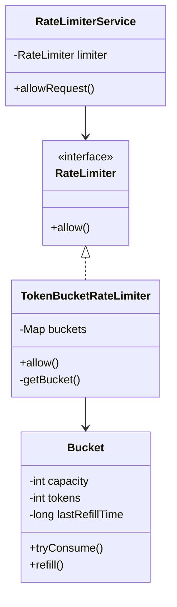

### 5. State Transitions

- State changes are represented using enums and status fields in the Java skeleton.

### 6. Core Flows

- Main flow: Receive request, check limit, allow or reject.

### 7. Design Patterns Used

- Strategy for algorithms, Token Bucket.

### 8. Skeleton Code

```java
interface RateLimiter {
    boolean allow(String clientId);
}

class Bucket {
    private int capacity;
    private int tokens;
    private long lastRefillTime;
    public synchronized boolean tryConsume() { return false; /* TODO */ }
    public synchronized void refill() { /* TODO */ }
}

class TokenBucketRateLimiter implements RateLimiter {
    private java.util.Map<String, Bucket> buckets = new java.util.concurrent.ConcurrentHashMap<>();
    public boolean allow(String clientId) { return false; /* TODO */ }
    private Bucket getBucket(String clientId) { return null; /* TODO */ }
}

class RateLimiterService {
    private RateLimiter limiter;
    public boolean allowRequest(String clientId) { return limiter.allow(clientId); }
}
```

### 9. Edge Cases

- Burst traffic, unknown client, clock skew.

---

## Design Version Control System

### 1. Requirements

- Use object-oriented design with clear responsibilities.
- Keep the system modular and extensible.
- Support core operations and important edge cases.

### 2. Core Use Cases

- Track file snapshot, commit, branch, checkout.

### 3. Entities + Responsibilities

- See the Mermaid class diagram below. It includes key entities, fields, methods, and relationships.

### 4. Relationships

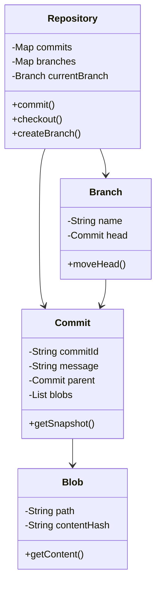

### 5. State Transitions

- State changes are represented using enums and status fields in the Java skeleton.

### 6. Core Flows

- Main flow: Track file snapshot, commit, branch, checkout.

### 7. Design Patterns Used

- Composite-like snapshots, DAG of commits.

### 8. Skeleton Code

```java
class Blob {
    private String path;
    private String contentHash;
    public String getContent() { return ""; /* TODO */ }
}

class Commit {
    private String commitId;
    private String message;
    private Commit parent;
    private java.util.List<Blob> blobs;
    public java.util.List<Blob> getSnapshot() { return blobs; }
}

class Branch {
    private String name;
    private Commit head;
    public void moveHead(Commit commit) { this.head = commit; }
}

class Repository {
    private java.util.Map<String, Commit> commits = new java.util.HashMap<>();
    private java.util.Map<String, Branch> branches = new java.util.HashMap<>();
    private Branch currentBranch;
    public Commit commit(String message) { return null; /* TODO */ }
    public void checkout(String branchName) { /* TODO */ }
    public Branch createBranch(String name) { return null; /* TODO */ }
}
```

### 9. Edge Cases

- Commit without changes, branch not found, merge conflict.

---
