# LLD Visual Reference — Java Skeletons

A visual-first Low-Level Design reference for common interview problems.

> Mermaid rendering tip: use fenced code blocks exactly like this: ` ```mermaid `. If your viewer says **Unable to render rich display**, open this file in GitHub, VS Code with Mermaid extension, Obsidian, or any Markdown tool that supports Mermaid.

---

## Clickable Index

### 🎮 Games & Puzzles
- [Design Tic Tac Toe](#design-tic-tac-toe)
- [Design Chess Game](#design-chess-game)

### 🧱 Data Structures & Search
- [Design LRU Cache](#design-lru-cache)
- [Design Search Autocomplete System](#design-search-autocomplete-system)

### 🔄 Managing States
- [Design ATM](#design-atm)
- [Design Elevator System](#design-elevator-system)

### 🏢 Management Systems
- [Design Parking Lot](#design-parking-lot)
- [Design Inventory Management System](#design-inventory-management-system)

### 🌐 Social & Content Platforms
- [Design a Social Network](#design-a-social-network)
- [Design Spotify](#design-spotify)

### 💬 Communication & Messaging
- [Design Pub Sub System](#design-pub-sub-system)
- [Design Chat Application](#design-chat-application)

### 💰 Financial & Payment Systems
- [Design Payment Gateway](#design-payment-gateway)
- [Design Splitwise](#design-splitwise)

### 🛒 E-commerce & Booking Systems
- [Design Amazon](#design-amazon)
- [Design Ride Hailing Service](#design-ride-hailing-service)

### ⚙️ Developer Tools & Infrastructure
- [Design URL Shortener](#design-url-shortener)
- [Design Rate Limiter](#design-rate-limiter)
- [Design Version Control System](#design-version-control-system)

---

## Universal LLD Flow

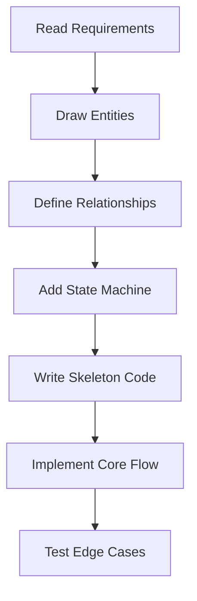
```mermaid
flowchart TD
    A[Read Requirements] --> B[Draw Entities]
    B --> C[Define Relationships]
    C --> D[Add State Machine]
    D --> E[Write Skeleton Code]
    E --> F[Implement Core Flow]
    F --> G[Test Edge Cases]
```

---

# 🎮 Games & Puzzles

## Design Tic Tac Toe

### 1. Requirements
- 3x3 board.
- Two players: X and O.
- Alternate turns.
- Detect win, draw, invalid move.
- Maintain score across games.

### 2. Core Use Cases
- Start game.
- Make move.
- Check winner.
- Reset game.
- Show scoreboard.

### 3. Entities + Responsibilities
| Entity | Responsibility |
|---|---|
| Symbol | X, O, EMPTY |
| Cell | Holds one symbol |
| Board | Manages grid |
| Player | Name and symbol |
| Game | Turn handling and winner detection |
| WinningStrategy | Pluggable win checking |
| Scoreboard | Stores wins |

### 4. Relationships
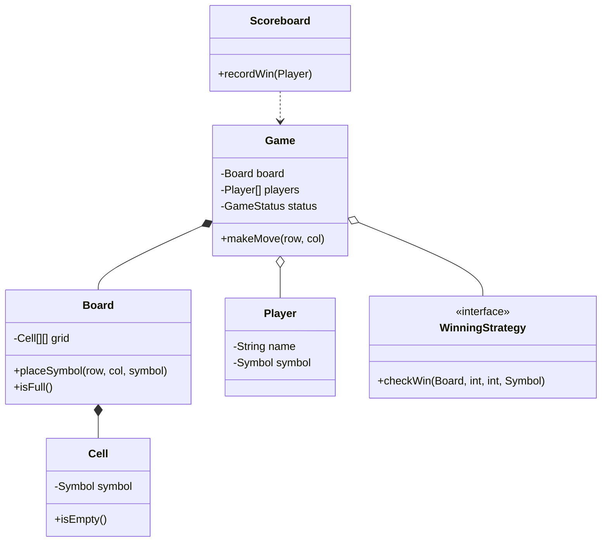
```mermaid
classDiagram
    class Game {
        -Board board
        -Player[] players
        -GameStatus status
        +makeMove(row, col)
    }
    class Board {
        -Cell[][] grid
        +placeSymbol(row, col, symbol)
        +isFull()
    }
    class Cell {
        -Symbol symbol
        +isEmpty()
    }
    class Player {
        -String name
        -Symbol symbol
    }
    class WinningStrategy {
        <<interface>>
        +checkWin(Board, int, int, Symbol)
    }
    class Scoreboard {
        +recordWin(Player)
    }
    Game *-- Board
    Board *-- Cell
    Game o-- Player
    Game o-- WinningStrategy
    Scoreboard ..> Game
```

### 5. State Transitions
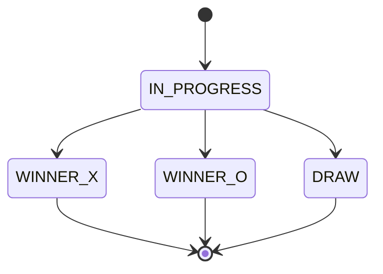
```mermaid
stateDiagram-v2
    [*] --> IN_PROGRESS
    IN_PROGRESS --> WINNER_X
    IN_PROGRESS --> WINNER_O
    IN_PROGRESS --> DRAW
    WINNER_X --> [*]
    WINNER_O --> [*]
    DRAW --> [*]
```

### 6. Core Flows
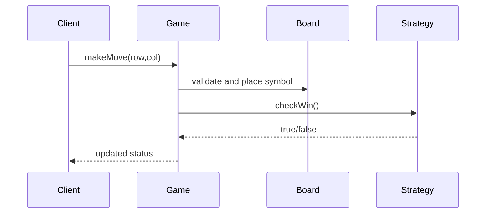
```mermaid
sequenceDiagram
    participant Client
    participant Game
    participant Board
    participant Strategy
    Client->>Game: makeMove(row,col)
    Game->>Board: validate and place symbol
    Game->>Strategy: checkWin()
    Strategy-->>Game: true/false
    Game-->>Client: updated status
```

### 7. Design Patterns Used
- Strategy: win detection.
- Observer: scoreboard updates.
- Facade: game system API.

### 8. Skeleton Code
```java
enum Symbol { X, O, EMPTY }
enum GameStatus { IN_PROGRESS, WINNER_X, WINNER_O, DRAW }

class Player {
    private final String name;
    private final Symbol symbol;
    public Player(String name, Symbol symbol) {
        if (symbol == Symbol.EMPTY) throw new IllegalArgumentException("Invalid symbol");
        this.name = name;
        this.symbol = symbol;
    }
    public String getName() { return name; }
    public Symbol getSymbol() { return symbol; }
}

class Cell {
    private Symbol symbol = Symbol.EMPTY;
    public boolean isEmpty() { return symbol == Symbol.EMPTY; }
    public Symbol getSymbol() { return symbol; }
    public void setSymbol(Symbol symbol) { this.symbol = symbol; }
}

class Board {
    private final int size;
    private final Cell[][] grid;
    public Board(int size) {
        this.size = size;
        this.grid = new Cell[size][size];
        for (int i = 0; i < size; i++)
            for (int j = 0; j < size; j++) grid[i][j] = new Cell();
    }
    public void placeSymbol(int row, int col, Symbol symbol) { /* TODO */ }
    public boolean isCellEmpty(int row, int col) { /* TODO */ return false; }
    public boolean isFull() { /* TODO */ return false; }
    public Symbol getSymbol(int row, int col) { return grid[row][col].getSymbol(); }
    public int getSize() { return size; }
}

interface WinningStrategy {
    boolean checkWin(Board board, int row, int col, Symbol symbol);
}

class RowWinningStrategy implements WinningStrategy {
    public boolean checkWin(Board board, int row, int col, Symbol symbol) { /* TODO */ return false; }
}

class ColumnWinningStrategy implements WinningStrategy {
    public boolean checkWin(Board board, int row, int col, Symbol symbol) { /* TODO */ return false; }
}

class DiagonalWinningStrategy implements WinningStrategy {
    public boolean checkWin(Board board, int row, int col, Symbol symbol) { /* TODO */ return false; }
}

class Game {
    private final Board board;
    private final Player[] players;
    private int currentPlayerIndex;
    private GameStatus status;
    private final java.util.List<WinningStrategy> strategies = new java.util.ArrayList<>();
    public Game(Player p1, Player p2) { /* TODO */ board = new Board(3); players = new Player[]{p1,p2}; }
    public void makeMove(int row, int col) { /* TODO */ }
    private void switchTurn() { currentPlayerIndex = 1 - currentPlayerIndex; }
}
```

### 9. Edge Cases
- Move outside board.
- Cell already occupied.
- Move after game is over.
- Same symbol assigned to both players.

---

## Design Chess Game

### 1. Requirements
- 8x8 board.
- Two players: white and black.
- Support pieces and legal moves.
- Track turn, check, checkmate, stalemate.

### 2. Core Use Cases
- Start game.
- Move piece.
- Validate move.
- Capture piece.
- Detect check/checkmate.

### 3. Entities + Responsibilities
| Entity | Responsibility |
|---|---|
| Board | 8x8 grid |
| Square | Board position |
| Piece | Abstract piece behavior |
| Move | Source, destination, piece |
| Player | Color and state |
| Game | Orchestrates play |
| MoveValidator | Validates piece rules |

### 4. Relationships
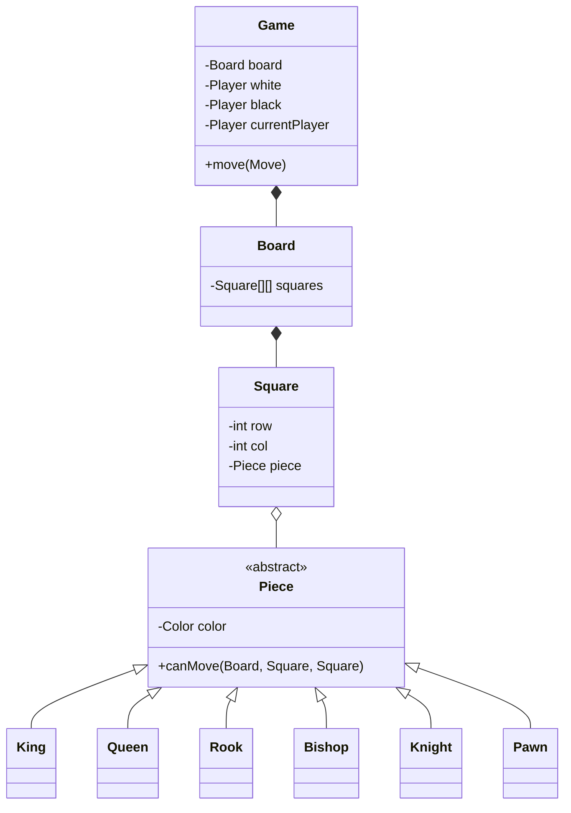
```mermaid
classDiagram
    class Game {
        -Board board
        -Player white
        -Player black
        -Player currentPlayer
        +move(Move)
    }
    class Board {
        -Square[][] squares
    }
    class Square {
        -int row
        -int col
        -Piece piece
    }
    class Piece {
        <<abstract>>
        -Color color
        +canMove(Board, Square, Square)
    }
    class King
    class Queen
    class Rook
    class Bishop
    class Knight
    class Pawn
    Piece <|-- King
    Piece <|-- Queen
    Piece <|-- Rook
    Piece <|-- Bishop
    Piece <|-- Knight
    Piece <|-- Pawn
    Game *-- Board
    Board *-- Square
    Square o-- Piece
```

### 5. State Transitions
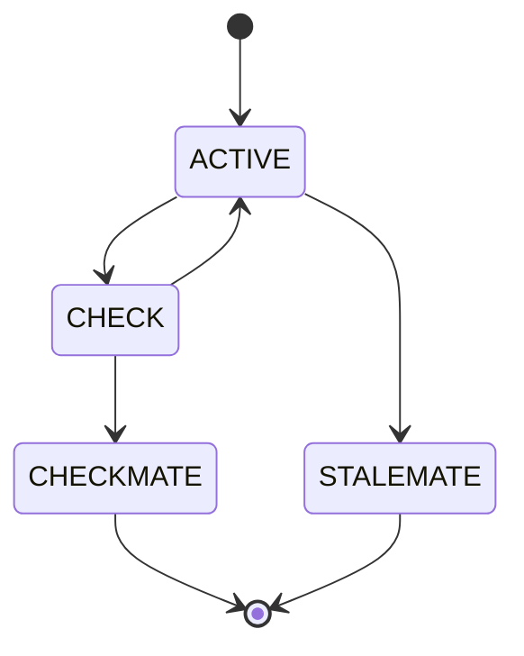
```mermaid
stateDiagram-v2
    [*] --> ACTIVE
    ACTIVE --> CHECK
    CHECK --> ACTIVE
    CHECK --> CHECKMATE
    ACTIVE --> STALEMATE
    CHECKMATE --> [*]
    STALEMATE --> [*]
```

### 6. Core Flows
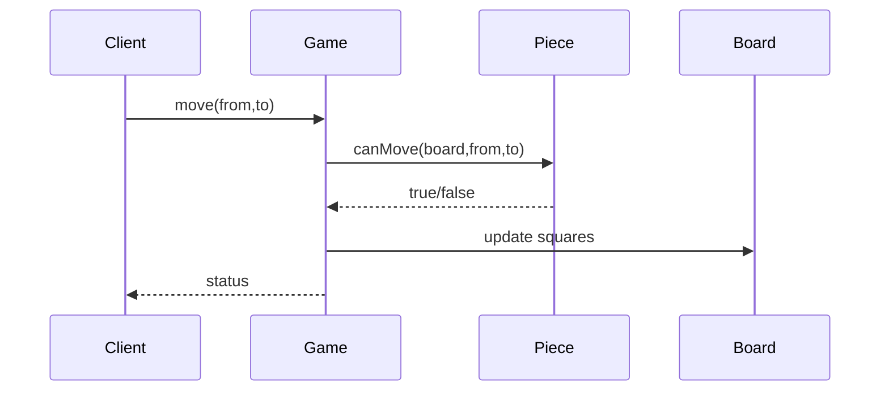
```mermaid
sequenceDiagram
    participant Client
    participant Game
    participant Piece
    participant Board
    Client->>Game: move(from,to)
    Game->>Piece: canMove(board,from,to)
    Piece-->>Game: true/false
    Game->>Board: update squares
    Game-->>Client: status
```

### 7. Design Patterns Used
- Strategy: move validation can be extracted per piece.
- Template Method: common piece movement flow.
- Factory: initial piece setup.

### 8. Skeleton Code
```java
enum Color { WHITE, BLACK }
enum GameState { ACTIVE, CHECK, CHECKMATE, STALEMATE }

class Square {
    private final int row, col;
    private Piece piece;
    public Square(int row, int col) { this.row = row; this.col = col; }
    public Piece getPiece() { return piece; }
    public void setPiece(Piece piece) { this.piece = piece; }
}

abstract class Piece {
    protected final Color color;
    protected boolean killed;
    public Piece(Color color) { this.color = color; }
    public abstract boolean canMove(Board board, Square from, Square to);
}

class King extends Piece { public King(Color c) { super(c); } public boolean canMove(Board b, Square f, Square t) { /* TODO */ return false; } }
class Queen extends Piece { public Queen(Color c) { super(c); } public boolean canMove(Board b, Square f, Square t) { /* TODO */ return false; } }
class Rook extends Piece { public Rook(Color c) { super(c); } public boolean canMove(Board b, Square f, Square t) { /* TODO */ return false; } }
class Bishop extends Piece { public Bishop(Color c) { super(c); } public boolean canMove(Board b, Square f, Square t) { /* TODO */ return false; } }
class Knight extends Piece { public Knight(Color c) { super(c); } public boolean canMove(Board b, Square f, Square t) { /* TODO */ return false; } }
class Pawn extends Piece { public Pawn(Color c) { super(c); } public boolean canMove(Board b, Square f, Square t) { /* TODO */ return false; } }

class Board {
    private final Square[][] squares = new Square[8][8];
    public Board() { /* TODO initialize squares and pieces */ }
    public Square getSquare(int row, int col) { /* TODO */ return null; }
}

class Move {
    private final Square from;
    private final Square to;
    public Move(Square from, Square to) { this.from = from; this.to = to; }
}

class Player {
    private final Color color;
    public Player(Color color) { this.color = color; }
}

class ChessGame {
    private Board board;
    private Player currentPlayer;
    private GameState state;
    public void move(Move move) { /* TODO validate, move, capture, check status */ }
}
```

### 9. Edge Cases
- Moving opponent piece.
- King moving into check.
- Castling, promotion, en passant.
- Same-color capture.

---

# 🧱 Data Structures & Search

## Design LRU Cache

### 1. Requirements
- Fixed capacity cache.
- `get(key)` returns value or -1.
- `put(key,value)` inserts/updates.
- Evict least recently used key.
- O(1) operations.

### 2. Core Use Cases
- Insert key.
- Read key.
- Update existing key.
- Evict old key.

### 3. Entities + Responsibilities
| Entity | Responsibility |
|---|---|
| Node | Doubly linked list node |
| LRUCache | Map + linked list orchestration |

### 4. Relationships
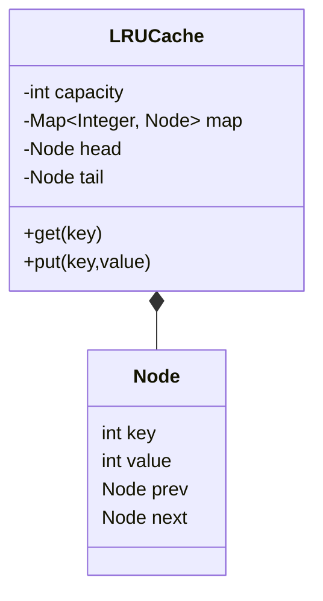
```mermaid
classDiagram
    class LRUCache {
        -int capacity
        -Map~Integer, Node~ map
        -Node head
        -Node tail
        +get(key)
        +put(key,value)
    }
    class Node {
        int key
        int value
        Node prev
        Node next
    }
    LRUCache *-- Node
```

### 5. State Transitions
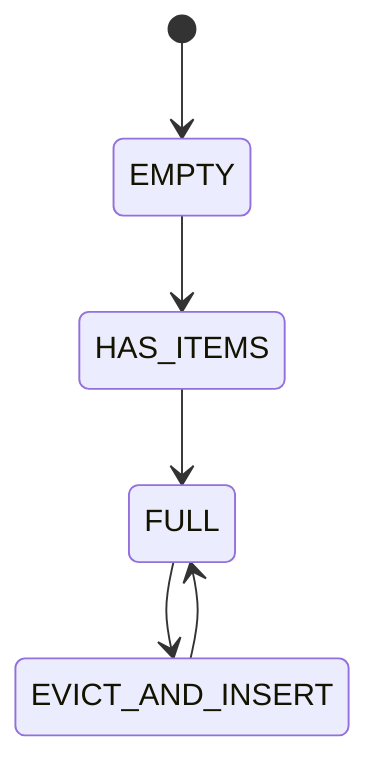
```mermaid
stateDiagram-v2
    [*] --> EMPTY
    EMPTY --> HAS_ITEMS
    HAS_ITEMS --> FULL
    FULL --> EVICT_AND_INSERT
    EVICT_AND_INSERT --> FULL
```

### 6. Core Flows
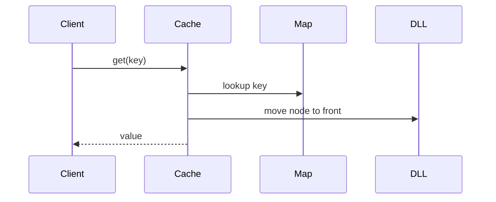
```mermaid
sequenceDiagram
    participant Client
    participant Cache
    participant Map
    participant DLL
    Client->>Cache: get(key)
    Cache->>Map: lookup key
    Cache->>DLL: move node to front
    Cache-->>Client: value
```

### 7. Design Patterns Used
- Hash map + doubly linked list.
- Sentinel nodes simplify edge cases.

### 8. Skeleton Code
```java
class LRUCache {
    private static class Node {
        int key, value;
        Node prev, next;
        Node(int key, int value) { this.key = key; this.value = value; }
    }

    private final int capacity;
    private final java.util.Map<Integer, Node> map = new java.util.HashMap<>();
    private final Node head = new Node(-1, -1);
    private final Node tail = new Node(-1, -1);

    public LRUCache(int capacity) {
        this.capacity = capacity;
        head.next = tail;
        tail.prev = head;
    }

    public int get(int key) { /* TODO */ return -1; }
    public void put(int key, int value) { /* TODO */ }
    private void addToFront(Node node) { /* TODO */ }
    private void remove(Node node) { /* TODO */ }
    private Node removeLRU() { /* TODO */ return null; }
}
```

### 9. Edge Cases
- Capacity zero.
- Updating existing key.
- Repeated get on same key.
- Eviction when full.

---

## Design Search Autocomplete System

### 1. Requirements
- Return suggestions for prefix.
- Rank suggestions by frequency.
- Update frequency when query is selected.
- Support fast prefix lookup.

### 2. Core Use Cases
- Insert sentence/query.
- Search by prefix.
- Update ranking.

### 3. Entities + Responsibilities
| Entity | Responsibility |
|---|---|
| TrieNode | Children and suggestions |
| Trie | Prefix search |
| Suggestion | Text and score |
| AutocompleteSystem | Public API |

### 4. Relationships
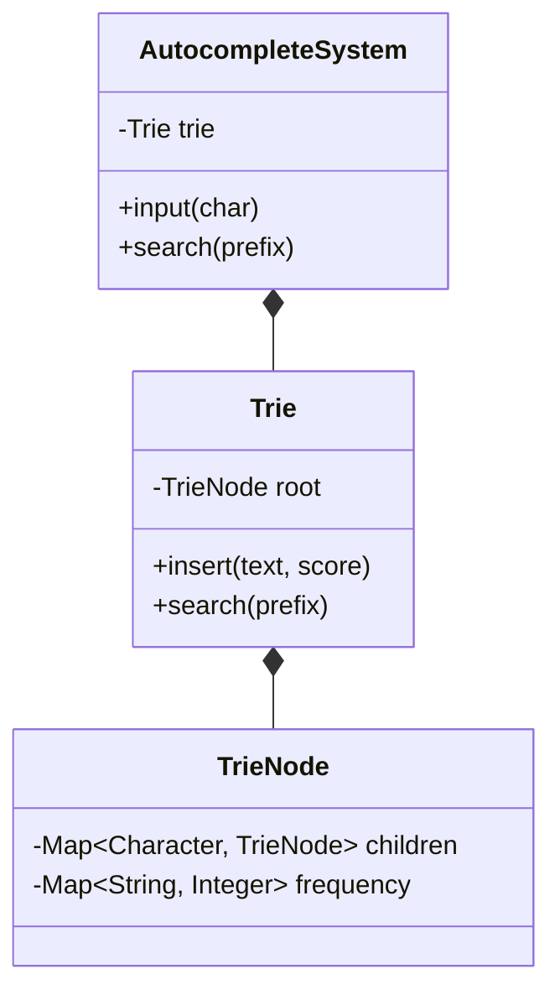
```mermaid
classDiagram
    class AutocompleteSystem {
        -Trie trie
        +input(char)
        +search(prefix)
    }
    class Trie {
        -TrieNode root
        +insert(text, score)
        +search(prefix)
    }
    class TrieNode {
        -Map~Character, TrieNode~ children
        -Map~String, Integer~ frequency
    }
    AutocompleteSystem *-- Trie
    Trie *-- TrieNode
```

### 5. State Transitions
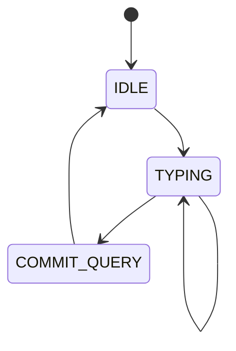
```mermaid
stateDiagram-v2
    [*] --> IDLE
    IDLE --> TYPING
    TYPING --> TYPING
    TYPING --> COMMIT_QUERY
    COMMIT_QUERY --> IDLE
```

### 6. Core Flows
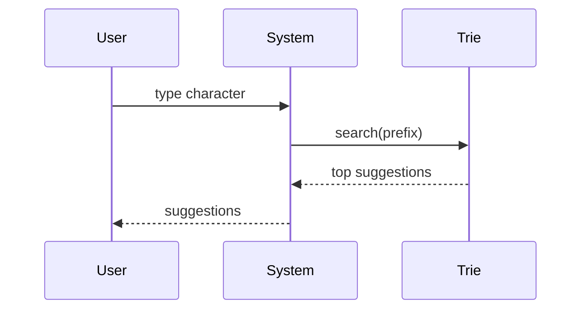
```mermaid
sequenceDiagram
    participant User
    participant System
    participant Trie
    User->>System: type character
    System->>Trie: search(prefix)
    Trie-->>System: top suggestions
    System-->>User: suggestions
```

### 7. Design Patterns Used
- Trie data structure.
- Strategy can be used for ranking.

### 8. Skeleton Code
```java
class AutocompleteSystem {
    private final Trie trie = new Trie();
    private final StringBuilder currentInput = new StringBuilder();

    public AutocompleteSystem(String[] sentences, int[] times) { /* TODO */ }
    public java.util.List<String> input(char c) { /* TODO */ return java.util.List.of(); }
}

class Trie {
    private final TrieNode root = new TrieNode();
    public void insert(String text, int score) { /* TODO */ }
    public java.util.List<String> search(String prefix) { /* TODO */ return java.util.List.of(); }
}

class TrieNode {
    java.util.Map<Character, TrieNode> children = new java.util.HashMap<>();
    java.util.Map<String, Integer> frequency = new java.util.HashMap<>();
}
```

### 9. Edge Cases
- Empty prefix.
- Duplicate query.
- Tie in frequency.
- Special end character like `#`.

---

# 🔄 Managing States

## Design ATM

### 1. Requirements
- Authenticate card and PIN.
- Check balance.
- Withdraw cash.
- Deposit cash.
- Maintain ATM cash.

### 2. Core Use Cases
- Insert card.
- Enter PIN.
- Select transaction.
- Withdraw/deposit.
- Eject card.

### 3. Entities + Responsibilities
| Entity | Responsibility |
|---|---|
| ATM | Main machine |
| ATMState | State-specific behavior |
| Card | User card |
| Account | Balance |
| Transaction | Operation abstraction |
| CashDispenser | Dispense cash |

### 4. Relationships
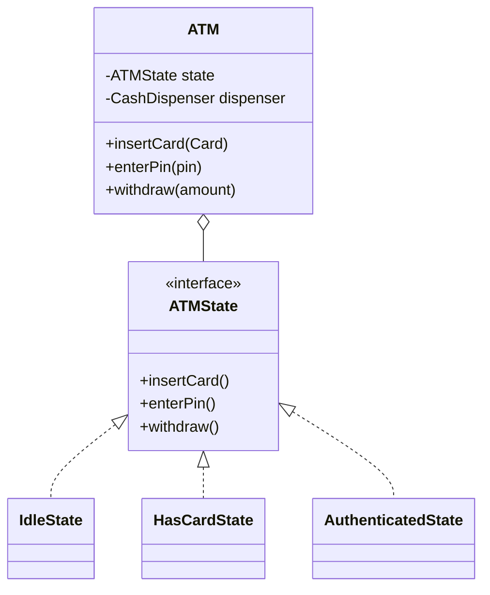
```mermaid
classDiagram
    class ATM {
        -ATMState state
        -CashDispenser dispenser
        +insertCard(Card)
        +enterPin(pin)
        +withdraw(amount)
    }
    class ATMState {
        <<interface>>
        +insertCard()
        +enterPin()
        +withdraw()
    }
    class IdleState
    class HasCardState
    class AuthenticatedState
    ATMState <|.. IdleState
    ATMState <|.. HasCardState
    ATMState <|.. AuthenticatedState
    ATM o-- ATMState
```

### 5. State Transitions
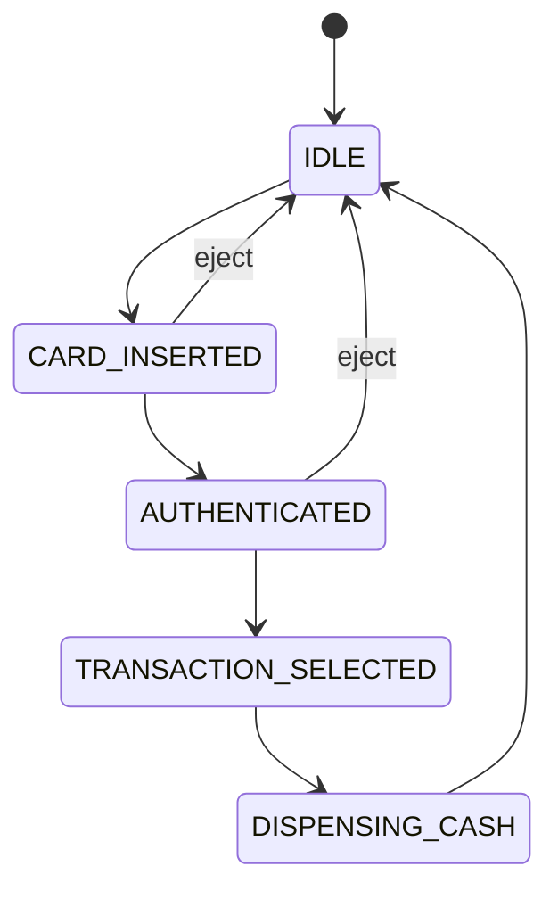
```mermaid
stateDiagram-v2
    [*] --> IDLE
    IDLE --> CARD_INSERTED
    CARD_INSERTED --> AUTHENTICATED
    AUTHENTICATED --> TRANSACTION_SELECTED
    TRANSACTION_SELECTED --> DISPENSING_CASH
    DISPENSING_CASH --> IDLE
    CARD_INSERTED --> IDLE: eject
    AUTHENTICATED --> IDLE: eject
```

### 6. Core Flows
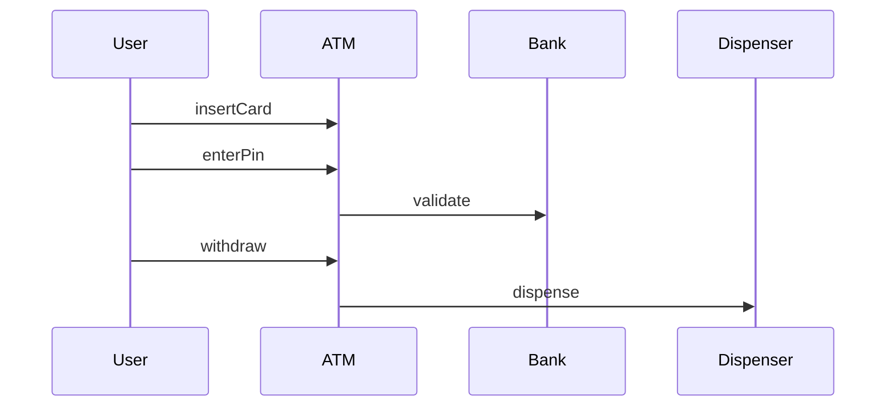
```mermaid
sequenceDiagram
    participant User
    participant ATM
    participant Bank
    participant Dispenser
    User->>ATM: insertCard
    User->>ATM: enterPin
    ATM->>Bank: validate
    User->>ATM: withdraw
    ATM->>Dispenser: dispense
```

### 7. Design Patterns Used
- State: ATM behavior changes by state.
- Strategy: transaction processing.
- Chain of Responsibility: cash denomination dispensing.

### 8. Skeleton Code
```java
interface ATMState {
    void insertCard(ATM atm, Card card);
    void enterPin(ATM atm, String pin);
    void withdraw(ATM atm, int amount);
    void ejectCard(ATM atm);
}

class ATM {
    private ATMState state;
    private Card currentCard;
    private final CashDispenser dispenser = new CashDispenser();
    public ATM() { this.state = new IdleState(); }
    public void setState(ATMState state) { this.state = state; }
    public void insertCard(Card card) { state.insertCard(this, card); }
    public void enterPin(String pin) { state.enterPin(this, pin); }
    public void withdraw(int amount) { state.withdraw(this, amount); }
}

class IdleState implements ATMState { public void insertCard(ATM atm, Card card) { /* TODO */ } public void enterPin(ATM a,String p){} public void withdraw(ATM a,int n){} public void ejectCard(ATM a){} }
class HasCardState implements ATMState { public void insertCard(ATM a,Card c){} public void enterPin(ATM atm,String pin){ /* TODO */ } public void withdraw(ATM a,int n){} public void ejectCard(ATM atm){ /* TODO */ } }
class AuthenticatedState implements ATMState { public void insertCard(ATM a,Card c){} public void enterPin(ATM a,String p){} public void withdraw(ATM atm,int amount){ /* TODO */ } public void ejectCard(ATM atm){ /* TODO */ } }

class Card { private final String number; public Card(String number) { this.number = number; } }
class Account { private double balance; public boolean debit(double amount) { /* TODO */ return false; } }
class CashDispenser { public void dispense(int amount) { /* TODO */ } }
```

### 9. Edge Cases
- Invalid PIN.
- Insufficient account balance.
- Insufficient ATM cash.
- Card stuck/eject failure.

---

## Design Elevator System

### 1. Requirements
- Multiple elevators.
- Users request pickup and destination.
- Scheduler assigns elevator.
- Elevator moves between floors.

### 2. Core Use Cases
- Request elevator.
- Assign elevator.
- Move elevator.
- Open/close doors.

### 3. Entities + Responsibilities
| Entity | Responsibility |
|---|---|
| Elevator | Movement and state |
| Request | Source/destination |
| Scheduler | Assigns requests |
| Controller | System facade |
| Door | Door state |

### 4. Relationships
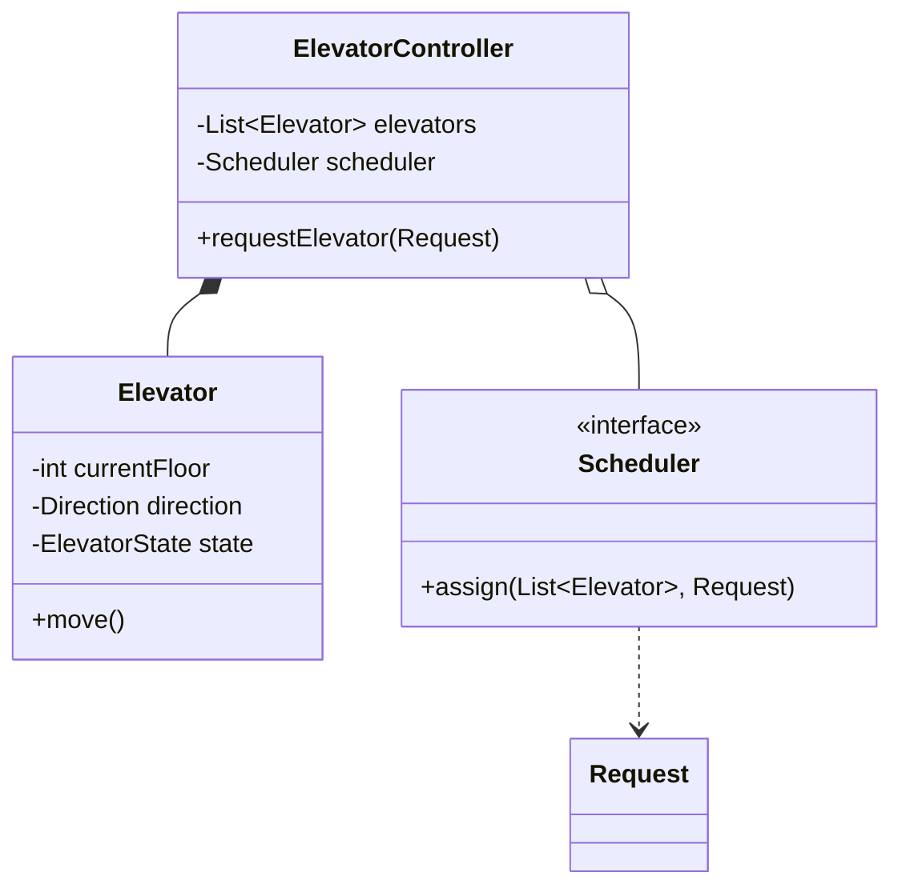
```mermaid
classDiagram
    class ElevatorController {
        -List~Elevator~ elevators
        -Scheduler scheduler
        +requestElevator(Request)
    }
    class Elevator {
        -int currentFloor
        -Direction direction
        -ElevatorState state
        +move()
    }
    class Scheduler {
        <<interface>>
        +assign(List~Elevator~, Request)
    }
    class Request
    ElevatorController *-- Elevator
    ElevatorController o-- Scheduler
    Scheduler ..> Request
```

### 5. State Transitions
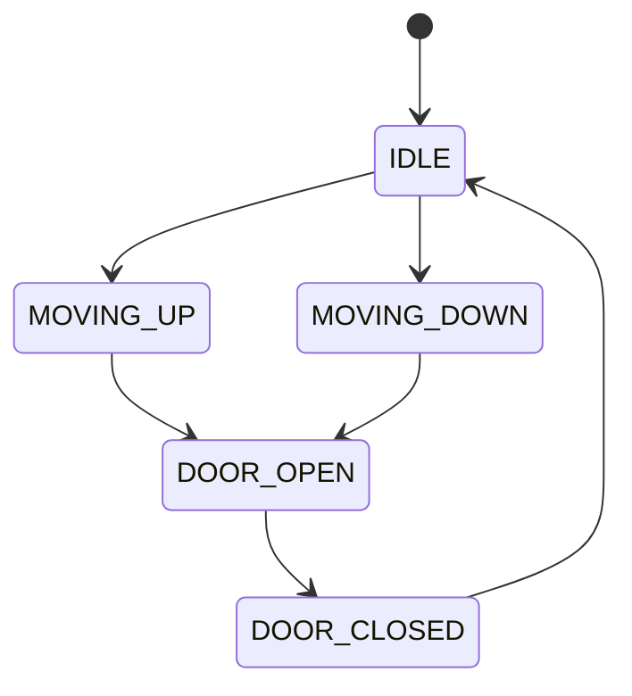
```mermaid
stateDiagram-v2
    [*] --> IDLE
    IDLE --> MOVING_UP
    IDLE --> MOVING_DOWN
    MOVING_UP --> DOOR_OPEN
    MOVING_DOWN --> DOOR_OPEN
    DOOR_OPEN --> DOOR_CLOSED
    DOOR_CLOSED --> IDLE
```

### 6. Core Flows
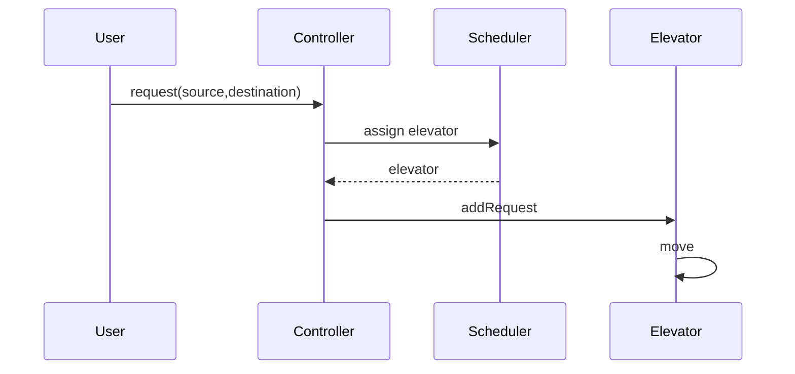
```mermaid
sequenceDiagram
    participant User
    participant Controller
    participant Scheduler
    participant Elevator
    User->>Controller: request(source,destination)
    Controller->>Scheduler: assign elevator
    Scheduler-->>Controller: elevator
    Controller->>Elevator: addRequest
    Elevator->>Elevator: move
```

### 7. Design Patterns Used
- Strategy: elevator scheduling.
- State: elevator movement state.
- Command: request object.

### 8. Skeleton Code
```java
enum Direction { UP, DOWN, IDLE }
enum ElevatorState { IDLE, MOVING, DOOR_OPEN }

class Request {
    final int sourceFloor;
    final int destinationFloor;
    public Request(int source, int destination) { this.sourceFloor = source; this.destinationFloor = destination; }
}

interface Scheduler {
    Elevator assign(java.util.List<Elevator> elevators, Request request);
}

class NearestElevatorScheduler implements Scheduler {
    public Elevator assign(java.util.List<Elevator> elevators, Request request) { /* TODO */ return null; }
}

class Elevator {
    private final int id;
    private int currentFloor;
    private Direction direction = Direction.IDLE;
    private ElevatorState state = ElevatorState.IDLE;
    private final java.util.Queue<Request> requests = new java.util.LinkedList<>();
    public Elevator(int id) { this.id = id; }
    public void addRequest(Request request) { /* TODO */ }
    public void step() { /* TODO move one floor */ }
}

class ElevatorController {
    private final java.util.List<Elevator> elevators;
    private final Scheduler scheduler;
    public ElevatorController(java.util.List<Elevator> elevators, Scheduler scheduler) { this.elevators = elevators; this.scheduler = scheduler; }
    public void requestElevator(Request request) { /* TODO */ }
}
```

### 9. Edge Cases
- Same source and destination.
- All elevators busy.
- Over capacity.
- Emergency stop.

---

# 🏢 Management Systems

## Design Parking Lot

### 1. Requirements
- Multiple floors.
- Vehicle types: bike, car, truck.
- Spot sizes: small, medium, large.
- Auto spot allocation.
- Generate ticket and calculate fee.

### 2. Core Use Cases
- Park vehicle.
- Unpark vehicle.
- Display availability.
- Calculate fee.

### 3. Entities + Responsibilities
| Entity | Responsibility |
|---|---|
| Vehicle | License and size |
| ParkingSpot | Occupancy and compatibility |
| ParkingFloor | Groups spots |
| ParkingTicket | Session record |
| ParkingLot | Orchestrator |
| FeeStrategy | Fee calculation |
| SpotAllocationStrategy | Spot selection |

### 4. Relationships
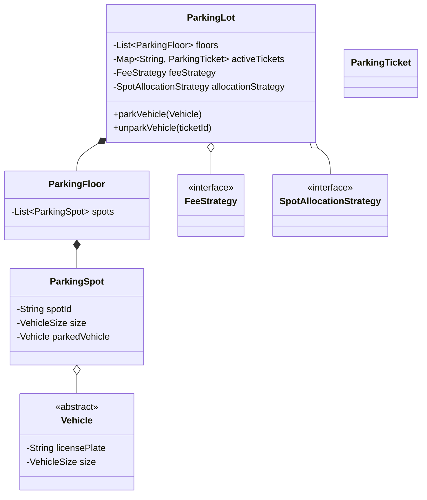
```mermaid
classDiagram
    class ParkingLot {
        -List~ParkingFloor~ floors
        -Map~String, ParkingTicket~ activeTickets
        -FeeStrategy feeStrategy
        -SpotAllocationStrategy allocationStrategy
        +parkVehicle(Vehicle)
        +unparkVehicle(ticketId)
    }
    class ParkingFloor {
        -List~ParkingSpot~ spots
    }
    class ParkingSpot {
        -String spotId
        -VehicleSize size
        -Vehicle parkedVehicle
    }
    class Vehicle {
        <<abstract>>
        -String licensePlate
        -VehicleSize size
    }
    class ParkingTicket
    class FeeStrategy { <<interface>> }
    class SpotAllocationStrategy { <<interface>> }
    ParkingLot *-- ParkingFloor
    ParkingFloor *-- ParkingSpot
    ParkingSpot o-- Vehicle
    ParkingLot o-- FeeStrategy
    ParkingLot o-- SpotAllocationStrategy
```

### 5. State Transitions
```mermaid
stateDiagram-v2
    [*] --> AVAILABLE
    AVAILABLE --> OCCUPIED: park
    OCCUPIED --> AVAILABLE: unpark
```

### 6. Core Flows
```mermaid
sequenceDiagram
    participant Client
    participant Lot
    participant Strategy
    participant Spot
    Client->>Lot: parkVehicle(vehicle)
    Lot->>Strategy: findSpot(floors, size)
    Strategy-->>Lot: spot
    Lot->>Spot: parkVehicle(vehicle)
    Lot-->>Client: ticket
```

### 7. Design Patterns Used
- Singleton: one parking lot.
- Strategy: fee and spot allocation.
- Facade: ParkingLot public API.

### 8. Skeleton Code
```java
enum VehicleSize { SMALL, MEDIUM, LARGE }

abstract class Vehicle {
    private final String licensePlate;
    private final VehicleSize size;
    protected Vehicle(String plate, VehicleSize size) { this.licensePlate = plate; this.size = size; }
    public String getLicensePlate() { return licensePlate; }
    public VehicleSize getSize() { return size; }
}
class Bike extends Vehicle { public Bike(String p) { super(p, VehicleSize.SMALL); } }
class Car extends Vehicle { public Car(String p) { super(p, VehicleSize.MEDIUM); } }
class Truck extends Vehicle { public Truck(String p) { super(p, VehicleSize.LARGE); } }

class ParkingSpot {
    private final String spotId;
    private final VehicleSize size;
    private Vehicle parkedVehicle;
    public ParkingSpot(String id, VehicleSize size) { this.spotId = id; this.size = size; }
    public synchronized boolean isAvailable() { return parkedVehicle == null; }
    public boolean canFitVehicle(VehicleSize vehicleSize) { return vehicleSize.ordinal() <= size.ordinal(); }
    public synchronized void parkVehicle(Vehicle vehicle) { /* TODO */ }
    public synchronized Vehicle unparkVehicle() { /* TODO */ return null; }
}

class ParkingTicket {
    private final String ticketId;
    private final Vehicle vehicle;
    private final ParkingSpot spot;
    private final java.time.LocalDateTime entryTime;
    private java.time.LocalDateTime exitTime;
    public ParkingTicket(String id, Vehicle vehicle, ParkingSpot spot) { /* TODO */ this.ticketId=id; this.vehicle=vehicle; this.spot=spot; this.entryTime=java.time.LocalDateTime.now(); }
}

interface FeeStrategy { double calculateFee(ParkingTicket ticket); }
interface SpotAllocationStrategy { ParkingSpot findSpot(java.util.List<ParkingFloor> floors, VehicleSize size); }

class ParkingFloor {
    private final int floorNumber;
    private final java.util.List<ParkingSpot> spots = new java.util.ArrayList<>();
    public ParkingFloor(int floorNumber) { this.floorNumber = floorNumber; }
    public ParkingSpot findAvailableSpot(VehicleSize size) { /* TODO */ return null; }
}

class ParkingLot {
    private static volatile ParkingLot instance;
    private final java.util.List<ParkingFloor> floors = new java.util.ArrayList<>();
    private final java.util.Map<String, ParkingTicket> activeTickets = new java.util.concurrent.ConcurrentHashMap<>();
    private FeeStrategy feeStrategy;
    private SpotAllocationStrategy allocationStrategy;
    private ParkingLot() {}
    public static ParkingLot getInstance() { /* TODO double checked locking */ return null; }
    public ParkingTicket parkVehicle(Vehicle vehicle) { /* TODO */ return null; }
    public double unparkVehicle(String ticketId) { /* TODO */ return 0.0; }
}
```

### 9. Edge Cases
- No compatible spot.
- Duplicate vehicle parked.
- Invalid ticket.
- Concurrent parking attempts.

---

## Design Inventory Management System

### 1. Requirements
- Manage products and stock.
- Add/remove inventory.
- Track warehouses.
- Alert low stock.

### 2. Core Use Cases
- Add product.
- Update stock.
- Reserve stock.
- Release stock.
- Transfer stock.

### 3. Entities + Responsibilities
| Entity | Responsibility |
|---|---|
| Product | Product metadata |
| InventoryItem | Product quantity at location |
| Warehouse | Holds inventory |
| InventoryService | Orchestrates operations |
| StockMovement | Audit log |
| ReorderPolicy | Low-stock rule |

### 4. Relationships
```mermaid
classDiagram
    class InventoryService {
        -List~Warehouse~ warehouses
        +addStock()
        +reserveStock()
    }
    class Warehouse {
        -Map~String, InventoryItem~ items
    }
    class InventoryItem {
        -Product product
        -int available
        -int reserved
    }
    class Product {
        -String sku
        -String name
    }
    InventoryService *-- Warehouse
    Warehouse *-- InventoryItem
    InventoryItem o-- Product
```

### 5. State Transitions
```mermaid
stateDiagram-v2
    [*] --> AVAILABLE
    AVAILABLE --> RESERVED
    RESERVED --> SOLD
    RESERVED --> AVAILABLE: release
    AVAILABLE --> OUT_OF_STOCK
```

### 6. Core Flows
```mermaid
sequenceDiagram
    participant Client
    participant Service
    participant Warehouse
    participant Item
    Client->>Service: reserve(sku, qty)
    Service->>Warehouse: find item
    Warehouse->>Item: reserve(qty)
    Item-->>Client: success/failure
```

### 7. Design Patterns Used
- Repository: product/inventory storage.
- Observer: low stock alerts.
- Strategy: reorder policy.

### 8. Skeleton Code
```java
class Product {
    private final String sku;
    private final String name;
    public Product(String sku, String name) { this.sku = sku; this.name = name; }
}

class InventoryItem {
    private final Product product;
    private int availableQuantity;
    private int reservedQuantity;
    public InventoryItem(Product product, int quantity) { this.product = product; this.availableQuantity = quantity; }
    public synchronized void addStock(int qty) { /* TODO */ }
    public synchronized boolean reserve(int qty) { /* TODO */ return false; }
    public synchronized void release(int qty) { /* TODO */ }
    public synchronized void deductReserved(int qty) { /* TODO */ }
}

class Warehouse {
    private final String id;
    private final java.util.Map<String, InventoryItem> inventory = new java.util.HashMap<>();
    public Warehouse(String id) { this.id = id; }
    public InventoryItem getItem(String sku) { /* TODO */ return null; }
}

interface ReorderPolicy { boolean shouldReorder(InventoryItem item); }
class FixedThresholdPolicy implements ReorderPolicy { public boolean shouldReorder(InventoryItem item) { /* TODO */ return false; } }

class InventoryService {
    private final java.util.List<Warehouse> warehouses = new java.util.ArrayList<>();
    public void addStock(String warehouseId, String sku, int qty) { /* TODO */ }
    public boolean reserveStock(String sku, int qty) { /* TODO */ return false; }
    public void transferStock(String from, String to, String sku, int qty) { /* TODO */ }
}
```

### 9. Edge Cases
- Negative quantity.
- Overselling.
- Stock transfer failure.
- Concurrent reservations.

---

# 🌐 Social & Content Platforms

## Design a Social Network

### 1. Requirements
- Users can post content.
- Users can follow/unfollow.
- Generate feed.
- Like/comment on posts.

### 2. Core Use Cases
- Create profile.
- Follow user.
- Create post.
- View feed.
- Like/comment.

### 3. Entities + Responsibilities
| Entity | Responsibility |
|---|---|
| User | Profile |
| Post | Content |
| Comment | Reply |
| FollowService | Relationships |
| FeedService | Feed generation |
| NotificationService | Events |

### 4. Relationships
```mermaid
classDiagram
    class User
    class Post
    class Comment
    class FollowService
    class FeedService
    User "1" --> "many" Post
    Post "1" --> "many" Comment
    FeedService ..> FollowService
    FeedService ..> Post
```

### 5. State Transitions
```mermaid
stateDiagram-v2
    [*] --> DRAFT
    DRAFT --> PUBLISHED
    PUBLISHED --> HIDDEN
    PUBLISHED --> DELETED
```

### 6. Core Flows
```mermaid
sequenceDiagram
    participant User
    participant PostService
    participant FeedService
    User->>PostService: createPost
    PostService->>FeedService: fanout/update feed
    FeedService-->>User: feed updated
```

### 7. Design Patterns Used
- Observer: notifications.
- Strategy: feed ranking.
- Repository: data access.

### 8. Skeleton Code
```java
class User {
    private final String id;
    private String name;
    public User(String id, String name) { this.id = id; this.name = name; }
}

class Post {
    private final String id;
    private final String authorId;
    private final String content;
    private final java.time.LocalDateTime createdAt;
    public Post(String id, String authorId, String content) { /* TODO */ this.id=id; this.authorId=authorId; this.content=content; this.createdAt=java.time.LocalDateTime.now(); }
}

class Comment {
    private final String id;
    private final String postId;
    private final String userId;
    private final String text;
    public Comment(String id, String postId, String userId, String text) { this.id=id; this.postId=postId; this.userId=userId; this.text=text; }
}

class FollowService {
    private final java.util.Map<String, java.util.Set<String>> following = new java.util.HashMap<>();
    public void follow(String followerId, String followeeId) { /* TODO */ }
    public void unfollow(String followerId, String followeeId) { /* TODO */ }
    public java.util.Set<String> getFollowing(String userId) { /* TODO */ return java.util.Set.of(); }
}

interface FeedRankingStrategy { java.util.List<Post> rank(java.util.List<Post> posts); }

class FeedService {
    private final FollowService followService;
    private final FeedRankingStrategy rankingStrategy;
    public FeedService(FollowService f, FeedRankingStrategy r) { this.followService=f; this.rankingStrategy=r; }
    public java.util.List<Post> getFeed(String userId) { /* TODO */ return java.util.List.of(); }
}
```

### 9. Edge Cases
- Follow self.
- Duplicate follow.
- Deleted post in feed.
- Abuse/spam content.

---

## Design Spotify

### 1. Requirements
- Users can search and play songs.
- Users can create playlists.
- Track playback state.
- Support premium/free differences.

### 2. Core Use Cases
- Search song.
- Play/pause/skip.
- Create playlist.
- Add/remove song.

### 3. Entities + Responsibilities
| Entity | Responsibility |
|---|---|
| Song | Music metadata |
| Album | Collection of songs |
| Artist | Creator |
| Playlist | User collection |
| Player | Playback state |
| SearchService | Search catalog |

### 4. Relationships
```mermaid
classDiagram
    class User
    class Playlist
    class Song
    class Player
    class SearchService
    User "1" --> "many" Playlist
    Playlist "many" --> "many" Song
    Player o-- Song
    SearchService ..> Song
```

### 5. State Transitions
```mermaid
stateDiagram-v2
    [*] --> STOPPED
    STOPPED --> PLAYING
    PLAYING --> PAUSED
    PAUSED --> PLAYING
    PLAYING --> STOPPED
```

### 6. Core Flows
```mermaid
sequenceDiagram
    participant User
    participant Search
    participant Player
    User->>Search: search(query)
    Search-->>User: songs
    User->>Player: play(song)
    Player-->>User: playing
```

### 7. Design Patterns Used
- State: player state.
- Strategy: shuffle/recommendation/search ranking.
- Composite: playlist contains songs.

### 8. Skeleton Code
```java
enum PlaybackState { STOPPED, PLAYING, PAUSED }

class Song {
    private final String id, title, artistId;
    private final int durationSeconds;
    public Song(String id, String title, String artistId, int durationSeconds) { this.id=id; this.title=title; this.artistId=artistId; this.durationSeconds=durationSeconds; }
}

class Playlist {
    private final String id;
    private final String ownerId;
    private final java.util.List<Song> songs = new java.util.ArrayList<>();
    public Playlist(String id, String ownerId) { this.id=id; this.ownerId=ownerId; }
    public void addSong(Song song) { /* TODO */ }
    public void removeSong(String songId) { /* TODO */ }
}

class MusicPlayer {
    private PlaybackState state = PlaybackState.STOPPED;
    private Song currentSong;
    public void play(Song song) { /* TODO */ }
    public void pause() { /* TODO */ }
    public void resume() { /* TODO */ }
    public void stop() { /* TODO */ }
}

interface SearchStrategy { java.util.List<Song> search(String query); }
class CatalogSearchService implements SearchStrategy { public java.util.List<Song> search(String query) { /* TODO */ return java.util.List.of(); } }
```

### 9. Edge Cases
- Song unavailable by region.
- Playlist duplicate song.
- Free user skip limit.
- Network failure during playback.

---

# 💬 Communication & Messaging

## Design Pub Sub System

### 1. Requirements
- Publishers send messages to topics.
- Subscribers consume messages from topics.
- Support multiple subscribers per topic.
- Preserve topic-level ordering if needed.

### 2. Core Use Cases
- Create topic.
- Subscribe.
- Publish message.
- Consume message.

### 3. Entities + Responsibilities
| Entity | Responsibility |
|---|---|
| Topic | Message stream |
| Message | Payload |
| Publisher | Sends message |
| Subscriber | Receives message |
| Broker | Routes messages |

### 4. Relationships
```mermaid
classDiagram
    class Broker {
        -Map~String, Topic~ topics
        +publish(topic, message)
        +subscribe(topic, subscriber)
    }
    class Topic {
        -Queue~Message~ messages
        -List~Subscriber~ subscribers
    }
    class Message
    class Subscriber { <<interface>> }
    Broker *-- Topic
    Topic o-- Subscriber
    Topic *-- Message
```

### 5. State Transitions
```mermaid
stateDiagram-v2
    [*] --> CREATED
    CREATED --> PUBLISHED
    PUBLISHED --> DELIVERED
    DELIVERED --> ACKED
    DELIVERED --> RETRY
```

### 6. Core Flows
```mermaid
sequenceDiagram
    participant Publisher
    participant Broker
    participant Topic
    participant Subscriber
    Publisher->>Broker: publish(topic,msg)
    Broker->>Topic: append msg
    Topic->>Subscriber: notify msg
```

### 7. Design Patterns Used
- Observer: subscribers receive events.
- Queue: message buffering.
- Strategy: retry/delivery policy.

### 8. Skeleton Code
```java
class Message {
    private final String id;
    private final String payload;
    public Message(String id, String payload) { this.id=id; this.payload=payload; }
}

interface Subscriber {
    void onMessage(Message message);
}

class Topic {
    private final String name;
    private final java.util.Queue<Message> messages = new java.util.concurrent.ConcurrentLinkedQueue<>();
    private final java.util.List<Subscriber> subscribers = new java.util.concurrent.CopyOnWriteArrayList<>();
    public Topic(String name) { this.name = name; }
    public void subscribe(Subscriber subscriber) { /* TODO */ }
    public void publish(Message message) { /* TODO */ }
}

class Broker {
    private final java.util.Map<String, Topic> topics = new java.util.concurrent.ConcurrentHashMap<>();
    public void createTopic(String name) { /* TODO */ }
    public void subscribe(String topic, Subscriber subscriber) { /* TODO */ }
    public void publish(String topic, Message message) { /* TODO */ }
}
```

### 9. Edge Cases
- Topic does not exist.
- Subscriber failure.
- Duplicate messages.
- Backpressure.

---

## Design Chat Application

### 1. Requirements
- One-to-one and group chats.
- Send/receive messages.
- Online/offline users.
- Message delivery status.

### 2. Core Use Cases
- Create chat.
- Send message.
- Receive message.
- Mark read.

### 3. Entities + Responsibilities
| Entity | Responsibility |
|---|---|
| User | Chat participant |
| ChatRoom | Conversation |
| Message | Text/media |
| MessageService | Delivery |
| PresenceService | Online status |
| NotificationService | Offline notifications |

### 4. Relationships
```mermaid
classDiagram
    class ChatRoom {
        -List~User~ members
        -List~Message~ messages
    }
    class User
    class Message
    class MessageService
    class PresenceService
    ChatRoom o-- User
    ChatRoom *-- Message
    MessageService ..> ChatRoom
    MessageService ..> PresenceService
```

### 5. State Transitions
```mermaid
stateDiagram-v2
    [*] --> SENT
    SENT --> DELIVERED
    DELIVERED --> READ
    SENT --> FAILED
```

### 6. Core Flows
```mermaid
sequenceDiagram
    participant Sender
    participant Service
    participant Room
    participant Receiver
    Sender->>Service: sendMessage(room,msg)
    Service->>Room: save message
    Service->>Receiver: deliver/notify
```

### 7. Design Patterns Used
- Observer: online delivery.
- Mediator: chat room coordinates users.
- Strategy: notification channel.

### 8. Skeleton Code
```java
enum MessageStatus { SENT, DELIVERED, READ, FAILED }

class User {
    private final String id;
    private final String name;
    public User(String id, String name) { this.id=id; this.name=name; }
}

class Message {
    private final String id;
    private final String senderId;
    private final String content;
    private MessageStatus status = MessageStatus.SENT;
    public Message(String id, String senderId, String content) { this.id=id; this.senderId=senderId; this.content=content; }
}

class ChatRoom {
    private final String id;
    private final java.util.List<User> members = new java.util.ArrayList<>();
    private final java.util.List<Message> messages = new java.util.ArrayList<>();
    public ChatRoom(String id) { this.id=id; }
    public void addMember(User user) { /* TODO */ }
    public void addMessage(Message message) { /* TODO */ }
}

class PresenceService {
    public boolean isOnline(String userId) { /* TODO */ return false; }
}

class MessageService {
    private final PresenceService presenceService;
    public MessageService(PresenceService presenceService) { this.presenceService = presenceService; }
    public void sendMessage(ChatRoom room, Message message) { /* TODO */ }
}
```

### 9. Edge Cases
- Blocked user.
- User removed from group.
- Offline delivery.
- Duplicate message retry.

---

# 💰 Financial & Payment Systems

## Design Payment Gateway

### 1. Requirements
- Process payments through providers.
- Support card, wallet, UPI/bank.
- Track payment status.
- Handle refunds.

### 2. Core Use Cases
- Initiate payment.
- Authorize/capture.
- Retry failed payment.
- Refund payment.

### 3. Entities + Responsibilities
| Entity | Responsibility |
|---|---|
| Payment | Transaction data |
| PaymentMethod | Card/wallet/bank abstraction |
| PaymentProcessor | Provider integration |
| PaymentGateway | Orchestration |
| Refund | Refund record |

### 4. Relationships
```mermaid
classDiagram
    class PaymentGateway {
        -PaymentProcessor processor
        +pay(PaymentRequest)
        +refund(paymentId)
    }
    class PaymentProcessor { <<interface>> }
    class StripeProcessor
    class RazorpayProcessor
    class Payment
    class PaymentMethod
    PaymentGateway o-- PaymentProcessor
    PaymentProcessor <|.. StripeProcessor
    PaymentProcessor <|.. RazorpayProcessor
    Payment o-- PaymentMethod
```

### 5. State Transitions
```mermaid
stateDiagram-v2
    [*] --> INITIATED
    INITIATED --> AUTHORIZED
    AUTHORIZED --> CAPTURED
    INITIATED --> FAILED
    CAPTURED --> REFUNDED
```

### 6. Core Flows
```mermaid
sequenceDiagram
    participant Client
    participant Gateway
    participant Processor
    participant Bank
    Client->>Gateway: pay(request)
    Gateway->>Processor: process
    Processor->>Bank: authorize/capture
    Bank-->>Processor: result
    Processor-->>Gateway: status
```

### 7. Design Patterns Used
- Strategy/Adapter: provider processors.
- State: payment lifecycle.
- Factory: payment method creation.

### 8. Skeleton Code
```java
enum PaymentStatus { INITIATED, AUTHORIZED, CAPTURED, FAILED, REFUNDED }

enum PaymentMethodType { CARD, WALLET, UPI }

class PaymentRequest {
    String userId;
    double amount;
    PaymentMethod method;
}

abstract class PaymentMethod {
    protected PaymentMethodType type;
}
class CardPaymentMethod extends PaymentMethod { /* TODO card token fields */ }
class WalletPaymentMethod extends PaymentMethod { /* TODO wallet id fields */ }

class Payment {
    private final String id;
    private final double amount;
    private PaymentStatus status;
    public Payment(String id, double amount) { this.id=id; this.amount=amount; this.status=PaymentStatus.INITIATED; }
}

interface PaymentProcessor {
    Payment process(PaymentRequest request);
    boolean refund(String paymentId, double amount);
}

class StripeProcessor implements PaymentProcessor {
    public Payment process(PaymentRequest request) { /* TODO */ return null; }
    public boolean refund(String paymentId, double amount) { /* TODO */ return false; }
}

class PaymentGateway {
    private PaymentProcessor processor;
    public PaymentGateway(PaymentProcessor processor) { this.processor = processor; }
    public Payment pay(PaymentRequest request) { /* TODO */ return null; }
    public boolean refund(String paymentId, double amount) { /* TODO */ return false; }
}
```

### 9. Edge Cases
- Duplicate payment request.
- Provider timeout.
- Partial refund.
- Idempotency key reuse.

---

## Design Splitwise

### 1. Requirements
- Users create groups.
- Add expenses.
- Split equally/exact/percentage.
- Track balances.
- Settle payments.

### 2. Core Use Cases
- Add expense.
- Calculate balances.
- Simplify debts.
- Settle up.

### 3. Entities + Responsibilities
| Entity | Responsibility |
|---|---|
| User | Participant |
| Group | Collection of users |
| Expense | Payment record |
| Split | Share of expense |
| BalanceSheet | Who owes whom |
| SplitStrategy | Split calculation |

### 4. Relationships
```mermaid
classDiagram
    class Group {
        -List~User~ members
        -List~Expense~ expenses
    }
    class Expense {
        -User paidBy
        -List~Split~ splits
    }
    class Split
    class SplitStrategy { <<interface>> }
    Group o-- User
    Group *-- Expense
    Expense *-- Split
    Expense o-- SplitStrategy
```

### 5. State Transitions
```mermaid
stateDiagram-v2
    [*] --> CREATED
    CREATED --> PARTIALLY_SETTLED
    PARTIALLY_SETTLED --> SETTLED
    CREATED --> SETTLED
```

### 6. Core Flows
```mermaid
sequenceDiagram
    participant User
    participant Service
    participant Strategy
    participant Balance
    User->>Service: addExpense
    Service->>Strategy: calculate splits
    Strategy-->>Service: splits
    Service->>Balance: update owes
```

### 7. Design Patterns Used
- Strategy: split calculation.
- Command: expense operation.
- Repository: user/group storage.

### 8. Skeleton Code
```java
class User {
    private final String id;
    private final String name;
    public User(String id, String name) { this.id=id; this.name=name; }
}

class Split {
    private final User user;
    private final double amount;
    public Split(User user, double amount) { this.user=user; this.amount=amount; }
}

interface SplitStrategy {
    java.util.List<Split> calculate(double total, java.util.List<User> users);
}

class EqualSplitStrategy implements SplitStrategy {
    public java.util.List<Split> calculate(double total, java.util.List<User> users) { /* TODO */ return java.util.List.of(); }
}

class Expense {
    private final String id;
    private final User paidBy;
    private final double amount;
    private final java.util.List<Split> splits;
    public Expense(String id, User paidBy, double amount, java.util.List<Split> splits) { this.id=id; this.paidBy=paidBy; this.amount=amount; this.splits=splits; }
}

class BalanceSheet {
    private final java.util.Map<String, java.util.Map<String, Double>> balances = new java.util.HashMap<>();
    public void addDebt(User from, User to, double amount) { /* TODO */ }
    public void settle(User from, User to, double amount) { /* TODO */ }
}

class SplitwiseService {
    private final BalanceSheet balanceSheet = new BalanceSheet();
    public void addExpense(User paidBy, double amount, java.util.List<User> users, SplitStrategy strategy) { /* TODO */ }
}
```

### 9. Edge Cases
- Unequal split sum mismatch.
- Rounding cents.
- User exits group.
- Negative or zero expense.

---

# 🛒 E-commerce & Booking Systems

## Design Amazon

### 1. Requirements
- Browse/search products.
- Add to cart.
- Place order.
- Payment and shipment.
- Inventory update.

### 2. Core Use Cases
- Search product.
- Add item to cart.
- Checkout.
- Pay.
- Ship order.

### 3. Entities + Responsibilities
| Entity | Responsibility |
|---|---|
| Product | Catalog item |
| Cart | User selected items |
| Order | Purchase record |
| Payment | Payment status |
| Inventory | Stock tracking |
| Shipment | Delivery status |

### 4. Relationships
```mermaid
classDiagram
    class User
    class Cart
    class CartItem
    class Product
    class Order
    class Payment
    class Shipment
    User o-- Cart
    Cart *-- CartItem
    CartItem o-- Product
    Order *-- CartItem
    Order o-- Payment
    Order o-- Shipment
```

### 5. State Transitions
```mermaid
stateDiagram-v2
    [*] --> CREATED
    CREATED --> PAID
    PAID --> PACKED
    PACKED --> SHIPPED
    SHIPPED --> DELIVERED
    CREATED --> CANCELLED
```

### 6. Core Flows
```mermaid
sequenceDiagram
    participant User
    participant Cart
    participant OrderService
    participant Payment
    participant Inventory
    User->>Cart: addProduct
    User->>OrderService: checkout
    OrderService->>Inventory: reserve stock
    OrderService->>Payment: charge
    Payment-->>OrderService: success
```

### 7. Design Patterns Used
- Facade: order service.
- Strategy: payment/shipping.
- State: order lifecycle.

### 8. Skeleton Code
```java
enum OrderStatus { CREATED, PAID, PACKED, SHIPPED, DELIVERED, CANCELLED }

class Product {
    private final String id;
    private final String name;
    private final double price;
    public Product(String id, String name, double price) { this.id=id; this.name=name; this.price=price; }
}

class CartItem {
    private final Product product;
    private int quantity;
    public CartItem(Product product, int quantity) { this.product=product; this.quantity=quantity; }
}

class Cart {
    private final java.util.List<CartItem> items = new java.util.ArrayList<>();
    public void addItem(Product product, int qty) { /* TODO */ }
    public void removeItem(String productId) { /* TODO */ }
}

class Order {
    private final String id;
    private final java.util.List<CartItem> items;
    private OrderStatus status = OrderStatus.CREATED;
    public Order(String id, java.util.List<CartItem> items) { this.id=id; this.items=items; }
}

interface PaymentStrategy { boolean pay(double amount); }
class CardPaymentStrategy implements PaymentStrategy { public boolean pay(double amount) { /* TODO */ return false; } }

class InventoryService {
    public boolean reserve(String productId, int qty) { /* TODO */ return false; }
    public void release(String productId, int qty) { /* TODO */ }
}

class OrderService {
    private final InventoryService inventory;
    private final PaymentStrategy paymentStrategy;
    public OrderService(InventoryService inventory, PaymentStrategy paymentStrategy) { this.inventory=inventory; this.paymentStrategy=paymentStrategy; }
    public Order checkout(Cart cart) { /* TODO */ return null; }
}
```

### 9. Edge Cases
- Product out of stock.
- Payment failure after inventory reserve.
- Order cancellation.
- Price change during checkout.

---

## Design Ride Hailing Service

### 1. Requirements
- Rider requests ride.
- Match nearby driver.
- Track ride lifecycle.
- Calculate fare.
- Process payment.

### 2. Core Use Cases
- Request ride.
- Match driver.
- Accept ride.
- Start/end ride.
- Pay fare.

### 3. Entities + Responsibilities
| Entity | Responsibility |
|---|---|
| Rider | Customer |
| Driver | Service provider |
| Location | Coordinates |
| Ride | Trip record |
| MatchingStrategy | Assign driver |
| FareStrategy | Calculate fare |

### 4. Relationships
```mermaid
classDiagram
    class RideService {
        -MatchingStrategy matchingStrategy
        -FareStrategy fareStrategy
        +requestRide()
    }
    class Ride
    class Rider
    class Driver
    class Location
    class MatchingStrategy { <<interface>> }
    class FareStrategy { <<interface>> }
    RideService o-- MatchingStrategy
    RideService o-- FareStrategy
    Ride o-- Rider
    Ride o-- Driver
    Ride o-- Location
```

### 5. State Transitions
```mermaid
stateDiagram-v2
    [*] --> REQUESTED
    REQUESTED --> DRIVER_ASSIGNED
    DRIVER_ASSIGNED --> STARTED
    STARTED --> COMPLETED
    REQUESTED --> CANCELLED
    DRIVER_ASSIGNED --> CANCELLED
```

### 6. Core Flows
```mermaid
sequenceDiagram
    participant Rider
    participant Service
    participant Matcher
    participant Driver
    Rider->>Service: requestRide
    Service->>Matcher: findDriver
    Matcher-->>Service: driver
    Service->>Driver: notify
    Driver-->>Service: accept
```

### 7. Design Patterns Used
- Strategy: matching and fare.
- State: ride status.
- Observer: driver notifications.

### 8. Skeleton Code
```java
enum RideStatus { REQUESTED, DRIVER_ASSIGNED, STARTED, COMPLETED, CANCELLED }

class Location {
    double lat, lon;
    public Location(double lat, double lon) { this.lat=lat; this.lon=lon; }
}

class Rider { String id; String name; }
class Driver { String id; String name; Location location; boolean available; }

class Ride {
    private final String id;
    private final Rider rider;
    private Driver driver;
    private final Location pickup;
    private final Location drop;
    private RideStatus status = RideStatus.REQUESTED;
    public Ride(String id, Rider rider, Location pickup, Location drop) { this.id=id; this.rider=rider; this.pickup=pickup; this.drop=drop; }
}

interface MatchingStrategy { Driver match(Location pickup, java.util.List<Driver> drivers); }
class NearestDriverStrategy implements MatchingStrategy { public Driver match(Location pickup, java.util.List<Driver> drivers) { /* TODO */ return null; } }

interface FareStrategy { double calculateFare(Ride ride); }
class DistanceFareStrategy implements FareStrategy { public double calculateFare(Ride ride) { /* TODO */ return 0.0; } }

class RideService {
    private final MatchingStrategy matchingStrategy;
    private final FareStrategy fareStrategy;
    public RideService(MatchingStrategy m, FareStrategy f) { this.matchingStrategy=m; this.fareStrategy=f; }
    public Ride requestRide(Rider rider, Location pickup, Location drop) { /* TODO */ return null; }
    public void startRide(String rideId) { /* TODO */ }
    public double completeRide(String rideId) { /* TODO */ return 0.0; }
}
```

### 9. Edge Cases
- No driver available.
- Driver cancels.
- Rider cancels after assignment.
- Surge pricing.

---

# ⚙️ Developer Tools & Infrastructure

## Design URL Shortener

### 1. Requirements
- Convert long URL to short URL.
- Redirect short URL to long URL.
- Custom alias optional.
- Expiration optional.

### 2. Core Use Cases
- Shorten URL.
- Redirect URL.
- Track click analytics.

### 3. Entities + Responsibilities
| Entity | Responsibility |
|---|---|
| URLMapping | short-to-long mapping |
| ShortCodeGenerator | Generates unique code |
| URLService | Main API |
| AnalyticsService | Click tracking |

### 4. Relationships
```mermaid
classDiagram
    class URLService {
        -ShortCodeGenerator generator
        -Map~String, URLMapping~ store
        +shorten(longUrl)
        +resolve(shortCode)
    }
    class URLMapping
    class ShortCodeGenerator { <<interface>> }
    URLService o-- ShortCodeGenerator
    URLService *-- URLMapping
```

### 5. State Transitions
```mermaid
stateDiagram-v2
    [*] --> ACTIVE
    ACTIVE --> EXPIRED
    ACTIVE --> DELETED
```

### 6. Core Flows
```mermaid
sequenceDiagram
    participant User
    participant Service
    participant Generator
    User->>Service: shorten(longUrl)
    Service->>Generator: generateCode
    Generator-->>Service: code
    Service-->>User: shortUrl
```

### 7. Design Patterns Used
- Strategy: code generation.
- Repository: persistence.
- Decorator: analytics around resolve.

### 8. Skeleton Code
```java
class URLMapping {
    private final String shortCode;
    private final String longUrl;
    private final java.time.LocalDateTime createdAt;
    private final java.time.LocalDateTime expiresAt;
    public URLMapping(String code, String url, java.time.LocalDateTime expiresAt) { this.shortCode=code; this.longUrl=url; this.expiresAt=expiresAt; this.createdAt=java.time.LocalDateTime.now(); }
}

interface ShortCodeGenerator { String generate(String longUrl); }
class Base62Generator implements ShortCodeGenerator { public String generate(String longUrl) { /* TODO */ return null; } }

class URLService {
    private final java.util.Map<String, URLMapping> store = new java.util.concurrent.ConcurrentHashMap<>();
    private final ShortCodeGenerator generator;
    public URLService(ShortCodeGenerator generator) { this.generator = generator; }
    public String shorten(String longUrl) { /* TODO */ return null; }
    public String resolve(String shortCode) { /* TODO */ return null; }
}
```

### 9. Edge Cases
- Code collision.
- Invalid URL.
- Expired link.
- Custom alias already taken.

---

## Design Rate Limiter

### 1. Requirements
- Limit requests per user/IP/API key.
- Support fixed window/sliding window/token bucket.
- Allow/deny request fast.

### 2. Core Use Cases
- Check request allowed.
- Update usage count.
- Reset/refill tokens.

### 3. Entities + Responsibilities
| Entity | Responsibility |
|---|---|
| RateLimiter | Public API |
| RateLimitStrategy | Algorithm |
| RequestContext | User/key metadata |
| Bucket | Token/count state |

### 4. Relationships
```mermaid
classDiagram
    class RateLimiter {
        -RateLimitStrategy strategy
        +allow(RequestContext)
    }
    class RateLimitStrategy { <<interface>> }
    class TokenBucketStrategy
    class FixedWindowStrategy
    class RequestContext
    RateLimiter o-- RateLimitStrategy
    RateLimitStrategy <|.. TokenBucketStrategy
    RateLimitStrategy <|.. FixedWindowStrategy
```

### 5. State Transitions
```mermaid
stateDiagram-v2
    [*] --> ALLOWED
    ALLOWED --> ALLOWED: within limit
    ALLOWED --> BLOCKED: limit exceeded
    BLOCKED --> ALLOWED: window reset/refill
```

### 6. Core Flows
```mermaid
sequenceDiagram
    participant Client
    participant Limiter
    participant Strategy
    Client->>Limiter: allow(context)
    Limiter->>Strategy: isAllowed(context)
    Strategy-->>Limiter: true/false
    Limiter-->>Client: allow/deny
```

### 7. Design Patterns Used
- Strategy: algorithm selection.
- Factory: create limiter by config.

### 8. Skeleton Code
```java
class RequestContext {
    private final String key;
    public RequestContext(String key) { this.key = key; }
    public String getKey() { return key; }
}

interface RateLimitStrategy {
    boolean allow(RequestContext context);
}

class TokenBucketStrategy implements RateLimitStrategy {
    private static class Bucket { int tokens; long lastRefillTime; }
    private final java.util.Map<String, Bucket> buckets = new java.util.concurrent.ConcurrentHashMap<>();
    private final int capacity;
    private final int refillRatePerSecond;
    public TokenBucketStrategy(int capacity, int refillRatePerSecond) { this.capacity=capacity; this.refillRatePerSecond=refillRatePerSecond; }
    public boolean allow(RequestContext context) { /* TODO */ return false; }
}

class FixedWindowStrategy implements RateLimitStrategy {
    public boolean allow(RequestContext context) { /* TODO */ return false; }
}

class RateLimiter {
    private final RateLimitStrategy strategy;
    public RateLimiter(RateLimitStrategy strategy) { this.strategy = strategy; }
    public boolean allow(RequestContext context) { return strategy.allow(context); }
}
```

### 9. Edge Cases
- Clock drift.
- Distributed race conditions.
- Burst traffic.
- Memory cleanup for inactive users.

---

## Design Version Control System

### 1. Requirements
- Track file changes.
- Create commits.
- Branch and merge.
- Checkout versions.

### 2. Core Use Cases
- Add file.
- Commit changes.
- Create branch.
- Checkout branch.
- Merge branch.

### 3. Entities + Responsibilities
| Entity | Responsibility |
|---|---|
| Repository | Main storage |
| Commit | Snapshot metadata |
| Blob | File content |
| Tree | Directory structure |
| Branch | Pointer to commit |
| WorkingDirectory | Current files |

### 4. Relationships
```mermaid
classDiagram
    class Repository {
        -Map~String, Branch~ branches
        -Branch currentBranch
        +commit(message)
        +checkout(branch)
    }
    class Branch {
        -String name
        -Commit head
    }
    class Commit {
        -String id
        -Commit parent
        -Tree tree
    }
    class Tree
    class Blob
    Repository *-- Branch
    Branch o-- Commit
    Commit o-- Commit
    Commit *-- Tree
    Tree *-- Blob
```

### 5. State Transitions
```mermaid
stateDiagram-v2
    [*] --> CLEAN
    CLEAN --> MODIFIED
    MODIFIED --> STAGED
    STAGED --> COMMITTED
    COMMITTED --> CLEAN
```

### 6. Core Flows
```mermaid
sequenceDiagram
    participant User
    participant Repo
    participant Index
    participant Commit
    User->>Repo: add(file)
    Repo->>Index: stage blob
    User->>Repo: commit(message)
    Repo->>Commit: create snapshot
```

### 7. Design Patterns Used
- Composite: tree/blob structure.
- Memento: commits as snapshots.
- Command: operations like add/commit/checkout.

### 8. Skeleton Code
```java
class Blob {
    private final String id;
    private final String content;
    public Blob(String id, String content) { this.id=id; this.content=content; }
}

class Tree {
    private final java.util.Map<String, Blob> files = new java.util.HashMap<>();
    public void addFile(String path, Blob blob) { /* TODO */ }
    public Blob getFile(String path) { /* TODO */ return null; }
}

class Commit {
    private final String id;
    private final String message;
    private final Commit parent;
    private final Tree tree;
    public Commit(String id, String message, Commit parent, Tree tree) { this.id=id; this.message=message; this.parent=parent; this.tree=tree; }
}

class Branch {
    private final String name;
    private Commit head;
    public Branch(String name, Commit head) { this.name=name; this.head=head; }
    public void moveHead(Commit commit) { this.head = commit; }
}

class Repository {
    private final java.util.Map<String, Branch> branches = new java.util.HashMap<>();
    private Branch currentBranch;
    private final java.util.Map<String, Blob> index = new java.util.HashMap<>();
    public void add(String path, String content) { /* TODO */ }
    public Commit commit(String message) { /* TODO */ return null; }
    public void createBranch(String name) { /* TODO */ }
    public void checkout(String branchName) { /* TODO */ }
    public void merge(String sourceBranch) { /* TODO */ }
}
```

### 9. Edge Cases
- Merge conflicts.
- Detached head.
- Empty commit.
- Checkout with uncommitted changes.

---

# Final Practice Checklist

```mermaid
flowchart LR
    A[Read Problem] --> B[Clarify Scope]
    B --> C[Draw Entities]
    C --> D[Define APIs]
    D --> E[Pick Patterns]
    E --> F[Write Skeleton]
    F --> G[Discuss Edge Cases]
```

