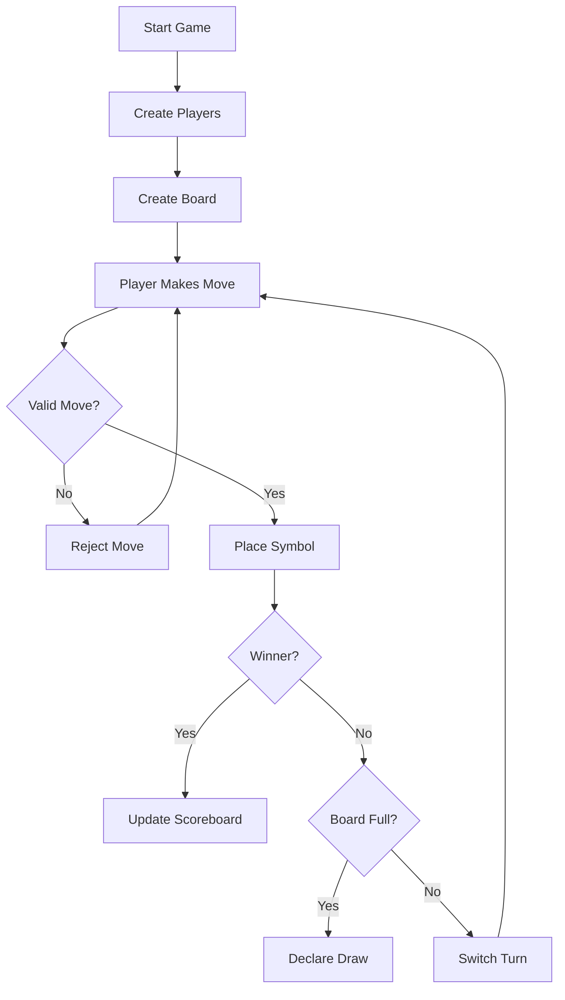
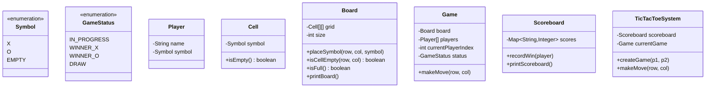
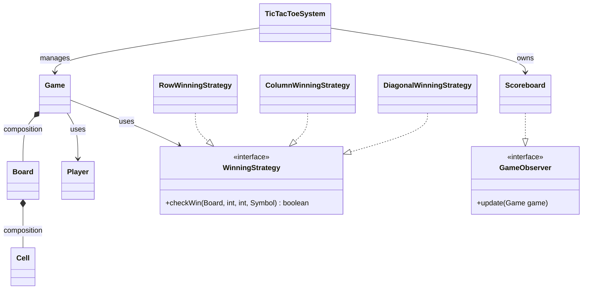
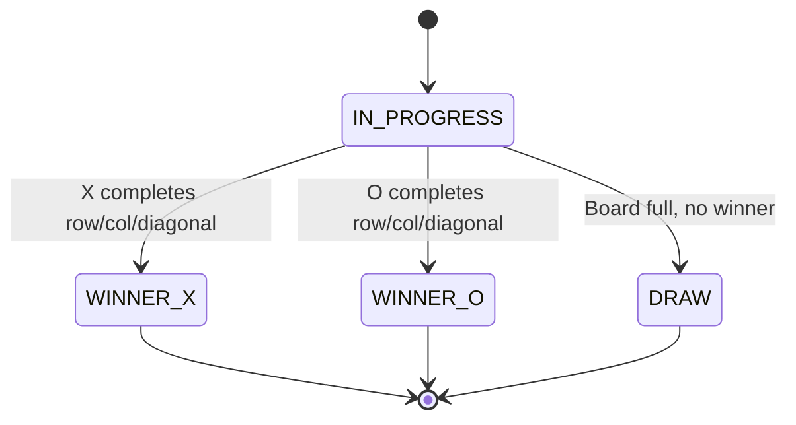
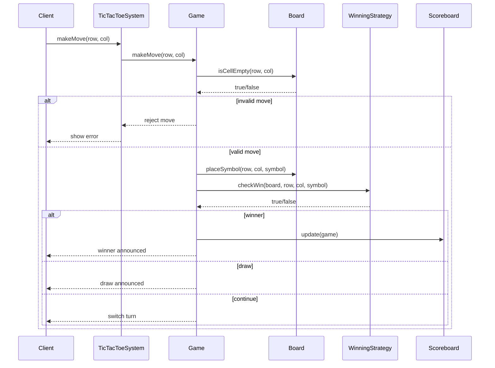
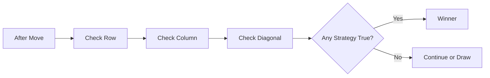
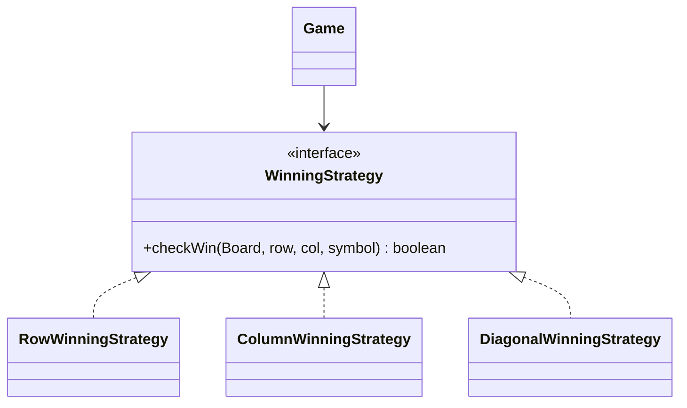
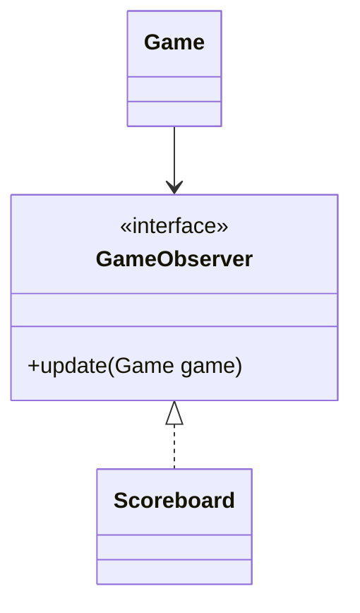
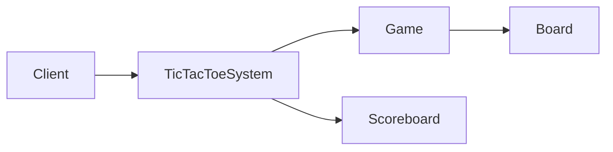
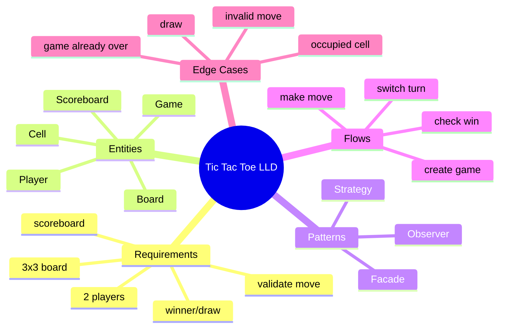

# Tic-Tac-Toe Low-Level Design Reference

## 1. Requirements

### Functional Requirements
- Game is played on a **3x3 board**.
- Two players play alternately using symbols **X** and **O**.
- System validates moves before placing a symbol.
- System detects a winner after every valid move.
- System declares a draw if the board is full and no player wins.
- System maintains a scoreboard across multiple games.
- Demo can use hardcoded moves instead of user input.

### Non-Functional Requirements
- Clean object-oriented design.
- Modular and testable classes.
- Extensible for larger board, AI player, undo, replay, etc.
- Clear console output.

---

## 2. Core Use Cases



Main use cases:
- Create a new game.
- Make a move.
- Validate move.
- Check winner.
- Check draw.
- Update scoreboard.
- Start another game.

---

## 3. Entities + Responsibilities

| Entity | Type | Responsibility |
|---|---|---|
| `Symbol` | Enum | Represents `X`, `O`, `EMPTY` |
| `GameStatus` | Enum | Represents game state |
| `Cell` | Data Class | Holds one symbol |
| `Player` | Data Class | Holds player name and symbol |
| `Board` | Core Class | Manages grid and placement |
| `WinningStrategy` | Interface | Contract for win checking |
| `Game` | Core Class | Controls gameplay |
| `Scoreboard` | Core Class | Tracks wins across games |
| `TicTacToeSystem` | Facade | Public entry point |



---

## 4. Relationships



Relationship types:
- **Composition**: `Board` owns `Cell`; `Game` owns `Board`.
- **Association**: `Game` uses `Player` and `WinningStrategy`.
- **Implementation**: strategies implement `WinningStrategy`; scoreboard implements `GameObserver`.

---

## 5. State Transitions



Rules:
- Game starts in `IN_PROGRESS`.
- After every valid move, check winner first.
- If no winner, check draw.
- Terminal states are `WINNER_X`, `WINNER_O`, and `DRAW`.

---

## 6. Core Flows

### Make Move Flow



### Winner Detection



---

## 7. Design Patterns Used

### Strategy Pattern
Used for winner detection.



Why useful:
- Each win condition is isolated.
- Easy to add new rules.
- Easier to test.

### Observer Pattern
Used for scoreboard updates.



Why useful:
- `Game` does not directly depend on `Scoreboard`.
- Later we can add analytics, logging, replay recorder, etc.

### Facade Pattern
`TicTacToeSystem` hides internal complexity.



---

## 8. Skeleton Code

```java
enum Symbol {
    X, O, EMPTY
}

enum GameStatus {
    IN_PROGRESS, WINNER_X, WINNER_O, DRAW
}

class Player {
    private final String name;
    private final Symbol symbol;

    public Player(String name, Symbol symbol) {
        if (symbol == Symbol.EMPTY) {
            throw new IllegalArgumentException("Player cannot use EMPTY symbol");
        }
        this.name = name;
        this.symbol = symbol;
    }

    public String getName() { return name; }
    public Symbol getSymbol() { return symbol; }
}

class Cell {
    private Symbol symbol = Symbol.EMPTY;

    public boolean isEmpty() {
        return symbol == Symbol.EMPTY;
    }

    public Symbol getSymbol() {
        return symbol;
    }

    public void setSymbol(Symbol symbol) {
        this.symbol = symbol;
    }
}

class Board {
    private final Cell[][] grid;
    private final int size;

    public Board(int size) {
        this.size = size;
        this.grid = new Cell[size][size];

        for (int r = 0; r < size; r++) {
            for (int c = 0; c < size; c++) {
                grid[r][c] = new Cell();
            }
        }
    }

    public boolean isValidPosition(int row, int col) {
        return row >= 0 && row < size && col >= 0 && col < size;
    }

    public boolean isCellEmpty(int row, int col) {
        return isValidPosition(row, col) && grid[row][col].isEmpty();
    }

    public void placeSymbol(int row, int col, Symbol symbol) {
        if (!isCellEmpty(row, col)) {
            throw new IllegalArgumentException("Invalid move");
        }
        grid[row][col].setSymbol(symbol);
    }

    public Symbol getSymbol(int row, int col) {
        return grid[row][col].getSymbol();
    }

    public int getSize() {
        return size;
    }

    public boolean isFull() {
        for (int r = 0; r < size; r++) {
            for (int c = 0; c < size; c++) {
                if (grid[r][c].isEmpty()) return false;
            }
        }
        return true;
    }

    public void printBoard() {
        for (int r = 0; r < size; r++) {
            for (int c = 0; c < size; c++) {
                System.out.print(grid[r][c].getSymbol() + " ");
            }
            System.out.println();
        }
    }
}

interface WinningStrategy {
    boolean checkWin(Board board, int row, int col, Symbol symbol);
}

class RowWinningStrategy implements WinningStrategy {
    public boolean checkWin(Board board, int row, int col, Symbol symbol) {
        for (int c = 0; c < board.getSize(); c++) {
            if (board.getSymbol(row, c) != symbol) return false;
        }
        return true;
    }
}

class ColumnWinningStrategy implements WinningStrategy {
    public boolean checkWin(Board board, int row, int col, Symbol symbol) {
        for (int r = 0; r < board.getSize(); r++) {
            if (board.getSymbol(r, col) != symbol) return false;
        }
        return true;
    }
}

class DiagonalWinningStrategy implements WinningStrategy {
    public boolean checkWin(Board board, int row, int col, Symbol symbol) {
        int n = board.getSize();
        boolean mainDiagonal = true;
        boolean antiDiagonal = true;

        for (int i = 0; i < n; i++) {
            if (board.getSymbol(i, i) != symbol) mainDiagonal = false;
            if (board.getSymbol(i, n - 1 - i) != symbol) antiDiagonal = false;
        }

        return mainDiagonal || antiDiagonal;
    }
}

interface GameObserver {
    void update(Game game);
}

class Scoreboard implements GameObserver {
    private final Map<String, Integer> scores = new HashMap<>();

    public void recordWin(Player player) {
        scores.put(player.getName(), scores.getOrDefault(player.getName(), 0) + 1);
    }

    public void update(Game game) {
        Player winner = game.getWinner();
        if (winner != null) {
            recordWin(winner);
        }
    }

    public void printScoreboard() {
        System.out.println(scores);
    }
}

class Game {
    private final Board board;
    private final Player[] players;
    private int currentPlayerIndex = 0;
    private GameStatus status = GameStatus.IN_PROGRESS;
    private Player winner;

    private final List<WinningStrategy> strategies = List.of(
        new RowWinningStrategy(),
        new ColumnWinningStrategy(),
        new DiagonalWinningStrategy()
    );

    private final List<GameObserver> observers = new ArrayList<>();

    public Game(Player p1, Player p2, int boardSize) {
        this.players = new Player[]{p1, p2};
        this.board = new Board(boardSize);
    }

    public void addObserver(GameObserver observer) {
        observers.add(observer);
    }

    public void makeMove(int row, int col) {
        if (status != GameStatus.IN_PROGRESS) {
            System.out.println("Game already finished");
            return;
        }

        Player currentPlayer = players[currentPlayerIndex];

        if (!board.isCellEmpty(row, col)) {
            System.out.println("Invalid move. Try again.");
            return;
        }

        board.placeSymbol(row, col, currentPlayer.getSymbol());
        board.printBoard();

        if (hasWon(row, col, currentPlayer.getSymbol())) {
            winner = currentPlayer;
            status = currentPlayer.getSymbol() == Symbol.X
                    ? GameStatus.WINNER_X
                    : GameStatus.WINNER_O;
            notifyObservers();
            System.out.println(currentPlayer.getName() + " wins!");
            return;
        }

        if (board.isFull()) {
            status = GameStatus.DRAW;
            System.out.println("Game draw!");
            return;
        }

        switchTurn();
    }

    private boolean hasWon(int row, int col, Symbol symbol) {
        for (WinningStrategy strategy : strategies) {
            if (strategy.checkWin(board, row, col, symbol)) return true;
        }
        return false;
    }

    private void switchTurn() {
        currentPlayerIndex = 1 - currentPlayerIndex;
    }

    private void notifyObservers() {
        for (GameObserver observer : observers) {
            observer.update(this);
        }
    }

    public Player getWinner() {
        return winner;
    }

    public GameStatus getStatus() {
        return status;
    }
}

class TicTacToeSystem {
    private static final TicTacToeSystem INSTANCE = new TicTacToeSystem();
    private final Scoreboard scoreboard = new Scoreboard();
    private Game currentGame;

    private TicTacToeSystem() {}

    public static TicTacToeSystem getInstance() {
        return INSTANCE;
    }

    public Game createGame(Player p1, Player p2) {
        currentGame = new Game(p1, p2, 3);
        currentGame.addObserver(scoreboard);
        return currentGame;
    }

    public void makeMove(int row, int col) {
        if (currentGame == null) {
            throw new IllegalStateException("No active game");
        }
        currentGame.makeMove(row, col);
    }

    public void printScoreboard() {
        scoreboard.printScoreboard();
    }
}
```

### Demo Code

```java
public class Main {
    public static void main(String[] args) {
        Player alice = new Player("Alice", Symbol.X);
        Player bob = new Player("Bob", Symbol.O);

        TicTacToeSystem system = TicTacToeSystem.getInstance();
        system.createGame(alice, bob);

        system.makeMove(0, 0); // Alice
        system.makeMove(1, 0); // Bob
        system.makeMove(0, 1); // Alice
        system.makeMove(1, 1); // Bob
        system.makeMove(0, 2); // Alice wins

        system.printScoreboard();
    }
}
```

---

## 9. Edge Cases

| Edge Case | Expected Handling |
|---|---|
| Move outside board | Reject move |
| Move on occupied cell | Reject move |
| Move after game finished | Reject move |
| Player uses `EMPTY` symbol | Throw validation error |
| Both players use same symbol | Reject in constructor or game creation |
| Board full with no winner | Declare draw |
| Starting game without players | Reject game creation |
| Scoreboard update on draw | No score increment |

---

## 10. Failure Points

Common places bugs happen:

1. **Turn switching bug**
   - Switching turn before checking winner can announce wrong winner.

2. **Invalid move handling**
   - If invalid moves switch the turn, the opponent gets unfair advantage.

3. **Diagonal check bug**
   - Need to check both main diagonal and anti-diagonal.

4. **Draw check order**
   - Always check winner before draw.
   - Last move can fill the board and also win.

5. **Scoreboard duplication**
   - Observer should update only once when game reaches terminal state.

6. **Mutable player symbol**
   - Player symbol should be immutable.

---

## 11. Improvements

Possible future enhancements:

### Game Features
- Support `N x N` board.
- Support custom winning length, e.g., 4 in a row.
- Add undo move.
- Add move history.
- Add replay support.
- Add timer per player.

### Player Features
- Add AI player.
- Add difficulty levels.
- Add online multiplayer.

### Design Improvements
- Use `Move` class instead of raw `row`, `col`.
- Use `GameResult` object for cleaner result handling.
- Add `InvalidMoveException`.
- Add unit tests for every strategy.

### Scalability Improvements
- Persist scoreboard in database.
- Support multiple simultaneous games.
- Add REST APIs.
- Add WebSocket support for real-time multiplayer.

---

## Quick Memory Map


